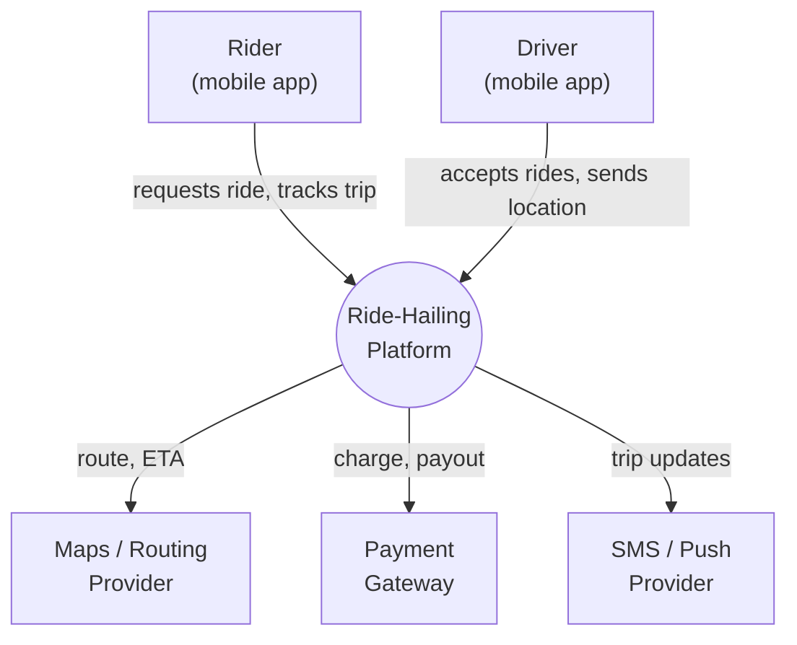
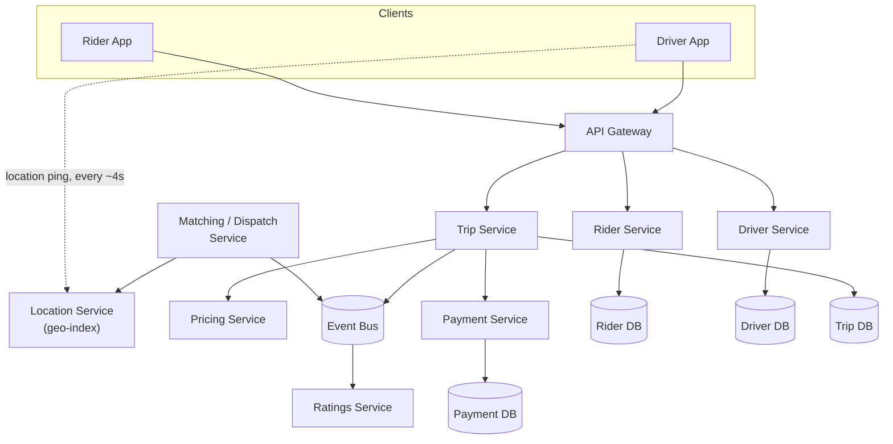
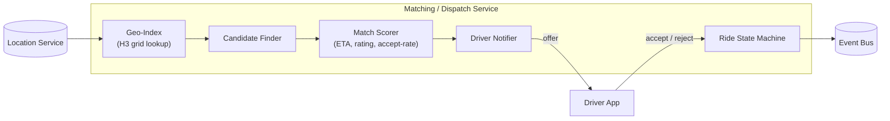
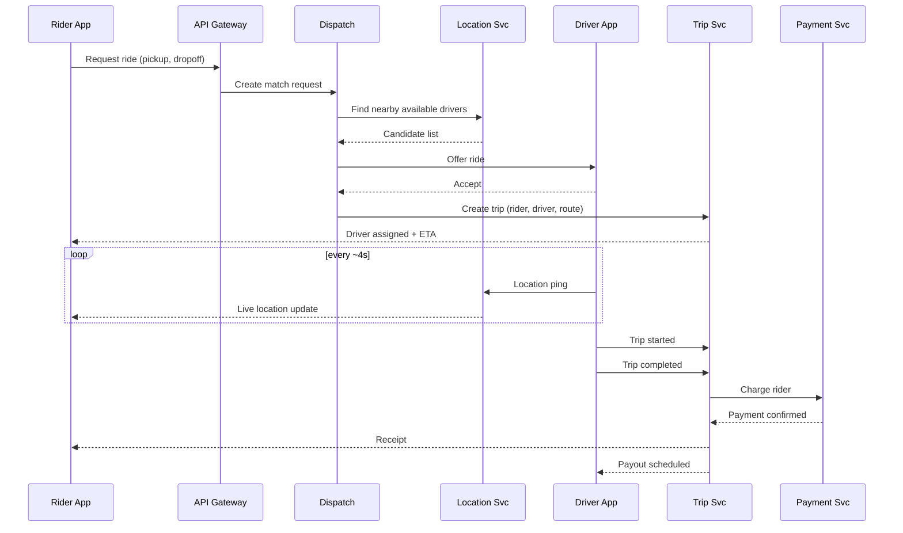
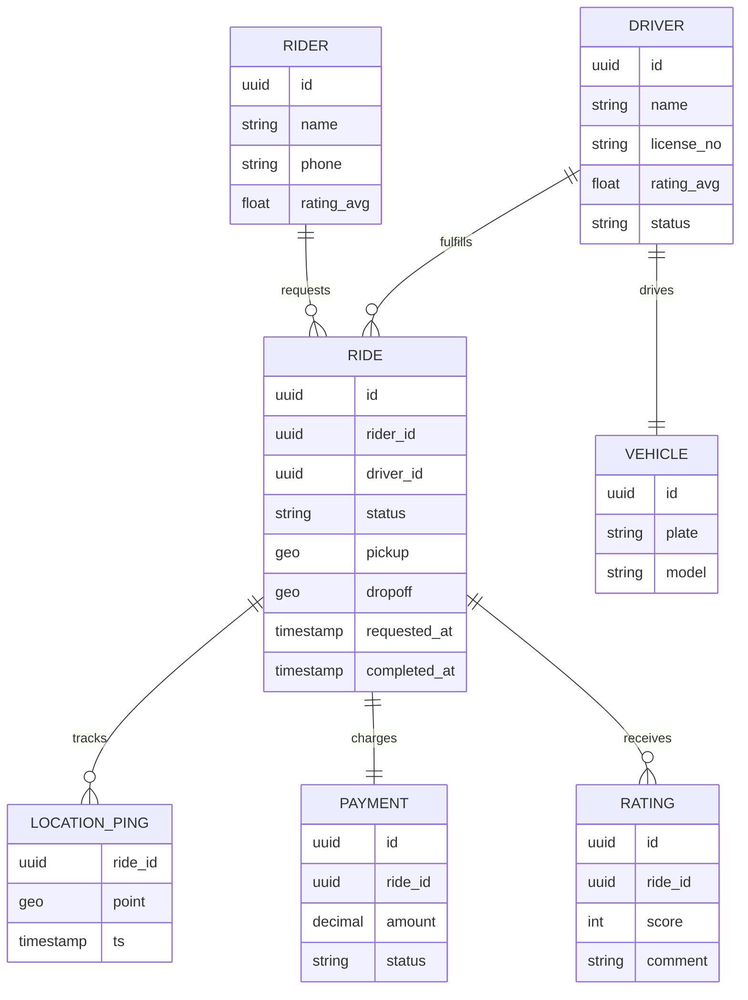

# Diagram-Driven Product Design

A repeatable method for starting a product from scratch, where the diagrams *are* the spec — not documentation of the spec, not a picture you draw once and forget. Worked through end to end using Uber as the example, in the order you'd walk it in a system design interview.

The core idea: every diagram below is written as **diagram-as-code** (Mermaid), not drawn in a freeform tool. That's the difference between a diagram that decays the day after you draw it and one that stays true, because the source is plain text — reviewable in a pull request, diffable in git, and editable directly by you or an AI agent. When the design changes, you edit the `.md` file; the diagram and the spec change in the same commit, by construction. A drawing-tool diagram (Figma, draw.io, a whiteboard photo) has no such mechanism — nothing forces it to stay in sync with reality.

> **Rendering note:** GitHub renders these Mermaid blocks natively when you view this file at github.com. This site also renders them live — a small client-side script in [`BaseLayout.astro`](../../src/layouts/BaseLayout.astro) finds Mermaid code fences and swaps them for rendered SVG in the browser.

## The method, in order

1. **Clarify scope** — functional and non-functional requirements, explicitly, before drawing anything.
2. **Domain event storming** — surface the vocabulary: events, actors, entities.
3. **System Context diagram (C4 level 1)** — the system as one box, its actors and external dependencies.
4. **Container diagram (C4 level 2)** — decompose into the major services/stores and how they connect.
5. **Component diagram (C4 level 3)** — deep-dive one container that carries the hardest problem.
6. **Sequence diagrams** — walk the 1-3 flows that matter most, end to end.
7. **Data model (ERD)** — the entities and relationships underneath the boxes.
8. **Capacity estimate** — rough numbers, so the design isn't fictional.
9. **Trade-offs (ADRs)** — the decisions you'd otherwise make silently, written down with the alternative you rejected.
10. **Phased roadmap** — which diagrams exist at MVP, and which get added later.

This is the same shape an interviewer expects in a system design interview: clarify → high-level design → deep dive → data model → scale → trade-offs. Working through Uber below is one worked example of it.

---

## 1. Clarify scope

**Functional requirements:**
- Rider requests a ride (pickup, dropoff).
- System matches the rider to a nearby available driver.
- Rider and driver see each other's live location during the trip.
- Fare is calculated and charged automatically at trip end.
- Both parties rate each other after the trip.

**Non-functional requirements:**
- Matching must complete in low single-digit seconds.
- Location updates are high-volume, high-frequency, and can tolerate briefly-stale data (eventual consistency is fine).
- Payment must be strongly consistent — a ride is never charged twice or left uncharged.
- The system must absorb demand spikes (rush hour, bad weather, events) without falling over.
- Geo-distributed: driver/rider pools are city-local, so most work can be sharded by region.

Writing this down first matters more than the diagrams — every downstream diagram is an answer to a requirement stated here. If a box in the diagrams below doesn't trace back to one of these bullets, it doesn't belong yet.

## 2. Domain event storming

Before drawing boxes, list the events that happen in the domain, in the language a rider or driver would use. This is deliberately messy and fast — sticky notes, not a diagram:

`RideRequested → DriverOffered → DriverAccepted → DriverArrived → TripStarted → LocationPinged (repeating) → TripCompleted → FareCalculated → PaymentCharged → RideRated`

From this, the bounded contexts (later: services) fall out almost for free:

- **Rider Management** — accounts, ride history.
- **Driver Management** — accounts, vehicle, availability.
- **Matching / Dispatch** — pairs riders to drivers.
- **Trip Tracking** — owns the ride lifecycle and live location.
- **Pricing** — fare and surge calculation.
- **Payments** — charges and payouts.
- **Ratings** — post-trip feedback.

## 3. System Context diagram

One box for the system, its human actors, and the external systems it depends on.

## 4. Container diagram

Break the single box into the services and stores that actually get built and deployed, with the connections between them.

Every box here answers "what problem from step 1 does this solve" — Location exists because location updates are high-volume and latency-tolerant (its own store, its own scaling story, separate from the strongly-consistent Payment DB).

## 5. Component diagram — deep dive on Matching / Dispatch

Dispatch is where the hardest problem lives (real-time geospatial matching under load), so it's the container worth decomposing further.

## 6. Sequence diagram — the core ride lifecycle

The flow that has to work end to end for the product to exist at all.

## 7. Data model

## 8. Capacity estimate (illustrative, not real Uber numbers)

Rough numbers force the design to confront reality — they're what stop a diagram from being fiction.

- 1M daily active riders, 200k rides/day → average ~2.3 rides/sec, peak (rush hour, ~10x average) ~25 ride-requests/sec.
- 100k active drivers at peak, each pinging location every 4s → **~25,000 location writes/sec** at peak. This single number is *why* Location is its own service with its own store: it dwarfs every other write path by two orders of magnitude and needs a different consistency model (eventual, not ACID).
- Payment: same order as ride volume, ~25/sec peak — small enough to afford strong consistency without it becoming a bottleneck.

## 9. Trade-offs (ADRs)

Decisions that would otherwise get made silently by whoever writes the code first — written down instead, with the rejected alternative, so a future change (human or AI-driven) can tell whether the original reasoning still holds.

| Decision | Chosen | Rejected alternative | Why |
|---|---|---|---|
| Location consistency | Eventual | Strong (same store as Payment) | 25k writes/sec at peak; briefly-stale position is an acceptable UX cost, strong consistency at that volume is not |
| Payment consistency | Strong (ACID) | Eventual | Money must never be double-charged or dropped; volume here is low enough to afford it |
| Geo-indexing | H3 hexagonal grid | Geohash / quadtree | Uniform cell size at all latitudes, simpler neighbor lookups for "nearby drivers" queries |
| MVP matching algorithm | Greedy nearest-available-driver | Global batch optimization | Ships in weeks not months; revisit once real acceptance-rate data exists to tune the scorer |

## 10. Phased roadmap

The diagrams above are the MVP. Later phases are diffs against them — this is the part that answers "how is this managed over years": a feature addition is a pull request that touches both a diagram file and the code, reviewed together, not a code change that quietly outgrows a design nobody updates.

| Phase | What's added | Which diagrams change |
|---|---|---|
| MVP | Single city, greedy matching, manual surge off | All diagrams above, as shown |
| v1 | Surge pricing, smarter Match Scorer | Component diagram (Dispatch) gains a Surge Calculator; Pricing container gains a feedback edge from Dispatch |
| v2 | Multi-city | Container diagram: Location and Dispatch become sharded-by-region; Context diagram unchanged (external view doesn't change) |
| v3 | Multi-modal (bikes, food delivery) | New Context-diagram actors; new bounded context in event storming; existing Trip/Payment containers reused, not rebuilt |

## Reusable checklist

Strip the Uber specifics away and this is the template for any new product, or for what to walk through out loud in a design interview:

1. Write functional + non-functional requirements as bullets before drawing anything.
2. Event-storm the domain vocabulary; let bounded contexts fall out of the events.
3. Draw the System Context diagram — one box, actors, external dependencies.
4. Draw the Container diagram — decompose into real, deployable pieces.
5. Pick the one container with the hardest problem and draw its Component diagram.
6. Sequence-diagram the 1-3 flows that most define the product.
7. Draw the ERD.
8. Do a back-of-envelope capacity estimate — let real numbers justify (or kill) design choices.
9. Write down the 3-5 decisions you'd otherwise make silently, as a trade-off table.
10. Split the diagrams into MVP vs. later phases, so growth is a planned diff, not an accident.

Keep every diagram as Mermaid/D2/PlantUML text in the repo next to the code it describes. A feature request becomes: update the relevant diagram → review the diagram diff → then implement against it (by hand or with an AI agent) → tests confirm the implementation matches. That loop is what keeps the design from drifting out of sync with the system it's supposed to describe.
