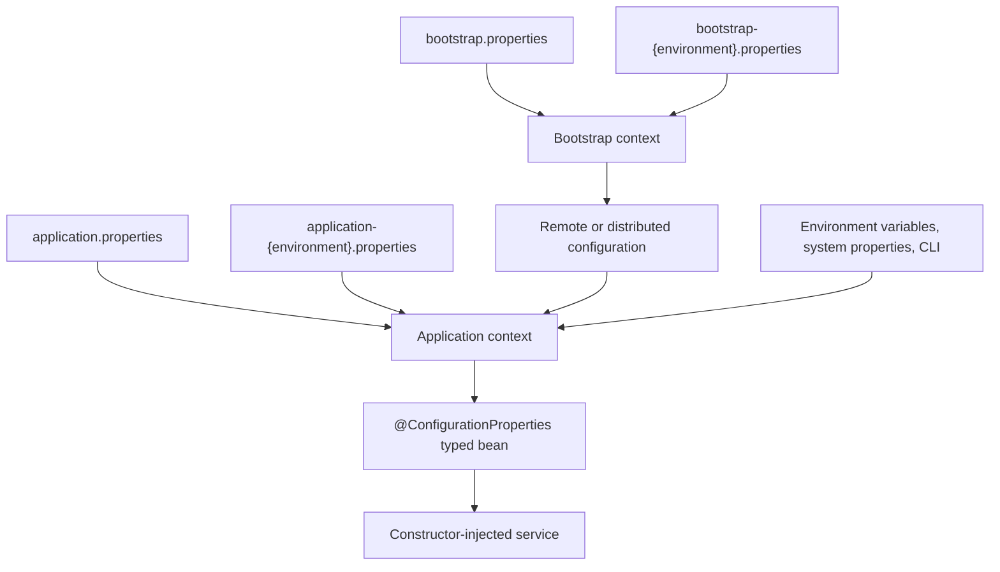
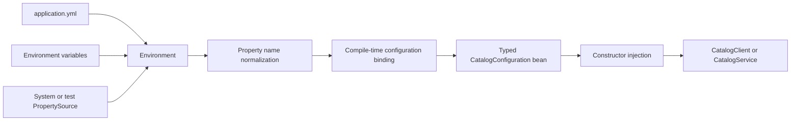
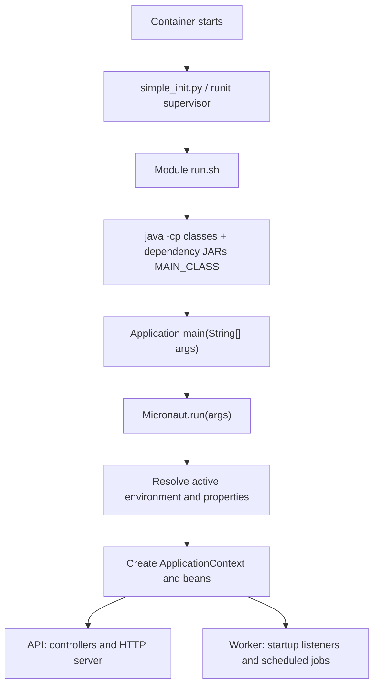
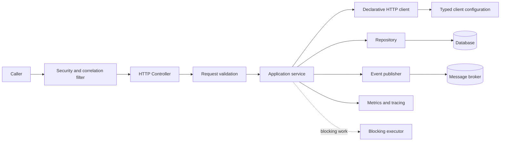

# Micronaut Interview Preparation

Micronaut is a JVM framework for building services with dependency injection, HTTP, configuration, validation, messaging, and testing support. A strong senior-level answer explains not only which annotation to use, but what Micronaut does at build time, where runtime work still happens, and how those choices affect startup, memory, correctness, and operations.

## Table of contents

- [The five-minute interview answer](#the-five-minute-interview-answer)
- [What Micronaut simplifies](#what-micronaut-simplifies)
- [Annotations in a real Micronaut service](#annotations-in-a-real-micronaut-service)
- [Configuration file naming and bootstrap context](#configuration-file-naming-and-bootstrap-context)
- [The configuration-to-object path](#the-configuration-to-object-path)
- [How to add a configuration class](#how-to-add-a-configuration-class)
- [Choosing the configuration mechanism](#choosing-the-configuration-mechanism)
- [How the LARS API and worker start](#how-the-lars-api-and-worker-start)
- [Generic service structure](#generic-service-structure)
- [HTTP, clients, and failure boundaries](#http-clients-and-failure-boundaries)
- [Blocking versus non-blocking execution](#blocking-versus-non-blocking-execution)
- [Testing the application context](#testing-the-application-context)
- [Security and operations](#security-and-operations)
- [Micronaut versus Spring: interview trade-offs](#micronaut-versus-spring-interview-trade-offs)
- [Senior interview questions](#senior-interview-questions)
- [A practical debugging checklist](#a-practical-debugging-checklist)
- [Key takeaways](#key-takeaways)
- [Official references](#official-references)

## The five-minute interview answer

> Micronaut is a modular JVM framework whose dependency-injection and bean-introspection metadata are computed at compile time. That reduces reflection and proxy scanning at startup, while keeping familiar service boundaries: controllers receive requests, services own business decisions, clients call other services, repositories own persistence, and typed configuration supplies environment-specific behavior. I use constructor injection, immutable or validated configuration, explicit timeout and retry policies, and `@MicronautTest` for boundary tests. I also separate non-blocking request work from blocking database or file operations and make health, metrics, traces, and failure behavior part of the design.

The important nuance is that “compile time” does not mean “everything is fixed forever.” Micronaut still resolves configuration from its `Environment`, creates the application context, selects conditional beans, and runs network or database work at runtime. Compile-time metadata makes that runtime path smaller and more predictable; it does not remove the need for good service design.

## What Micronaut simplifies

Micronaut provides conventions and generated metadata for concerns that are otherwise repetitive in a JVM service:

- Dependency injection without scanning every class with reflection at startup.
- HTTP routing and declarative clients with compile-time annotation metadata.
- Type-safe configuration binding instead of manually reading strings from a map.
- Bean validation at the edge of the service and during configuration binding.
- Test support that starts a real application context and can replace property sources or collaborators.
- Conditional and multi-instance beans for feature flags, tenants, regional endpoints, or multiple clients.
- Integration points for metrics, tracing, health endpoints, security, serialization, persistence, and messaging.

The interview trade-off is explicitness versus magic. An annotation can remove boilerplate, but a senior engineer should still be able to explain the generated bean, its lifecycle, its qualifier, its thread model, and its failure mode.

## Annotations in a real Micronaut service

An annotation is a declarative instruction that Micronaut reads while compiling the application. It generates metadata from that instruction and later uses the metadata to create beans, bind configuration, map routes, or schedule work. The annotation does not itself execute the business method.

The LARS project demonstrates three especially useful categories:

| What the annotation declares | LARS example | What Micronaut does with it |
| --- | --- | --- |
| An HTTP boundary | `@Controller("/20250625")` on `RemediationEventController` in `oase-devops-lars-api` | Registers the class as a singleton controller and maps the generated API operations below that URI prefix. |
| An injectable application bean | `@Singleton` on `LarsWorkers` in `oase-devops-lars-worker` | Creates one `LarsWorkers` instance and supplies its constructor dependencies from the application context. |
| A scheduled background action | `@Scheduled` on `LarsWorkers.tickerPoller()` and `PollingService.run()` | Calls the method repeatedly using the configured delay or rate once the application is running. |
| A startup action | `@EventListener` receiving `StartupEvent` in `LarsWorkers` | Invokes the method after the context has started; in this case, it begins long-polling work. |
| A conditional capability | `@Requires(property = "lars.analyzer.fast-enabled", value = "true")` on `analyzeFastPoller` | Enables that listener only when the active configuration has the expected value. |
| Typed configuration binding | `@ConfigurationProperties("lars.collector.ticket")` on `TicketCollectorConfig` | Generates a configuration bean whose methods read and convert matching `lars.collector.ticket.*` properties. |
| Input/configuration validation | `@NotNull` and `@NotBlank` methods on `TicketCollectorConfig` | Validates required values during binding so an invalid deployment can fail early. |

The API controller also uses Lombok's `@RequiredArgsConstructor`. Lombok generates the constructor, and Micronaut uses that single constructor for injection. In `LarsWorkers`, the constructor is written explicitly and carries `@Inject`; with one unambiguous constructor, modern Micronaut code can usually omit `@Inject`.

For an interview, describe the distinction clearly: `@Controller` maps an external HTTP boundary; `@Singleton` makes a class available for injection; `@Scheduled` and `@EventListener` determine *when* an already-created bean's methods run; and `@ConfigurationProperties` turns external configuration into a typed dependency.

## Configuration file naming and bootstrap context

Micronaut uses the active environment name to select environment-specific configuration files:

| File | Meaning |
| --- | --- |
| `application.properties` | Base application configuration |
| `application-dev.properties` | Overrides for the active `dev` environment |
| `application-stage.properties` | Overrides for the active `stage` environment |
| `bootstrap.properties` | Configuration needed before the main context starts |
| `bootstrap-stage.properties` | Early configuration for the active `stage` environment |

The general naming pattern is:

```text
application-{environment}.{extension}
bootstrap-{environment}.{extension}
```

Creating `application-stage.properties` does not activate the `stage` environment. Activate it explicitly, for example:

```bash
MICRONAUT_ENVIRONMENTS=stage java -jar service.jar
```

or:

```bash
java -Dmicronaut.environments=stage -jar service.jar
```

Once `stage` is active, Micronaut can load both `application.properties` and `application-stage.properties`, with the environment-specific values overriding matching base values. Tests commonly activate `TEST` automatically, and an application can have more than one active environment.

`bootstrap` is not merely another profile name. It represents an early configuration context that runs before the main application context when bootstrap is enabled. Use it for settings required to discover or retrieve the rest of the configuration, such as distributed configuration clients, service discovery, or a remote configuration location. `bootstrap-stage.properties` requires both an active `stage` environment and an enabled bootstrap context; the file is not automatically used just because it exists.

Bootstrap configuration is carried into the main context and has higher precedence than regular application configuration when the same key appears in both contexts. Keep ordinary service settings in `application*.properties`; put only startup-critical configuration in `bootstrap*.properties` so the lifecycle remains understandable. The bootstrap name can also be customized with Micronaut’s bootstrap-name system property.

The effective resolution path is:



In an interview, explain the distinction this way: `application-stage.properties` changes the main application’s stage-specific behavior; `bootstrap-stage.properties` supplies stage-specific values needed to build or locate that application context in the first place. See the [Micronaut application configuration guide](https://docs.micronaut.io/4.9.10/guide/index.html) and [Environment API](https://docs.micronaut.io/4.9.10/api/io/micronaut/context/env/Environment.html).

## The configuration-to-object path

Suppose a service calls a catalog API. The same application artifact should work in local development, CI, staging, and production without recompiling for every URL or timeout. Configuration belongs outside the business logic.

### 1. Property sources provide values

```yaml
# application.yml
service:
  catalog:
    base-url: https://catalog.internal
    connect-timeout: 500ms
    read-timeout: 2s
    retries: 3
    features:
      cache-enabled: true
```

Micronaut can combine values from application configuration files, environment-specific files, environment variables, system properties, command-line properties, and programmatic `PropertySource` values in tests. The exact precedence should be checked for the environment being used; do not assume a local file can safely override a production secret.

### 2. A prefix binds to a typed Java object

```java
@ConfigurationProperties("service.catalog")
public class CatalogConfiguration {
    private URI baseUrl;
    private Duration connectTimeout = Duration.ofMillis(500);
    private Duration readTimeout = Duration.ofSeconds(2);
    private int retries = 3;
    private Features features = new Features();

    // getters and setters

    public static class Features {
        private boolean cacheEnabled;

        // getter and setter
    }
}
```

Micronaut treats this configuration class as a bean. The prefix `service.catalog` maps nested keys to Java properties. Values such as `https://catalog.internal`, `500ms`, `2s`, `3`, and `true` are converted to `URI`, `Duration`, `int`, and `boolean`. This is more useful than injecting five unrelated strings because the service can validate and pass one coherent object around.

### 3. Validation fails early

```java
@ConfigurationProperties("service.catalog")
public class CatalogConfiguration {
    @NotNull
    private URI baseUrl;

    @Min(0)
    @Max(5)
    private int retries = 3;
}
```

If required configuration is absent or invalid, fail during application startup rather than discovering it on the first customer request. This is a reliability feature: a bad deployment should be rejected visibly and quickly. Keep secrets out of source-controlled YAML and use the approved deployment secret/property source for sensitive values.

### 4. Constructor injection receives the bean

```java
@Singleton
public class CatalogClient {
    private final CatalogConfiguration configuration;
    private final HttpClient client;

    public CatalogClient(CatalogConfiguration configuration, HttpClient client) {
        this.configuration = configuration;
        this.client = client;
    }

    public CatalogItem fetch(String id) {
        // use configuration.getBaseUrl(), timeout, and retry policy
        return client.fetch(configuration.getBaseUrl(), id);
    }
}
```

Micronaut resolves the constructor dependencies from the application context. There is no service locator call in the business method and no mutable global configuration. Constructor injection makes required dependencies visible, simplifies unit tests, and lets the compiler help when a dependency is missing.



### What happens automatically, and what does not?

| Concern | Micronaut helps with | You still own |
| --- | --- | --- |
| Property lookup | Resolving keys from configured property sources | Choosing safe precedence and defaults |
| Name mapping | Binding kebab-case keys to Java properties | Keeping names stable and documented |
| Type conversion | Converting supported scalar values to Java types | Custom converters for domain-specific formats |
| Validation | Applying Jakarta validation constraints | Deciding which values are safe and required |
| Bean creation | Registering configuration as a bean | Lifecycle, refresh semantics, and secret rotation |
| Injection | Wiring constructor dependencies | Dependency boundaries and avoiding cycles |
| Availability | Startup failure for invalid required config | Readiness, fallback, and operational rollback |

## How to add a configuration class

Micronaut does **not** invent a Java configuration type merely because properties with a common prefix appear in `application.properties`. The property file supplies values; you must define the Java class, record, or interface that declares the configuration contract, annotate it, and then inject that type where it is needed.

LARS provides a useful interface-based example in `oase-devops-lars-worker/src/main/java/com/oracle/pic/oase/lars/worker/config/TicketCollectorConfig.java`:

```java
@ConfigurationProperties("lars.collector.ticket")
public interface TicketCollectorConfig {
    @NotNull
    Boolean getEnabled();

    @NotNull
    Duration getPollInterval();

    @NotNull
    Duration getInitialDelay();
}
```

Its base properties are defined in `oase-devops-lars-worker/src/main/resources/application.properties`:

```properties
lars.collector.ticket.enabled=false
lars.collector.ticket.poll-interval=30s
lars.collector.ticket.initial-delay=0s
```

At compile time, Micronaut generates an implementation that can bind this interface. At startup, it creates that generated configuration bean, reads the active property sources, converts `30s` to a `Duration`, and applies the validation constraints. The worker's `LarsWorkers` bean then refers to the configuration in its `@Scheduled` expression:

```java
@Scheduled(
    condition = "#{ ctx[com.oracle.pic.oase.lars.worker.config.TicketCollectorConfig].enabled }",
    fixedDelay = "#{ ctx[com.oracle.pic.oase.lars.worker.config.TicketCollectorConfig].pollInterval }",
    initialDelay = "#{ ctx[com.oracle.pic.oase.lars.worker.config.TicketCollectorConfig].initialDelay }")
void tickerPoller() { /* poll tickets */ }
```

The answer to “what do I need to write?” is therefore:

1. **Define the type yourself**: a class/record with properties and setters or constructor parameters, or an interface with getter methods.
2. **Annotate the type** with `@ConfigurationProperties("your.prefix")`.
3. **Declare each value your code needs** as a field, constructor parameter, or getter. You do not write binding code or an implementation for an annotated interface.
4. **Add properties** with matching names in `application.properties`, `application-{environment}.properties`, environment variables, or another supported source.
5. **Inject the configuration type** into the service that uses it, rather than repeatedly reading strings with `@Value`.

Adding a new property alone does nothing until a configuration type or direct `@Value` injection consumes it. Conversely, declaring `getEnabled()` without supplying a valid `lars.collector.ticket.enabled` value causes validation/startup failure when it is required. This explicit contract is intentional: it keeps configuration discoverable, type-safe, and reviewable.

## Choosing the configuration mechanism

### `@Value`: a precise escape hatch

Use `@Value("${service.catalog.base-url}")` for a small, one-off value where creating a configuration type would add no clarity. It is convenient, but repeated `@Value` fields scatter the configuration contract and make validation harder to see. Prefer `@ConfigurationProperties` when values belong together.

### `@ConfigurationProperties`: the default for service configuration

Use it for a typed, reusable group such as a database pool, downstream client, feature policy, or cache. It supports nested properties, defaults, validation, and constructor injection. It is the clearest interview answer for “how does a YAML property become a Java object?”

### `@EachProperty`: one configuration bean per named entry

For:

```yaml
service:
  downstream:
    catalog:
      url: https://catalog.internal
    pricing:
      url: https://pricing.internal
```

`@EachProperty("service.downstream")` can create one qualified configuration bean for `catalog` and one for `pricing`. The qualifier is the configured name, so the service can select the correct downstream without a long `if` statement or a hard-coded map.

### `@EachBean`: build dependents from configured beans

An `@EachBean(DownstreamConfiguration.class)` factory can create one HTTP client for every downstream configuration. This makes adding a new configured downstream data-driven: add properties, validate them, and let the context create the corresponding client. The factory should still apply bounded connection pools, timeouts, TLS policy, and metrics labels.

### `@Requires`: conditionally load a capability

Use `@Requires(property = "feature.cache-enabled", value = "true")` or a bean/class requirement to conditionally register a bean. This is useful for optional integrations, but avoid hiding core business behavior behind too many flags. An absent optional bean should produce a clear fallback or a clear startup error.

## How the LARS API and worker start

The LARS repository is a Maven multi-module build, but it does not deploy every module. The root `pom.xml` is an aggregator. The API, worker, T2 collector, and canary each have a Java `main` method; common code, data access, specifications, Java clients, and integration tests are packaged as dependencies of those applications.



### API startup

`OaseDevopsLarsApi.main` first imports dynamic-region configuration, calls `Micronaut.run(args)`, and then logs the resolved environment. In a deployed container, the API's runit entry invokes `run.sh`; outside the local `dev` mode, that script executes Java with a constructed classpath, `MAIN_CLASS`, and `-Dmicronaut.environments` set from the deployment environment.

When `Micronaut.run(args)` returns, the application context has read the active `application.properties` and environment-specific overrides, selected conditional beans, constructed controller/repository/service beans, and started enabled HTTP infrastructure. The API's `RemediationEventController` is therefore ready to receive the generated routes under `/20250625`. `DevDataPopulator` is a contrasting startup listener: it only runs in the development environment because it has `@Requires(env = DEVELOPMENT)`.

### Worker startup

`OaseDevopsLarsWorker.main` follows the same configuration-import and `Micronaut.run(args)` pattern, but its useful work is background work rather than request handling. The context creates `LarsWorkers`, injects its collector, analyzer, dispatcher, and queue dependencies, then processes its `StartupEvent` listeners and schedules its `@Scheduled` methods.

For example, `tickerPoller()` runs only when `TicketCollectorConfig.enabled` is true; its delay and initial delay come from the same typed configuration bean. `analyzeFastPoller` and `dispatchPoller` are startup listeners additionally gated by `@Requires` properties. The worker JVM stays alive because the Micronaut runtime, scheduled executor, and long-running polling work remain active—not because the `main` method itself loops forever.

This is the key interview answer: deployment starts **one Java process per application module**, not one process per bean. `main()` starts Micronaut once; the compiled annotation metadata tells the resulting application context which controllers, configuration beans, listeners, schedulers, and other dependencies belong in that process.

## Generic service structure

This is a framework-level flow, not a representation of any private project:



The controller translates HTTP into an application command. The service owns the use case and transaction boundary. The client, repository, and publisher isolate external systems. Filters handle cross-cutting request concerns. Configuration supplies policy; it should not become a second business-logic layer.

## HTTP, clients, and failure boundaries

Micronaut’s HTTP server and client APIs are built for service-to-service communication. A senior answer should address:

- Request and response DTOs, validation, content types, and stable error envelopes.
- Client connection, read, and total-deadline timeouts.
- Retry only for operations that are safe to repeat, with bounded exponential backoff and jitter.
- Circuit breaking or load shedding when a dependency is unhealthy.
- Correlation and trace propagation across client calls.
- Idempotency keys for externally visible writes.
- A fallback that is explicit about stale, partial, or unavailable data.

Do not retry validation failures, authentication failures, or every `5xx` blindly. A retry policy is part of the API contract and must be tested with a fake clock or deterministic scheduler.

## Blocking versus non-blocking execution

Micronaut can start request handling on non-blocking event-loop threads. Database drivers, file operations, and blocking SDKs must run on an appropriate blocking executor or use a genuinely non-blocking client. The interview explanation should include:

1. Identify whether each dependency is blocking.
2. Dispatch blocking work to a bounded executor.
3. Bound queue depth and request deadlines.
4. Measure saturation and reject or degrade gracefully under load.
5. Never “fix” event-loop blocking by creating an unbounded thread per request.

Virtual threads can be a useful choice for some blocking workloads, but the decision still requires bounded concurrency, cancellation, and downstream capacity limits.

## Testing the application context

Use plain unit tests for pure policies and `@MicronautTest` for wiring and HTTP boundaries. A useful layered test set includes:

- Configuration binding: valid values become the expected `URI`, `Duration`, numbers, and booleans.
- Configuration failure: missing or invalid required values fail startup with an actionable message.
- Bean selection: `@EachProperty`, qualifiers, and `@Requires` select the intended implementation.
- HTTP behavior: an embedded server test verifies status, validation, serialization, and error responses.
- Downstream behavior: replace the client or server with a deterministic stub and test timeout/retry behavior.
- Observability: verify correlation IDs, metric labels, and trace propagation without asserting implementation-private details.

Test properties can be supplied through the test environment or a programmatic `PropertySource`, which keeps tests deterministic and avoids changing a developer’s machine-wide configuration.

## Security and operations

Configuration binding does not make secrets safe by itself. Do not log passwords, tokens, or complete connection strings. Redact sensitive fields in startup diagnostics. Validate allowed hosts, TLS settings, and certificate behavior. Keep management endpoints protected and separate liveness from readiness.

For production readiness, explain:

- structured logs with a request/trace identifier;
- metrics for request latency, error rate, dependency calls, retries, and pool saturation;
- distributed traces across HTTP and messaging boundaries;
- health checks that distinguish “process alive” from “ready to receive traffic”;
- graceful shutdown that stops intake, drains in-flight work, and closes clients;
- configuration rollout and rollback without silently changing behavior.

## Micronaut versus Spring: interview trade-offs

Micronaut and Spring both support dependency injection, HTTP services, configuration, validation, testing, and integrations. A balanced answer is:

- Micronaut emphasizes compile-time bean metadata and low reflection overhead, which can improve startup time and memory use for small services and native-image-oriented deployments.
- Spring has a larger ecosystem, broader team familiarity, and many established operational integrations.
- Micronaut’s compile-time model can make some errors appear earlier, but developers must understand annotation processing, generated metadata, and module compatibility.
- The right choice depends on startup/footprint goals, ecosystem needs, team expertise, and the organization’s existing platform standards.

Avoid claiming that one framework is universally faster or safer. Describe the workload and the evidence you would measure.

## Senior interview questions

### 1. How does Micronaut create a bean without scanning every class at startup?

Micronaut’s annotation processors generate bean-definition metadata during compilation. At startup, the application context reads that generated metadata to discover scopes, constructor dependencies, qualifiers, and conditions instead of scanning every class and building reflection metadata. Runtime work still exists—configuration is loaded, conditions are evaluated, and objects are instantiated—but the discovery path is more explicit and generally smaller. I would verify the benefit with startup-time, memory, and throughput measurements for the actual service rather than promising a universal speedup.

### 2. Walk through a value from `application.yml` to a constructor-injected Java object.

Micronaut loads the property sources into its environment, normalizes the property path, and binds the `service.catalog` subtree to a `@ConfigurationProperties("service.catalog")` bean. Supported conversion turns values such as `500ms` into a `Duration`, a URL into a `URI`, and text into numbers or booleans. Validation constraints run while the configuration bean is created. The application context then resolves that bean as a constructor argument of the client or service. If a required value is missing or invalid, startup should fail clearly instead of allowing the first production request to discover the problem.

### 3. When would you use `@Value` instead of `@ConfigurationProperties`?

I use `@Value` for one small, local value where a configuration type would add no structure—for example, a single optional message. I use `@ConfigurationProperties` for related settings such as a downstream URL, timeout policy, retry count, and feature switches. Grouping gives the configuration one validation boundary, one test seam, and one obvious contract. Repeated `@Value` fields spread configuration knowledge across the codebase and make it easier to miss a required setting.

### 4. How would you configure ten downstream clients without writing ten factory methods?

Represent the clients as named configuration entries and bind them with `@EachProperty`. Then use an `@EachBean` factory to create one qualified client for each configuration bean. The factory applies shared defaults—TLS, connection limits, timeouts, metrics labels—and the configured name becomes the qualifier. Adding an eleventh client becomes a configuration change rather than another branch or factory method. I would still validate names, prevent duplicate identities, and cap the total connection/resource footprint.

### 5. What happens when a required configuration property is missing?

The configuration bean cannot be created or validated, so application startup should fail with the property path and constraint that caused the failure. That is preferable to starting “mostly healthy” and failing later on a live request. For optional integrations, I would make the absence explicit with a default or `@Requires`-controlled fallback. I would never silently substitute an unsafe production URL, credential, or permissive security setting.

### 6. How do environment variables and test properties override file configuration?

Micronaut combines property sources according to its environment and precedence rules. Deployment-specific environment or system properties can override packaged defaults, while a test can provide a programmatic `PropertySource` or test environment values. I verify the effective configuration in the target environment rather than relying on memory about precedence. Tests should assert the selected value and avoid logging secrets; production should use the organization’s approved secret/configuration source.

### 7. How do you keep a blocking database call off an event-loop thread?

First identify whether the driver is blocking. If it is, execute the repository call on a bounded blocking executor or use a truly non-blocking driver. Propagate the request deadline, bound queue depth, and expose executor saturation metrics. I would test that the call is dispatched to the intended executor and that overload produces timeout or rejection behavior. Creating an unbounded thread per request only hides the problem and can exhaust the process or database.

### 8. Where would you apply retries, timeouts, idempotency, and circuit breaking?

Timeouts belong at every network boundary, with a total request deadline so nested calls cannot exceed the caller’s budget. Retries belong only around transient failures and only when the operation is safe to repeat; use bounded exponential backoff and jitter. Idempotency keys protect externally visible writes when a client may retry after a response loss. Circuit breaking or load shedding protects the caller when a dependency is persistently unhealthy. These controls should be placed at the client/service boundary and tested together, not added independently as annotations without a failure policy.

### 9. How would you test a controller while keeping the downstream service deterministic?

Use a Micronaut application-context or embedded-server test for routing, validation, serialization, filters, and error responses. Replace the downstream client with a fake bean or point the client at a deterministic test server. Supply explicit test properties through the test environment, then exercise success, timeout, malformed input, dependency failure, and idempotent replay. Keep pure retry, mapping, and business-policy tests separate so a failure identifies whether wiring or domain logic broke.

### 10. What metrics tell you that a Micronaut service is failing because of its dependency pool rather than its own CPU?

Compare request latency and error rate with dependency-call latency, timeout/retry counts, connection-pool utilization, pending-acquire time, executor queue depth, and downstream status codes. If CPU is normal but pool wait, dependency latency, and request deadlines rise together, the bottleneck is likely the dependency or its client pool. Correlate traces to confirm where time is spent, and check whether pool limits, timeout budgets, and downstream capacity are aligned.

### 11. How do you protect secrets from logs and accidental configuration exposure?

Keep secrets out of source control and ordinary application YAML. Load them through the approved secret/configuration source, inject only the component that needs them, and redact values in startup diagnostics, exception messages, request logs, and actuator/management output. Log presence and non-sensitive metadata rather than the secret itself. Test redaction and review configuration changes as security-sensitive code.

### 12. What evidence would make you choose Micronaut over Spring for a new service?

I would compare the service’s startup and memory budget, deployment model, native-image goals, ecosystem integrations, team familiarity, debugging experience, and operational standards. I would build a representative thin slice in both frameworks and measure startup time, RSS, throughput, tail latency, build complexity, and incident ergonomics. Micronaut’s compile-time model may be attractive for small, fast-starting services; Spring’s ecosystem may win for an organization with deep Spring expertise or required integrations. The choice should follow measured constraints, not framework slogans.

## A practical debugging checklist

When a service does not start or a bean is missing:

1. Confirm the active environment and property source names.
2. Check kebab-case property paths and the configuration prefix.
3. Turn on Micronaut injection tracing locally to see why a bean was or was not created.
4. Inspect qualifiers and `@Requires` conditions.
5. Check for circular dependencies and missing annotation processors.
6. Verify that a blocking call is not running on the event loop.
7. Reproduce the issue with a focused `@MicronautTest` and explicit test properties.
8. Add a safe startup diagnostic for non-secret configuration presence, not secret values.

## Key takeaways

- Micronaut simplifies service construction by making dependency and configuration metadata explicit at compile time.
- `@ConfigurationProperties` is the main bridge from external configuration to a validated, typed Java object.
- `@EachProperty` and `@EachBean` turn repeated client/resource setup into configuration-driven bean creation.
- Constructor injection, clear thread boundaries, bounded retries, and deterministic tests are more important than annotation memorization.
- A senior engineer explains lifecycle, precedence, failure behavior, security, and observability—not just the happy-path controller.

## Official references

- [Micronaut 4.9.10 guide](https://docs.micronaut.io/4.9.10/guide/index.html)
- [Dependency injection and compile-time metadata](https://docs.micronaut.io/4.9.10/guide/index.html#dependencyInjection)
- [Application configuration](https://docs.micronaut.io/4.9.10/guide/index.html#configuration)
- [ConfigurationProperties API](https://docs.micronaut.io/4.9.10/api/io/micronaut/context/annotation/ConfigurationProperties.html)
- [EachProperty API](https://docs.micronaut.io/4.9.10/api/io/micronaut/context/annotation/EachProperty.html)
- [EachBean API](https://docs.micronaut.io/4.9.10/api/io/micronaut/context/annotation/EachBean.html)
- [Controller API](https://docs.micronaut.io/4.9.10/api/io/micronaut/http/annotation/Controller.html)
- [ServerFilter API](https://docs.micronaut.io/4.9.10/api/io/micronaut/http/annotation/ServerFilter.html)
