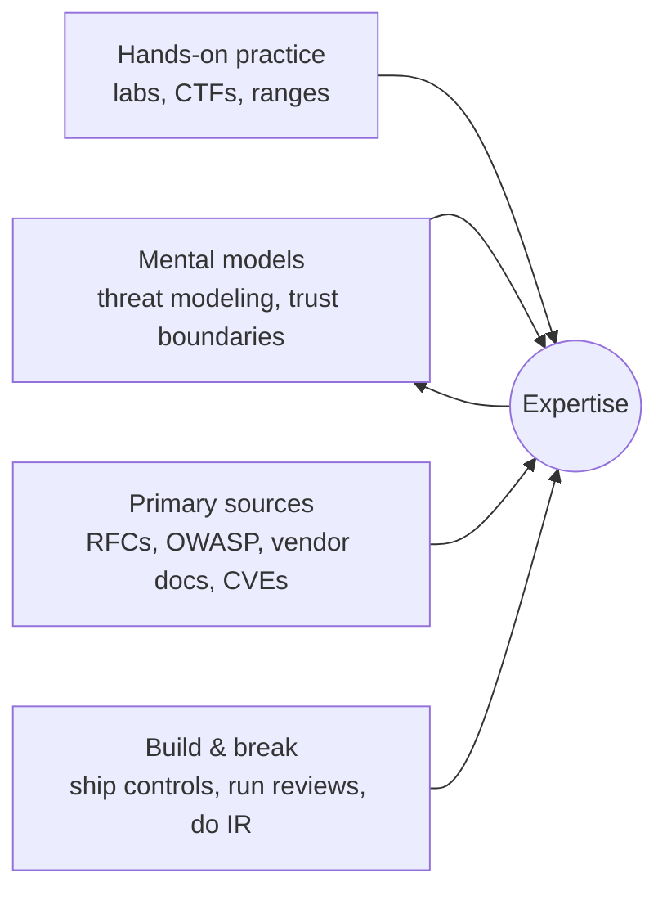

_This is the entry point for the Security section. Every other module follows the same shape: concept → how it works → how it is attacked → how to defend it → a runnable example → how it applies to our platform._

## The running example

Every module is grounded in one system, so the theory always has somewhere to land:

> A **microservice deployed on OCI Kubernetes Engine (OKE)** that **pulls logs and events from external systems** — a Lenel OnGuard physical access control system, camera / video management system (VMS) feeds, and similar building and sensor platforms — normalises them, and exposes them to downstream consumers.

That shape concentrates almost every security domain worth learning:

- It has an **identity** (to OCI, to Kubernetes, to each external system) — *identity and authentication, OAuth, workload identity*.
- It **trusts data from systems you do not control** — *input validation, injection, poisoned telemetry, supply chain*.
- It runs as **containers on managed Kubernetes in a public cloud** — *container and cluster hardening, cloud security, network segmentation*.
- Its whole job is **producing logs** that people will trust — *tamper-evident logging, detection engineering*. The Hugging Face incident (July 2026) showed autonomous agents **spoofing and deleting their own tool-call transcripts**, so "just check the logs" is no longer a complete answer.
- It may itself be **operated or extended by AI agents** — *AI agent security, MCP, excessive agency*.

## How to become an expert (the honest version)

Expertise in security is not a certificate. It is the combination of four things, and you build them in parallel, not in sequence:

1. **Mental models.** You should be able to look at any system and sketch its trust boundaries, data flows, and the STRIDE threats at each boundary in a few minutes. Module 01 teaches this; every later module practises it.
2. **Hands-on practice.** Reading about a padding-oracle attack teaches you nothing durable. Doing one on a deliberately vulnerable app does. Budget half your study time for labs.
3. **Primary sources.** Secondary blog posts (including this one) drift and simplify. Learn to read the OAuth RFCs, the OWASP project pages, the CIS Benchmarks, the OCI security docs, and CVE write-ups directly.
4. **Build and break.** Add a real control to a real system. Run a security review of a colleague's PR. Do a tabletop incident-response exercise. The feedback loop is where judgement comes from.

## Phased study plan

Roughly six months at ~5 focused hours/week. Adjust to your pace; the **order** matters more than the timeline.

### Phase 1 — Foundations (weeks 1–4)

- Modules **01 Foundations & threat modeling**, **02 Cryptography essentials**, **03 PKI, TLS & certificates**.
- Outcome: you can threat-model a service and explain exactly what TLS, a certificate, and a signature give you.
- Course: *Cybersecurity Foundations* (LinkedIn Learning) or *Introduction to Cyber Security Specialization* (Coursera / NYU).

### Phase 2 — Identity and access (weeks 5–9)

- Modules **04 Identity & authentication**, **05 OAuth 2.0 / 2.1 & OIDC**, **06 Authorization & access control**.
- Outcome: you can defend an OAuth deployment, read a JWT critically, and design an RBAC/ABAC model with deny-by-default.
- Course: *OAuth 2.0: Getting Started in API Security* (Coursera / API Academy) plus the OAuth 2.1 draft and RFC 9700 (OAuth Security BCP).

### Phase 3 — Application and platform (weeks 10–16)

- Modules **07 Application & API security**, **08 Supply chain security**, **09 Container & Kubernetes security**, **10 Cloud security on OCI**, **11 Network security & zero trust**.
- Outcome: you can pass a CIS Benchmark review of an OKE cluster and explain your supply chain from commit to running pod.
- Courses: *Kubernetes Security Essentials (LFS260)* + the **CKS** exam (Linux Foundation); **OCI 2025 Security Professional** learning path and certification (Oracle University); *DevSecOps* courses on LinkedIn Learning.

### Phase 4 — Detection and response (weeks 17–20)

- Modules **12 Logging, detection & tamper-evident audit**, **15 Incident response & secure operations**.
- Outcome: you can design an append-only, externally-anchored audit log and run the NIST incident-response lifecycle.
- Course: *Incident Response and Digital Forensics* (Coursera / IBM) or SANS SEC504 if budget allows.

### Phase 5 — AI and integration security (weeks 21–24)

- Modules **13 AI agent security**, **14 Securing external system integrations**.
- Outcome: you can threat-model an agent with tools, apply the OWASP Agentic Top 10, and harden an untrusted-telemetry ingest path.
- Sources: OWASP GenAI Security Project, the NSA/CISA *MCP Security* guidance (2026), the Hugging Face incident write-ups.

## Certification ladder

Certifications are a forcing function for structured study and a hiring signal — not proof of skill. Pick the ones that match the role you want.

| Stage | Certification | Why it is worth it |
| --- | --- | --- |
| Entry | **CompTIA Security+** (SY0-701) or **ISC2 CC** | Broad vocabulary and baseline. The common first ask in job listings. |
| Analyst | **CompTIA CySA+** or Microsoft **SC-200** | Detection, SIEM, and triage skills. |
| Cloud | **OCI 2025 Security Professional** (matches our platform), plus AWS/Azure equivalents | Cloud-provider security services and IAM in depth. |
| Kubernetes | **CKS** (Certified Kubernetes Security Specialist) | Hands-on cluster hardening; requires CKA first. |
| Offensive | **OSCP** | The respected hands-on pentest cert: 24 hours against live machines plus a report. |
| Leadership | **CISSP**, later **CISM** | Security architecture and programme management; needs experience. |

A practical path for your context: **Security+ → OCI Security Professional → CKS → (CISSP or OSCP depending on whether you go architecture or offensive).**

## Course catalogue

Verified links to platform landing pages. Course availability and exact titles change; search the platform for the current version.

### LinkedIn Learning (formerly Lynda.com)

- **[Cybersecurity library and learning paths](https://www.linkedin.com/learning/topics/security-3)** — the umbrella topic page.
- **[Become a CompTIA Security+ Certified Security Professional](https://www.linkedin.com/learning/paths/become-a-comptia-security-plus-certified-security-professional)** — full exam-aligned path.
- **[CompTIA Cybersecurity Analyst (CySA+) Cert Prep](https://www.linkedin.com/learning/topics/comptia)** — analyst / SOC track.
- **[Network Security courses](https://www.linkedin.com/learning/topics/network-security)** — segmentation, firewalls, zero trust.
- Search within LinkedIn Learning for: *OAuth 2.0*, *Application Security*, *DevSecOps*, *Kubernetes Security*, *Threat Modeling*, *Ethical Hacking (CEH prep)*, *Incident Response*.

### Oracle University (learn.oracle.com)

- **[Become a Cloud Security Professional (2025)](https://learn.oracle.com/ols/learning-path/become-a-cloud-security-professional-2025/118071/147744)** — role-based path.
- **[Oracle Cloud Infrastructure Security Professional](https://learn.oracle.com/ols/course/oracle-cloud-infrastructure-security-professional/118071/137800)** — course with ~16 hands-on labs covering Cloud Guard, Security Zones, Network Firewall, Vault/KMS, Vulnerability Scanning, IAM.
- **[OCI 2025 Certified Security Professional certification track](https://education.oracle.com/oracle-cloud-infrastructure-2025-certified-security-professional/trackp_OCIS2025CP)** — the exam.
- **[OCI training and certification pillar](https://education.oracle.com/learn/iaas/pPillar_640)** — much of the OCI foundations content is free.

### Coursera / edX (university and vendor courses, audit-for-free on Coursera)

- **[Introduction to Cyber Security Specialization](https://www.coursera.org/specializations/intro-cyber-security)** — NYU, good first pass on fundamentals.
- **[Google Cybersecurity Professional Certificate](https://www.coursera.org/professional-certificates/google-cybersecurity)** — broad, practical, entry-level.
- **[IBM Cybersecurity Analyst Professional Certificate](https://www.coursera.org/professional-certificates/ibm-cybersecurity-analyst)** — includes incident response and forensics.
- Search for: *OAuth*, *API Security*, *Cloud Security*, *Software Security* (University of Maryland).

### Kubernetes and cloud native (Linux Foundation / training.linuxfoundation.org)

- **[Kubernetes Security Essentials (LFS260)](https://training.linuxfoundation.org/training/kubernetes-security-essentials-lfs260/)** — direct CKS preparation.
- **[Certified Kubernetes Security Specialist (CKS)](https://training.linuxfoundation.org/certification/certified-kubernetes-security-specialist/)** — the exam.
- **[Understanding the Software Supply Chain (LFD119 / SLSA material)](https://www.cncf.io/training/certification/)** — CNCF security work.

### Hands-on ranges (spend real time here)

- **[TryHackMe](https://tryhackme.com/)** — guided, beginner-friendly rooms (SOC, web, cloud paths).
- **[Hack The Box Academy](https://academy.hackthebox.com/)** — deeper, less hand-holding.
- **[PortSwigger Web Security Academy](https://portswigger.net/web-security)** — free, the definitive web-vuln training.
- **[OWASP Juice Shop](https://owasp.org/www-project-juice-shop/)** — deliberately vulnerable app you host yourself.
- **[iximiuz Labs](https://labs.iximiuz.com/)** / **[KillerCoda](https://killercoda.com/)** — browser Kubernetes scenarios.

### Primary sources to bookmark

- **[OWASP Top 10](https://owasp.org/www-project-top-ten/)**, **[OWASP API Security Top 10](https://owasp.org/API-Security/)**, **[OWASP GenAI Security Project](https://genai.owasp.org/)** (LLM Top 10, Agentic Top 10).
- **[OAuth 2.1 draft](https://oauth.net/2.1/)** and **[RFC 9700 — OAuth 2.0 Security Best Current Practice](https://www.rfc-editor.org/rfc/rfc9700)**.
- **[CIS Benchmarks](https://www.cisecurity.org/cis-benchmarks)** (Kubernetes, Docker, cloud).
- **[NIST SP 800-61 — Incident Handling](https://csrc.nist.gov/pubs/sp/800/61/r3/final)** and the **[NIST Cybersecurity Framework 2.0](https://www.nist.gov/cyberframework)**.
- **[MITRE ATT&CK](https://attack.mitre.org/)** for adversary techniques.
- **[OCI Security documentation](https://docs.oracle.com/en-us/iaas/Content/Security/Concepts/security.htm)**.

## Key takeaways

- Learn in the order **foundations → identity → platform → detection → AI/integration**; skipping foundations makes everything later shallower.
- Split your time roughly 50/50 between reading and hands-on labs.
- Certifications structure study and open doors; they do not substitute for building and breaking real systems.
- For this platform specifically: **Security+ → OCI Security Professional → CKS** is the highest-leverage sequence, with AI-agent and tamper-evident-logging study layered on top because that is where this system's novel risk lives.
