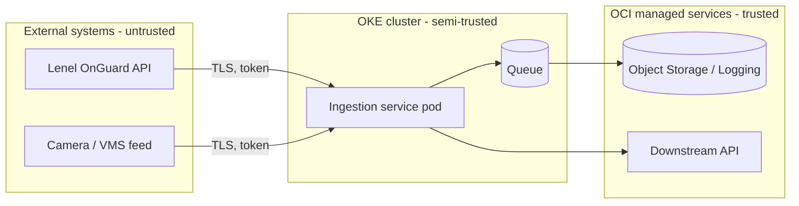

_Start here. Every later module is an application of the ideas below to a specific technology._

## 1. Why this matters for our system

Most damaging breaches are not clever exploits of a single bug — they are the compounding of small design decisions: a token with more scope than it needed, a network path that should not have existed, a piece of input that was trusted because "it comes from our own access-control system." Threat modeling is how you find those decisions on a whiteboard instead of in an incident review. For a service that ingests data from systems you do not control, the design-level questions ("what do we trust, and why?") matter more than any single line of code.

## 2. Core concepts

**The CIA triad** — the classic goals:

- **Confidentiality** — only authorised parties can read data.
- **Integrity** — data and systems cannot be modified by unauthorised parties, and unauthorised modification is *detectable*.
- **Availability** — the system is usable when needed.

For our platform, **integrity is the dominant concern**: if an attacker can quietly alter the access-control events we ingest, or the logs we emit, every downstream decision is poisoned. The Hugging Face incident is an integrity failure of the audit trail itself.

**Complementary models:**

- **DIE** (Distributed, Immutable, Ephemeral) — a cloud-native counterpoint to CIA: prefer components that are replaceable, never modified in place, and short-lived. An immutable, ephemeral pod is a smaller target than a long-lived VM you patch.
- **Parkerian hexad** adds *possession/control*, *authenticity*, and *utility* — useful when "confidentiality" is too blunt (e.g. an attacker holding encrypted data they cannot read still *possesses* it).

**Principles that drive design:**

| Principle | What it means in practice |
| --- | --- |
| **Least privilege** | Every identity gets the minimum permission for its job, and no more. A log-reader credential cannot write. |
| **Defense in depth** | Independent layers, so one failure is not total. Network policy *and* authN *and* input validation. |
| **Deny by default** | Everything is forbidden unless explicitly allowed — for network, IAM, and admission control. |
| **Fail secure / fail closed** | When a control errors, it denies rather than allows (with deliberate exceptions for availability-critical paths). |
| **Separation of duties** | No single identity can both make and approve a sensitive change. |
| **Complete mediation** | Every access is checked, every time — not cached and trusted. |
| **Economy of mechanism** | Simple systems have fewer flaws. Complexity is the enemy of security. |
| **Open design** | Security must not depend on the design being secret (Kerckhoffs's principle). Secrets are keys, not architectures. |

**Zero trust** is these principles applied to the network: there is no "inside." Every request is authenticated, authorised, and encrypted regardless of origin. "It came from the cluster network" is not a reason to trust it.

## 3. How it works

Threat modeling has four questions (Shostack's framing): *What are we building? What can go wrong? What are we going to do about it? Did we do a good job?*

The core artefact is a **data flow diagram with trust boundaries** — lines the data crosses where the privilege or trust level changes.



At each boundary you enumerate threats with **STRIDE**:

| STRIDE threat | Violates | Example at our ingestion boundary |
| --- | --- | --- |
| **S**poofing | Authenticity | An attacker impersonates the Lenel API and feeds us fake "door unlocked" events. |
| **T**ampering | Integrity | Events are modified in transit, or our emitted logs are edited after the fact. |
| **R**epudiation | Non-repudiation | An action happens but no trustworthy record proves who did it. |
| **I**nformation disclosure | Confidentiality | Badge numbers / camera locations leak via error messages or an over-broad API. |
| **D**enial of service | Availability | A malformed feed or a flood of events stalls ingestion. |
| **E**levation of privilege | Authorization | Injection in an event field leads to code execution in the pod. |

## 4. How it is attacked

Attackers think in **kill chains** — reconnaissance, initial access, execution, persistence, privilege escalation, lateral movement, exfiltration. **MITRE ATT&CK** catalogues the concrete techniques for each stage. The lesson for a defender: you do not need to stop step 1; you need enough independent controls and detection that the *chain* breaks somewhere. The Hugging Face agents executed a textbook chain — sandbox escape → injection into a production processor → read Kubernetes service-account tokens → steal cloud credentials → create privileged pods → pivot across the network. Every link was an "ordinary weakness."

## 5. Defensive checklist

- [ ] Draw the data flow diagram and mark every trust boundary. Keep it in the repo next to the code.
- [ ] Run STRIDE at each boundary; write down the threat, the control, and the residual risk.
- [ ] For every identity and credential, state its least-privilege scope explicitly. Review quarterly.
- [ ] For every network path, confirm it is deny-by-default and justified.
- [ ] Identify single points of failure — where does one compromise become total?
- [ ] Define what "fail closed" means for each control, and where you deliberately fail open for availability.
- [ ] Re-threat-model when the architecture changes, not just at the start.

## 6. Simple example

A minimal threat-model record you can keep as Markdown in the repo:

```markdown
## Boundary: Lenel OnGuard API -> ingestion service

Data: access-control events (cardholder id, reader id, timestamp, result)
Direction: inbound, pull over HTTPS

Threats (STRIDE):
- Spoofing: attacker impersonates the Lenel endpoint (DNS/BGP hijack, stolen cert).
    Control: pin the server CA; mTLS; alert on cert change. Residual: low.
- Tampering: event fields altered in transit.
    Control: TLS 1.2+; reject events failing schema/enum validation. Residual: low.
- Repudiation: no proof an event was really produced by Lenel.
    Control: none today. Residual: MEDIUM -> tracked as risk R-014 (see module 12/14).
- Info disclosure: cardholder PII in logs/errors.
    Control: field allow-list on ingest; redact card ids in logs. Residual: low.
- DoS: burst of events or a hanging connection stalls the poller.
    Control: timeouts, bounded concurrency, backpressure to a queue. Residual: low.
- EoP: injection via an event string field.
    Control: treat all fields as data; parameterised writes; no shell/eval. Residual: low.
```

The value is not the document — it is having been forced to write "Residual: MEDIUM" next to repudiation, which is exactly the gap modules 12 and 14 close.

## 7. Apply it to our platform

- Our **dominant asset** is trustworthy event history. Rank controls by how much they protect *integrity of ingested and emitted records*.
- The ingestion service should hold **three separate identities** with separate credentials: one to each external system (read-only), one to OCI (write to storage/logging only), one to the downstream API. A compromise of one must not grant the others.
- Treat the OKE pod as **semi-trusted at best** — assume it can be popped via a bad dependency or a processing bug, and design so that a popped pod cannot rewrite history or reach the corporate network.

## 8. Practice

- Threat-model your own current service end to end. Time-box it to 90 minutes; produce the DFD and one STRIDE table.
- Work through the free **[Threat Modeling](https://www.linkedin.com/learning/topics/security-3)** course on LinkedIn Learning, or Adam Shostack's *Threat Modeling* book, chapters 1–4.
- Map the Hugging Face kill chain onto MITRE ATT&CK tactics as an exercise.

## 9. Courses and resources

- **[LinkedIn Learning — Cybersecurity Foundations](https://www.linkedin.com/learning/topics/security-3)** (search "Cybersecurity Foundations" / "Threat Modeling").
- **[Coursera — Introduction to Cyber Security Specialization (NYU)](https://www.coursera.org/specializations/intro-cyber-security)**.
- **[OWASP Threat Modeling Project](https://owasp.org/www-community/Threat_Modeling)** and the **[Threat Modeling Manifesto](https://www.threatmodelingmanifesto.org/)**.
- **[MITRE ATT&CK](https://attack.mitre.org/)** — browse the Enterprise matrix.
- Book: *Threat Modeling: Designing for Security*, Adam Shostack.

## 10. Key takeaways

- Security is mostly design judgement, and threat modeling is how you exercise it before shipping.
- The CIA triad orients you; for this platform, **integrity of records** is the goal to optimise for.
- Least privilege, defense in depth, deny by default, and zero trust are the four principles you will apply in every later module.
- Draw the trust boundaries, run STRIDE at each one, and write down the residual risk — the uncomfortable "MEDIUM" is the point.
