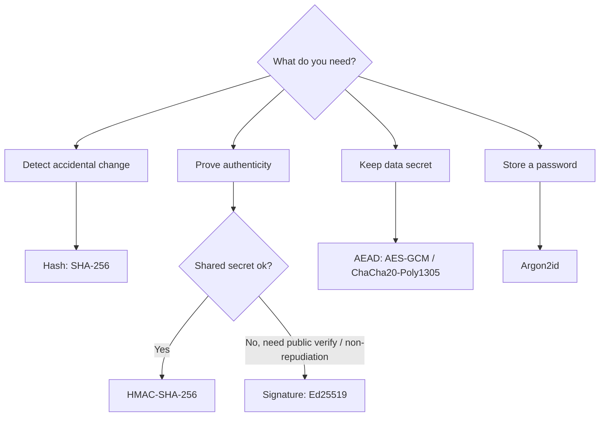

_You do not need to implement crypto. You need to know precisely what each primitive guarantees, so you choose the right one and spot misuse in review._

## 1. Why this matters for our system

TLS, JWT signatures, certificate chains, image signing, and tamper-evident logs are all the same handful of primitives recombined. If you understand hashing, HMAC, and signatures at the "what does this guarantee" level, modules 03, 05, 08, and 12 become straightforward instead of magical. And the most common real-world crypto failure is not a broken algorithm — it is a hard-coded key, a reused nonce, or `MD5` where a signature was needed.

## 2. Core concepts

**Hash functions** (SHA-256, SHA-3, BLAKE3) — a one-way fingerprint. Properties: deterministic, fast, preimage- and collision-resistant. A hash gives you **integrity checking against accidental change** and content addressing. It does **not** prove *who* produced the data — anyone can recompute it. `MD5` and `SHA-1` are broken for collision resistance; never use them for security.

**HMAC** (e.g. HMAC-SHA-256) — a keyed hash. Now only someone with the shared secret key can produce or verify the tag. This gives you **integrity + authenticity between two parties who share a secret**. Used for API request signing, session-cookie integrity, and simple tamper-evident logs.

**Symmetric encryption** (AES-GCM, ChaCha20-Poly1305) — one key encrypts and decrypts. Fast. Always use an **AEAD** mode (Authenticated Encryption with Associated Data) so decryption also verifies integrity — GCM and Poly1305 do this. **Never reuse a nonce/IV with the same key** — with GCM that catastrophically leaks the authentication key.

**Asymmetric encryption** (RSA-OAEP, ECIES) — a public key encrypts, only the private key decrypts. Slow, so in practice it is used to exchange a symmetric key, not bulk data.

**Key exchange** (ECDH, X25519) — two parties derive a shared secret over a public channel. Combined with fresh ephemeral keys per session it gives **forward secrecy**: stealing today's long-term key does not decrypt yesterday's traffic. This is what modern TLS does.

**Digital signatures** (Ed25519, ECDSA, RSA-PSS) — the private key signs, anyone with the public key verifies. Gives you **integrity + authenticity + non-repudiation** *without* a shared secret. This is the primitive behind certificates, JWTs, signed container images, and signed log checkpoints.

**Key derivation functions:**

- **Password hashing** — Argon2id (preferred), scrypt, or bcrypt. Deliberately *slow* and memory-hard to resist brute force. Never use a plain fast hash for passwords.
- **KDFs** — HKDF to expand one strong key into many purpose-specific keys; PBKDF2 only for legacy compatibility.

**Randomness** — use the OS CSPRNG (`/dev/urandom`, `crypto.getRandomValues`, `secrets` in Python). Never `Math.random()` or a seeded PRNG for tokens, keys, nonces, or salts.



## 3. How it works

**At rest vs in transit:**

- *In transit* — TLS 1.2+ (prefer 1.3) for every hop, including inside the cluster. Module 03 covers the handshake.
- *At rest* — the cloud provider encrypts block/object storage by default, but that only protects against stolen disks. For anything sensitive, add **application-layer or envelope encryption** with a key you control in a KMS, so a leaked storage credential is not a data breach.

**Envelope encryption** (how KMS is used at scale): generate a random **data encryption key (DEK)**, encrypt the data with it locally, then ask the KMS to encrypt the DEK with a **key encryption key (KEK)** that never leaves the HSM. Store the wrapped DEK next to the ciphertext. To read, send the wrapped DEK to the KMS to unwrap. You get HSM-grade key protection without a KMS round-trip per record.

**Key lifecycle** — generate in an HSM, distribute via a vault (never in env vars committed to Git), rotate on a schedule and on suspected compromise, and destroy old keys only after everything encrypted under them is re-wrapped.

## 4. How it is attacked

- **Downgrade / protocol attacks** — forcing TLS 1.0 or export ciphers. Mitigation: minimum-version enforcement, no legacy cipher suites.
- **Padding oracles / non-AEAD misuse** — CBC without a MAC leaks plaintext one byte at a time. Mitigation: AEAD only.
- **Nonce reuse** — repeating a GCM nonce breaks it. Mitigation: random 96-bit nonces or a strict counter, and rotate keys before exhaustion.
- **Weak password storage** — fast hashes (`SHA-256`, unsalted) fall to GPU cracking. Mitigation: Argon2id with per-user salt.
- **Hard-coded / leaked keys** — the number-one finding in real audits. Mitigation: secret scanning in CI, keys only from a vault, short-lived where possible.
- **Using a hash where you needed a signature** — trusting a plain SHA-256 checksum an attacker can recompute. Mitigation: sign checkpoints.

## 5. Defensive checklist

- [ ] TLS 1.2 minimum (1.3 preferred) on every connection, including pod-to-pod.
- [ ] All application encryption uses an AEAD mode; nonces are never reused.
- [ ] Passwords (if you store any) use Argon2id; API secrets are high-entropy random, not derived from anything guessable.
- [ ] No key, token, or password in source, env files, container images, or CI logs — enforced by a secret scanner.
- [ ] Sensitive data at rest uses envelope encryption with a KMS-held KEK.
- [ ] Keys have an owner, a rotation schedule, and a documented compromise-response procedure.
- [ ] Signatures (not bare hashes) protect anything an attacker could otherwise forge — log checkpoints, releases, config.

## 6. Simple example

Envelope-encrypting a sensitive field with OCI Vault (Node, conceptual):

```js
import { KmsCryptoClient } from 'oci-keymanagement';
import crypto from 'node:crypto';

// 1. Fresh data key per record.
const dek = crypto.randomBytes(32);
const iv = crypto.randomBytes(12);              // 96-bit nonce, never reused with this dek
const cipher = crypto.createCipheriv('aes-256-gcm', dek, iv);
const ciphertext = Buffer.concat([cipher.update(plaintext, 'utf8'), cipher.final()]);
const tag = cipher.getAuthTag();                // AEAD tag = integrity

// 2. Wrap the DEK with the KMS master key (KEK stays in the HSM).
const { ciphertext: wrappedDek } = await kms.encrypt({
  encryptDataDetails: { keyId: MASTER_KEY_OCID, plaintext: dek.toString('base64') },
});

// 3. Store { ciphertext, iv, tag, wrappedDek } — but never `dek`.
dek.fill(0);                                    // scrub the plaintext key from memory
```

To decrypt: send `wrappedDek` to `kms.decrypt`, get `dek` back, verify the GCM tag on `update`/`final` — a failed tag throws, which is exactly the tamper detection you want.

## 7. Apply it to our platform

- The ingestion service authenticates to external systems with secrets pulled at startup from **OCI Vault via workload identity** (module 04), never from a Kubernetes `Secret` alone and never from the image.
- Cardholder identifiers from Lenel are sensitive: envelope-encrypt them at rest, or hash them with a keyed HMAC if downstream only needs to correlate, not read, them.
- Log checkpoints (module 12) are **Ed25519-signed**, not just hashed, so a downstream consumer can verify them without trusting our storage.

## 8. Practice

- Do the **[PortSwigger padding-oracle labs](https://portswigger.net/web-security/all-labs)** — you will never trust non-AEAD CBC again.
- Implement envelope encryption against a local KMS emulator or OCI Vault free tier.
- Crack a batch of `SHA-256` vs `bcrypt` hashes with `hashcat` on a test set to feel the cost difference.

## 9. Courses and resources

- **[Coursera — Cryptography I (Stanford, Dan Boneh)](https://www.coursera.org/learn/crypto)** — the canonical course; audit free.
- **[LinkedIn Learning — Applied Cryptography / "Learning Cryptography and Network Security"](https://www.linkedin.com/learning/topics/security-3)**.
- **[Oracle University — OCI Vault / Key Management](https://learn.oracle.com/ols/learning-path/become-a-cloud-security-professional-2025/118071/147744)** (part of the OCI Security path).
- Book: *Serious Cryptography*, Jean-Philippe Aumasson — readable, practical, no math degree required.
- **[Cryptographic Right Answers (Latacora)](https://www.latacora.com/blog/2018/04/03/cryptographic-right-answers/)** — what to pick when you must pick.

## 10. Key takeaways

- Hash = integrity vs accidents; HMAC = integrity + authenticity with a shared secret; signature = the same plus non-repudiation and public verification; AEAD = confidentiality + integrity.
- Use Argon2id for passwords, an OS CSPRNG for anything random, and an AEAD mode for anything encrypted.
- The real failures are operational: hard-coded keys, reused nonces, and fast hashes for passwords.
- Keys live in a vault/KMS with an owner and a rotation plan — never in code, images, or env files.
