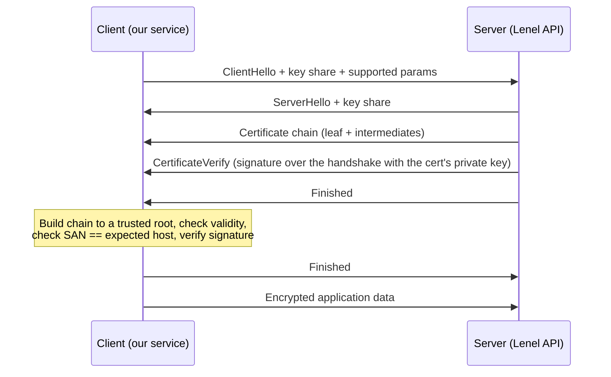

_Certificates are just signed statements: "this public key belongs to this name, and I — a CA you already trust — vouch for it." Everything else is plumbing._

## 1. Why this matters for our system

Our service opens TLS connections *outbound* to Lenel and the VMS, and serves TLS *inbound* to downstream consumers. If any of those connections can be silently intercepted or impersonated, an attacker sits in the middle of our event stream. Inside the cluster, mutual TLS is what lets one pod actually verify it is talking to the ingestion service and not an attacker's pod. And the single most common TLS incident in production is not an attack — it is a certificate that expired at 2 a.m. because nobody automated renewal.

## 2. Core concepts

**X.509 certificate** — a signed document binding a **public key** to a **subject** (a DNS name, or a SPIFFE ID for workloads), with a validity window, an issuer, allowed usages (`Key Usage`, `Extended Key Usage`), and **Subject Alternative Names** (SANs — the field browsers and clients actually check; the legacy `CN` is ignored by modern clients).

**Certificate Authority (CA)** — an entity whose signature on a certificate means "I verified this binding." Your OS/browser ships a **trust store** of root CA public keys. A CA can delegate to **intermediate CAs**, forming a **chain**: leaf → intermediate → root. A client trusts the leaf if it can build a chain to a root it already trusts, every signature verifies, nothing is expired, and nothing is revoked.

**Private CA** — for internal services you run your own CA (OCI Certificates service, HashiCorp Vault, `step-ca`, or cert-manager's CA issuer). Internal clients trust *your* root, not the public web PKI.

**Revocation** — CRLs (lists) and OCSP (online checks) exist but are unreliable at scale. The modern answer is **short-lived certificates** (hours to days): a compromised cert expires before revocation would have mattered.

**Mutual TLS (mTLS)** — normal TLS authenticates only the *server* to the *client*. mTLS also makes the client present a certificate, so both ends are cryptographically identified. This is the backbone of zero-trust service-to-service communication and of a service mesh.

**SPIFFE / SPIRE** — a standard for **workload identity**. Each workload gets a **SPIFFE ID** (`spiffe://trust-domain/ns/prod/sa/ingestion`) delivered as a short-lived X.509 SVID (or JWT). SPIRE attests *what* the workload is (which node, which Kubernetes service account) before issuing it, so identity is not a copyable secret.

## 3. How it works

The TLS 1.3 handshake, abbreviated:



The two checks that give you the security guarantee: (1) the chain terminates at a root you trust and every signature verifies; (2) the name you *intended* to connect to is in the certificate's SANs. Skip either and you have encryption without authentication — useless against a MITM.

**Certificate lifecycle:** generate keypair → create a CSR → CA validates and issues → deploy leaf + chain → monitor expiry → **rotate before expiry** → revoke on compromise. Automate the whole loop; humans forget.

## 4. How it is attacked

- **MITM via trust failures** — client does not validate the chain, ignores hostname mismatch, or trusts a too-broad set of CAs. Result: attacker presents any cert and reads everything.
- **Rogue / mis-issued certificates** — a CA is tricked or compromised into issuing a cert for your domain. Detection: **Certificate Transparency** monitoring (watch CT logs for certs naming your domains).
- **Stripping** — downgrading HTTPS to HTTP at a proxy. Mitigation: HSTS, and refuse plaintext.
- **Expired-cert outage** — self-inflicted DoS. Mitigation: automated renewal + expiry alerting well before the deadline.
- **Stolen leaf key** — attacker impersonates your service until the cert expires. Mitigation: short-lived certs, non-exportable keys (PKCS#11/HSM or SPIRE-delivered).
- **`InsecureSkipVerify` / disabled validation** — the "make it work" flag that ships to prod. Mitigation: lint for it; block in review.

## 5. Defensive checklist

- [ ] Every TLS client validates the full chain **and** the hostname/SAN. No `InsecureSkipVerify`, no global "trust all."
- [ ] Outbound connections to Lenel/VMS pin to the specific issuing CA (not the whole public trust store).
- [ ] In-cluster service-to-service traffic uses mTLS (service mesh or SPIRE).
- [ ] Certificates are short-lived and rotated automatically (cert-manager, SPIRE, or OCI Certificates).
- [ ] Expiry monitoring alerts at 30/14/7 days for anything not auto-rotated.
- [ ] CT-log monitoring is enabled for your public domains.
- [ ] Private keys are non-exportable where the platform allows it.

## 6. Simple example

Pinning the expected CA for an outbound call instead of trusting every public root (Node):

```js
import fs from 'node:fs';
import https from 'node:https';

const agent = new https.Agent({
  ca: fs.readFileSync('/etc/tls/lenel-issuing-ca.pem'),  // ONLY this CA is trusted for this call
  minVersion: 'TLSv1.2',
  checkServerIdentity: (host, cert) => {
    // default check verifies SAN; add an explicit expected-host assertion for clarity
    if (host !== 'onguard.corp.example') throw new Error(`unexpected host ${host}`);
    return undefined;
  },
});

const res = await fetch('https://onguard.corp.example/api/access-events', { agent });
```

Automated in-cluster certificates with cert-manager:

```yaml
apiVersion: cert-manager.io/v1
kind: Certificate
metadata: { name: ingestion-tls, namespace: prod }
spec:
  secretName: ingestion-tls
  duration: 24h            # short-lived
  renewBefore: 8h          # rotate with plenty of margin
  privateKey: { algorithm: ECDSA, size: 256, rotationPolicy: Always }
  dnsNames: [ingestion.prod.svc.cluster.local]
  issuerRef: { name: internal-ca, kind: ClusterIssuer }
```

## 7. Apply it to our platform

- Maintain a small, explicit **trust bundle per external system** and mount it into the pod; do not rely on the base image's global CA store for these high-value connections.
- Adopt a **service mesh (Istio/Linkerd) or SPIRE** so pod-to-pod calls are mTLS with automatically rotated identities — this directly limits the "attacker's pod impersonates ingestion" scenario from the Hugging Face-style lateral movement.
- If Lenel supports client certificates, use **mTLS outbound** so the access-control system also authenticates *us*.
- Alert on any change to an external system's certificate or issuing CA — an unexpected change is a possible interception.

## 8. Practice

- Inspect a real chain: `openssl s_client -connect example.com:443 -showcerts` and read every field of the leaf with `openssl x509 -text`.
- Stand up `step-ca` or cert-manager locally and issue yourself a 5-minute certificate; watch it rotate.
- Deploy Linkerd to a kind cluster and confirm with `linkerd viz tap` that traffic is mTLS.

## 9. Courses and resources

- **[LinkedIn Learning — "Learning Cryptography and Network Security" / "SSL Certificates for Web Developers"](https://www.linkedin.com/learning/topics/network-security)**.
- **[Cloudflare Learning Center — What is TLS / SSL](https://www.cloudflare.com/learning/ssl/what-is-ssl/)** — clear conceptual reference.
- **[SPIFFE / SPIRE documentation](https://spiffe.io/docs/latest/spiffe-about/overview/)**.
- **[cert-manager documentation](https://cert-manager.io/docs/)**.
- **[RFC 8446 — TLS 1.3](https://www.rfc-editor.org/rfc/rfc8446)** (skim the handshake section).
- **[OCI Certificates service](https://docs.oracle.com/en-us/iaas/Content/certificates/home.htm)**.

## 10. Key takeaways

- A certificate is a CA-signed binding of a public key to a name; TLS security depends on validating the chain **and** the name — never disable either.
- Prefer short-lived, auto-rotated certificates over revocation infrastructure.
- mTLS (via a mesh or SPIRE) gives every service a verifiable identity and is the practical foundation of zero trust inside the cluster.
- The most likely certificate incident is an expired cert; automate renewal and alert early.
