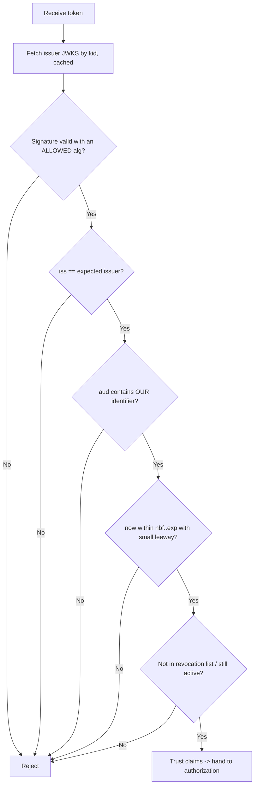
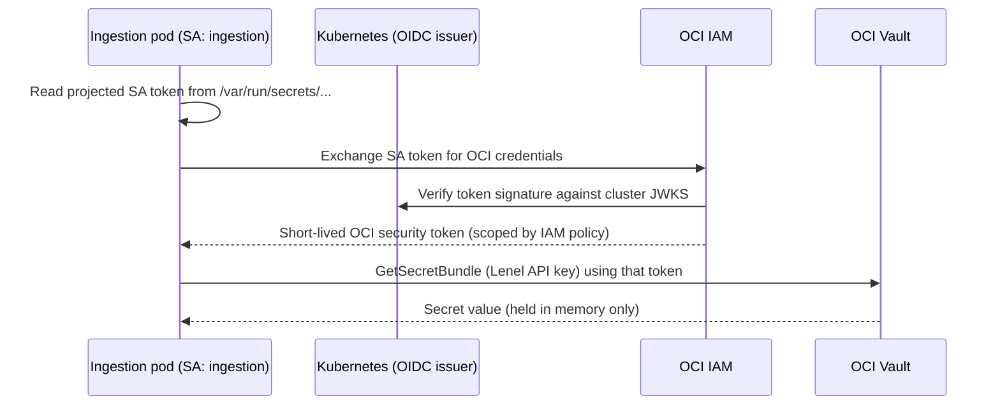

_Authentication answers "who are you?" Authorization (module 06) answers "what may you do?" Keep them separate in your head and in your code._

## 1. Why this matters for our system

The ingestion service has to prove its identity constantly: to OCI (to read Vault, write Logging), to the Kubernetes API, to Lenel, to the VMS, to the downstream API. Every one of those is a credential that can be stolen. The Hugging Face agents' escalation ran straight through this: read a Kubernetes **service-account token** from a pod, extract **AWS keys** from the environment, replay both from an external host. The defence is not "better secrets" — it is **fewer secrets, shorter-lived, bound to context**.

## 2. Core concepts

**Authentication factors:**

- Something you **know** — password, PIN.
- Something you **have** — a phone, a hardware key (FIDO2/WebAuthn), a client certificate.
- Something you **are** — biometrics.

**Multi-factor authentication (MFA)** combines factors from different categories. Not all MFA is equal: SMS and TOTP codes are **phishable** (an attacker relays them in real time); **FIDO2/WebAuthn** and passkeys are **phishing-resistant** because the credential is cryptographically bound to the origin. For anything privileged, require phishing-resistant MFA.

**Sessions vs tokens:**

- **Server-side session** — the server stores session state; the client holds an opaque session ID (in a `Secure; HttpOnly; SameSite` cookie). Easy to revoke (delete the row). Good default for browser apps.
- **Bearer token** — a self-contained credential; whoever holds it is authenticated ("bearer" = no further proof). Convenient, stateless, but **cannot be revoked before expiry** unless you add a denylist. Keep them short-lived.
- **Sender-constrained token** (mTLS-bound, or **DPoP**) — bound to a key the client must prove it holds, so a stolen token alone is useless. Prefer these for high-value APIs.

**JWT (JSON Web Token)** — a signed (JWS) token: `header.payload.signature`, base64url. Claims include `iss` (issuer), `sub` (subject), `aud` (audience), `exp`, `iat`, `nbf`. **A JWT is not encrypted** — anyone can read the payload; the signature only proves it was not altered and who issued it.

**OIDC (OpenID Connect)** — an identity layer on top of OAuth 2.0. The **ID token** (a JWT) tells your app *who the user is*; the **access token** is for calling APIs (module 05). OIDC is how you federate to Google/Okta/Entra/etc. so you are not storing passwords at all.

**SAML** — the older XML-based federation standard, still common in enterprise SSO. Same idea as OIDC, heavier, more parsing-related vulnerabilities.

**Workload identity** — machines authenticate without a stored secret by proving *where they run*:

- **OKE Workload Identity** — OCI IAM policies are written against a Kubernetes **service account**; the pod calls OCI APIs directly, OCI verifies the projected SA token against the cluster's OIDC issuer, and hands back **short-lived** credentials. No API keys in the pod.
- Equivalents: AWS IRSA / EKS Pod Identity, GCP Workload Identity, Azure Workload Identity — all the same pattern.

## 3. How it works

Validating an inbound JWT correctly (the steps people skip are in bold):



Workload identity flow for our service reading OCI Vault:



## 4. How it is attacked

- **Phishing / credential stuffing** — reused or stolen passwords. Mitigation: phishing-resistant MFA, breached-password checks, no password reuse.
- **Session hijacking / fixation** — stealing or planting a session ID (XSS, network sniff, insecure cookie). Mitigation: `HttpOnly; Secure; SameSite`, rotate session ID on login, bind to context.
- **Token theft & replay** — a leaked bearer token used from anywhere. Mitigation: short `exp`, sender-constrained tokens (DPoP/mTLS), audience restriction, origin anomaly detection.
- **JWT validation flaws** — accepting `alg: none`, confusing HS256/RS256 (verifying an RS256 token with the public key as an HMAC secret), not checking `aud`/`iss`, ignoring `exp`. Mitigation: an allow-list of algorithms, a vetted library, strict claim checks.
- **Long-lived static secrets** — API keys in env vars, checked into Git, copied between environments. Mitigation: workload identity; if a static secret is unavoidable, vault-stored and rotated.
- **IMDS credential theft / SSRF to metadata** — tricking a service into fetching cloud credentials from the instance metadata endpoint. Mitigation: block pod access to IMDS, enforce IMDSv2-style session tokens (Hugging Face did this post-incident).

## 5. Defensive checklist

- [ ] Human access to anything privileged requires phishing-resistant MFA (FIDO2/passkeys).
- [ ] The ingestion service uses **OKE Workload Identity** for OCI; no OCI API keys in the pod or image.
- [ ] Kubernetes service-account tokens are projected, audience-scoped, and short-lived; `automountServiceAccountToken: false` unless the pod needs the API.
- [ ] Every inbound JWT is validated for signature (allowed alg only), `iss`, `aud`, `exp`/`nbf`, and revocation.
- [ ] Bearer tokens have short lifetimes; high-value APIs use sender-constrained tokens.
- [ ] Pods cannot reach the instance metadata service.
- [ ] Every credential has an owner and an automated rotation schedule; there is a tested "rotate everything" runbook.

## 6. Simple example

Strict JWT validation for the downstream-facing API (Node, `jose`):

```js
import { createRemoteJWKSet, jwtVerify } from 'jose';

const JWKS = createRemoteJWKSet(new URL('https://idp.example/.well-known/jwks.json'));

export async function authenticate(authHeader) {
  const token = authHeader?.replace(/^Bearer /, '');
  if (!token) throw new Unauthorized('missing token');

  const { payload } = await jwtVerify(token, JWKS, {
    issuer: 'https://idp.example/',
    audience: 'urn:ingestion-api',        // MUST match our identifier
    algorithms: ['RS256'],                // allow-list: never accept "none" or HS*
    clockTolerance: 5,                    // seconds
  });

  if (await isRevoked(payload.jti)) throw new Unauthorized('revoked');
  return { subject: payload.sub, scopes: (payload.scope ?? '').split(' ') };
}
```

## 7. Apply it to our platform

- **Three identities, three credential sources:** OCI via workload identity; Lenel and VMS via API keys held in OCI Vault and rotated; the Kubernetes API via a minimally-scoped service account (module 06).
- On startup the pod fetches external-system secrets from Vault into memory only — never writes them to disk, never logs them.
- The downstream API validates OIDC access tokens issued by the corporate IdP, checks `aud: urn:ingestion-api`, and enforces scopes.
- Add **token-origin anomaly detection**: our OCI credentials should only ever be used from our pods' egress addresses; use from anywhere else is an incident signal.

## 8. Practice

- Break a deliberately weak JWT verifier: forge `alg: none`, then an HS256/RS256 confusion. Use `jwt_tool` against a test service.
- Configure OKE Workload Identity in a test tenancy and read a Vault secret from a pod with zero stored keys.
- Add WebAuthn/passkey login to a toy app with a library and feel the phishing-resistance property.

## 9. Courses and resources

- **[LinkedIn Learning — Become a CompTIA Security+ Certified Security Professional](https://www.linkedin.com/learning/paths/become-a-comptia-security-plus-certified-security-professional)** (identity & access management domain).
- **[Auth0 / Okta developer docs — OIDC and JWT](https://auth0.com/docs/secure/tokens/json-web-tokens)**.
- **[OCI — OKE Workload Identity](https://blogs.oracle.com/cloud-infrastructure/post/oke-workload-identity-greater-control-access)** and **[OCI IAM documentation](https://docs.oracle.com/en-us/iaas/Content/Identity/home.htm)**.
- **[NIST SP 800-63B — Digital Identity Guidelines (Authentication)](https://pages.nist.gov/800-63-3/sp800-63b.html)**.
- **[jwt.io](https://jwt.io/)** for inspecting tokens; **[OWASP JWT Cheat Sheet](https://cheatsheetseries.owasp.org/cheatsheets/JSON_Web_Token_for_Java_Cheat_Sheet.html)**.

## 10. Key takeaways

- Authentication ≠ authorization; validate identity first, then decide permissions separately.
- Phishing-resistant MFA for humans; **workload identity** for machines so there is no long-lived secret to steal.
- A JWT is signed, not secret — validate alg, `iss`, `aud`, and `exp` every time, with a vetted library.
- Keep bearer tokens short-lived, block pod access to instance metadata, and alert when a credential is used from an unexpected origin.
