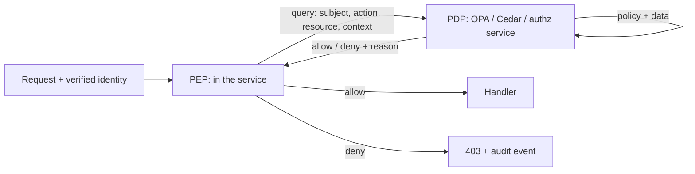

_Authentication is a solved problem you should not reinvent. Authorization is where most application-level breaches actually happen, because the rules live scattered through the code and drift._

## 1. Why this matters for our system

Broken authorization is the #1 category in the OWASP API Security Top 10 (BOLA/BFLA). For our platform the questions are concrete: which service accounts may the ingestion pod use in Kubernetes? Can a `events:read` caller reach an admin route? If a downstream consumer is scoped to "building A," can it pull building B's badge events by changing an ID? Getting these right is mostly discipline, not technology.

## 2. Core concepts

**The models, in increasing expressiveness:**

| Model | Decision is based on | Good for | Cost |
| --- | --- | --- | --- |
| **RBAC** (role-based) | the roles assigned to the subject | coarse org-level permissions, admin tiers | role explosion when rules get contextual |
| **ABAC** (attribute-based) | attributes of subject, resource, action, environment | contextual rules ("same department, business hours") | policy complexity, harder to reason about |
| **ReBAC** (relationship-based) | the graph of relationships ("is owner of," "is member of parent folder") | hierarchical/shared resources (Google-Docs-style) | needs a purpose-built store (Zanzibar / OpenFGA) |

Most real systems are **RBAC for the coarse layer + ABAC for the fine layer**. Start with RBAC; add attributes only where a role cannot express the rule.

**Core design rules:**

- **Deny by default** — the absence of a matching allow rule means *no*.
- **Least privilege** — grant the minimum; expire grants; review them.
- **Complete mediation** — check on *every* access, including object-level ("may this subject touch *this* record?"), not just route-level ("may this subject call this endpoint?").
- **Centralize the decision, distribute the enforcement** — one policy engine/service answers "is this allowed?"; each service enforces the answer. Scattered `if user.isAdmin` checks are how drift happens.
- **Separate policy from code** — policy as data (Rego, Cedar, a policy table) so it can be reviewed, tested, and changed without a redeploy.
- **Fail closed** — if the policy engine is unreachable, deny (with a deliberate, monitored exception only where availability truly outranks the risk).

**Policy engines:**

- **OPA / Rego** — general-purpose policy engine; used for Kubernetes admission (Gatekeeper), API authorization, CI checks. Ship policy as a bundle; test with `opa test`.
- **AWS Cedar** — a purpose-built authorization language with analyzability (you can prove properties about policies); used by Amazon Verified Permissions and available standalone.
- **OpenFGA / SpiceDB** — ReBAC stores implementing Google's Zanzibar model.

## 3. How it works

The Policy Decision Point / Policy Enforcement Point split:



**Kubernetes RBAC** is a concrete RBAC system you must configure for our pod:

- `Role` / `ClusterRole` = a set of allowed verbs on resources; `RoleBinding` / `ClusterRoleBinding` ties it to a subject (a `ServiceAccount`).
- Kubernetes RBAC is **additive and allow-only** — there are no deny rules, so a single over-broad binding is the whole risk. `list`/`watch` on `secrets` is effectively "read all secrets in scope."
- The ingestion pod should get a tiny namespaced `Role` (probably: read its own `ConfigMap`, nothing else) and `automountServiceAccountToken: false` if it never calls the API.

## 4. How it is attacked

- **BOLA / IDOR (broken object-level authorization)** — `GET /events/1042` returns another tenant's event because the code checks "is authenticated" but not "owns 1042." The most common serious API bug.
- **BFLA (broken function-level authorization)** — a non-admin calls `POST /admin/replay` because the route only checks authentication.
- **Privilege escalation via role assignment** — an endpoint that lets a user grant themselves a role, or a Kubernetes `RoleBinding` that lets a SA create other bindings / `escalate` / `bind`.
- **Confused deputy** — a privileged service performs an action on behalf of a less-privileged caller without downscoping, so the caller borrows privilege.
- **Policy drift** — roles accrete permissions over years; nobody removes them. "Privilege creep."
- **Wildcard / default-allow** — `resources: ["*"], verbs: ["*"]`, or a catch-all `allow` at the top of a Rego policy.

## 5. Defensive checklist

- [ ] Every data-returning endpoint does an **object-level** check ("subject may access *this* resource"), not just a route-level one.
- [ ] Authorization decisions come from one place (policy engine or authz module), enforced consistently; no scattered ad-hoc role checks.
- [ ] Policy is data, version-controlled, and unit-tested, including deny cases and boundaries.
- [ ] Kubernetes: the ingestion SA has a minimal namespaced `Role`; no `cluster-admin`, no `secrets` `list`, no `bind`/`escalate`/`impersonate`; token not automounted unless needed.
- [ ] No wildcards in production roles/policies; deny by default with an explicit default rule.
- [ ] Quarterly access review: list every role/binding/grant and re-justify it; remove the unjustified.
- [ ] Policy engine failure = deny, and that denial is alerted.

## 6. Simple example

An OPA/Rego policy for the events API, with an object-level rule:

```rego
package ingestion.authz
default allow := false

# route-level: scope gates the action
allow if {
    input.action == "read"
    "events:read" in input.subject.scopes
    scope_ok
}
allow if {
    input.action == "admin"
    "events:admin" in input.subject.scopes
}

# object-level: a reader may only see buildings it is entitled to
scope_ok if {
    input.action == "read"
    some b in input.subject.buildings
    b == input.resource.building
}
```

```js
// PEP in the service
const decision = await opa.evaluate('ingestion/authz/allow', {
  subject: req.auth,                              // scopes + buildings from the token
  action: 'read',
  resource: { building: event.building },        // the ACTUAL object being returned
});
if (!decision) return res.status(403).json({ error: 'forbidden' });
```

Minimal Kubernetes RBAC for the pod:

```yaml
apiVersion: rbac.authorization.k8s.io/v1
kind: Role
metadata: { namespace: prod, name: ingestion }
rules:
  - apiGroups: [""]
    resources: ["configmaps"]
    resourceNames: ["ingestion-config"]   # this one object only
    verbs: ["get"]
# no secrets, no list/watch, no other resources
```

## 7. Apply it to our platform

- Model downstream consumers as **RBAC (reader / admin) + ABAC (entitled buildings/sites)**. The building check must be **object-level**, evaluated against the record actually being returned.
- Keep the policy in the repo as Rego with tests; a CI job runs `opa test` and fails the build on a regression.
- The ingestion pod's Kubernetes identity is deliberately near-powerless — this is the control that would have blunted the Hugging Face lateral movement (their compromised pod could read cluster-wide catalog and secrets).
- Every `403` is an audit event in the tamper-evident pipeline; a spike is a probing signal.

## 8. Practice

- Do the **[PortSwigger access control labs](https://portswigger.net/web-security/access-control)** — IDOR and privilege escalation end to end.
- Write and `opa test` a Rego policy with at least three deny cases; then break it and watch the test catch it.
- Audit a real cluster: `kubectl get clusterrolebindings -o wide` and find the over-broad ones. Try `kubectl auth can-i --list --as=system:serviceaccount:prod:ingestion`.

## 9. Courses and resources

- **[OWASP API Security Top 10](https://owasp.org/API-Security/editions/2023/en/0x11-t10/)** — API1 BOLA, API5 BFLA.
- **[Open Policy Agent documentation](https://www.openpolicyagent.org/docs/latest/)** and the **[Rego Playground](https://play.openpolicyagent.org/)**.
- **[Kubernetes RBAC documentation](https://kubernetes.io/docs/reference/access-authn-authz/rbac/)**.
- **[Google Zanzibar paper](https://research.google/pubs/pub48190/)** / **[OpenFGA](https://openfga.dev/)** for ReBAC.
- **[LinkedIn Learning — "Kubernetes Security" / "Application Security"](https://www.linkedin.com/learning/topics/security-3)**.

## 10. Key takeaways

- Most breaches at the app layer are authorization bugs — check object-level access, not just the route.
- RBAC for coarse rules, ABAC for context; centralize the decision, keep policy as tested data.
- Kubernetes RBAC is allow-only and additive — one broad binding is the whole risk; keep the ingestion SA minimal.
- Deny by default, fail closed, review grants regularly, and audit every denial.
