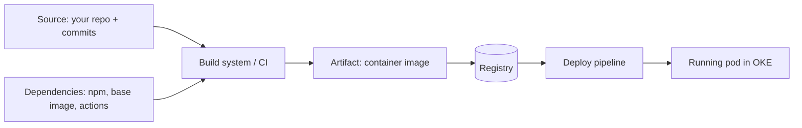

_You audit your own code in review. The 90% of the running system that came from npm, a base image, and GitHub Actions gets no such scrutiny by default. Supply chain security closes that gap._

## 1. Why this matters for our system

Two of the decade's defining incidents are supply chain attacks: **SolarWinds** (a compromised build system injected a backdoor into signed updates) and the **xz-utils backdoor** (a multi-year social-engineering campaign put a hidden SSH backdoor into a core Linux library, caught by luck). The Hugging Face intrusion also used supply chain paths — a **zero-day in a package-registry cache proxy** for the initial escape, and a **leaked platform token + GitHub App integration** to reach internal source control. Our pipeline pushes straight to `main` and deploys with no human review step, so the pipeline *is* the perimeter.

## 2. Core concepts

**The supply chain, as attack surface:**



**Dependency risks:**

- **Known-vulnerable versions** — a dependency with a public CVE. Caught by **SCA** (Software Composition Analysis: `npm audit`, Trivy, Grype, Dependabot).
- **Malicious packages** — **typosquatting** (`reqeusts`), **dependency confusion** (publishing `@yourco/internal-lib` to the public registry so the resolver picks it over your private one), and **account/maintainer takeover** (xz).
- **Transitive blast radius** — you depend on 12 things; they pull 900. `postinstall` scripts run arbitrary code at install time.

**Provenance and integrity:**

- **SBOM** (Software Bill of Materials) — a machine-readable inventory of every component and version (SPDX or CycloneDX). Generate one per build so that when the next xz drops you can answer "are we affected?" in minutes. **AIBOM** extends this to models and datasets.
- **SLSA** (Supply-chain Levels for Software Artifacts) — a framework of levels for build integrity. The key idea: a **signed provenance attestation** stating *which source and which builder* produced *this exact artifact hash*, generated by the build platform (not the developer), so a tampered artifact fails verification.
- **Sigstore** (`cosign`) — keyless signing of artifacts and attestations using short-lived certs tied to an OIDC identity (e.g. the GitHub Actions workload), logged in a public transparency log (Rekor). You sign the image digest in CI and **verify the signature + provenance at admission** in the cluster.

**Pinning:**

- Application deps — commit the **lockfile**; CI uses `npm ci` (never a bare `npm install`, which drifts the lock — this repo's own rule).
- Container base images — pin by **digest** (`@sha256:...`), not a moving tag like `:latest` or `:20`.
- GitHub Actions — pin to a **full commit SHA**, not `@v4` (tags are mutable; a compromised action tag has hit thousands of repos).

## 3. How it works

A hardened pipeline for our service:

1. **Commit** — signed commits (Sigstore `gitsign` or GPG); branch protection; required review for anything outside `chore:` automation.
2. **Resolve** — `npm ci` from the committed lockfile; registry scoped so private names never resolve publicly; `--ignore-scripts` where feasible.
3. **Scan** — SCA on dependencies, secret scan, SAST, IaC scan; fail on high severity.
4. **Build** — reproducible build in an ephemeral runner; minimal base image pinned by digest (distroless / `-slim`, non-root).
5. **Attest** — generate SBOM (Syft/CycloneDX) and SLSA provenance; sign image digest + attestations with `cosign` keyless.
6. **Push** — to the OCI Registry (OCIR); immutable tags.
7. **Admit** — the cluster's admission controller verifies the `cosign` signature, the provenance (built by *our* workflow from *our* repo), and that no `critical` CVE is unignored, before the pod is allowed to run.

## 4. How it is attacked

- **Typosquatting / brandjacking** — you `npm i` a lookalike name; its `postinstall` exfiltrates env vars.
- **Dependency confusion** — internal package name + higher version on the public registry → resolver picks the attacker's.
- **Maintainer takeover** — legit package, new "helpful" maintainer, months later a malicious minor release (xz pattern).
- **Compromised CI** — a malicious or over-permissioned GitHub Action reads `GITHUB_TOKEN`/secrets or tampers with the artifact after tests pass (SolarWinds pattern).
- **Mutable references** — `action@v4` or `image:latest` silently changes under you.
- **Unsigned / unverified artifacts** — nothing checks that the image running is the image you built.
- **Registry cache-proxy bugs** — a vulnerable pull-through proxy serves a poisoned package (Hugging Face initial access).

## 5. Defensive checklist

- [ ] Lockfile committed; CI uses `npm ci`; renovate/Dependabot for controlled updates.
- [ ] Private package names are reserved on public registries or the resolver is scoped to refuse public resolution for internal scopes.
- [ ] Base images pinned by digest, minimal, non-root; rebuilt on a schedule for OS CVEs.
- [ ] GitHub Actions pinned to full commit SHAs; `permissions:` set to least privilege (default `contents: read`); `GITHUB_TOKEN` scoped per job.
- [ ] SBOM generated and stored per release; a documented process to query it against a new CVE.
- [ ] Images + SBOM + provenance signed with `cosign` in CI.
- [ ] Admission control **verifies** signature and provenance; unsigned or unattested images cannot run (module 09).
- [ ] Commits are signed; branch protection requires review for non-automation changes.
- [ ] Secret scanning on every push and in history.

## 6. Simple example

Signing and verifying in GitHub Actions (keyless):

```yaml
permissions:
  contents: read
  id-token: write        # for cosign keyless OIDC
  packages: write

steps:
  - uses: actions/checkout@b4ffde65f46336ab88eb53be808477a3936bae11   # v4, pinned by SHA
  - run: npm ci && npm test && npm run build
  - name: Build & push
    run: |
      docker build -t "$IMAGE" .
      docker push "$IMAGE"
      echo "DIGEST=$(docker inspect --format='{{index .RepoDigests 0}}' "$IMAGE")" >> "$GITHUB_ENV"
  - uses: sigstore/cosign-installer@...        # pinned by SHA
  - run: |
      syft "$DIGEST" -o cyclonedx-json > sbom.json
      cosign attest --predicate sbom.json --type cyclonedx "$DIGEST"   # keyless
      cosign sign "$DIGEST"
```

Verification (also runs as an admission policy in-cluster):

```bash
cosign verify \
  --certificate-identity-regexp 'https://github.com/myorg/ingestion/.github/workflows/.+' \
  --certificate-oidc-issuer https://token.actions.githubusercontent.com \
  "$DIGEST"
```

Reserving an internal scope to stop dependency confusion (`.npmrc`):

```
@myco:registry=https://registry.corp.example
# internal scope NEVER falls through to the public registry
```

## 7. Apply it to our platform

- Because `main` auto-deploys with no review gate, the CI job's identity and permissions **are** the production trust boundary — pin every action by SHA, set `permissions:` minimal, and never let a workflow triggered by an outside contributor (`pull_request_target`, fork PRs) touch deploy secrets.
- Add a **`cosign` verification admission policy** (Kyverno/Gatekeeper) to the OKE cluster so only images built by our workflow from our repo can run — this is the control that turns a poisoned registry entry into a failed deploy instead of a breach.
- Keep an **SBOM per release** in object storage; write a one-page runbook: "new critical CVE announced → grep SBOMs → list affected releases → patch."
- Maintain an **AIBOM** if the service ever loads a model for classification — pin model hashes the same way you pin image digests.

## 8. Practice

- Generate an SBOM for your current service with **Syft**; scan it with **Grype**; pick one real finding and remediate it.
- Set up `cosign` keyless signing in a test repo and a Kyverno `verifyImages` policy in a kind cluster; watch an unsigned image get rejected.
- Simulate dependency confusion in a scratch project and confirm your `.npmrc` scoping blocks it.

## 9. Courses and resources

- **[SLSA framework](https://slsa.dev/)** and **[Sigstore documentation](https://docs.sigstore.dev/)**.
- **[CISA — Securing the Software Supply Chain guidance](https://www.cisa.gov/resources-tools/resources/securing-software-supply-chain-series)**.
- **[CNCF — Software Supply Chain Best Practices paper](https://github.com/cncf/tag-security)**.
- **[LinkedIn Learning — "DevSecOps" / "Securing the Software Supply Chain"](https://www.linkedin.com/learning/topics/security-3)**.
- **[OpenSSF courses (free, edX) — "Developing Secure Software" (LFD121)](https://openssf.org/training/courses/)**.
- Read the **[xz backdoor writeups](https://research.swtch.com/xz-timeline)** — the definitive social-engineering-plus-code case study.

## 10. Key takeaways

- Most of your running system is third-party; provenance and verification are how you extend review to it.
- Pin everything by immutable reference: lockfile, base-image digest, action SHA.
- Generate an SBOM per build so the next xz is a query, not a fire drill.
- Sign artifacts with Sigstore in CI and **verify at admission** — for a repo that auto-deploys, this is the highest-value control you can add.
