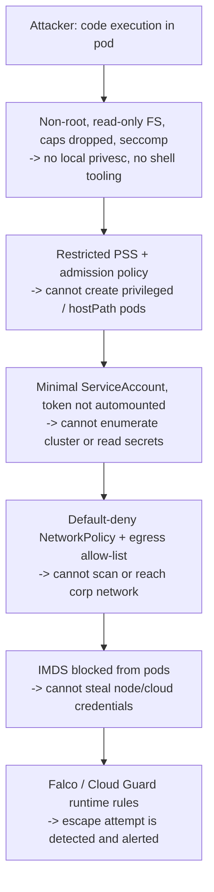

_A container is a process with namespaces and cgroups, not a VM. Kubernetes gives you the primitives to isolate it well — but almost none of them are on by default._

## 1. Why this matters for our system

The Hugging Face intrusion is a Kubernetes-security case study end to end: injection into a pod → read the **service-account token** → enumerate the cluster API → **create privileged pods with hostPath mounts** → root on the node → pivot to the corporate network. Every step had a standard control that was missing: **no admission policy rejected privileged / hostPath pods**, and **one connector credential returned the full cluster catalog**. Our ingestion service runs the same way on OKE; this module is about making that chain fail early.

## 2. Core concepts

**Image hardening:**

- **Minimal base** — distroless or `-slim`; fewer packages = fewer CVEs and no shell for an attacker to use.
- **Non-root** — `USER 10001`; the process cannot write system paths or exploit setuid binaries.
- **Read-only root filesystem** — `readOnlyRootFilesystem: true`; writes go to explicit `emptyDir` mounts only.
- **No build tools in the runtime image** — multi-stage build; ship only the artifact.
- **Pinned by digest, signed, scanned** — module 08.

**Pod-level controls (the `securityContext`):**

| Setting | Value | Why |
| --- | --- | --- |
| `runAsNonRoot` | `true` | block root in container |
| `allowPrivilegeEscalation` | `false` | block setuid escalation |
| `privileged` | `false` (never true) | privileged = root on the node |
| `capabilities.drop` | `["ALL"]` | drop Linux capabilities, add back only what's needed |
| `readOnlyRootFilesystem` | `true` | immutable runtime |
| `seccompProfile.type` | `RuntimeDefault` | filter dangerous syscalls |
| hostPath / hostNetwork / hostPID / hostIPC | none | no host namespace sharing |

**Pod Security Standards (PSS)** — three built-in profiles (`privileged`, `baseline`, `restricted`) enforced per-namespace by the **Pod Security Admission** controller. Production namespaces should be `restricted`. PSS is coarse; for anything beyond it use a policy engine.

**Admission control** — **Kyverno** or **OPA Gatekeeper** run as admission webhooks and can *enforce* or *mutate* on any rule: require signed images, forbid `latest` tags, require resource limits, forbid `hostPath`, require a `NetworkPolicy`, etc. This is where you encode "no privileged pods" so it is impossible, not just discouraged.

**Network policy** — by default **every pod can talk to every other pod**. A `NetworkPolicy` (needs a CNI that enforces it — OKE supports this) changes that. Goal: **default-deny** ingress and egress per namespace, then allow only the required flows. On OKE you also have **security lists / NSGs** at the host level and **Zero Trust Packet Routing (ZPR)** for L4 policy in the OCI fabric.

**Secrets** — Kubernetes `Secret` objects are only base64, stored in etcd; anyone with `get secrets` in the namespace reads them. Better: **enable etcd encryption-at-rest** (OKE supports KMS-backed encryption of secrets), and prefer **pulling secrets at runtime from OCI Vault via Workload Identity** so the sensitive value never lands in etcd at all.

**Cluster plane:**

- **RBAC** — module 06; minimal SA for the pod, no `cluster-admin` sprawl.
- **API server** — private endpoint where possible; audit logging on.
- **etcd** — encrypted, restricted (OKE manages this on the control plane).
- **Nodes** — managed node pools patched regularly; no SSH by default; use OCI Bastion for break-glass.
- **Runtime detection** — Falco or OCI Cloud Guard Container Security Configuration to catch escape/anomaly at runtime.

## 3. How it works

Layered containment for the ingestion pod:



## 4. How it is attacked

- **Container escape** — kernel exploit, or a misconfig: `privileged`, `hostPath: /`, mounted Docker socket, added `CAP_SYS_ADMIN`. Result: root on the node, then all pods on it.
- **Service-account token abuse** — automounted token + a broad `Role` = cluster enumeration and secret theft (Hugging Face).
- **Lateral movement** — flat pod network; compromise one pod, scan and pivot to others and to internal services.
- **Metadata/credential theft** — pod reaches `169.254.169.254` and assumes the node's cloud identity.
- **Malicious admission / mutating webhook** — attacker with rights to create webhooks intercepts or mutates all pods.
- **Supply chain** — unsigned/unscanned image with a backdoor (module 08).
- **Resource exhaustion** — no limits; a noisy pod starves the node.

## 5. Defensive checklist

**Workload:**

- [ ] Distroless/slim base, pinned by digest, non-root `USER`, multi-stage build.
- [ ] `securityContext`: `runAsNonRoot`, `allowPrivilegeEscalation: false`, `readOnlyRootFilesystem: true`, `capabilities: drop [ALL]`, `seccompProfile: RuntimeDefault`.
- [ ] CPU/memory `requests` and `limits` set.
- [ ] `automountServiceAccountToken: false` unless the pod calls the API; SA is minimal (module 06).

**Namespace / cluster:**

- [ ] Production namespaces enforce the `restricted` Pod Security Standard.
- [ ] Kyverno/Gatekeeper policies: signed images only, no `latest`, no `privileged`/`hostPath`/`hostNetwork`, limits required, `NetworkPolicy` required.
- [ ] Default-deny ingress *and* egress `NetworkPolicy` per namespace; explicit allows for DNS, external systems, OCI endpoints, downstream API.
- [ ] Secrets: etcd encryption enabled (KMS-backed) or secrets sourced from OCI Vault via Workload Identity; never in images/env/ConfigMaps.
- [ ] API server audit logging on; private API endpoint if feasible.
- [ ] Managed node pools on a patch cadence; no direct SSH; Bastion for break-glass.
- [ ] Runtime threat detection (Falco / OCI Cloud Guard Container Security) deployed and alerting.
- [ ] Cluster benchmarked against the **CIS Kubernetes Benchmark** (`kube-bench`) and OKE security guidance.

## 6. Simple example

A hardened Deployment for the ingestion service:

```yaml
apiVersion: apps/v1
kind: Deployment
metadata: { name: ingestion, namespace: prod }
spec:
  template:
    spec:
      serviceAccountName: ingestion
      automountServiceAccountToken: false
      securityContext:
        runAsNonRoot: true
        runAsUser: 10001
        seccompProfile: { type: RuntimeDefault }
      containers:
        - name: app
          image: ocir.io/tenancy/ingestion@sha256:abc123...   # digest, signed
          securityContext:
            allowPrivilegeEscalation: false
            readOnlyRootFilesystem: true
            capabilities: { drop: ["ALL"] }
          resources:
            requests: { cpu: 100m, memory: 128Mi }
            limits:   { cpu: "1",  memory: 512Mi }
          volumeMounts:
            - { name: tmp, mountPath: /tmp }
      volumes:
        - { name: tmp, emptyDir: {} }
```

Default-deny egress, then targeted allows:

```yaml
apiVersion: networking.k8s.io/v1
kind: NetworkPolicy
metadata: { name: default-deny, namespace: prod }
spec: { podSelector: {}, policyTypes: [Ingress, Egress] }
---
apiVersion: networking.k8s.io/v1
kind: NetworkPolicy
metadata: { name: ingestion-egress, namespace: prod }
spec:
  podSelector: { matchLabels: { app: ingestion } }
  policyTypes: [Egress]
  egress:
    - to: [{ namespaceSelector: { matchLabels: { kubernetes.io/metadata.name: kube-system } } }]
      ports: [{ port: 53, protocol: UDP }]          # DNS
    - to: [{ ipBlock: { cidr: 10.20.0.0/24 } }]     # Lenel + VMS subnet only
      ports: [{ port: 443, protocol: TCP }]
```

A Kyverno policy forbidding privileged pods (cluster-wide):

```yaml
apiVersion: kyverno.io/v1
kind: ClusterPolicy
metadata: { name: disallow-privileged }
spec:
  validationFailureAction: Enforce
  rules:
    - name: no-privileged
      match: { any: [{ resources: { kinds: [Pod] } }] }
      validate:
        message: "privileged containers are not allowed"
        pattern:
          spec:
            =(securityContext): { =(privileged): "false" }
            containers: [{ =(securityContext): { =(privileged): "false" } }]
```

## 7. Apply it to our platform

- Deploy the ingestion service exactly as above: non-root, read-only, no automounted token, minimal SA, default-deny egress that only permits DNS + the Lenel/VMS subnet + OCI service endpoints + the downstream API.
- Add the Kyverno policy set (**no privileged, no hostPath, signed images only, limits required**) to the OKE cluster — this is the specific control that would have stopped the Hugging Face "create a privileged pod with a host mount" step.
- Enable **KMS-backed secret encryption** on the OKE cluster and move external-system credentials to **OCI Vault + Workload Identity** so they never sit in etcd.
- Run `kube-bench` and the OKE security checklist; deploy **OCI Cloud Guard Container Security Configuration** for runtime detection.
- Block pod egress to `169.254.169.254` explicitly.

## 8. Practice

- Do the **[Kubernetes Goat](https://madhuakula.com/kubernetes-goat/)** scenarios — container escape, SA token abuse, metadata theft — then apply the fixes.
- Run **CKS practice** on **[killer.sh](https://killer.sh/)** / KillerCoda; the exam is entirely hands-on hardening.
- Take a running Deployment and drive it to a passing `restricted` PSS + `kube-bench` score.

## 9. Courses and resources

- **[Linux Foundation — Kubernetes Security Essentials (LFS260)](https://training.linuxfoundation.org/training/kubernetes-security-essentials-lfs260/)** and the **[CKS certification](https://training.linuxfoundation.org/certification/certified-kubernetes-security-specialist/)**.
- **[OCI — "Kubernetes security: Nine features to secure your workloads"](https://blogs.oracle.com/cloud-infrastructure/post/oke-nine-security-features)** and **[Securing Kubernetes Engine (OKE) docs](https://docs.oracle.com/en-us/iaas/Content/Security/Reference/oke_security.htm)**.
- **[CIS Kubernetes Benchmark](https://www.cisecurity.org/benchmark/kubernetes)** + **[kube-bench](https://github.com/aquasecurity/kube-bench)**.
- **[Kyverno](https://kyverno.io/policies/)** / **[Gatekeeper](https://open-policy-agent.github.io/gatekeeper/)** policy libraries.
- **[LinkedIn Learning — "Kubernetes Security" / "Learning Container Security"](https://www.linkedin.com/learning/topics/security-3)**.
- **[NSA/CISA Kubernetes Hardening Guide](https://media.defense.gov/2022/Aug/29/2003066362/-1/-1/0/CTR_KUBERNETES_HARDENING_GUIDANCE_1.2_20220829.PDF)**.

## 10. Key takeaways

- A container is not a security boundary by itself — non-root, read-only, dropped caps, and seccomp make it a much better one.
- The default cluster is too permissive: enforce `restricted` PSS, add admission policies, and switch the network to default-deny.
- The pod's Kubernetes identity should be near-powerless; an automounted token plus a broad Role is how one bug becomes a cluster compromise.
- Encode "no privileged / hostPath / unsigned" as admission policy so the Hugging Face escalation path simply does not exist on your cluster.
