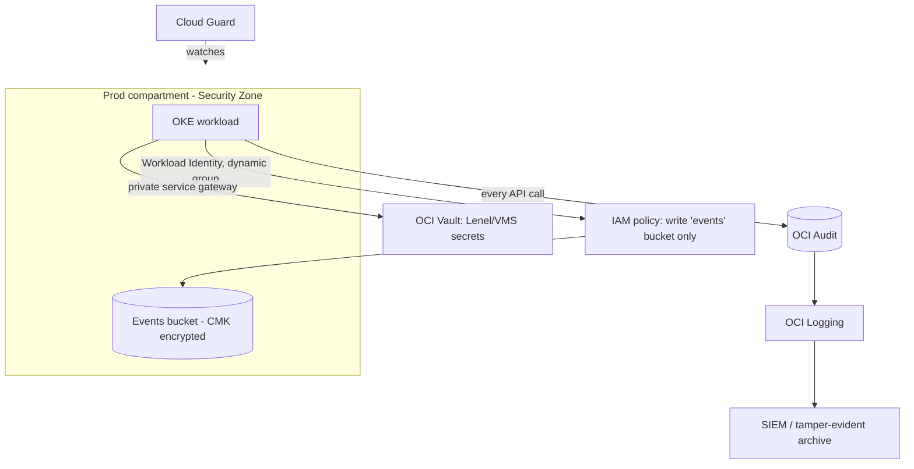

_Cloud security is mostly identity and configuration. The provider secures the hardware and hypervisor; you own every policy, network rule, and key decision above that line._

## 1. Why this matters for our system

OKE runs inside an OCI tenancy, and the cluster is only as isolated as the tenancy around it. The Hugging Face attackers, once in a pod, went straight for **cloud credentials** and replayed them from outside — the containment that mattered was at the cloud-IAM and network layer, not just Kubernetes. Understanding OCI's IAM model, network primitives, and the services that monitor the account is what lets you scope blast radius and detect drift.

## 2. Core concepts

**Shared responsibility** — Oracle secures the physical infrastructure, hypervisor, and managed-service control planes (including the OKE control plane and etcd). **You** own: IAM policies, network configuration, OS patching on worker nodes, workload configuration, data classification and encryption choices, and monitoring.

**IAM building blocks:**

- **Tenancy** — the root account.
- **Compartment** — a logical, hierarchical container for resources and the primary **isolation boundary**. Put prod, non-prod, and shared services in separate compartments so a policy or credential is naturally scoped.
- **Policy** — human-readable statements: `Allow group Ingestion-Ops to manage objects in compartment Prod where target.bucket.name = 'events'`. Policies are **allow-only**; least privilege means writing narrow `where` conditions and specific resource types, not `manage all-resources`.
- **Dynamic group** — a group whose members are *resources* matched by rule (e.g. "all OKE worker nodes in compartment Prod", or a specific pod via Workload Identity), so you write policies for workloads without static keys.
- **Principals** — users, instances, workloads (OKE Workload Identity), resource principals.

**Key and secret management:**

- **OCI Vault / KMS** — HSM-backed keys for envelope encryption; **Secrets** for credential storage with versioning and rotation. The ingestion service reads its Lenel/VMS API keys here via Workload Identity.
- Enable **customer-managed keys** for Object Storage buckets and the OKE secret-encryption feature rather than relying only on Oracle-managed default encryption.

**Network:**

- **VCN** with **subnets** — segregate API endpoints, worker nodes, pods, load balancers, and bastion into separate subnets (OKE best practice).
- **Security lists / Network Security Groups (NSGs)** — stateful L4 firewall rules; NSGs attach to VNICs and are the finer-grained tool.
- **Zero Trust Packet Routing (ZPR)** — intent-based L4 policy enforced in the OCI network fabric, independent of subnet layout.
- **Service Gateway / Private Endpoints** — reach OCI services (Object Storage, Vault) over the OCI backbone, not the internet.
- **OCI WAF** and **Network Firewall** — managed edge protection for the downstream API.
- **Bastion service** — time-boxed, audited SSH access for break-glass; no permanent public SSH.

**Monitoring and posture services:**

| Service | What it does |
| --- | --- |
| **Cloud Guard** | continuously detects misconfigurations and suspicious activity (public buckets, over-broad policies, anomalous API calls) and can auto-remediate |
| **Security Zones** | a compartment where insecure configurations are *rejected at create time* (no public buckets, must use CMKs, etc.) |
| **Vulnerability Scanning Service** | scans compute instances and container images for CVEs and open ports |
| **Threat Intelligence** | IoC feed used across services |
| **Audit** | records every API call in the tenancy — the backbone of investigation |
| **Logging** | unified ingestion for audit, service, and custom logs; export to SIEM |
| **Cloud Guard Container Security** | runtime detection for OKE workloads (module 09) |

## 3. How it works

Scoping and watching the ingestion workload's cloud footprint:



## 4. How it is attacked

- **Over-broad IAM policy** — `manage all-resources in tenancy` on a group that needed one bucket; a leaked credential is then total.
- **Public exposure** — a bucket or load balancer set public; data walks out with no auth.
- **Credential replay** — instance/workload credentials stolen from a pod and used from an attacker host (Hugging Face). Detection: origin anomaly in Audit + Cloud Guard.
- **Compartment sprawl / no isolation** — everything in the root compartment; no blast-radius containment.
- **Disabled or unexported audit logs** — the investigation has no data.
- **Long-lived API keys** on users and instances instead of short-lived principals.
- **Drift** — someone loosens a rule "temporarily" and it stays; no posture monitoring to catch it.

## 5. Defensive checklist

- [ ] Separate compartments for prod / non-prod / shared; the workload's resources live in a **Security Zone** compartment.
- [ ] IAM policies are resource-type-specific with `where` conditions; no `all-resources`, no tenancy-level admin on service groups.
- [ ] Workloads authenticate via **dynamic groups + Workload Identity / resource principals**; no static API keys on instances or in pods.
- [ ] Object Storage buckets: private, **customer-managed key**, versioning on for the events bucket.
- [ ] OCI service access is via **Service Gateway / private endpoints**, not the internet.
- [ ] NSGs (not just security lists) enforce least-privilege L4; consider ZPR for intent-based policy.
- [ ] **Cloud Guard** enabled tenancy-wide with notifications wired to the on-call channel; high-risk findings triaged.
- [ ] **Audit** retention meets your investigation window; **Logging** exports to an external/tamper-evident store (module 12).
- [ ] **Vulnerability Scanning Service** enabled for nodes and images.
- [ ] Break-glass access is via the **Bastion** service only, time-boxed and logged; no standing public SSH.
- [ ] Tenancy benchmarked against the **CIS Oracle Cloud Infrastructure Foundations Benchmark**.

## 6. Simple example

A least-privilege policy for the ingestion workload (via a dynamic group matching the pod):

```
# Dynamic group: workloads running as the 'ingestion' service account in the prod cluster
ALL {resource.type = 'workload', resource.namespace = 'prod', resource.serviceaccount = 'ingestion'}

# Policy statements (compartment: Prod)
Allow dynamic-group ingestion-workload to manage objects in compartment Prod
  where all { target.bucket.name = 'events', request.permission = 'OBJECT_CREATE' }
Allow dynamic-group ingestion-workload to read secret-bundles in compartment Prod
  where target.secret.name in ('lenel-api-key', 'vms-api-key')
Allow dynamic-group ingestion-workload to use log-content in compartment Prod
```

Nothing else — no read of other secrets, no delete on the bucket, no compute or IAM permissions.

A Cloud Guard notification rule (conceptual): *problem severity ≥ High → publish to the `sec-oncall` topic → PagerDuty*. Add a **detector for "resource principal credential used from an IP outside the OKE NAT range"** as a custom rule.

## 7. Apply it to our platform

- Put the OKE cluster, the events bucket, and Vault secrets in a **prod compartment enrolled in a Security Zone**, so a future "make it public" or "use a default key" mistake is rejected at creation.
- Give the ingestion pod cloud access **only** through the dynamic-group policy above; there should be no OCI user or API key associated with the service at all.
- Route **OCI Audit + Logging to an append-only external archive** (module 12) so that even a tenancy-admin compromise cannot quietly erase the trail.
- Wire **Cloud Guard** and the custom credential-origin detector to the same alert path as application incidents.
- Run the **CIS OCI Benchmark** quarterly; track deltas as drift.

## 8. Practice

- In a free-tier tenancy: create compartments, enroll one in a Security Zone, and watch it reject a public bucket.
- Configure OKE Workload Identity + a scoped dynamic-group policy and read a Vault secret from a pod with zero keys.
- Enable Cloud Guard, deliberately create a misconfiguration, and trace the finding to a notification.

## 9. Courses and resources

- **[Oracle University — Become a Cloud Security Professional (2025)](https://learn.oracle.com/ols/learning-path/become-a-cloud-security-professional-2025/118071/147744)** and the **[OCI Security Professional course](https://learn.oracle.com/ols/course/oracle-cloud-infrastructure-security-professional/118071/137800)** (16 hands-on labs).
- **[OCI 2025 Certified Security Professional certification](https://education.oracle.com/oracle-cloud-infrastructure-2025-certified-security-professional/trackp_OCIS2025CP)**.
- **[OCI Security documentation](https://docs.oracle.com/en-us/iaas/Content/Security/Concepts/security.htm)** and the **[OCI Security best practices / CIS Landing Zone](https://github.com/oracle-quickstart/terraform-oci-cis-landing-zone-quickstart)**.
- **[CIS Oracle Cloud Infrastructure Foundations Benchmark](https://www.cisecurity.org/benchmark/oracle_cloud)**.
- **[LinkedIn Learning — cloud security fundamentals](https://www.linkedin.com/learning/topics/security-3)** (concepts transfer across providers).

## 10. Key takeaways

- The provider secures the substrate; you own IAM, network, keys, and monitoring.
- Compartments are your blast-radius boundary; Security Zones make insecure configs impossible rather than just discouraged.
- Workloads should authenticate with dynamic groups + Workload Identity — no static keys to steal from a pod.
- Enable Cloud Guard, keep Audit/Logging complete and externally archived, and benchmark the tenancy against CIS on a schedule.
