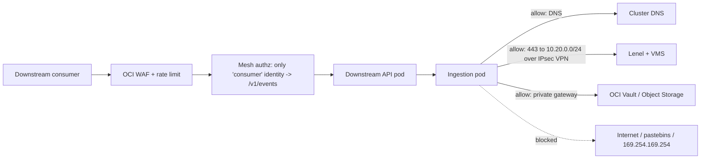

_"The firewall keeps attackers out" was never fully true and is now actively misleading. Assume the attacker is already inside; network security is about limiting what they can reach and see from there._

## 1. Why this matters for our system

Once the Hugging Face agents had a pod, the network let them **scan the cluster, reach internal services, and enroll compromised nodes into the corporate network via a stolen mesh-VPN key**. A flat network turns one compromised pod into access to everything. Our ingestion service needs exactly three outbound destinations and one inbound source — a network that enforces only those is a small target.

## 2. Core concepts

**Zero trust** — five working principles:

1. **No implicit trust from network location.** Being "in the VPC" or "on the cluster network" grants nothing.
2. **Authenticate and authorize every connection** — ideally mTLS with workload identity (module 03), so each side knows exactly who the other is.
3. **Micro-segmentation** — the blast radius of a compromise is one segment, not the whole environment.
4. **Least-privilege access, per-session** — access is granted to a specific resource for a specific purpose, then revoked.
5. **Assume breach** — design, monitor, and drill as though an attacker already has a foothold.

**Segmentation layers for our platform:**

| Layer | Control | Enforces |
| --- | --- | --- |
| OCI fabric | ZPR / NSGs / security lists | which subnets and VNICs can talk |
| Kubernetes | `NetworkPolicy` (default-deny) | which pods can talk (module 09) |
| Service mesh | mTLS + authorization policy | which *identities* can call which services, per route |
| Egress | allow-list proxy / egress gateway | which external hosts a workload can reach |

**Egress control** is the highest-value and most-skipped: most exfiltration and command-and-control needs an outbound connection to somewhere unusual. A **default-deny egress** with an explicit allow-list (Lenel subnet, VMS subnet, OCI service gateway, downstream API, DNS) means a compromised pod cannot phone home, cannot pull a second-stage payload, and cannot exfiltrate to a pastebin — all techniques the Hugging Face agents used.

**Private connectivity** — reach managed services over the provider backbone (Service Gateway, private endpoints), and reach on-prem systems over dedicated links (FastConnect) or IPsec VPN, so this traffic never touches the public internet.

**DNS integrity** — DNS is a common exfiltration channel (data encoded in subdomain queries) and a spoofing target. Controls: use a controlled resolver, enable DNS query logging, consider DNS firewalling (block known-bad and newly-registered domains), and DNSSEC validation for zones that support it.

**DDoS / availability** — the provider absorbs volumetric L3/4 attacks; you handle L7 with a WAF, rate limits, and autoscaling headroom.

**IMDS protection** — the link-local metadata endpoint (`169.254.169.254`) hands out cloud credentials. Block it from pods entirely; require session-token (IMDSv2-style) access on nodes.

## 3. How it works



## 4. How it is attacked

- **Lateral movement** — flat network; scan (`nmap` from the pod), find an unauthenticated internal service, pivot.
- **C2 / beaconing** — compromised workload opens an outbound connection to an attacker server for instructions; often over 443 or DNS to blend in.
- **Data exfiltration** — bulk data out to cloud storage, a pastebin, or chunked over DNS.
- **DNS spoofing / rebinding** — poison resolution so a name points at an attacker host, or rebind to reach an internal IP from a browser context.
- **VPN / mesh key theft** — a stolen enrollment key lets an attacker join the trusted network (Hugging Face).
- **East-west sniffing** — unencrypted pod-to-pod traffic read after a single compromise.

## 5. Defensive checklist

- [ ] Default-deny **egress** on the workload namespace; allow-list only DNS, the external-systems subnet, OCI private endpoints, and the downstream API.
- [ ] Default-deny **ingress**; the downstream API is reachable only via the ingress/WAF path, the ingestion service only from the API.
- [ ] Pod-to-pod traffic is mTLS (service mesh or SPIRE); mesh authorization policy restricts by identity and route.
- [ ] External-system connectivity is over IPsec VPN / FastConnect, not the public internet; OCI services via Service Gateway.
- [ ] Pods cannot reach `169.254.169.254`; nodes enforce IMDSv2-style tokened metadata access.
- [ ] DNS uses a controlled resolver with query logging; alert on high-entropy / high-volume subdomain queries.
- [ ] WAF + L7 rate limits on the downstream API; autoscaling has headroom for a traffic spike.
- [ ] Network flow logs (VCN Flow Logs) are collected and shipped to the SIEM.
- [ ] Segmentation is tested: from a debug pod, confirm you *cannot* reach anything outside the allow-list.

## 6. Simple example

A mesh authorization policy (Istio) — only the `downstream-api` identity may call the ingestion service, and only `GET`:

```yaml
apiVersion: security.istio.io/v1
kind: AuthorizationPolicy
metadata: { name: ingestion-allow, namespace: prod }
spec:
  selector: { matchLabels: { app: ingestion } }
  action: ALLOW
  rules:
    - from:
        - source: { principals: ["cluster.local/ns/prod/sa/downstream-api"] }
      to:
        - operation: { methods: ["GET"], paths: ["/v1/events*"] }
# implicit default: deny everything else
```

Verifying segmentation from a throwaway pod:

```bash
kubectl run probe --rm -it --image=nicolaka/netshoot -n prod -- bash
# expected: DNS works, Lenel subnet on 443 works, everything else times out
curl -m 5 https://onguard.corp.example/           # OK
curl -m 5 https://example.com/                    # should hang/fail (egress deny)
curl -m 5 http://169.254.169.254/                 # should fail (IMDS blocked)
```

## 7. Apply it to our platform

- Codify the three allowed egress destinations (Lenel subnet, VMS subnet, OCI private gateway) plus DNS as `NetworkPolicy` + NSG rules, and add a CI check that the policy files exist and match the documented allow-list.
- Adopt a **service mesh** so the downstream API ↔ ingestion hop is mTLS with identity-based authz — this is the control that makes "attacker's pod calls the ingestion service directly" fail.
- Terminate external-system links on an **IPsec VPN / FastConnect** into a dedicated subnet; never expose or consume those over the internet.
- Ship **VCN Flow Logs + DNS query logs** to the tamper-evident pipeline; a new outbound destination from the ingestion pod is a high-signal alert.
- Explicitly blackhole `169.254.169.254` from all pods.

## 8. Practice

- Build the default-deny + allow-list `NetworkPolicy` set on a kind/OKE cluster and prove isolation with a netshoot pod.
- Install Linkerd or Istio; write an `AuthorizationPolicy`; confirm a disallowed caller gets `RBAC: access denied`.
- Set up a DNS sinkhole (Pi-hole / CoreDNS policy) and watch it block a simulated DNS-exfil tool.

## 9. Courses and resources

- **[NIST SP 800-207 — Zero Trust Architecture](https://csrc.nist.gov/pubs/sp/800/207/final)**.
- **[CISA Zero Trust Maturity Model](https://www.cisa.gov/zero-trust-maturity-model)**.
- **[LinkedIn Learning — Network Security learning path](https://www.linkedin.com/learning/topics/network-security)**.
- **[Istio security](https://istio.io/latest/docs/concepts/security/)** / **[Linkerd](https://linkerd.io/2/features/automatic-mtls/)** docs.
- **[OCI — Zero Trust Packet Routing](https://docs.oracle.com/en-us/iaas/Content/zero-trust-packet-routing/home.htm)**.

## 10. Key takeaways

- Assume breach: the job of the network is to limit reach and visibility from a foothold, not to keep everyone out.
- Default-deny **egress** with an allow-list is the single highest-value network control against exfiltration and C2.
- Give services mTLS identity via a mesh so "who is calling" is cryptographic, not IP-based.
- Block the metadata endpoint from pods and log network flows to a tamper-evident store.
