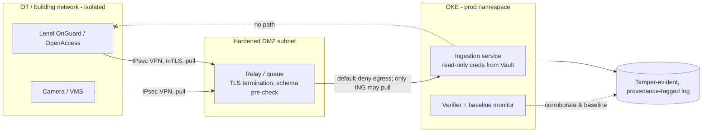

_The systems we pull from were built for a trusted LAN, ship infrequent patches, and use protocols that predate zero trust. You cannot fix them — you can only bound how much you trust them._

## 1. Why this matters for our system

This is the module closest to the actual job. Lenel OnGuard, a VMS, and similar building systems are **long-lived, rarely-patched, vendor-controlled**, and often sit on an OT/building network with weak internal segmentation. Our ingestion service is the bridge between that world and our cloud platform. If we trust their data implicitly, we inherit every weakness they have; if the bridge is poorly isolated, a compromise of a camera becomes a path into OKE — and vice versa.

## 2. Core concepts

**Assume the source may be compromised or impersonated.** Three distinct questions:

1. **Is this really Lenel?** — *source authentication*. TLS with a pinned CA at minimum; mutual TLS if the system supports it; a dedicated network path (VPN/FastConnect) so you are not accepting connections from the internet.
2. **Is this message intact and fresh?** — *integrity and replay protection*. TLS gives transport integrity; add sequence numbers / monotonic timestamps / nonce tracking so a replayed or reordered batch is detected. If the vendor can sign events, verify the signature.
3. **Is the content safe to process?** — *untrusted-input handling*. Strict schema validation, enum checks, length bounds, and the module 07 rule: no field ever reaches a query, template, shell, log format, or an LLM as instructions.

**Poisoned telemetry** — an attacker who controls the source (or a man-in-the-middle) feeds you plausible-but-false events: fake "access granted" records to create a false alibi, suppressed "door forced" events to hide an intrusion, or a flood to drown a real event. Defences:

- **Cross-source corroboration** — a badge-in event should have a corresponding camera event and network presence; disagreement is a signal (this is the module 12 pattern applied to ingest).
- **Behavioral baselines** — event rate per reader, per hour, per cardholder; alert on deviation.
- **Provenance tagging** — every stored record carries `source`, `ingested_at`, `source_seq`, `transport` (mTLS? VPN?), and a `trust` level, so downstream consumers and investigators know what they are relying on.
- **Gap detection** — a source that goes quiet, or a sequence gap, is treated as suspicious, not ignored.

**OT/IT convergence** — the building/camera network (OT) and the cloud platform (IT) have different risk profiles. Design the boundary deliberately:

- **Directionality** — ingest should be **pull-only from our side, or one-directional push** from theirs. Our service should have *no* path that lets it (or an attacker through it) send commands back to Lenel — reading access events must not share a credential or route with "unlock door."
- **A brokered DMZ** — a small, hardened relay/queue in a segmented subnet between OT and the cluster, so neither side connects directly to the other.
- **Separate, least-privilege credentials** — one read-only OnGuard/OpenAccess account used only by the ingestion service, vaulted and rotated; never the admin account, never shared with other integrations.
- **No lateral trust** — a compromised camera on the OT network must not be able to reach the cluster, and a compromised ingestion pod must not be able to reach OT management interfaces.

**Vendor API specifics (Lenel OnGuard / OpenAccess)** — RESTful web service, typically TCP 8080, auth via `POST /authentication` returning a **session token** plus an **Application-Id** header on each call. Practical hardening: put it behind TLS termination you control (the raw service may be HTTP), pin the path over VPN, store the service-account credential in OCI Vault, keep session tokens in memory only, handle token expiry/rotation gracefully, and rate-limit your own polling so a bug can't hammer the panel.

## 3. How it works



## 4. How it is attacked

- **Source impersonation** — DNS/BGP hijack or a rogue host on the OT LAN answers as Lenel; you ingest attacker data. Mitigation: pinned CA / mTLS, dedicated link, alert on cert change.
- **Poisoned / suppressed events** — attacker with source control fabricates or drops records to build an alibi or hide an intrusion. Mitigation: cross-source corroboration, baselines, gap detection.
- **Replay** — a captured "access granted" batch is re-sent. Mitigation: sequence/nonce/timestamp tracking, dedupe on `source_seq`.
- **Injection via fields** — a cardholder name or note field carrying SQL, a template expression, or LLM instructions. Mitigation: strict schema + module 07 handling.
- **Credential compromise on the legacy system** — the OnGuard box is unpatched and popped; its stored integration credentials are reused. Mitigation: least-privilege read-only account, vaulted, rotated, and monitored for use from unexpected origins.
- **OT→IT pivot (or IT→OT)** — flat network lets a compromised camera reach the cluster, or a compromised pod reach the door controllers. Mitigation: strict segmentation, brokered DMZ, one-directional ingest, no shared credentials/routes.
- **DoS via volume** — a malformed or flooding feed stalls ingestion and masks real events. Mitigation: bounded concurrency, backpressure to a queue, per-source rate caps, alert on rate anomalies.

## 5. Defensive checklist

- [ ] Connectivity to each external system is over a **dedicated link (IPsec VPN / FastConnect)**, never the public internet; TLS with a **pinned issuing CA**; mTLS where supported.
- [ ] A **hardened DMZ relay/queue** sits between OT and the cluster; neither side connects directly to the other.
- [ ] Ingest is **one-directional**: the service has no credential or route that can send commands to Lenel/VMS.
- [ ] Each external system has its **own read-only, least-privilege service account**, stored in OCI Vault, rotated on a schedule, and alerted on use from an unexpected origin.
- [ ] Every event is **schema-validated** (`.strict()`, enums, length bounds, formats); unknown fields rejected; no field reaches a query/template/shell/log-format/LLM as code or instructions.
- [ ] Every stored record is **provenance-tagged**: `source`, `source_seq`, `ingested_at`, `transport`, `trust`.
- [ ] **Replay protection**: dedupe on `source_seq`; reject non-monotonic timestamps outside a tolerance.
- [ ] **Corroboration + baselines**: cross-check related events across sources; per-reader / per-hour rate baselines; alert on deviation.
- [ ] **Gap detection**: a silent source or a sequence gap is a high-severity alert, not a silent skip.
- [ ] The OT network cannot initiate connections to the cluster; the cluster cannot reach OT management planes.
- [ ] Ingest has bounded concurrency, timeouts, backpressure, and per-source rate limits.

## 6. Simple example

Provenance-tagged, replay-protected ingest of a Lenel event:

```js
const AccessEvent = z.object({
  sourceSeq: z.number().int().nonnegative(),
  cardholderId: z.string().regex(/^[0-9]{1,12}$/),
  readerId: z.string().max(64),
  timestamp: z.string().datetime(),
  result: z.enum(['granted', 'denied', 'forced', 'held']),
  note: z.string().max(500).optional(),
}).strict();

async function ingestLenelBatch(rawBatch, conn) {
  for (const raw of rawBatch) {
    const ev = AccessEvent.parse(raw);                       // throws on bad shape / unknown fields

    if (ev.sourceSeq <= lastSeq.lenel) continue;             // replay / duplicate -> drop
    if (Math.abs(Date.parse(ev.timestamp) - Date.now()) > 15 * 60_000)
      { await alert('lenel timestamp outside tolerance', ev.sourceSeq); continue; }

    const record = {
      ...ev,
      note: ev.note ? redactAndTag(ev.note) : undefined,     // never trusted as instructions
      _provenance: {
        source: 'lenel-onguard',
        sourceSeq: ev.sourceSeq,
        ingestedAt: new Date().toISOString(),
        transport: conn.mutualTls ? 'mtls+vpn' : 'tls+vpn',
        trust: 'external-unverified',
      },
    };
    await auditLog.append(record);                           // module 12 hash-chained store
    lastSeq.lenel = ev.sourceSeq;
  }
  await checkForGap('lenel', lastSeq.lenel);                 // alert if the sequence jumped
}
```

## 7. Apply it to our platform

- Stand up the **DMZ relay** pattern: a minimal queue in its own subnet; Lenel/VMS push (or the relay pulls) over VPN + mTLS; the ingestion pod is the only thing allowed to read from the relay; the relay can reach nothing else.
- The OnGuard integration uses a **dedicated OpenAccess account with event-read scope only** — confirmed unable to modify access levels or actuate doors — vaulted and rotated quarterly.
- Tag every record with `_provenance` and expose it through the downstream API so consumers can filter by trust level; investigators can see exactly how each record arrived.
- Build the **corroboration job**: for each `granted` at a reader, expect a VMS motion/clip event within a window and (where available) a network-auth event for that cardholder's device; log disagreements as `integrity.corroboration_failed`.
- Alert on: a source going quiet > X minutes, a `source_seq` gap, event rate outside the 30-day baseline, the integration credential used from any IP other than the ingestion pod's egress, and any certificate change on an external endpoint.

## 8. Practice

- Model the OT/IT boundary for your real deployment: draw it, mark every direction of every connection, and confirm none allow OT→cluster initiation or cluster→OT management.
- Write the schema + replay + gap logic above against a recorded sample of real events; then inject a replayed batch, an out-of-order batch, and a `{{7*7}}` note and confirm each is caught.
- Build the corroboration job against two sample feeds and tune the window until the false-positive rate is workable.

## 9. Courses and resources

- **[Lenel OnGuard / OpenAccess documentation](https://partner.lenels2.com/)** (partner portal) and the **[OpenAccess API overview](https://www.lenels2.com/en/security-solutions/third-party-integration/oaap)**.
- **[NIST SP 800-82 — Guide to Operational Technology (OT) Security](https://csrc.nist.gov/pubs/sp/800/82/r3/final)**.
- **[CISA — Securing Industrial Control Systems](https://www.cisa.gov/topics/industrial-control-systems)** and the **Purdue model** for OT network layering.
- **[ISA/IEC 62443](https://www.isa.org/standards-and-publications/isa-standards/isa-iec-62443-series-of-standards)** — the OT security standard series.
- **[OWASP API Security Top 10 — API10:2023 Unsafe Consumption of APIs](https://owasp.org/API-Security/editions/2023/en/0xaa-unsafe-consumption-of-apis/)**.
- **[LinkedIn Learning — "OT/ICS Security" / "IoT Security"](https://www.linkedin.com/learning/topics/security-3)**.

## 10. Key takeaways

- You cannot patch the source systems — bound your trust instead: authenticate the source, verify freshness, and treat every field as hostile input.
- Poisoned or suppressed telemetry is the defining threat here; defend with cross-source corroboration, baselines, and gap detection, not just schema checks.
- Make ingest one-directional and isolate it through a brokered DMZ so an OT compromise and a cluster compromise cannot become each other.
- Provenance-tag every record so downstream consumers and investigators always know how much to trust it.
