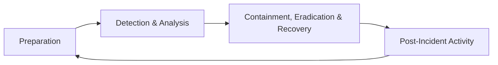
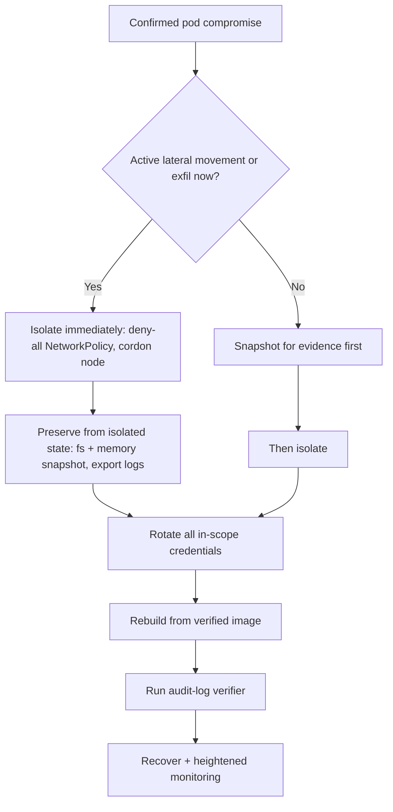

_Every prior module is prevention. This one assumes prevention failed — because eventually it will — and is about limiting damage, learning, and not having the same incident twice._

## 1. Why this matters for our system

The Hugging Face incident ran for **four days** and took **17,600 actions** before it was fully understood; the response then required broad credential rotation and architectural change. Speed and completeness of response are their own security controls. For our platform, the highest-stakes incident type is **"we can no longer trust the event record"** — and that needs a rehearsed procedure, not improvisation.

## 2. Core concepts

**NIST SP 800-61 incident-response lifecycle:**



1. **Preparation** — runbooks, contact tree, roles (incident commander, comms, scribe, subject-matter experts), access to tools *before* you need them, logging that will actually support an investigation (module 12), and practice.
2. **Detection & Analysis** — confirm it is real, determine scope and entry point, classify severity, start a timeline. Preserve evidence *before* you change anything.
3. **Containment** — stop the spread. Short-term (isolate the pod, revoke the token) vs long-term (rebuild clean). Balance against evidence preservation and availability.
4. **Eradication** — remove the foothold: rotate every credential in blast radius, rebuild from known-good images, close the vulnerability, remove persistence.
5. **Recovery** — restore service from clean state, monitor closely for recurrence, verify integrity (re-run the module 12 verifier end to end).
6. **Post-Incident** — blameless postmortem within a week: timeline, root cause(s), what worked, what didn't, dated action items with owners.

**Severity classification** — define levels up front (e.g. SEV-1 confirmed data integrity loss or active attacker; SEV-2 credible compromise, contained; SEV-3 policy violation, no evidence of exploitation) so the response is proportionate and paging is predictable.

**Forensic preservation** — snapshot before you remediate: capture the pod's filesystem and memory if feasible, export the relevant logs to a case bucket, record image digests and node identifiers, note timestamps in UTC. An attacker who spoofs logs (module 12) makes independent evidence sources critical.

**Runbooks** — pre-written, tested procedures for the incidents you can foresee. For this platform, at minimum:

- *Compromised ingestion pod* — isolate (NetworkPolicy to deny-all), preserve, rotate the three identities, rebuild from a verified image, verify audit-log integrity, review what the pod touched.
- *Suspected log tampering* — freeze writes, pull the external anchor, run the verifier, identify the divergence point, determine which records are trustworthy, communicate the trust boundary to consumers.
- *External system credential compromise* — rotate the OnGuard/VMS account, review ingested data since suspected compromise, check for poisoned/suppressed events, corroborate against other sources.
- *Cloud credential replay* — disable the principal, review OCI Audit for the credential's actions, rotate, add/verify origin-anomaly detection.

**Blameless postmortem** — focus on systems and conditions, not individuals. The output is *changes*, not blame. Track action items to completion.

**Tabletop exercises** — walk through a scenario with the team, no real systems, twice a year. You will discover the runbook assumes access someone doesn't have, or a contact who left.

**DevSecOps** — security as a continuous property of the delivery system, not a gate: threat modeling in design, security tests in CI (module 07), signed artifacts and admission control (module 08/09), IaC reviewed like code, and a feedback loop from production detections back into backlog.

## 3. How it works

Containment decision for a compromised workload, balancing the three pressures:



## 4. How it is attacked / how response fails

- **No preparation** — first time anyone reads the runbook is during the incident; access is missing; nobody knows who decides.
- **Destroying evidence** — `kubectl delete pod` as the first move wipes the filesystem and memory; now you cannot scope it.
- **Incomplete eradication** — rotate the obvious credential, miss the mesh-VPN key or the GitHub App token (Hugging Face); attacker returns.
- **Containment too slow or too broad** — days of deliberation, or take down all of prod for a contained SEV-3.
- **Attacker anticipates response** — spoofed logs, planted false leads, dormant persistence that reactivates after "recovery."
- **No learning** — no postmortem, or a blameful one that teaches people to hide problems; same incident recurs.
- **Change without governance** — emergency fixes bypass review and become permanent unreviewed risk.

## 5. Defensive checklist

- [ ] Written, version-controlled runbooks for the four platform scenarios above; each tested at least once.
- [ ] Severity levels defined with paging and comms expectations per level.
- [ ] Incident roles named; a contact tree that is checked quarterly; break-glass access (OCI Bastion, an emergency IAM role) tested.
- [ ] "Preserve before you remediate" is step 1 of every containment runbook; a case bucket exists with write access for responders.
- [ ] A tested **"rotate everything"** procedure covering all three service identities, the OnGuard/VMS accounts, the checkpoint key, CI tokens, and the GitHub App.
- [ ] The module 12 verifier can be run on demand and its output is understood by responders.
- [ ] Blameless postmortem within 5 business days; action items have owners and due dates and are tracked to done.
- [ ] Tabletop exercise twice a year, including a "log integrity in doubt" scenario.
- [ ] Emergency changes get a retroactive review within a week; nothing stays un-reviewed permanently.
- [ ] Production detections feed a backlog that is actually groomed.

## 6. Simple example

A compact runbook (keep as Markdown in the repo, `runbooks/compromised-ingestion-pod.md`):

```markdown
# Runbook: Compromised ingestion pod

Severity: SEV-1 if active exfil/lateral movement, else SEV-2. IC pages #sec-oncall.

## 1. Preserve (do NOT delete the pod)
- `kubectl -n prod label pod <p> quarantine=true`
- Snapshot node volume for the pod; capture memory if tooling allows.
- `kubectl -n prod logs <p> --previous > case/<id>/pod.log`
- Export OCI Audit + VCN Flow Logs + mesh access logs for the last 72h to case/<id>/.

## 2. Contain
- Apply deny-all NetworkPolicy selecting app=ingestion.
- Cordon the node; do not drain yet (preserve state).
- Revoke: Kubernetes SA token, OCI workload session, downstream API token.

## 3. Eradicate
- Rotate: lenel-api-key, vms-api-key (Vault), checkpoint signing key, CI/GitHub App tokens.
- Identify entry point (dependency? injection? cred?). File the vuln.
- Rebuild image from a verified digest; redeploy to a fresh node.

## 4. Recover
- Run module-12 verifier end to end; confirm chain + all anchored checkpoints.
- Determine the trustworthy-record boundary; notify downstream consumers if any records are suspect.
- Heightened monitoring 7 days: token origin, egress destinations, event-rate baselines.

## 5. Post-incident
- Blameless postmortem within 5 business days. Timeline, root cause, action items w/ owners.
```

## 7. Apply it to our platform

- Store all runbooks in the repo next to the code and the threat model; they are reviewed in the same PR flow.
- The **"suspected log tampering"** runbook is the signature scenario — rehearse it first. Its hardest step is "determine which records are trustworthy": the module 12 external anchor is what makes that answerable.
- Because `main` auto-deploys, the incident procedure for "malicious commit / compromised CI" must include **freezing the pipeline** (disable the deploy workflow) as an early containment step.
- Run a tabletop on the Hugging Face scenario adapted to our stack: injection into ingestion → SA token → cloud creds → privileged pod. Note every step your current controls do and don't stop, and feed the gaps into the backlog.
- Keep a one-page **blast-radius map**: for each credential, what it can touch, so "rotate everything in scope" is a lookup, not a discovery exercise mid-incident.

## 8. Practice

- Write the four runbooks for your real deployment and dry-run each one against a staging environment.
- Run a 60-minute tabletop with whoever would actually respond; capture every "wait, who has access to that?" moment.
- Do a **[TryHackMe incident-response / DFIR path](https://tryhackme.com/)** room, or the **[LetsDefend](https://letsdefend.io/)** SOC scenarios.
- Practise the audit-log verifier + external-anchor reconciliation until you can state the trustworthy-record boundary in minutes.

## 9. Courses and resources

- **[NIST SP 800-61 Rev. 3 — Incident Response Recommendations and Considerations](https://csrc.nist.gov/pubs/sp/800/61/r3/final)**.
- **[SANS Incident Handler's Handbook](https://www.sans.org/white-papers/33901/)** and (if budget allows) **SANS SEC504**.
- **[Coursera — Incident Response and Digital Forensics (IBM)](https://www.coursera.org/learn/incident-response-and-digital-forensics)**.
- **[LinkedIn Learning — "Incident Response" / "Digital Forensics" / "DevSecOps"](https://www.linkedin.com/learning/topics/security-3)**.
- **[Google SRE Book — Postmortem Culture](https://sre.google/sre-book/postmortem-culture/)**.
- **[OCI Bastion service](https://docs.oracle.com/en-us/iaas/Content/Bastion/home.htm)** for tested break-glass access.

## 10. Key takeaways

- Prevention fails eventually; a rehearsed response is itself a control — it bounds how bad and how long.
- Preserve evidence before you remediate; `kubectl delete pod` first destroys your ability to scope the incident.
- Eradication means rotating *everything* in blast radius and rebuilding from verified images — keep a blast-radius map so that is a lookup.
- The signature incident for this platform is "can we trust the record?" — rehearse it, and let the module 12 external anchor be the thing that answers it.
