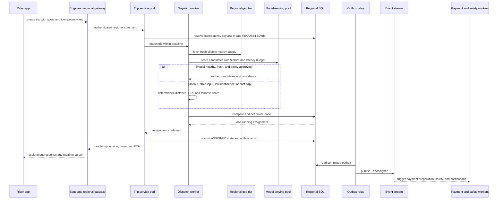
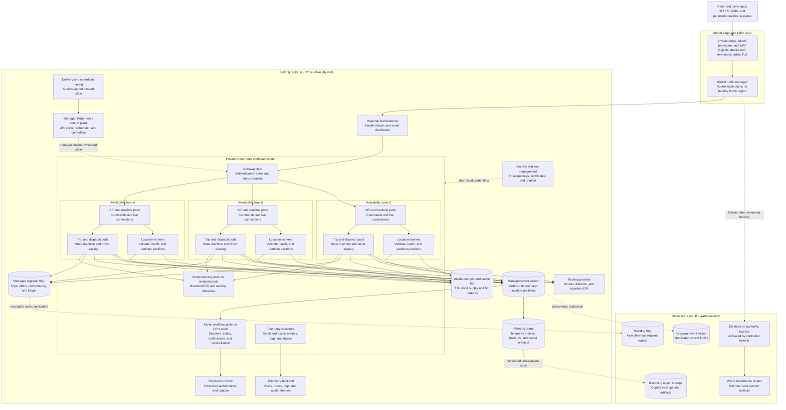

This page turns the [logical mobility design](../01-ai-native-mobility-marketplace) into a physical runtime view. The central idea is a **regional cell**: one serving region owns the low-latency path for a group of nearby cities, survives a zone failure locally, and uses another region for controlled disaster recovery.

## 1. Deployment goals and assumptions

The deployment must keep active trips safe and readable, match nearby supply within seconds, ingest 250,000 driver-location events per second at peak, and capture payment exactly once. Prediction improves decisions but is never required for trip availability.

Assume:

- A rider and driver are assigned to a city-local home cell at session start. Active trips never bounce between regions during normal operation.
- A serving region has three independent availability zones. The workload cluster and every synchronous data service span all three.
- Kubernetes runs stateless APIs, realtime gateways, stream consumers, and orchestration workers. Managed databases, event streams, object storage, secrets, and key management remain outside the workload cluster.
- A second region receives encrypted backups and asynchronous copies of the durable data needed for disaster recovery. Cross-region latency makes it unsuitable for synchronous driver matching.
- Routing and payment are external providers reached through tightly controlled egress.
- The numbers below are interview estimates. A production decision requires load tests using the real message shape, connection behavior, storage engine, and provider quotas.

The deployment has three planes:

| Plane | Responsibility | Availability rule |
|---|---|---|
| Data plane | Rider and driver traffic, trip commands, locations, dispatch, and events | Remains available through a pod, node, or single-zone failure |
| Control plane | Kubernetes API, delivery controller, policy/configuration, and model rollout | May be briefly unavailable without interrupting already-running pods |
| State plane | Trip SQL, geo state, event log, archives, secrets, and model artifacts | Replicated independently of application pods and restored by tested procedures |

## 2. Traffic classes and critical paths

Different traffic classes need separate scaling and failure policies:

| Traffic class | Approximate peak | Latency objective | Consistency | Deployment implication |
|---|---:|---:|---|---|
| Quote requests | Region-dependent subset of trip demand | p99 below 500 ms | Bounded-stale map and demand inputs are acceptable | Cache route features and isolate quote concurrency from trip commands |
| Trip commands | About 230 new trips/s platform-wide at a 10× peak, plus state updates | Most commands below 300 ms before dispatch | Strong per-trip ordering and idempotency | Route one trip to one regional writer and protect the SQL pool |
| Driver locations | 250k events/s, about 25 MB/s before protocol overhead | Fresh within 10 seconds | Eventually consistent; newest valid sample wins | Dedicated connection and ingestion fleets, partitioned stream, TTL geo store |
| Dispatch | Roughly follows trip creation but fans out to many candidates | Assignment normally below 5 seconds | One winning driver lease | Separate worker pool, geo-local reads, deadline-bounded model call |
| Trip updates | Persistent rider/driver connections | Subsecond delivery when healthy | Reconnect and catch up from durable state | Realtime gateways scale on connections and outbound messages |
| Payment and safety | Lower volume but high consequence | Seconds to minutes depending on action | Durable, auditable, idempotent | Asynchronous workers with restricted identities and human escalation |

The customer-critical synchronous path is:

**mobile app → edge protection → global traffic manager → regional load balancer → Kubernetes Gateway → trip/dispatch service → regional state**

Payment, notifications, analytics, safety enrichment, and model-feature generation begin after a durable event is committed. They must not lengthen the trip-command transaction.

### Critical trip path

## 3. Deployment architecture

### How to read the diagram

- **Solid arrows** are normal data-plane calls or event movement.
- **Dotted arrows** are management, credential, replication, or disaster-recovery relationships.
- The Kubernetes control plane configures workloads; mobile requests never pass through the Kubernetes API server.
- Each zone has independent API/realtime, trip/dispatch, and location capacity. A regional load balancer and topology-aware routing distribute traffic across healthy zones.
- SQL, the event stream, geo state, object storage, key management, and telemetry are separate managed capabilities. Losing the workload cluster does not erase durable state.

### Deployment inventory

| Component | Runtime and placement | Scaling unit | Stateful | Failure behavior |
|---|---|---|---|---|
| Global edge and traffic manager | Distributed provider edge outside serving regions | Provider points of presence and routing policy | Routing/config only | Sends a city only to an explicitly healthy, ownership-approved region |
| Regional load balancer | Public edge subnet spanning regional zones | Managed capacity units | No application state | Removes unhealthy gateway endpoints and preserves zone diversity |
| Kubernetes control plane | Managed regional control plane | Provider-managed replicas | Desired-state metadata | Existing pods continue serving during a short control-plane outage |
| Gateway fleet | Private workload cluster, spread across three zones | Pod replicas and nodes | Connection metadata only | Retries safe reads; rejects overload before protected trip commands |
| API and realtime fleet | CPU node pools in every zone | Connections, requests/s, and outbound messages per pod | Ephemeral session state | Clients reconnect through another zone and reload durable trip state |
| Trip service | CPU node pools in every zone | Command concurrency and database-pool budget | Durable state is external | A failed pod is replaced; idempotency makes a retried command safe |
| Dispatch workers | CPU node pools in every zone | In-flight matches, queue depth, and deadline utilization | Short leases in external state | Another worker resumes after lease expiry without double assignment |
| Location workers | Network-optimized CPU pools in every zone | Events/s, bytes/s, and partition lag | Buffered only | Sampling is reduced before trip commands are throttled |
| Model serving | Isolated accelerator or optimized CPU pool | Inferences/s, latency, and accelerator utilization | Versioned model loaded from artifacts | Circuit breaker switches dispatch to deterministic scoring |
| Async workflow workers | Restricted CPU pools and service accounts | Topic lag and provider concurrency | Checkpoints outside pods | Durable events retry with backoff; poison messages enter review |
| Regional SQL | Managed multi-zone relational service | Transactions/s, storage, replicas, and connection budget | Yes | Automatic zonal failover; regional promotion is fenced and deliberate |
| Geo and cache tier | Managed or dedicated multi-zone memory/LSM fleet | Shards, memory, reads/s, and writes/s | Soft state with TTL; rebuildable | Stale or missing cells trigger wider search and slower baseline routing |
| Event stream | Managed brokers spread across zones | Partitions, throughput, retention, and consumer groups | Yes | Replicas elect leaders; consumers resume from committed offsets |
| Object storage | Regional durable service with lifecycle and cross-region copy | Requests/s and stored bytes | Yes | Buffers absorb delay; archives remain recoverable outside the cluster |
| Secrets and keys | Restricted managed control service | Request rate and key hierarchy | Yes | Cached short-lived identity remains bounded; new sensitive work fails closed |
| Telemetry collectors | Daemon and gateway collectors inside the cluster | Node count and telemetry volume | Buffered only | Application traffic continues; collectors sample/drop before blocking apps |

## 4. Edge, ingress, and API tier

The public edge absorbs volumetric attacks, applies coarse bot and device-abuse rules, and terminates public TLS. A global traffic manager maps a city to its home region using health, capacity, compliance, and explicit ownership—not raw latency alone. That prevents an automatic health check from sending an active trip to a region that lacks its latest state.

The regional load balancer is the only public entry point. It forwards to a Kubernetes Gateway fleet in private application subnets. The gateway validates access tokens, establishes request identity, limits abusive clients, attaches trace context, and selects HTTP, realtime, or location routes. It does not perform business transitions.

Realtime gateways hold many long-lived sessions, so they scale on active connections, new connections/s, outbound messages/s, event-loop delay, and memory—not CPU alone. Sessions carry no irreplaceable state. After reconnect, the client reads the current trip version and resumes its event cursor.

Trip APIs use short timeouts, bounded database pools, and load shedding. Quote traffic may degrade independently; authenticated active-trip reads, safety commands, and trip transitions receive higher priority classes and reserved capacity.

## 5. Kubernetes and compute layout

Use one managed regional cluster per deployment cell when organizational scale permits; very large fleets may split realtime/location and core trip workloads into separate clusters to reduce blast radius. Namespaces isolate edge, core-trip, streaming-workers, model-serving, operations, and observability responsibilities.

Minimum production placement:

- At least two ready replicas per zone for gateway, active-trip API, trip service, dispatch, and safety ingress.
- Topology spread constraints across zone and hostname with a maximum skew of one for critical deployments.
- Pod anti-affinity or spread rules prevent replicas from sharing one node.
- Pod disruption budgets protect capacity during upgrades, while recognizing that they govern voluntary disruptions—not hardware or zone loss.
- Priority classes reserve scheduling for active-trip and safety workloads before batch analytics or offline feature jobs.
- CPU node pools serve gateways, APIs, dispatch, and workers. Network-optimized pools serve connection/location workloads. Accelerator pools are tainted for model-serving pods and can scale to zero only when deterministic capacity is already provisioned.
- Node autoscaling maintains a warm buffer because a five-minute node launch cannot satisfy a five-second dispatch SLO. Scheduled commute forecasts pre-scale nodes and pods, but reactive metrics remain authoritative.

The control plane’s API server, scheduler, and controllers reconcile desired state. Application pods use Kubernetes Services for stable discovery; they do not query the API server on every request. Workload identity supplies short-lived credentials without storing cloud keys in images or configuration files.

## 6. Stateful data and messaging

**Regional SQL** is the source of truth for trips, offers, driver leases, idempotency records, payment ledger entries, and durable safety cases. Partition primarily by serving region and trip ID. A transaction changes trip state and writes an outbox record; a relay publishes it to the event stream. This avoids a database/event dual-write.

**Geo state** holds the most recent valid driver sample keyed by city and H3 cell with a short TTL. It favors availability and freshness over full historical correctness. If an update arrives out of order, a monotonic device sequence or event time prevents it from replacing a newer sample.

**Event streams** separate two workloads:

- Domain topics use trip ID as key so transitions for one trip stay ordered and durable.
- Location topics use city plus H3 cell (with hot-cell salting when needed) to distribute volume. Consumers update geo state, realtime views, safety detection, and the archive independently.

**Object storage** retains compressed location segments, audit exports, backups, and immutable model artifacts. Lifecycle policy moves old telemetry to cheaper storage and deletes it when privacy retention expires.

**Model artifacts and features** are versioned. Online features used for dispatch live near the geo tier with timestamps and freshness checks; training history lives in offline object/table storage. A model response records model version, feature version, latency, and confidence for later evaluation.

## 7. Network zones and security boundaries

Use four logical zones even when a cloud implements them with different primitives:

| Security zone | Permitted components | Key controls |
|---|---|---|
| Public edge | DDoS/WAF, public load balancer | TLS, attack filtering, strict origin allowlist, no database route |
| Private application | Gateway and workload pods | Default-deny network policy, workload identity, mTLS for sensitive service calls |
| Restricted data | SQL, event stream, geo state, keys, audit storage | Private endpoints, narrow service identities, encryption, immutable audit |
| Controlled egress | Routing, payment, emergency, notification providers | Egress proxy/gateway, destination allowlists, timeouts, tokenization, response validation |

Authorization is enforced at both gateway and owning service. The gateway authenticates the caller; the trip service checks whether that rider, driver, support role, or safety role may act on this trip version. Precise location is encrypted in transit and at rest and never appears in routine logs.

Payment card data goes directly to a licensed payment provider or tokenization boundary. Internal services store provider tokens, amounts, status, and reconciliation IDs—not raw card numbers. Safety access is time-bounded, purpose-limited, and audited. Break-glass access requires approval and produces an immutable event.

Secrets are not committed to Git or baked into images. Workload identity obtains short-lived credentials; a secrets manager handles externally issued credentials; a key manager provides envelope keys. Rotation must support overlapping key versions so a rollout does not interrupt active trips.

## 8. Availability and failure-domain placement

The regional target is active-active across three zones. Stateless services have enough capacity in any two zones to carry the protected workload after one zone is removed. Zone-aware load balancing prefers local dependencies without sacrificing correctness.

Availability objectives by state:

| State | Normal protection | Regional disaster objective |
|---|---|---|
| Trip, offer, lease, and idempotency state | Synchronous multi-zone commit; no acknowledged transition lost | RPO below 60 seconds and RTO below 15 minutes after fenced promotion |
| Payment ledger | Transactional multi-zone commit plus provider reconciliation | RPO 0 for acknowledged ledger entries; RTO below 30 minutes |
| Live geo state | Multi-zone replication with TTL; rebuildable from the stream | RPO up to 30 seconds and RTO below 10 minutes |
| Raw location archive | Buffered stream to versioned object storage | RPO up to 60 seconds and RTO below 30 minutes for resumed archival |
| Configuration and policy | Signed, versioned desired state with regional copies | RPO 0 for approved versions and RTO below 30 minutes |
| Model artifacts | Immutable, checksummed objects copied across regions | RPO one approved model version; RTO below 30 minutes, with rules active immediately |

Regional failover is controlled rather than purely automatic. The operator or automation must:

1. Fence writes in the old region or prove it unreachable under a lease/epoch mechanism.
2. Determine the recovery point and reconcile in-flight trip, driver lease, payment, and safety state.
3. Promote the standby SQL and critical stream topics.
4. Restore minimum safe capacity and validate routing/payment dependencies.
5. Move city ownership in the traffic manager.
6. Resume active-trip reads first, then safety and commands, then new matching, and finally nonessential traffic.

This pause is a deliberate trade-off: temporary inability to create new trips is safer than split-brain assignments or double payment.

## 9. Scaling and capacity mapping

Start from workload units, then benchmark:

### Location ingestion

- Peak input: 250,000 events/s × 100 bytes = 25 MB/s raw.
- Budget 2–4× for envelopes, TLS, indexes, stream replication, and bursts rather than treating 25 MB/s as provisioned capacity.
- If a tested stream partition safely sustains 5,000 events/s for this message shape, 50 partitions carry the nominal peak. Provision about 100 partitions for 2× burst/rebalance headroom.
- If one tested validation worker sustains 2,500 events/s at the latency target, 100 workers carry nominal peak. Run at least 200-worker capacity across three zones for a 2× event burst, while autoscaling on partition lag and processing latency.
- Partition keys must avoid a stadium or airport becoming one hot H3 partition; salt hot cells while retaining a lookup directory.

### Realtime connections

With one million active drivers and an observed safe target of 5,000 persistent connections per gateway pod, the starting estimate is 200 pods. Add 30% operational headroom for reconnect storms: about 260, distributed across zones. This is an estimate to validate with TLS, heartbeat, fan-out, and message-size load tests.

### Dispatch

At 230 trip creations/s and a five-second upper matching window, up to 1,150 matches may be in flight. If a benchmarked dispatch pod safely handles 50 concurrent matches, about 23 pods cover nominal concurrency; provision roughly 46 across zones for a 2× demand burst and run a minimum in each zone. Candidate count, geo latency, and model latency matter more than request rate alone.

### Scaling controls

| Workload | Primary scale signals | Guardrail |
|---|---|---|
| Gateway/realtime | Active connections, event-loop lag, outbound messages, memory | Slow scale-down and connection draining prevent reconnect storms |
| Trip API | Command concurrency, p95/p99 latency, database pool saturation | Database connection budget caps replicas |
| Location workers | Partition lag, oldest-event age, events/s, bytes/s | Reduce sampling and drop duplicate telemetry before protected commands |
| Dispatch | In-flight matches, lease backlog, geo/model latency | Preserve deterministic worker capacity before accelerator capacity |
| Async workflows | Topic lag, retry age, provider quota | Per-provider concurrency and circuit breakers stop cascading failure |
| Model serving | Inferences/s, queue time, latency, accelerator utilization | Hard deadline; fallback capacity is always warm |

Horizontal workload autoscaling uses multiple custom metrics and a stabilization window. Node autoscaling follows unschedulable workload demand, but scheduled forecasts pre-warm capacity before commute peaks. Forecasting is advisory; observed queues and latency remain the safe control signal.

## 10. Configuration, secrets, and service discovery

Configuration has three layers:

1. **Versioned baseline:** deployment manifests, resource policies, schemas, and default timeouts reviewed in Git.
2. **Environment and region overlays:** endpoints, city ownership, capacity floors, retention, and provider selection promoted through environments.
3. **Dynamic business policy:** pricing, eligibility, safety thresholds, and feature flags distributed by a signed configuration service with version, author, audit, and rollback.

Services discover in-cluster peers through stable service names and endpoint health. External managed services use private DNS names and workload identities. Clients never receive internal addresses.

Every request records the effective configuration and model version where it affects a decision. Dynamic changes use validation, staged rollout, expiration, and last-known-good caching. A bad configuration can be rolled back without rebuilding an image.

Secrets and cryptographic keys are referenced by identity and version. Applications fetch or receive short-lived material at runtime, cache it only as policy permits, and support overlap during rotation. Loss of the secrets service must not reveal material; new sensitive actions fail closed after bounded cached credentials expire.

## 11. Observability and operations

Instrument the critical path with OpenTelemetry-compatible traces, metrics, and structured logs. A node-level collector gathers infrastructure signals; a regional gateway collector batches, redacts, samples, and exports. Telemetry backpressure drops low-value debug data before consuming application resources.

Key service-level indicators:

- Quote and trip-command success, p50/p95/p99 latency, and saturation by region and city.
- Match time, candidate count, lease conflicts, fallback rate, and unassigned-trip age.
- Location ingest rate, invalid/out-of-order rate, partition lag, geo freshness, and reconnect storms.
- SQL transaction latency, connection saturation, replica health, deadlocks, and outbox age.
- Event publish latency, consumer lag, retry age, and dead-letter growth.
- Payment authorization/capture success, duplicate-prevention hits, and unreconciled ledger age.
- Model latency, timeout, confidence, feature staleness, error, cost, and decision-quality slices.
- Zone traffic balance, unavailable replicas, disruption-budget state, node headroom, and pending pods.

Alerts are tied to user impact and error-budget burn, not every transient metric. A single model-version alarm can automatically disable that version; it must not page as a trip outage when deterministic matching remains healthy. Dashboards show request, event, and model version using a shared trace and trip-safe correlation identifier—never raw precise coordinates.

Operational runbooks cover zone evacuation, stream lag, database failover, provider isolation, payment reconciliation, model rollback, and regional promotion. Every disaster-recovery exercise records measured RPO/RTO and updates the assumptions on this page.

## 12. Release, rollback, and data migration

Build immutable, signed images with a software bill of materials and vulnerability policy. Promote the same artifact from test to staging to one canary city, then a small regional percentage, then the region. Separate deploy from release with feature flags.

Rolling updates use readiness, startup, and liveness signals for distinct purposes:

- Startup allows caches and model files to load without restart loops.
- Readiness removes a pod before draining connections or when a critical local dependency is unavailable.
- Liveness detects a wedged process, not a remote provider outage.

Realtime gateways drain existing connections before termination. Critical services use max-unavailable limits and disruption budgets so a rollout cannot remove an entire zone’s capacity.

API and event changes are backward compatible across at least one rollout window. Consumers ignore unknown fields and understand current plus previous schema versions. Database changes use expand-and-contract:

1. Add nullable columns, tables, or indexes.
2. Deploy code that writes old and new representations where necessary.
3. Backfill with rate limits and observable checkpoints.
4. Switch reads after validation.
5. Remove old structures in a later release.

Rollback means reverting traffic and feature configuration to the previous compatible version. Destructive schema rollback is avoided; forward repair is safer after data has been written.

## 13. Disaster recovery and multi-region evolution

Normal operation is active-active at the business level: different regional cells serve different cities simultaneously. Each city remains single-writer to avoid cross-region dispatch coordination. Durable state replicates to a warm recovery region, but live geo state is treated as reconstructable.

Evolution path:

| Stage | Deployment | Benefit | Trade-off |
|---|---|---|---|
| 1 | One region, three zones, backups | Simple and sufficient for an early market | Regional outage stops service |
| 2 | Warm recovery region with replicated SQL, streams, artifacts, and minimum cluster | Tested regional recovery | Capacity cost and controlled RTO |
| 3 | Multiple independent active regional cells, each with a recovery partner | Limits blast radius and keeps city traffic local | Operational and data-ownership complexity |
| 4 | Paired-cell active-trip recovery with fenced ownership epochs | Faster continuity for active trips | Hard reconciliation and split-brain prevention |

Never advertise “multi-region” based only on having clusters in two places. The design is credible only when ownership fencing, provider dependencies, DNS/traffic-manager behavior, secrets, data promotion, payment reconciliation, and operator drills are all tested.

## 14. Failure scenarios and graceful degradation

| Failure scenario | Detection | Automatic response | User-visible result |
|---|---|---|---|
| Failure: one availability zone is lost | Load-balancer health, missing node/zone signals, replica and latency SLOs | Remove zone endpoints, reschedule within remaining zones, preserve disruption budgets and reserved capacity | Existing sessions reconnect; active trips continue with a brief update gap |
| Failure: model-serving timeout or bad model version | Inference deadline, error rate, drift/quality guardrail, canary comparison | Open circuit, pin or roll back model, use deterministic dispatch fallback based on distance, eligibility, fairness, and map ETA | Matching may be less optimized, but quotes, trips, and payments remain available |
| Failure: event-stream lag grows | Oldest-event age, partition lag, consumer throughput | Autoscale consumers, isolate poison partitions, lower location sampling, pause low-priority analytics | Live map may refresh less often; trip commands remain protected |
| Failure: geo tier loses shards or returns stale cells | Freshness watermark, miss/error rate, replica health | Read replica, widen H3 search, rebuild from location stream, use last valid sample within policy | Matching slows and ETA confidence drops; no unsafe exact-location claim |
| Failure: regional SQL primary fails | Transaction errors, quorum/replica health | Managed zonal failover, connection re-resolution, idempotent retry with jitter | Short command pause; duplicate commands return the original result |
| Failure: payment provider is unavailable | Provider timeout/error budget and circuit state | Record payment-pending ledger state, stop repeated calls, retry asynchronously, expose operations queue | Trip completes; receipt says payment pending rather than double charging |
| Failure: routing provider is unavailable | Timeout, error rate, stale-route signal | Use cached route features and coarse distance/road-speed estimates with reduced confidence | Quote or ETA becomes approximate; safety-critical navigation is not fabricated |
| Failure: entire serving region is lost | Independent regional probes plus operator confirmation | Fence old ownership, promote standby data, validate minimum capacity, shift traffic in priority order | New matching pauses; active-trip reads and safety recover before normal traffic |

### AI degradation ladder

1. Use the approved online model while latency, confidence, freshness, fairness, and cost policies pass.
2. On low confidence, use the learned result only as one bounded signal alongside hard eligibility constraints.
3. On timeout, error, stale features, policy block, or cost cap, invoke the **deterministic dispatch fallback**.
4. If geo state is also degraded, widen lookup using last-valid positions and map estimates; reduce the promise shown to users.
5. If safe eligibility or trip state cannot be established, stop new assignment and route active safety cases to humans.

An AI outage never bypasses identity, eligibility, driver leases, pricing bounds, payment idempotency, or safety policy.

## 15. Cost and architecture trade-offs

| Decision | Recommended choice | Cost paid | When to reconsider |
|---|---|---|---|
| Regional cells | Keep active-trip paths local and isolate blast radius | Duplicate platform capacity and more operations | Very small launch footprint may begin with one region |
| Managed state outside Kubernetes | Use managed SQL, stream, object, and key services | Service cost and provider abstraction work | Self-host only with proven scale/economics and an expert operations team |
| Three-zone minimums | Reserve protected capacity in each zone | Lower average utilization | Never remove for active-trip/safety tiers; tune batch tiers separately |
| Warm recovery region | Maintain minimum cluster and replicated state | Ongoing standby cost | Cold recovery only if the business accepts hours of RTO |
| Dedicated realtime/location pools | Isolate connections and streaming from command APIs | More node pools and capacity planning | Combine at low scale with strict resource reservations |
| Accelerator model pool | Isolate specialized inference | Expensive idle/burst capacity | Prefer optimized CPU/smaller models when latency and quality allow |
| Full telemetry | Trace important decisions and failures | Storage and cardinality cost | Tail-sample successful paths; never sample away safety/payment errors |

The largest recurring costs are network egress, realtime connection capacity, replicated streams, location retention, multi-zone database capacity, and warm disaster recovery. Cost control begins with retention, compression, sampling, and right-sized availability—not by putting the protected trip path at risk.

## 16. Interview walkthrough

A strong five-minute deployment explanation:

1. **Start at the edge.** “Rider and driver apps enter through DDoS/WAF protection and a global traffic manager that keeps a city pinned to its healthy home region.”
2. **Draw the request path.** “A regional load balancer reaches a private Kubernetes Gateway, then stateless API/realtime and trip/dispatch pods spread across three zones.”
3. **Separate state.** “Trip and payment correctness live in multi-zone SQL; high-rate locations use a partitioned stream and TTL geo tier; durable events drive payment, safety, notifications, and archives.”
4. **Explain Kubernetes correctly.** “The managed API server controls deployments but is not in the customer path. Pods scale independently, while managed state sits outside the cluster.”
5. **Map numbers to capacity.** “At 250k location events/s, a measured 5k events/s per partition means 50 nominal partitions and roughly 100 with burst/rebalance headroom.”
6. **Survive failure.** “Any one zone can disappear. The other two zones have reserved capacity, clients reconnect, and stateful services fail over independently.”
7. **Handle AI failure.** “Inference has a deadline and circuit breaker; deterministic eligibility, distance, ETA, and fairness scoring remains warm.”
8. **Close with regional trade-off.** “Cities are single-writer regional cells. A warm region receives async copies; failover fences ownership before routing traffic, accepting a short pause to prevent split brain.”

Common follow-ups:

- Why not make every region active for the same city? Cross-region consensus adds latency to a five-second local matching problem and makes split-brain driver assignment harder.
- Why not run the database inside Kubernetes? Kubernetes can run stateful workloads, but managed multi-zone data services usually reduce operational risk for an interview design unless self-hosting is a stated constraint.
- What is the first overload action? Lower redundant location sampling and low-priority analytics before throttling trip commands or safety.
- What breaks if the control plane is down? New scheduling and rollout are impaired, but healthy running pods and Services continue the data path.

## 17. Cloud capability mapping

| Capability | Architectural responsibility | Example technologies | Selection criteria |
|---|---|---|---|
| Global edge and traffic management | DDoS/WAF, TLS, geographic health-aware routing | Anycast edge, global load-balancing DNS, service mesh gateways | Failover controls, health semantics, compliance routing, origin protection |
| Managed Kubernetes | Regional control plane and zonal workload scheduling | Conformant managed Kubernetes distributions | Three-zone support, upgrade policy, identity, networking, autoscaling |
| Gateway and service networking | North-south routing and stable in-cluster discovery | Kubernetes Gateway API, Envoy-compatible gateway, Services | Protocol support, connection draining, policy, observability |
| Relational system of record | Trips, leases, idempotency, ledger, outbox | PostgreSQL-compatible managed SQL, distributed SQL | Transaction semantics, zonal quorum, failover, connection limits |
| Geo/cache tier | Expiring live supply and online features | Redis-compatible cluster, memory/LSM distributed key-value store | TTL, geo/H3 access, hot-key handling, recovery behavior |
| Event streaming | Ordered domain topics and high-rate location topics | Kafka-compatible log, Pulsar-compatible stream | Partition throughput, replication, retention, consumer isolation |
| Object storage | Location archive, backups, audit exports, model artifacts | S3-compatible object storage | Durability, versioning, lifecycle, regional copy, encryption |
| Secrets and key management | Workload credentials, envelope keys, rotation | Managed secrets manager and key management service | Workload identity, audit, hardware-backed keys, rotation |
| Model serving | Deadline-bounded ETA and ranking inference | Kubernetes model server or managed inference endpoint | Tail latency, batching, version routing, accelerator efficiency |
| Observability | Collection, correlation, SLOs, audit, and incident evidence | OpenTelemetry collectors with metric/log/trace backends | Open standards, redaction, tail sampling, cardinality controls |
| Delivery and policy | Signed artifact promotion and declarative desired state | GitOps controller, CI/CD, policy admission | Provenance, approvals, canary control, rollback, audit |

## 18. References

- [Kubernetes Services, load balancing, Gateway API, and NetworkPolicy](https://kubernetes.io/docs/concepts/services-networking/)
- [Kubernetes pod topology spread constraints](https://kubernetes.io/docs/concepts/scheduling-eviction/topology-spread-constraints/)
- [Kubernetes disruptions and PodDisruptionBudgets](https://kubernetes.io/docs/concepts/workloads/pods/disruptions/)
- [Kubernetes Horizontal Pod Autoscaling](https://kubernetes.io/docs/concepts/workloads/autoscaling/horizontal-pod-autoscale/)
- [OpenTelemetry Collector and Kubernetes](https://opentelemetry.io/docs/platforms/kubernetes/collector/)
