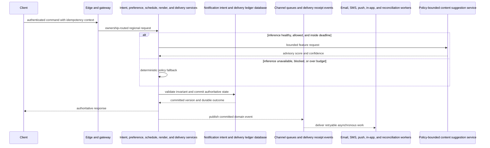
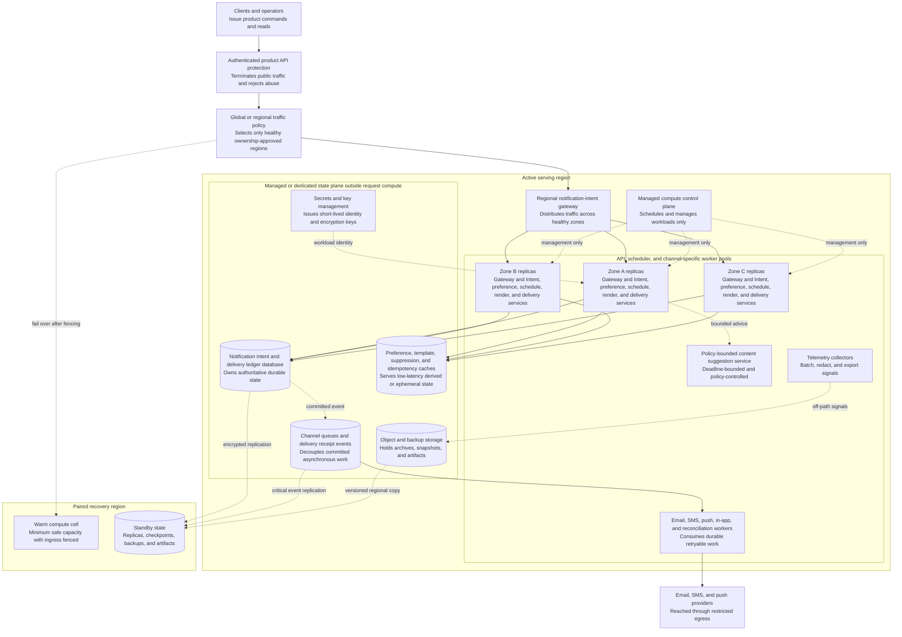

This page translates the logical design into a physical runtime view. Capability names are illustrative and cloud-neutral: select products only after measuring workload, operational skill, compliance, and recovery needs.

## 1. Deployment goals and assumptions

The deployment protects the parent design's critical invariant—idempotency, preference, suppression, and per-channel ordering policy are enforced—while meeting 99.99% intent acceptance with durable schedules and no duplicate user-visible send. The synchronous customer path remains short; derived views, external calls, analytics, and expensive inference move behind durable boundaries whenever the product contract permits.

Assume three independent failure zones in an active region, immutable artifacts, workload identity, managed or dedicated state services separated from stateless request compute, and a paired recovery region. Providers are unreliable external dependencies, channels differ in guarantees, and AI copy is never sent without policy validation. The Kubernetes or compute API is a management plane and never carries customer requests.

## 2. Traffic classes and critical paths

| Traffic class | Latency or freshness objective | Consistency | Deployment implication |
|---|---|---|---|
| Critical command | transactional notifications enqueue below 200 ms and urgent delivery begins within seconds | Enforce the product invariant before acknowledgement | Ownership-route to zonal service replicas and authoritative regional state. |
| Dominant read | Bounded by the parent read target and declared staleness | Versioned cache or index may be eventual | Scale read replicas and caches independently; authoritative policy can bypass stale entries. |
| Event and background work | Seconds to minutes by business priority | At-least-once with idempotent consumers | Partition Channel queues and delivery receipt events and isolate critical from bulk queues. |
| AI advisory path | Hard deadline, confidence, policy, and cost gate | Never overrides deterministic invariants | Circuit-break inference and keep the non-AI result warm. |

The authoritative response is returned only after the durable invariant is established. Downstream work may be replayed; every consumer uses event IDs, schema versions, and idempotent effects.

## 3. Deployment architecture

Solid arrows are request or event movement. Dotted arrows are management, identity, replication, telemetry, or failover relationships. The control plane schedules workloads but is deliberately absent from the customer data path.

### Deployment inventory

| Component | Runtime and placement | Scaling unit | Stateful | Failure behavior |
|---|---|---|---|---|
| Authenticated product API protection | Globally or regionally distributed edge | Edge location and policy | Routing/config only | Rejects attacks and routes only to explicitly healthy regions. |
| Regional notification-intent gateway | Active region across three zones | Managed capacity or gateway replica | No | Drains failed zones and preserves connection or request retries. |
| Managed compute control plane | Regional managed control capability | Provider-managed quorum | Desired-state metadata | Running workloads continue during a short management outage. |
| Intent, preference, schedule, render, and delivery services | Private zonal replicas in API, scheduler, and channel-specific worker pools | Replica by CPU, concurrency, connections, or queue lag | No local authority | Losing one replica or zone removes endpoints without losing durable state. |
| Notification intent and delivery ledger database | Managed or dedicated multi-zone state plane | Shard, partition, connection, and storage unit | Yes | Quorum or replica failover preserves acknowledged authoritative state. |
| Preference, template, suppression, and idempotency caches | Regional replicas or immutable serving indexes | Shard and memory/index bytes | Derived or ephemeral | Rebuilds from authority; stale data is bounded or bypassed for policy changes. |
| Channel queues and delivery receipt events | Multi-zone partitioned durable log/queue | Partition throughput and retention | Yes | Consumers replay from checkpoints after worker failure. |
| Email, SMS, push, in-app, and reconciliation workers | Private autoscaled worker pools | Queue age, lag, and concurrency | Checkpoints only | Work is retried idempotently or isolated in a dead-letter workflow. |
| Policy-bounded content suggestion service | Isolated CPU/accelerator or managed inference pool | Requests, tokens, batches, and accelerator utilization | Model artifacts | Circuit opens to a deterministic fallback without failing the product. |
| Backup and recovery plane | Paired region plus versioned object storage | Recovery copy and restore throughput | Yes | Remains fenced until ownership, data, and capacity checks pass. |

## 4. Edge, ingress, and API tier

Authenticated product API protection terminates public TLS, applies DDoS/WAF controls, rate limits abuse, and strips untrusted forwarding metadata. Traffic policy chooses a region only after independent health and ownership checks. At Regional notification-intent gateway, the platform authenticates or validates signed identity, attaches trace and idempotency context, enforces request-size and deadline policy, and distributes traffic across healthy zones.

Long-lived connections, bulk upload, and normal command traffic receive separate listeners and capacity pools when relevant. The edge can serve immutable or explicitly stale-safe reads, but revocation, deletion, payment, privacy, and ownership decisions always consult an authoritative version boundary.

## 5. Kubernetes and compute layout

Place API, scheduler, and channel-specific worker pools across three zones with topology spread, disruption budgets, anti-affinity for critical replicas, and reserved capacity so any one zone can disappear. Run Intent, preference, schedule, render, and delivery services as stateless deployments where the domain permits; give Email, SMS, push, in-app, and reconciliation workers separate queues and resource pools so backlogs cannot exhaust request capacity. Specialized inference is isolated from product compute.

The managed compute control plane is shown separately because its API server, scheduler, and controllers manage desired state rather than serving users. Managed databases, streams, object storage, secrets, and globally distributed edge services remain outside the workload cluster. Dedicated stateful fleets are used only when the product itself is the cache, broker, or similar state platform.

## 6. Stateful data and messaging

Treat Notification intent and delivery ledger database as authoritative. Partition by recipient and channel, with campaign work separately rate-shaped. Apply strong consistency only to idempotency, preference, suppression, and per-channel ordering policy are enforced; allow bounded eventual consistency for derived caches, indexes, analytics, and model features. Give Preference, template, suppression, and idempotency caches a rebuild path and version watermark so stale values cannot overrule newer security or deletion state.

Begin Channel queues and delivery receipt events after a durable commit, preferably through a transactional outbox or native log append. Consumers checkpoint offsets, deduplicate event IDs, quarantine poison records, and expose oldest-work age. Archives, snapshots, and model artifacts use encrypted versioned object storage with lifecycle policy.

## 7. Network zones and security boundaries

Separate public edge, private application, restricted state, management, telemetry, and controlled-egress zones. Default-deny network policy allows only named service identities and ports. Workload identity replaces static credentials; secrets and envelope keys rotate through managed key services. protect contact data, restrict templates, verify webhooks, and prevent spam abuse.

Email, SMS, and push providers is reached through allowlisted egress proxies with deadlines, circuit breakers, response-size limits, and audit. Treat external and model output as untrusted data. Administrative and break-glass actions require strong authentication, least privilege, short sessions, immutable audit, and where consequence demands it, dual approval.

## 8. Availability and failure-domain placement

Each customer-facing service has replicas in all three zones; the remaining two zones carry the protected load after one-zone loss. Readiness removes unhealthy endpoints, while startup and liveness checks avoid restart storms. Stateful services place quorum or synchronous replicas across zones and expose replica lag and recovery state.

Define error budgets separately for critical commands, reads, async freshness, and AI enhancement. Preserve correctness by shedding recommendation, analytics, bulk, and low-priority work before the authoritative command path.

## 9. Scaling and capacity mapping

The sizing method is explicit: peak intents/s, fan-out, provider quota, retry rate, and scheduled backlog determine queue partitions and channel worker concurrency. Load-test the complete protocol and record shape rather than relying on vendor headline throughput. Keep at least 30% burst/rebalance headroom plus enough reserved capacity to survive the largest declared failure domain.

Scale gateways on connections and tail latency, stateless APIs on concurrency and dependency saturation, streams on bytes/s and partition lag, workers on oldest-work age, state on throughput/storage/hot-key distribution, and inference on deadline success, batch efficiency, tokens, and accelerator utilization. Cap every autoscaler to protect downstream state.

## 10. Configuration, secrets, and service discovery

Store versioned configuration outside images and promote the same signed artifact through environments. Validate policy and schema before publication, canary high-impact changes, and retain a last-known-good snapshot. Service discovery advertises only ready endpoints and includes zone/region metadata for topology-aware routing.

Secrets are never committed to configuration files. Workloads authenticate through identity federation, fetch short-lived credentials at runtime, and use envelope encryption with audited key rotation. Feature flags have owners, expiry, safe defaults, and emergency rollback.

## 11. Observability and operations

OpenTelemetry collectors batch, redact, sample, and export metrics, logs, and traces off the request path. Correlate request ID, tenant or ownership shard, deployment version, event ID, model version, policy version, and recovery epoch without logging sensitive payloads.

Alert on user-visible SLO burn, saturation, oldest queue age, state quorum, replica lag, cache/index watermark, external circuit state, and recovery-copy freshness. Run synthetic critical journeys from multiple zones and regions. Dashboards link symptoms to dependency health, rollout version, and failure domain.

## 12. Release, rollback, and data migration

Promote signed immutable artifacts with canary or progressive traffic, automated SLO gates, and one-click rollback. Models shadow and canary separately from application releases. A model rollback never requires an application rollback, and deterministic behavior remains continuously exercised.

Use backward-compatible API and event schemas. Database changes follow expand/migrate/contract: add compatible fields or tables, deploy dual readers/writers if necessary, backfill with checkpoints and rate limits, verify invariants, switch reads, then remove old state in a later release.

## 13. Disaster recovery and multi-region evolution

The assumed **RPO** is zero for acknowledged intents and delivery ledger transitions. The assumed **RTO** is under 10 minutes for scheduler or regional recovery with overdue work rate-shaped. These are product choices, not properties automatically obtained by creating a second cluster. Backups are encrypted, immutable where required, restored in drills, and checked against application-level invariants.

Regional failover fences the old ownership epoch, verifies replication and external dependencies, promotes state, enables minimum safe capacity, shifts internal/safety traffic first, then gradually restores normal traffic. Reconcile delayed events and external effects before lifting write restrictions. Evolve from one zonal region to paired recovery and then independent regional cells only when measured scale and business impact justify the operational cost.

## 14. Failure scenarios and graceful degradation

| Failure scenario | Detection | Automatic or operator response | User-visible result |
|---|---|---|---|
| Failure: one channel provider fails | adapter errors and provider health | open its circuit, retain durable work, and route only approved fallback channels | other channels continue |
| Failure: the scheduler pauses | oldest-due age and lease health | promote a replica and release overdue work under rate limits | notifications are delayed without duplicate sends |
| Failure: content assistance fails | deadline or policy rejection | use the deterministic approved-template fallback | delivery correctness is unchanged |

AI degradation is explicit: render approved deterministic templates when content assistance is slow, blocked, or unavailable. The **deterministic product fallback** is tested in canaries and game days; inference may improve ranking, prediction, classification, or assistance but cannot bypass identity, authorization, ownership, money, privacy, durability, or safety rules.

## 15. Cost and architecture trade-offs

| Decision | Recommended choice | Cost paid | Reconsider when |
|---|---|---|---|
| Failure domains | Three-zone active region with a fenced recovery copy | Reserved capacity and replication | Business RTO permits a cheaper cold restore. |
| State placement | Managed or dedicated state outside stateless request compute | Service cost and operational boundaries | A proven team and economics justify self-management. |
| Async isolation | Durable streams and separate worker pools | More infrastructure and eventual derived views | Workload is small enough for a transactional monolith. |
| Global footprint | Ownership-based cells rather than synchronous global writes | Routing and recovery complexity | Strong global consistency is a hard product requirement. |
| AI serving | Isolated, deadline-bound, and optional | Extra compute, evaluation, and telemetry | Measured product value does not exceed inference cost and risk. |

Network egress, replicated state, idle recovery capacity, long retention, and specialized accelerators usually dominate. Control cost with lifecycle policy, compression, batching, sampling, right-sized replicas, and smaller models—not by weakening the product invariant.

## 16. Interview walkthrough

1. Start at Authenticated product API protection: explain trust, routing, and what can be served safely at the edge.
2. Follow the solid request path through Regional notification-intent gateway into zonal Intent, preference, schedule, render, and delivery services replicas.
3. Identify Notification intent and delivery ledger database as authoritative and state the partition key: recipient and channel, with campaign work separately rate-shaped.
4. Draw Preference, template, suppression, and idempotency caches and Channel queues and delivery receipt events only after explaining which reads and side effects may be derived or eventual.
5. Separate Email, SMS, push, in-app, and reconciliation workers, Policy-bounded content suggestion service, and Email, SMS, and push providers from the authoritative transaction with deadlines and durable events.
6. Explain one-zone survival, reserved capacity, and why the compute control plane is not in the customer path.
7. State the RPO/RTO, ownership fencing, promotion order, and reconciliation step for regional loss.
8. Close with the deterministic fallback, the cost trade-off, and the metric that would trigger a different architecture.

## 17. Cloud capability mapping

| Capability | Architectural responsibility | Illustrative alternatives | Selection criteria |
|---|---|---|---|
| Edge and traffic management | TLS, DDoS/WAF, caching, health-aware ownership routing | Anycast edge, CDN, global load-balancing DNS | Health semantics, origin protection, invalidation, compliance routing. |
| Compute orchestration | Zonal stateless services, jobs, autoscaling, rollout | Managed Kubernetes, managed containers, autoscaling VMs | Failure-zone spread, identity, upgrade policy, workload isolation. |
| Authoritative state | Notification intent and delivery ledger database | Managed relational, distributed SQL, key-value, or dedicated state fleet | Transactions, quorum, latency, partitioning, restore behavior. |
| Fast serving state | Preference, template, suppression, and idempotency caches | In-memory cache, read replica, search/vector index | Staleness, invalidation, hot-key behavior, rebuild time. |
| Durable messaging | Channel queues and delivery receipt events | Partitioned log, managed queue, transactional outbox relay | Ordering, replay, retention, throughput, consumer isolation. |
| Object and backup storage | Archives, snapshots, artifacts, recovery copies | Versioned object storage | Durability, immutability, lifecycle, regional copy, restore throughput. |
| Secrets and keys | Workload identity, encryption, rotation, audit | Managed secrets, KMS, HSM where required | Short-lived credentials, hardware assurance, rotation, access evidence. |
| Observability | SLOs, correlation, audit, incident evidence | OpenTelemetry collectors and metric/log/trace backends | Open standards, redaction, sampling, cardinality, retention. |
| AI/model serving | Policy-bounded content suggestion service | In-cluster serving or managed inference endpoint | Tail latency, policy, model routing, cost, deterministic fallback. |
