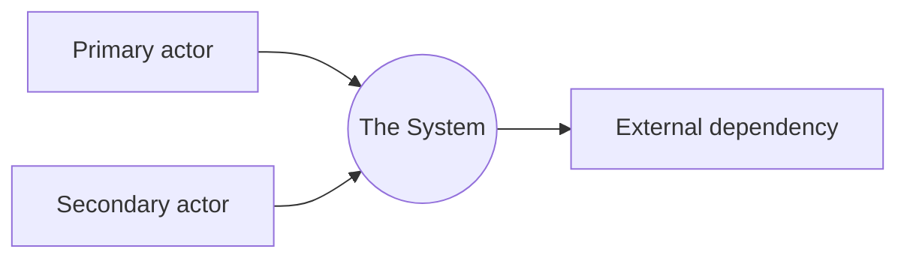
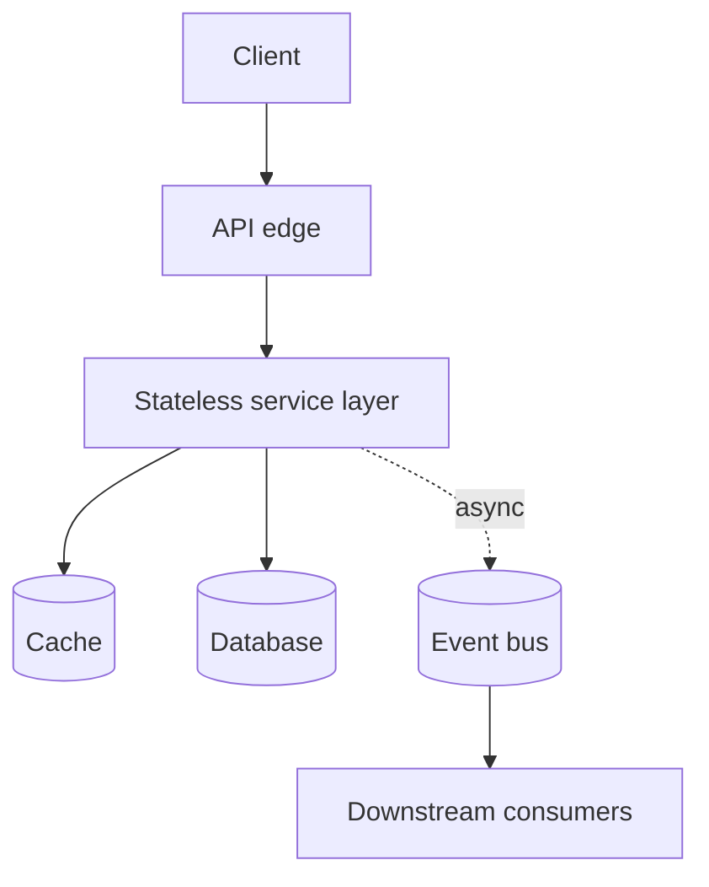
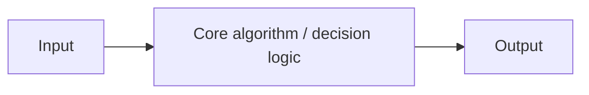
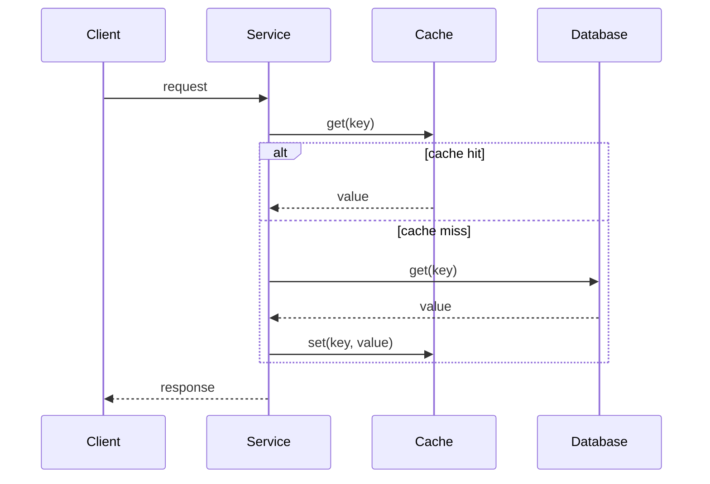
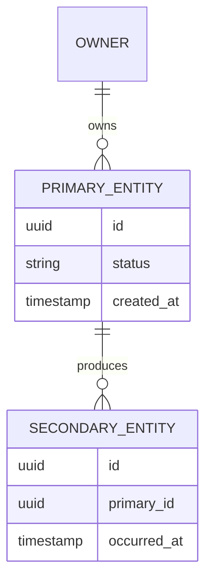

Every page in this library — Rate Limiter, Video Streaming, Payments, all of them — follows the exact same 20 sections, in the exact same order. That's not an accident and it's not laziness. It's the actual point: once this shape is memorized, a completely unfamiliar prompt ("design X") stops being scary, because you already know what section 7 is going to ask of you.

This page is the one to memorize. Every other page is this template applied to a specific system — read them side by side and the pattern will click faster than reading this page alone.

> **How to use this page:** each section below has the generic content (what belongs here, for *any* system) followed by a blockquote — that's the part worth internalizing. It's what an interviewer is actually scoring while you talk.

## The one-paragraph version

Clarify scope in plain language → turn it into numbers → turn the numbers into an API → draw the system as one box, then open the box → zoom into the one component that's actually hard → walk one request through the whole system end to end → design the data underneath it → say how it survives failure, load, and bad actors → say where AI would and wouldn't earn its cost → name every trade-off you made and the alternative you rejected → say how it grows over time → manage the clock → close with the two or three questions you know are coming.

That's the whole method. Everything below is that paragraph, unpacked.

---

## 1. Interview prompt

Restate the one-line prompt you were given, in your own words, before doing anything else. This is a 30-second step that costs nothing and buys you permission to ask questions.

> **What's being evaluated:** whether you clarify before you design. Candidates who start drawing boxes off a one-line prompt are the easiest to fail — they're solving a problem they invented, not the one being asked.

## 2. Requirements and scope

Split into **functional** (what the system does — the verbs: create, request, match, charge, notify) and **non-functional** (the qualities it must have — latency, availability, consistency, read/write ratio). State what's explicitly *out* of scope; naming an exclusion is as valuable as naming an inclusion.

> **What's being evaluated:** scoping discipline. A senior signal is proposing to exclude something reasonable ("I'll assume single-currency, no refunds v1") and defending why — not silently assuming it, and not trying to design everything.

## 3. Capacity estimate

Convert requirements into numbers: daily/monthly active users, request volume, read:write ratio, average and peak QPS (peak is usually 5-10x average), storage growth over a realistic horizon (1-5 years), and bandwidth. Round aggressively — the goal is the right order of magnitude, not precision.

> **What's being evaluated:** whether your architecture is actually justified by the numbers, or bolted on because "that's what big companies use." A cache is not a default — it's the answer to a specific QPS number you just calculated.

## 4. API and event contracts

Define the handful of endpoints/RPCs that matter, with request/response shapes. For anything asynchronous, define the event schema (event name, key fields, idempotency key). Keep it to what you'll actually reference later — 3-6 endpoints, not a full CRUD surface.

> **What's being evaluated:** whether you think in contracts, not implementation. A crisp API forces you to decide what's synchronous vs. async before you've drawn a single box — that ordering matters.

## 5. System context

One diagram: the system as a single box, its human/system actors, and its external dependencies. Nothing internal yet.

> **What's being evaluated:** whether you can zoom out before zooming in. This diagram is usually what an interviewer wants to see within the first 5-10 minutes — skipping straight to internals is a common and costly mistake.

## 6. Container architecture

Open the box. Show the real, deployable pieces — services, caches, queues, databases — and how they connect. This is where the read/write ratio and the capacity numbers from section 3 start dictating actual boxes (a cache exists because of a QPS number, not by default).

> **What's being evaluated:** whether every box traces back to a requirement or a number. If you can't say *why* a box exists, an interviewer will ask, and "because that's standard" is not an answer that survives a follow-up.

## 7. Component deep dive

Pick the **one** container that carries the hardest problem — the thing that makes this system different from a CRUD app — and decompose it further. For a ride-hailing system that's dispatch; for a URL shortener it's code generation; for a payments system it's the ledger. Every system has exactly one or two of these; find them and spend real time here.

> **What's being evaluated:** this is the section that actually differentiates candidates. Anyone can draw a load balancer and a database. Reasoning clearly about the one genuinely hard sub-problem is what a senior/staff-level answer looks like.

## 8. Critical flow

Sequence-diagram the single most important request end to end, through every component it touches, including the cache-hit and cache-miss branches.

> **What's being evaluated:** whether your diagrams (sections 5-7) actually cohere into a working system, or are disconnected boxes. This is where gaps in the design get caught — both by you and by the interviewer.

## 9. Data model

The entities, their relationships, and the fields that matter — as an ER diagram. Keep it to what the critical flow (section 8) actually touches.

> **What's being evaluated:** whether your lookups match your architecture. If section 6 promised O(1) key-value lookups but your schema needs a join to serve the critical flow, that's a real design bug — interviewers look for exactly this kind of internal inconsistency.

## 10. Storage, partitioning, consistency, and caching

State the partition/shard key and why it avoids hotspots, which paths need strong consistency vs. which can be eventual, and the caching strategy (cache-aside is the default answer; know when it isn't).

> **What's being evaluated:** whether you can name *which* parts of the system need strong consistency and *why*, rather than declaring the whole system "consistent" or "eventually consistent" as one blanket choice. Real systems are a mix — money is strong, view counts are eventual.

## 11. Reliability and failure handling

What happens when a dependency is slow or down. Name the specific mitigations: retries with backoff, circuit breakers, graceful degradation, what fails first vs. what must never fail.

> **What's being evaluated:** whether you've thought about the unhappy path at all. State explicitly which capability you'd sacrifice first under partial failure — that single sentence is often the most senior-sounding thing in the whole interview.

## 12. Security, privacy, moderation, and abuse prevention

Authn/authz boundaries, data you must not log or must encrypt, rate limiting/abuse vectors specific to this system, and how moderation or safety decisions stay auditable.

> **What's being evaluated:** whether security is something you design in, not something you'd bolt on after a breach. Even a brief, correct treatment here outperforms candidates who skip the section entirely.

## 13. AI architecture

Where would a model or an agent plausibly improve this system (ranking, prediction, classification, a copilot), and — critically — what's the deterministic fallback if it's slow, wrong, or unavailable. AI should be advisory on the hot path, never a dependency the core system can't function without.

> **What's being evaluated (2026 baseline):** AI-system-design questions are now a standard part of the interview, not a bonus round. The bar isn't "did you mention AI" — it's whether you protected the system's core guarantees (availability, correctness) from the AI component's failure modes.

## 14. Model lifecycle, evaluation, and observability

How the model gets trained, evaluated, shadow-tested, and rolled out (canary, not big-bang). What metrics catch drift or regression, and what telemetry ties a bad outcome back to a specific model version.

> **What's being evaluated:** whether you understand ML systems operationally, not just architecturally. "We'd retrain it sometimes" is a red flag; naming shadow evaluation and canary rollout is the actual signal.

## 15. Cost controls and deterministic fallbacks

How you keep the AI-adjacent parts of the system affordable at scale (caching predictions, batching, cheaper models before expensive ones, sampling), and confirm — again — that the deterministic fallback from section 13 actually works if inference is disabled entirely.

> **What's being evaluated:** cost is an explicit 2026 evaluation axis, not an implicit one. Interviewers now expect you to reason about $/request the same way you reason about latency.

## 16. Trade-offs and alternatives

A table: decision, what you chose, the alternative you rejected, and the condition under which you'd switch. This is the single highest-leverage section in the entire interview.

| Decision | Choice | Alternative and trigger |
|---|---|---|
| *(example)* Consistency model | Strong for money, eventual for counts | All-strong if regulatory requirements demand it everywhere |

> **What's being evaluated:** not whether you picked the "right" answer — there usually isn't one — but whether you understand what would make you change your mind. This is what separates a memorized design from genuine understanding, and it's usually the last thing interviewers probe before time runs out.

## 17. Phased evolution

What ships at MVP vs. what gets added in later phases, and which diagrams from sections 5-9 change at each phase.

> **What's being evaluated:** whether you can sequence delivery, not just describe an end state. A system that "must" launch with global multi-region active-active from day one is usually a candidate over-engineering to sound impressive.

## 18. 45-minute interview walkthrough

State your own budget out loud, early: roughly 5 min scope, 5 min capacity, 10 min APIs/architecture, 10 min deep dive, 5 min reliability/security, 5 min trade-offs, 5 min buffer, inside a 45-minute slot (scale proportionally for 30 or 60).

> **What's being evaluated:** whether you can manage the clock. Running out of time on section 16 (trade-offs) because you spent 20 minutes drawing boxes is the single most common way a technically sound candidate still gets a "no hire."

## 19. Follow-up questions and key takeaways

Name 2-3 follow-ups you'd expect for this specific system, and the one-sentence idea that the whole design hangs on.

> **What's being evaluated:** self-awareness. Naming your own weak points before the interviewer does reads as confidence, not weakness — and it's usually true that you already know where the soft spots are.

## 20. References

Primary sources only — a project's own engineering blog, official docs, published papers. Never a random blog aggregator.

> **What's being evaluated:** nothing, directly — but grounding claims in real systems ("this is the pattern Kafka uses for partition assignment") reads very differently from unsupported assertions, especially at senior levels.

---

## The one-page checklist

Print this part. Everything above is commentary on this list.

1. Restate the prompt.
2. Functional + non-functional requirements. Name an exclusion.
3. Traffic + storage math. Round to orders of magnitude.
4. 3-6 API endpoints or event contracts.
5. System context diagram (one box, actors, externals).
6. Container diagram (real, deployable pieces).
7. Deep-dive the one hard component.
8. Sequence-diagram the critical path.
9. ER diagram matching the critical path's lookups.
10. State partition key, consistency per-path, caching strategy.
11. State the failure mode and what degrades first.
12. Security/privacy/abuse, briefly but explicitly.
13. Where AI helps + its deterministic fallback.
14. How the model is trained, evaluated, rolled out.
15. Cost controls; confirm the fallback still works.
16. Trade-off table: choice, alternative, trigger to switch.
17. MVP vs. later phases.
18. Say your time budget out loud, early.
19. Your own follow-ups + the one-sentence takeaway.
20. Primary-source references only.

Every other page in this library is this checklist, worked through for one specific system. Once this shape is automatic, "design X" for an X you've never seen stops being a memory test and starts being an application of a method you already know.
