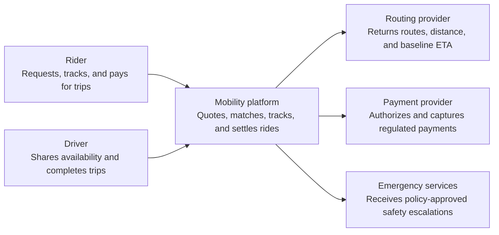
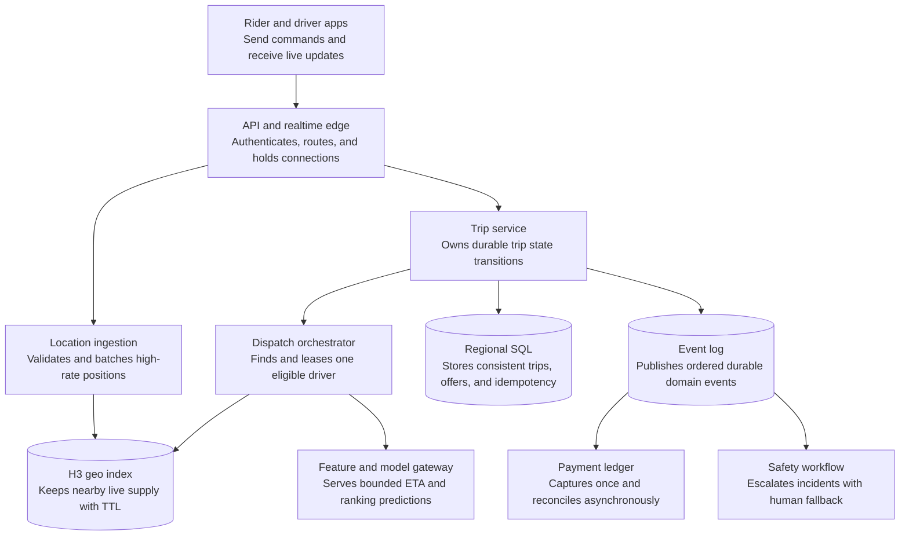
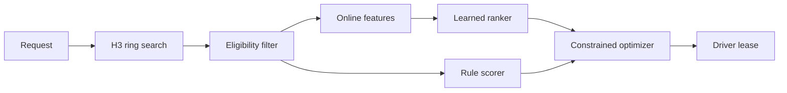
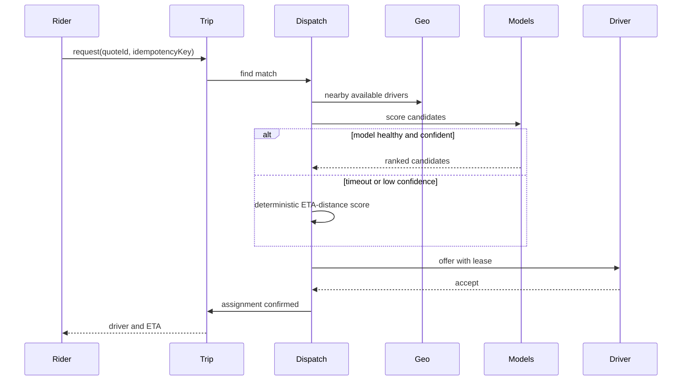
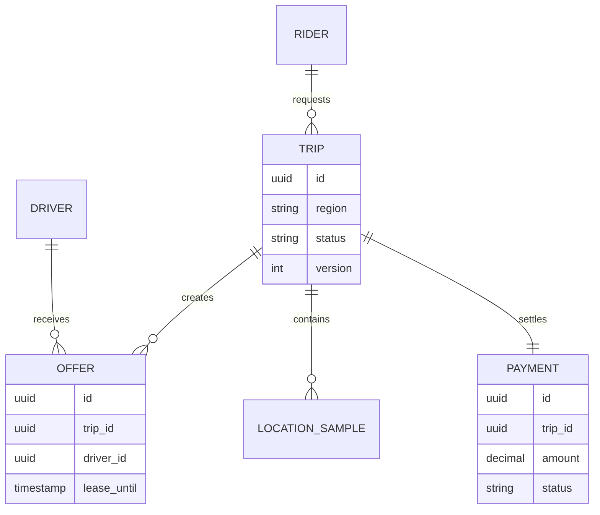

_Follows the [System Design Template](/system-design/00-system-design-template) — the reusable method behind every design in this library._

## 1. Interview prompt

Design a ride marketplace that lets riders request trips, matches nearby drivers, streams location, charges exactly once, and uses models to improve ETA and dispatch without making availability depend on inference.

## 2. Requirements and scope

### Functional requirements

| ID | Requirement | Priority | Interview significance |
|---|---|---|---|
| FR-1 | A rider can request a price and ETA quote, then create a trip from an unexpired quote. | Must | Defines the synchronous read and command APIs plus quote-expiration semantics. |
| FR-2 | The platform finds eligible nearby drivers, sends leased offers, and confirms exactly one assignment. | Must | Drives the geospatial index, dispatch pipeline, and concurrency control. |
| FR-3 | Rider and driver apps receive current trip state, driver position, and arrival updates in near real time. | Must | Separates high-volume ephemeral location traffic from durable trip state. |
| FR-4 | The platform authorizes, captures, refunds, and reconciles payment without charging a trip twice. | Must | Requires idempotency, a ledger boundary, and asynchronous reconciliation. |
| FR-5 | Riders and drivers can trigger safety workflows, share trip context, and reach human or emergency support. | Must | Introduces a protected safety path that must work when automation is unavailable. |
| FR-6 | Operations can manage service areas, pricing policies, driver eligibility, and incident review. | Should | Establishes control-plane configuration, audit, and policy-distribution needs. |

### Non-functional requirements

| Quality | Measurable target | Why it matters | Architecture consequence |
|---|---|---|---|
| Quote latency | p99 below 500 ms inside a serving region | Slow quotes reduce conversion and make prices stale. | Keep routing features and pricing inputs region-local and enforce strict dependency timeouts. |
| Match latency | 95% of normal requests assigned within 5 seconds | Supply disappears quickly and users perceive matching as the core experience. | Maintain a low-latency geo index, precomputed features, and independently scalable dispatch workers. |
| Location freshness | Latest usable driver position under 10 seconds old for 99% of active trips | Stale locations produce unsafe pickup guidance and poor ETAs. | Use persistent realtime connections, TTL-based geo state, and backpressure-aware ingestion. |
| Trip availability | 99.99% availability for active-trip reads and commands; one zone may fail without interrupting active trips | Trips already in progress are safety-critical. | Spread stateless workloads across three zones and keep durable trip state synchronously replicated across zones. |
| Payment correctness | Zero duplicate captures for the same trip and idempotency key | Financial correctness is more important than immediate capture. | Use a transactional ledger, unique idempotency constraints, and retryable outbox events. |
| Durability | No acknowledged trip-state transition lost; regional location history may have an RPO up to 60 seconds | Trip history supports disputes and safety, while raw telemetry has a lower consistency need. | Separate strongly consistent trip state from buffered telemetry and object-storage archives. |
| Privacy | Precise location encrypted in transit and at rest, access logged, and raw routes deleted by policy | Location history is highly sensitive personal data. | Isolate data-plane networks, enforce scoped identities, and apply lifecycle deletion. |
| Peak scale | Sustain 250k driver-location events/s and a 10× commute burst in trip creation | Location load is orders of magnitude larger than trip-command load. | Partition by region and H3 cell, autoscale consumers on lag, and shed sampling frequency before commands. |

**Scope exclusions:** pooled rides, autonomous vehicles, driver payroll, and proprietary mapping are outside this interview. **Assumptions:** supply is assigned within a city-local serving region, a licensed payment provider handles card data, and emergency integrations vary by jurisdiction.

## 3. Capacity estimate

At 10M daily riders and 2M trips/day, average trip creation is 23/s and a 10× commute peak is 230/s. With 1M active drivers sending a 100-byte location every four seconds, peak ingestion is 250k events/s or 25 MB/s before replication. Seven-day raw location history is roughly 15 TB; budget about 50 TB after three replicas and index/metadata overhead. Payment traffic is small enough for serializable transactions.

## 4. API and event contracts

- `POST /v1/quotes {pickup, dropoff}` → `{quoteId, priceRange, eta, expiresAt}`.
- `POST /v1/trips` accepts an idempotency key; `POST /v1/offers/{id}:accept` uses compare-and-set.
- Events carry `eventId`, `occurredAt`, `region`, `schemaVersion`, and trace context: `TripRequested`, `DriverLocationUpdated`, `OfferAccepted`, `TripCompleted`, `PaymentCaptured`.

## 5. System context

### Context component roles

| Component | Role |
|---|---|
| Rider | Requests transportation, reviews the quote, follows the trip, and pays. |
| Driver | Publishes availability and location, accepts an offer, and performs the trip. |
| Mobility platform | Owns quotes, matching, trip state, safety orchestration, and payment intent. |
| Routing provider | Supplies road routes, distances, and deterministic ETA inputs; it does not assign drivers. |
| Payment provider | Handles regulated payment authorization and capture while the platform owns idempotent trip settlement. |
| Emergency services | Receives a deliberately limited, audited safety escalation when policy permits. |

## 6. Container architecture

### Container component roles

| Component | Role |
|---|---|
| Rider and driver apps | Submit commands, stream location, and consume realtime trip updates. |
| API and realtime edge | Terminates authenticated HTTP and persistent connections, applies quotas, and routes traffic to regional services. |
| Trip service | Enforces the trip state machine, optimistic concurrency, and idempotent rider or driver commands. |
| Location ingestion | Absorbs the highest-volume stream, rejects impossible samples, and reduces sampling under backpressure. |
| Dispatch orchestrator | Queries nearby supply, applies eligibility rules, scores candidates, and leases a single driver. |
| H3 geo index | Holds eventually consistent, expiring driver availability grouped by map cell for low-latency proximity lookup. |
| Feature and model gateway | Provides versioned online features and deadline-bounded predictions with deterministic fallback. |
| Regional SQL | Stores durable trip, offer, idempotency, and audit state with transactional consistency. |
| Event log | Decouples committed trip transitions from payment, safety, notifications, analytics, and model features. |
| Payment ledger | Converts trip-completion events into exactly-once business effects through idempotency and reconciliation. |
| Safety workflow | Prioritizes incident signals, gathers scoped context, and routes consequential decisions to trained humans. |

## 7. Component deep dive

Dispatch first fetches candidates by expanding H3 rings, then applies hard eligibility constraints. A deterministic scorer provides a baseline; a learned scorer predicts pickup ETA, acceptance, and cancellation. An optimizer assigns offers with fairness and maximum-detour constraints. A lease prevents two riders from winning the same driver.

## 8. Critical flow

## 9. Data model

## 10. Storage, partitioning, consistency, and caching

Partition trips and the event log by region, then trip ID. Store live positions in an H3-keyed in-memory/LSM index with TTL; retain raw telemetry in object storage. Quotes and map tiles use short caches. Trip transitions and payments require optimistic concurrency and idempotency; locations and predictions are eventually consistent.

## 11. Reliability and failure handling

Use outbox events, bounded retries, dead-letter review, per-region circuit breakers, and admission control. If a region fails, finish active trips from replicated state but stop new matching until safety and payment dependencies are healthy. Backpressure lowers location sampling before rejecting trip commands.

## 12. Security, privacy, moderation, and abuse prevention

Tokenize payment data, encrypt precise location, restrict employee access, and delete raw routes by retention policy. Detect GPS spoofing and collusion with rules plus reviewed models. Safety escalation and account suspension remain auditable human decisions; emergency data sharing follows explicit policy.

## 13. AI architecture

Streaming features feed ETA, acceptance, demand, and anomaly models. The model gateway pins versions, enforces latency budgets, and returns confidence. A rider/driver copilot may summarize support context, but uses scoped tools and requires confirmation before cancellation, refund, or emergency actions.

## 14. Model lifecycle, evaluation, and observability

Train from delayed, quality-checked labels; replay by city and weather; shadow new models; then canary by region. Track ETA MAE/p95 error, cancellations, acceptance, fairness slices, override rate, drift, latency, and cost. Propagate OpenTelemetry trace context across feature and inference calls.

## 15. Cost controls and deterministic fallbacks

Cache route features, batch offline forecasting, use small specialized models on the hot path, and sample explanations. Timeout returns map ETA plus distance/fairness scoring. Disable copilots independently; trip, location, and payment paths remain operational.

## 16. Trade-offs and alternatives

| Decision | Choice | Alternative and trigger |
|---|---|---|
| Geo index | H3 cells | Geohash when range tooling is already standard |
| Assignment | constrained optimizer | greedy nearest for MVP or overload |
| Trip store | regional relational DB | globally consistent DB when cross-region trips dominate |
| AI execution | specialized online models | LLM only for non-hot-path assistance |

## 17. Phased evolution

MVP uses one city, greedy matching, and rules. Phase 2 adds event streaming and learned ETA. Phase 3 adds constrained dispatch and safety models. Phase 4 adds regional cells, shadow evaluation, and scoped support agents.

## 18. 45-minute interview walkthrough

Spend 5 minutes clarifying, 5 estimating, 10 on APIs/data and the regional container diagram, 10 on location/dispatch, 5 on the match sequence, 5 on reliability/security, and 5 on models, fallbacks, and trade-offs.

## 19. Follow-up questions and key takeaways

How do driver leases avoid double assignment? What happens when GPS is stale? How would scheduled rides change capacity? The key insight is to isolate high-volume approximate location from strongly consistent trip/payment state and make prediction advisory, never a single point of failure.

## 20. References

- [OpenTelemetry generative AI semantic conventions](https://opentelemetry.io/docs/specs/semconv/how-to-write-conventions/)
- [H3 documentation](https://h3geo.org/docs/)
