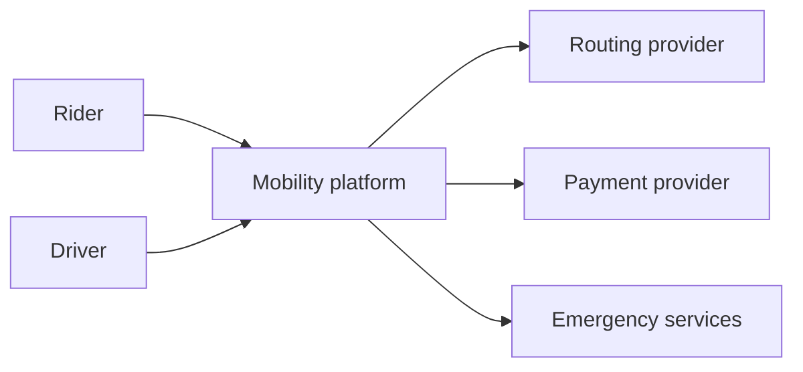
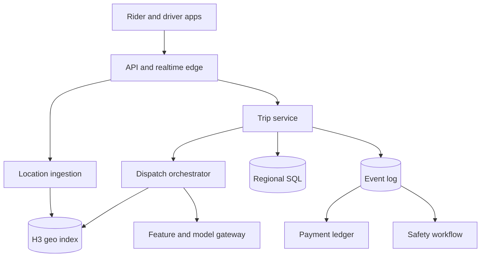
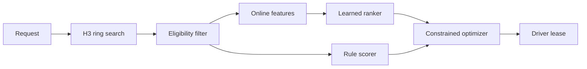
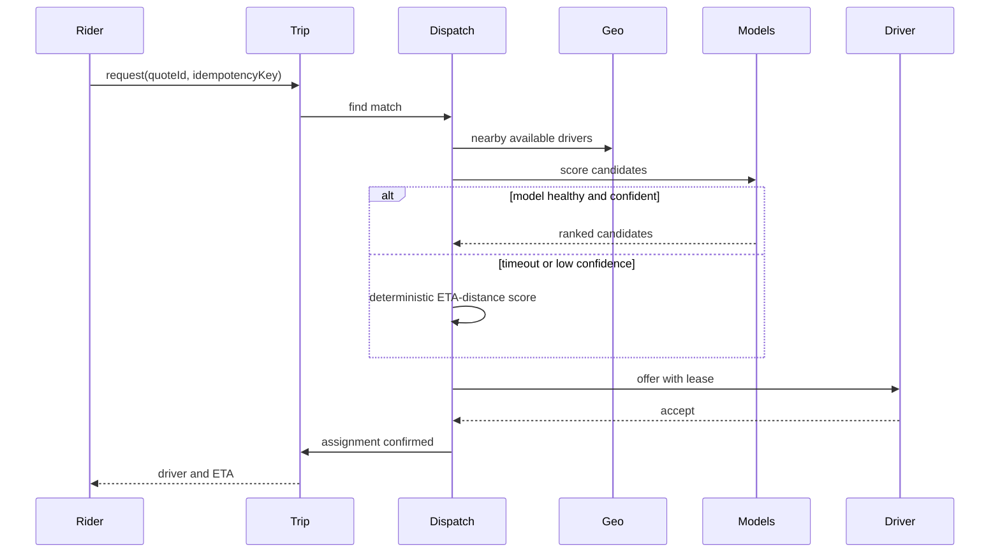
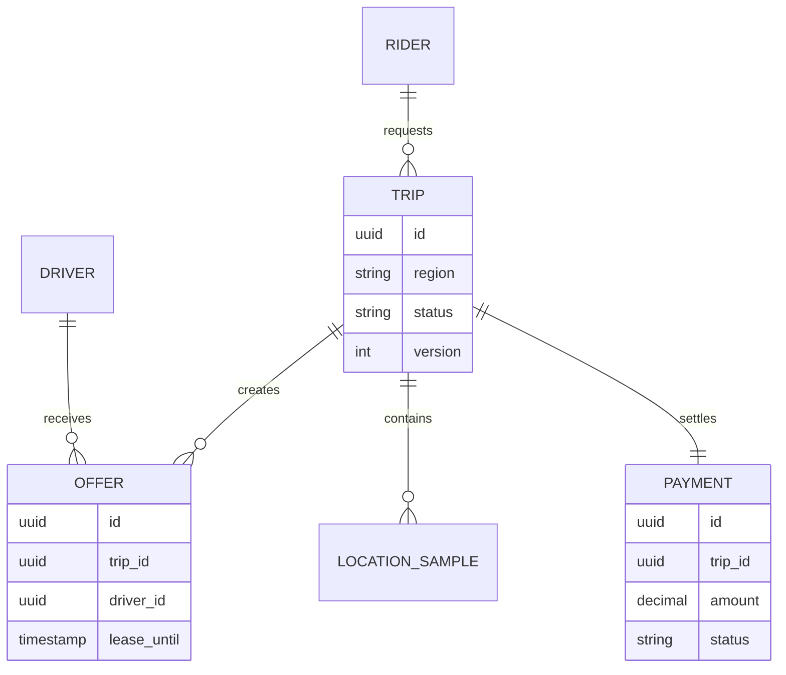

_Follows the [System Design Template](/system-design/00-system-design-template) — the reusable method behind every design in this library._

## 1. Interview prompt

Design a ride marketplace that lets riders request trips, matches nearby drivers, streams location, charges exactly once, and uses models to improve ETA and dispatch without making availability depend on inference.

## 2. Requirements and scope

**Functional:** quote and request a ride; accept/expire offers; track a trip; settle payment; report safety issues. **Non-functional:** p99 quote under 500 ms, match under 5 seconds, location freshness under 10 seconds, regional isolation, and no double charge. Exclude pooled rides and autonomous vehicles. Assume city-local supply and a licensed payment provider.

## 3. Capacity estimate

At 10M daily riders and 2M trips/day, average trip creation is 23/s and a 10× commute peak is 230/s. With 1M active drivers sending a 100-byte location every four seconds, peak ingestion is 250k events/s or 25 MB/s before replication. Seven-day raw location history is roughly 15 TB; budget about 50 TB after three replicas and index/metadata overhead. Payment traffic is small enough for serializable transactions.

## 4. API and event contracts

- `POST /v1/quotes {pickup, dropoff}` → `{quoteId, priceRange, eta, expiresAt}`.
- `POST /v1/trips` accepts an idempotency key; `POST /v1/offers/{id}:accept` uses compare-and-set.
- Events carry `eventId`, `occurredAt`, `region`, `schemaVersion`, and trace context: `TripRequested`, `DriverLocationUpdated`, `OfferAccepted`, `TripCompleted`, `PaymentCaptured`.

## 5. System context

## 6. Container architecture

## 7. Component deep dive

Dispatch first fetches candidates by expanding H3 rings, then applies hard eligibility constraints. A deterministic scorer provides a baseline; a learned scorer predicts pickup ETA, acceptance, and cancellation. An optimizer assigns offers with fairness and maximum-detour constraints. A lease prevents two riders from winning the same driver.

## 8. Critical flow

## 9. Data model

## 10. Storage, partitioning, consistency, and caching

Partition trips and the event log by region, then trip ID. Store live positions in an H3-keyed in-memory/LSM index with TTL; retain raw telemetry in object storage. Quotes and map tiles use short caches. Trip transitions and payments require optimistic concurrency and idempotency; locations and predictions are eventually consistent.

## 11. Reliability and failure handling

Use outbox events, bounded retries, dead-letter review, per-region circuit breakers, and admission control. If a region fails, finish active trips from replicated state but stop new matching until safety and payment dependencies are healthy. Backpressure lowers location sampling before rejecting trip commands.

## 12. Security, privacy, moderation, and abuse prevention

Tokenize payment data, encrypt precise location, restrict employee access, and delete raw routes by retention policy. Detect GPS spoofing and collusion with rules plus reviewed models. Safety escalation and account suspension remain auditable human decisions; emergency data sharing follows explicit policy.

## 13. AI architecture

Streaming features feed ETA, acceptance, demand, and anomaly models. The model gateway pins versions, enforces latency budgets, and returns confidence. A rider/driver copilot may summarize support context, but uses scoped tools and requires confirmation before cancellation, refund, or emergency actions.

## 14. Model lifecycle, evaluation, and observability

Train from delayed, quality-checked labels; replay by city and weather; shadow new models; then canary by region. Track ETA MAE/p95 error, cancellations, acceptance, fairness slices, override rate, drift, latency, and cost. Propagate OpenTelemetry trace context across feature and inference calls.

## 15. Cost controls and deterministic fallbacks

Cache route features, batch offline forecasting, use small specialized models on the hot path, and sample explanations. Timeout returns map ETA plus distance/fairness scoring. Disable copilots independently; trip, location, and payment paths remain operational.

## 16. Trade-offs and alternatives

| Decision | Choice | Alternative and trigger |
|---|---|---|
| Geo index | H3 cells | Geohash when range tooling is already standard |
| Assignment | constrained optimizer | greedy nearest for MVP or overload |
| Trip store | regional relational DB | globally consistent DB when cross-region trips dominate |
| AI execution | specialized online models | LLM only for non-hot-path assistance |

## 17. Phased evolution

MVP uses one city, greedy matching, and rules. Phase 2 adds event streaming and learned ETA. Phase 3 adds constrained dispatch and safety models. Phase 4 adds regional cells, shadow evaluation, and scoped support agents.

## 18. 45-minute interview walkthrough

Spend 5 minutes clarifying, 5 estimating, 10 on APIs/data and the regional container diagram, 10 on location/dispatch, 5 on the match sequence, 5 on reliability/security, and 5 on models, fallbacks, and trade-offs.

## 19. Follow-up questions and key takeaways

How do driver leases avoid double assignment? What happens when GPS is stale? How would scheduled rides change capacity? The key insight is to isolate high-volume approximate location from strongly consistent trip/payment state and make prediction advisory, never a single point of failure.

## 20. References

- [OpenTelemetry generative AI semantic conventions](https://opentelemetry.io/docs/specs/semconv/how-to-write-conventions/)
- [H3 documentation](https://h3geo.org/docs/)
