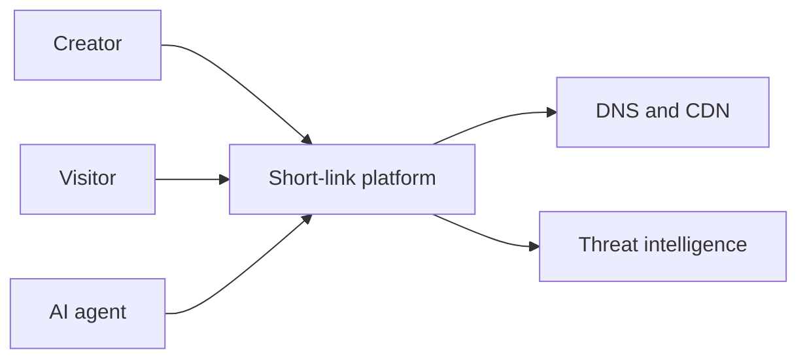
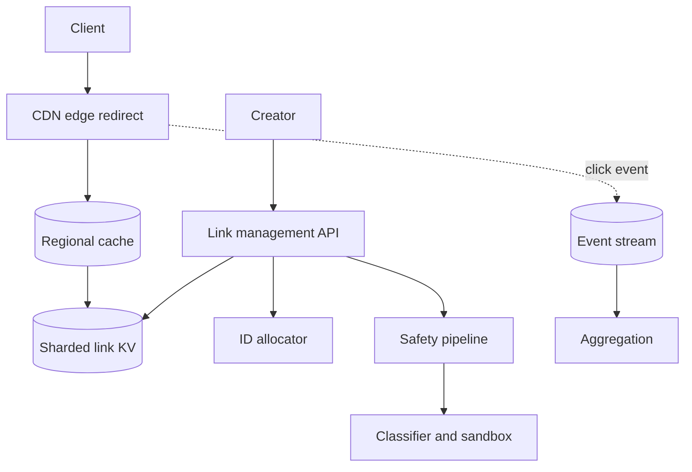
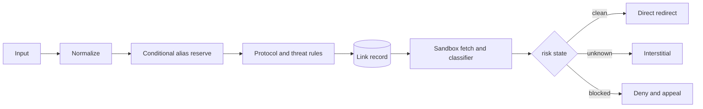
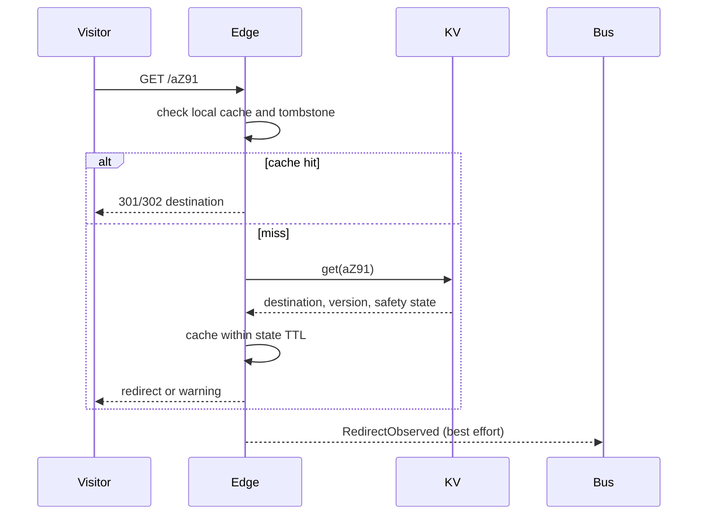
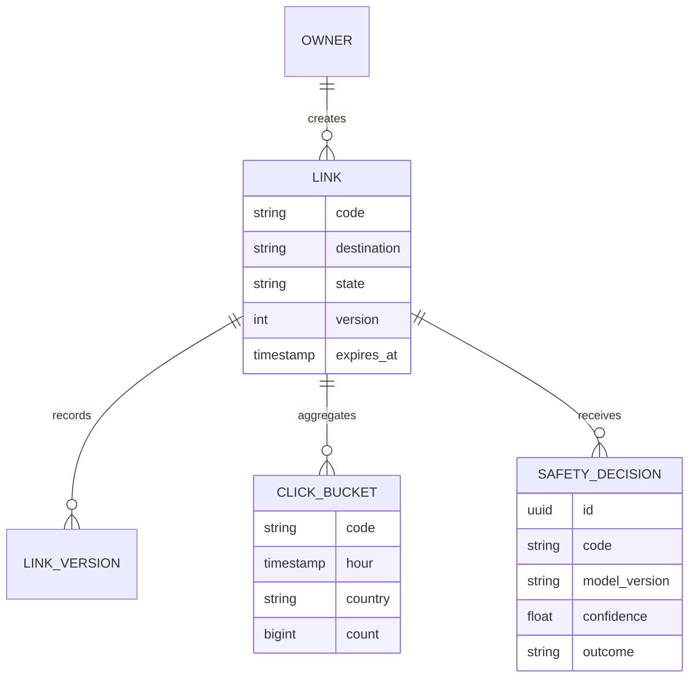

## 1. Interview prompt

Design a global short-link product supporting custom aliases, expiration, analytics, and safe redirects. AI may classify destinations and discover related links, but redirect latency and availability cannot depend on a model.

## 2. Requirements and scope

Create, resolve, disable, and inspect links; support owner quotas and aggregated analytics. Target p99 redirect below 50 ms at the edge and 99.99% redirect availability. Exclude ad targeting and crawling the entire destination web. Safety decisions must be appealable.

## 3. Capacity estimate

Assume 100M links created/month (39 writes/s average, 400/s peak) and 10B redirects/month (3,860/s average, 40k/s peak). A 500-byte link record needs about 600 GB/year raw, or roughly 1.8 TB/year with three replicas before index overhead. Ten billion 200-byte click events/month produce 2 TB/month before compression; aggregate early and tier raw events.

## 4. API and event contracts

- `POST /v1/links {url, customAlias?, expiresAt?}` → `{code, shortUrl, safetyState}`.
- `GET /{code}` performs a 301 for immutable links or 302 for editable links.
- `DELETE /v1/links/{code}` writes a tombstone; `RedirectObserved` is asynchronous and never blocks redirect.

## 5. System context

## 6. Container architecture

## 7. Component deep dive

The write path normalizes the URL, validates protocol, allocates a random/non-sequential 64-bit ID, Base62 encodes it, and reserves custom aliases conditionally. Rules and threat lists provide an immediate decision; semantic classification runs asynchronously. High-risk links fail closed, unknown links can show an interstitial, and clean links redirect directly.

## 8. Critical flow

## 9. Data model

## 10. Storage, partitioning, consistency, and caching

Partition link KV by hash(code); random codes prevent hotspots. Alias creation is strongly consistent, while replicas and click counts are eventual. Push disable tombstones to edge caches; never let a long positive TTL override a newer tombstone. Cache negative lookups briefly to absorb scans.

## 11. Reliability and failure handling

Redirect edges serve cached clean links during regional KV failure. Creation is shed before redirects. Analytics uses at-least-once events with event-ID deduplication. Threat-feed and classifier outages move new unknown links to an interstitial, not silent approval; existing decisions retain bounded TTLs.

## 12. Security, privacy, moderation, and abuse prevention

Block unsafe schemes, SSRF targets, credential-bearing URLs, malware, and phishing. Rate-limit by account, network, device, and agent identity; rotate signals to resist automation. Aggregate IP/location fields and enforce retention. Provide reason codes, appeals, and signed moderation audit events.

## 13. AI architecture

An asynchronous pipeline renders destinations in a sandbox, extracts text/image features, and combines a compact classifier with reputation rules. Embeddings support owner-only semantic search. Agent clients use scoped tokens and MCP-style tools with strict redirect/create quotas; tool results are untrusted data, never executable instructions.

## 14. Model lifecycle, evaluation, and observability

Evaluate precision/recall by abuse class, false-positive appeal rate, language, latency, drift, and adversarial bypass. Shadow updates and canary only new links. Trace classifier version and decision IDs without recording sensitive destination content in general telemetry.

## 15. Cost controls and deterministic fallbacks

Deduplicate scans by normalized-domain fingerprint, cache verdicts, use rules before models, and reserve large multimodal models for uncertain cases. If inference is unavailable, keep redirects deterministic from stored safety state and route new unknown links through a warning page.

## 16. Trade-offs and alternatives

| Decision | Choice | Alternative and trigger |
|---|---|---|
| Code | random 64-bit Base62 | sequence+Base62 for simpler allocation but enumerable links |
| Redirect | edge cache + KV | relational DB until traffic justifies KV |
| Mutation | 302 for editable links | 301 for immutable links and maximum caching |
| Safety | rules plus async model | synchronous model only when policy accepts added latency |

## 17. Phased evolution

MVP provides random codes, SQL, Redis, and rules. Phase 2 adds CDN edge resolution and streaming aggregates. Phase 3 adds sandbox classification and appeals. Phase 4 adds privacy-safe semantic search and scoped agent access.

## 18. 45-minute interview walkthrough

Use 5 minutes for scope, 5 for traffic/storage math, 10 for redirect and create flows, 10 for caching/tombstones, 5 for analytics, 5 for abuse/AI, and 5 for alternatives and evolution.

## 19. Follow-up questions and key takeaways

How do disabled links invalidate worldwide caches? Why random rather than sequential IDs? How are hot celebrity links handled? The key is that redirect stays a tiny deterministic lookup; analytics and semantic safety are decoupled asynchronous systems.

## 20. References

- [Model Context Protocol 2026 updates](https://blog.modelcontextprotocol.io/posts/2026-07-28/)
- [OpenTelemetry generative AI semantic conventions](https://opentelemetry.io/docs/specs/semconv/how-to-write-conventions/)
