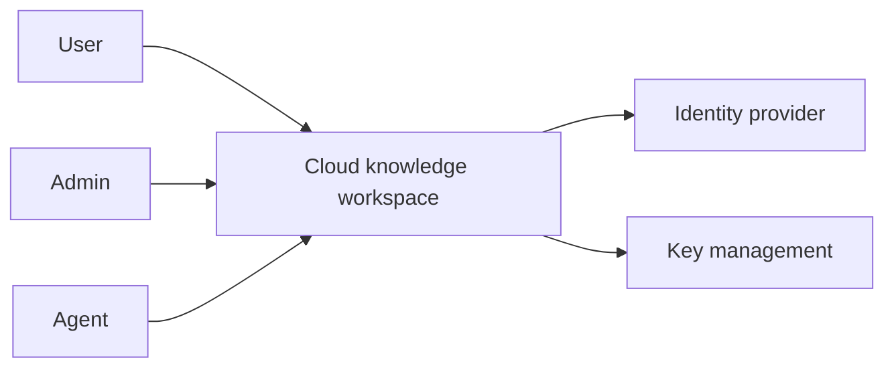
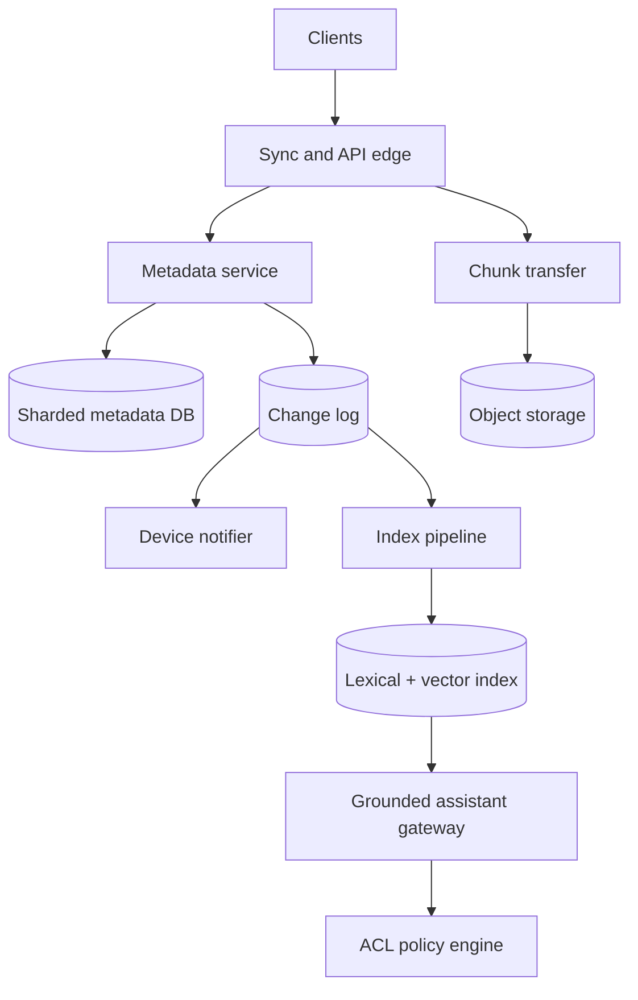
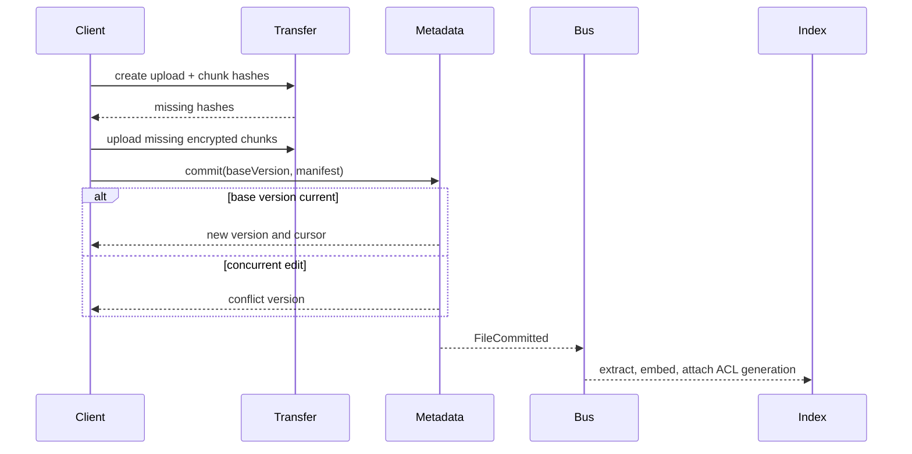
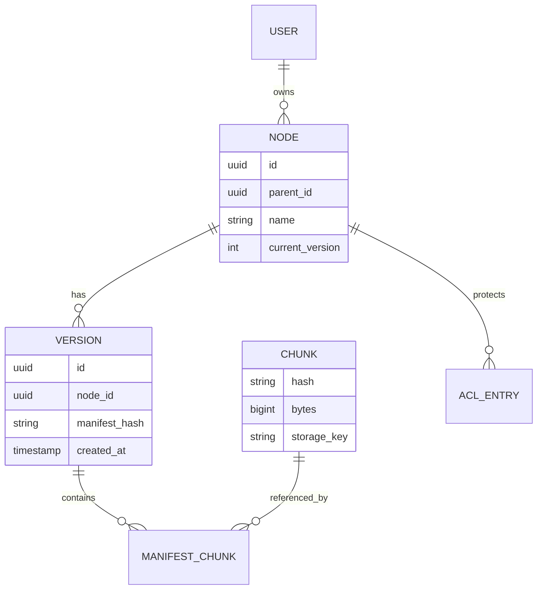

_Follows the [System Design Template](/system-design/00-system-design-template) — the reusable method behind every design in this library._

## 1. Interview prompt

Design a multi-device cloud drive with sharing, resumable sync, version history, search, and an assistant that answers from files without leaking content across access boundaries.

## 2. Requirements and scope

Upload/download, offline edits, folders, sharing, conflict copies, deletion recovery, full-text/multimodal search, and cited answers. Target durable blobs, p99 metadata operations under 300 ms, resumable transfer, and read-your-writes metadata. Exclude live document editing and public-web search.

## 3. Capacity estimate

For 100M users, 10M daily users, and 2 GB average stored, logical data is 200 PB. Deduplication and erasure coding determine physical size. At five changed files per DAU/day, average commits are 580/s and peak near 6k/s. One million concurrent clients polling would be wasteful, so use cursor-based push notifications.

## 4. API and event contracts

- `POST /uploads` creates a session; chunk PUTs include content hash; `POST /uploads/{id}:commit` atomically publishes a manifest.
- `GET /changes?cursor=` returns ordered metadata mutations; `POST /shares` records principal, resource, role, and expiry.
- `FileCommitted`, `AclChanged`, and `FileDeleted` drive indexing; every index document carries an ACL generation.

## 5. System context

## 6. Container architecture

## 7. Component deep dive

Clients split files into content-defined chunks, hash locally, ask which hashes are missing, upload only missing chunks, then commit an immutable manifest. The metadata transaction updates the path/version and emits an outbox event. Concurrent edits create deterministic conflict versions instead of silently choosing a winner.

## 8. Critical flow

## 9. Data model

## 10. Storage, partitioning, consistency, and caching

Shard metadata by workspace/owner, keeping folder transactions local. Blob chunks are immutable, erasure-coded, regionally replicated, and garbage-collected only after reference scans and retention delay. Metadata is strongly consistent; device cursors, indexes, thumbnails, and usage counters converge asynchronously. Cache manifests and ACL decisions by generation.

## 11. Reliability and failure handling

Uploads are idempotent by hash; sessions resume after network loss. An outbox prevents committed files from missing indexing events. Rebuild search from manifests. Cross-region disaster recovery prioritizes metadata logs and encryption keys; orphan chunks are safe and collected later. Slow consumers use durable cursors and bounded compaction.

## 12. Security, privacy, moderation, and abuse prevention

Envelope-encrypt per workspace, separate key and object permissions, scan shared content in isolated workers, and record immutable access audits. Search filters ACLs before retrieval and again before response. Prompt content cannot grant tools or broaden access. Legal hold and deletion policies operate on manifests and derived indexes.

## 13. AI architecture

Extraction produces text, OCR, image/audio captions, and structured metadata. Hybrid lexical/vector retrieval filters by principal and ACL generation before ranking. The assistant receives small cited passages, uses read-only scoped tools by default, labels uncertain answers, and requires confirmation for move/share/delete actions.

## 14. Model lifecycle, evaluation, and observability

Evaluate retrieval recall under ACL filters, citation correctness, unsupported-claim rate, multilingual/OCR quality, and cross-tenant leakage (must be zero). Re-index new embeddings side-by-side, shadow queries, then atomically switch aliases. Trace document IDs and policy decisions, not raw content.

## 15. Cost controls and deterministic fallbacks

Deduplicate chunks and embeddings, embed only changed regions, tier cold blobs, cache extraction, and route simple queries to small models. Without AI, filename/full-text search and normal sync remain available. If vector indexing lags, show index freshness and use lexical results.

## 16. Trade-offs and alternatives

| Decision | Choice | Alternative and trigger |
|---|---|---|
| Blob identity | content-addressed chunks | fixed chunks for simpler clients |
| Conflicts | preserve both versions | CRDT for truly collaborative documents |
| Metadata | relational shards | globally consistent SQL for cross-region workspaces |
| Retrieval | ACL filter before and after | separate per-tenant indexes for stronger isolation at higher cost |

## 17. Phased evolution

MVP uses whole-file uploads and SQL metadata. Phase 2 adds chunking, cursors, and conflict versions. Phase 3 adds hybrid indexing. Phase 4 adds cited assistants, scoped MCP tools, evaluation gates, and customer-controlled model policies.

## 18. 45-minute interview walkthrough

Allocate 5 minutes to requirements, 5 to storage math, 10 to upload/sync, 10 to metadata and chunk durability, 5 to sharing/ACLs, 5 to RAG safety, and 5 to failures and trade-offs.

## 19. Follow-up questions and key takeaways

How do renames sync cheaply? When can chunks be deleted? How do ACL changes invalidate embeddings? The central separation is immutable bulk data versus transactional metadata; AI-derived indexes are disposable projections that never outrank authorization.

## 20. References

- [Model Context Protocol 2026 updates](https://blog.modelcontextprotocol.io/posts/2026-07-28/)
- [OpenTelemetry generative AI semantic conventions](https://opentelemetry.io/docs/specs/semconv/how-to-write-conventions/)
