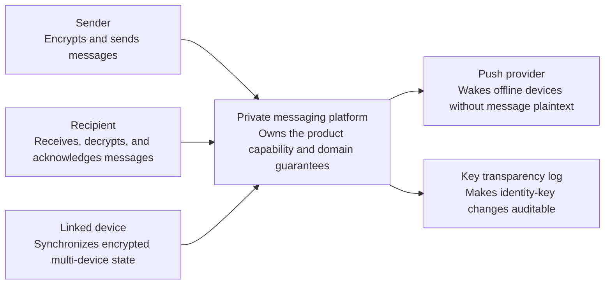
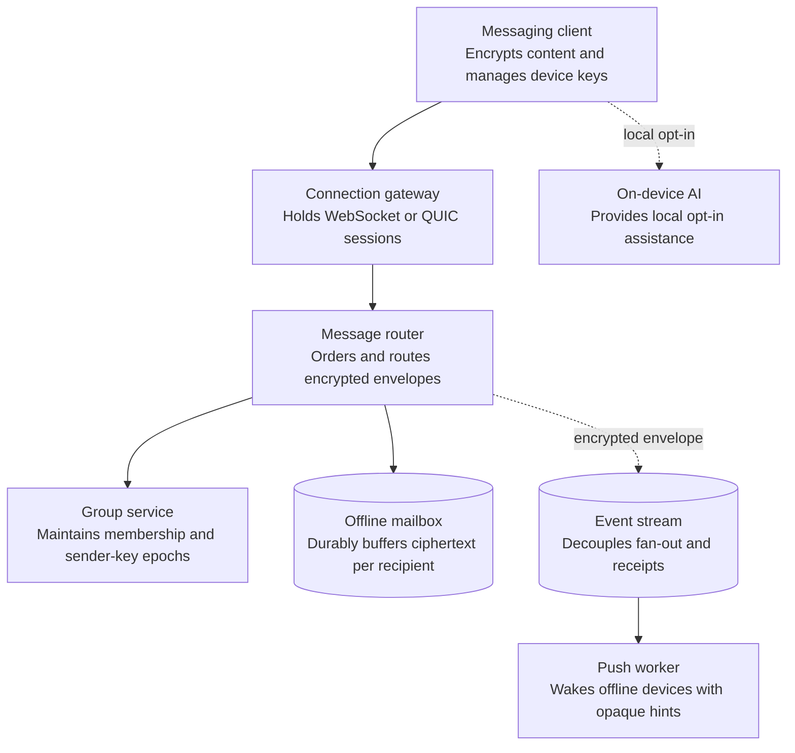
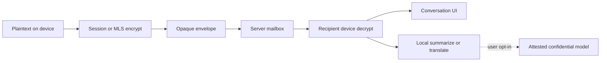
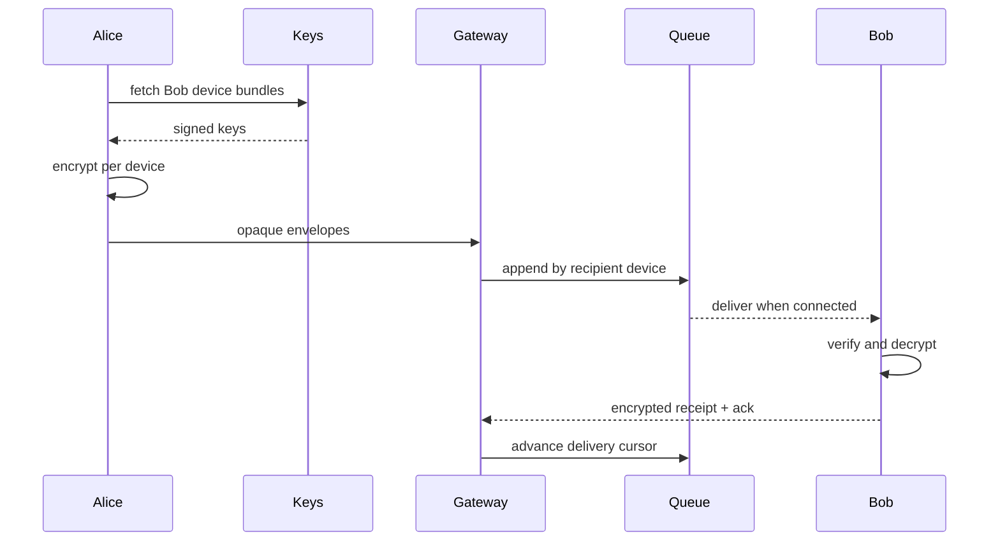
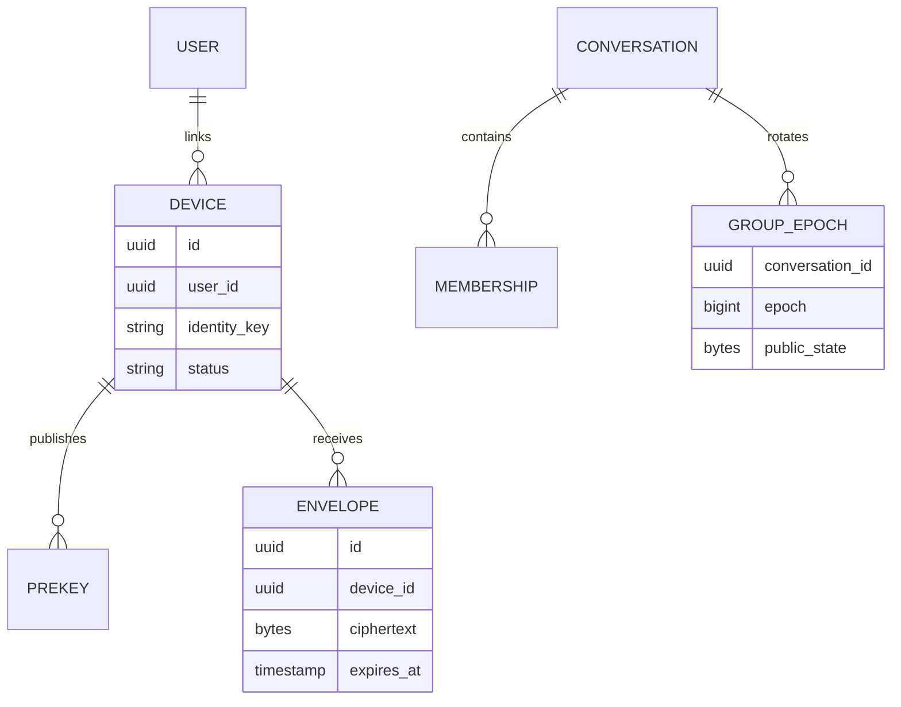

_Follows the [System Design Template](../00-system-design-template) — the reusable method behind every design in this library._

## 1. Interview prompt

Design private one-to-one and group messaging with multi-device delivery, media, calls signaling, and AI assistance that preserves end-to-end encryption by default.

## 2. Requirements and scope

### Functional requirements

| ID | Requirement | Priority | Interview significance |
|---|---|---|---|
| FR-1 | The system must send direct and group messages with delivery state. | Must | Defines the authoritative synchronous command boundary and its invariants. |
| FR-2 | The system must receive realtime messages and catch up from an offline mailbox. | Must | Defines the dominant read path, caches, indexes, and acceptable staleness. |
| FR-3 | The system must fan out encrypted envelopes, synchronize devices, and expire retained metadata. | Must | Separates durable acceptance from retryable fan-out and derived work. |
| FR-4 | The system must manage abuse reports without reading end-to-end encrypted content. | Should | Requires versioned configuration, least privilege, audit, and rollback. |

### Non-functional requirements

| Quality | Measurable target | Why it matters | Architecture consequence |
|---|---|---|---|
| Latency | online delivery p99 below 500 ms within a region | Users experience this path directly. | Keep the critical path local, bounded, and independently scalable. |
| Availability | 99.99% send and mailbox availability with durable acknowledged messages | A partial infrastructure failure must have an explicit outcome. | Spread workloads across failure zones and define degradation before failover. |
| Correctness | preserve per-conversation ordering and never acknowledge before durable mailbox acceptance | The system is not useful if its central invariant can be violated. | Use idempotency, ownership epochs, transactions, leases, or version checks where required. |
| Peak scale | support millions of persistent connections and high-fanout groups | Peak traffic and skew determine partitions and isolation. | Partition by the domain ownership key, autoscale on work, and reserve burst headroom. |
| Security and privacy | end-to-end encrypt messages, minimize metadata, rotate device keys, and protect backups | Abuse or data disclosure can outweigh availability. | Authenticate at the edge, authorize at the data boundary, encrypt, minimize, and audit. |

**Scope exclusions:** public feeds, server-side plaintext search, and invisible weakening of encryption for moderation. **Assumptions:** clients own message keys, servers route ciphertext, and confidential inference is explicit opt-in.

## 3. Capacity estimate

At 500M daily users sending 50 messages/day, average is 290k messages/s and a 5× peak is 1.45M/s. A 2 KB average encrypted envelope produces 50 TB/day before replication; media is orders larger and belongs in object storage/CDN. Ten percent simultaneously connected means 50M long-lived sessions distributed across regional gateways.

## 4. API and event contracts

- `POST /v1/messages` accepts opaque encrypted envelopes, recipient device IDs, client sequence, and idempotency key.
- Gateways stream `EnvelopeAvailable`; devices ack a server envelope ID, then send encrypted delivery/read receipts.
- Key directory responses are signed and auditable; group epoch changes reject messages encrypted to retired epochs.

## 5. System context

### Context component roles

| Component | Role |
|---|---|
| Sender | Encrypts and sends messages. |
| Recipient | Receives, decrypts, and acknowledges messages. |
| Linked device | Synchronizes encrypted multi-device state. |
| Private messaging platform | Owns the product boundary, core policy, and durable outcome. |
| Push provider | Wakes offline devices without message plaintext. |
| Key transparency log | Makes identity-key changes auditable. |

## 6. Container architecture

### Container component roles

| Component | Role |
|---|---|
| Messaging client | Encrypts content and manages device keys. |
| Connection gateway | Holds WebSocket or QUIC sessions. |
| Message router | Orders and routes encrypted envelopes. |
| Group service | Maintains membership and sender-key epochs. |
| Offline mailbox | Durably buffers ciphertext per recipient. |
| Event stream | Decouples fan-out and receipts. |
| Push worker | Wakes offline devices with opaque hints. |
| On-device AI | Provides local opt-in assistance. |

## 7. Component deep dive

Each linked device has identity and prekeys. One-to-one sessions use a ratcheting protocol; dynamic groups use MLS-style epochs and trees. Servers route ciphertext to per-device mailboxes and cannot generate plaintext. Local AI consumes decrypted content inside the device sandbox; confidential inference receives only an explicitly selected, separately encrypted context.

## 8. Critical flow

## 9. Data model

## 10. Storage, partitioning, consistency, and caching

Partition mailbox logs by recipient device so ordering and ack cursors stay local. Envelopes are immutable with TTL; clients own durable history and encrypted backups. Presence is ephemeral/eventual. Membership epoch changes and device revocation require strongly ordered group state. Cache public key bundles briefly with signed versions.

## 11. Reliability and failure handling

At-least-once delivery plus client message IDs handles retries. Gateways are stateless; session registries rebuild. Mailboxes replicate within a legal region and shed presence/typing before messages. A push outage delays wake-ups but polling reconnects. Key-directory inconsistency fails closed and surfaces a safety-number change.

## 12. Security, privacy, moderation, and abuse prevention

Use forward-secret protocols, key transparency, sealed-sender options, encrypted backups, and rate limits. Abuse reports deliberately reveal only user-selected messages and cryptographic context. Device-local classifiers can warn about scams without uploading plaintext. Contact discovery uses privacy-preserving protocols; retention of IP and delivery metadata is minimized.

## 13. AI architecture

Small on-device models summarize, translate, transcribe, and draft. Model files are signed and capability-scoped. Optional server inference requires explicit selection, remote attestation, ephemeral keys, no retention, and a visible boundary. Assistants cannot silently send messages or change group membership.

## 14. Model lifecycle, evaluation, and observability

Evaluate locally on consented/curated datasets for hallucination, harmful suggestions, language quality, battery, memory, and latency. Release signed models progressively by device capability. Collect opt-in aggregate quality counters; never log prompts or decrypted messages. Audit confidential-inference attestations separately.

## 15. Cost controls and deterministic fallbacks

Prefer quantized local models, incremental summaries, and download-on-Wi-Fi policies. Server models run only for explicit tasks and capped context. Messaging always works with AI disabled; rule-based link warnings and ordinary compose UI remain.

## 16. Trade-offs and alternatives

| Decision | Choice | Alternative and trigger |
|---|---|---|
| Group crypto | MLS-style epochs | pairwise sender keys for simpler small groups |
| History | client-owned + encrypted backup | server ciphertext archive for easier restore |
| AI | on-device first | confidential server inference for large opted-in tasks |
| Delivery | per-device mailbox | per-user log with fan-out complexity at clients |

## 17. Phased evolution

MVP supports one-to-one encrypted text and offline delivery. Phase 2 adds groups, devices, and media. Phase 3 adds key transparency and encrypted backup. Phase 4 adds signed local models and optional attested inference with privacy evaluation.

## 18. 45-minute interview walkthrough

Spend 5 minutes on scope, 5 on traffic, 10 on gateways/mailboxes, 10 on encryption and groups, 5 on delivery failure, 5 on privacy abuse controls, and 5 on on-device AI and trade-offs.

## 19. Follow-up questions and key takeaways

How does a new device join a group? What can the server order without plaintext? How are abusive users rate-limited? The core insight is that the server owns reliable ciphertext transport while endpoints own meaning, keys, and default inference.

## 20. References

- [RFC 9420: Messaging Layer Security](https://www.rfc-editor.org/info/rfc9420/)
- [OpenTelemetry generative AI semantic conventions](https://opentelemetry.io/docs/specs/semconv/how-to-write-conventions/)
