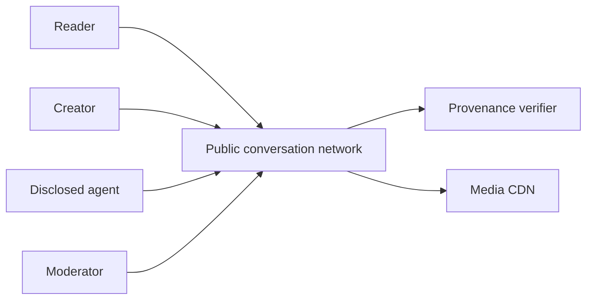
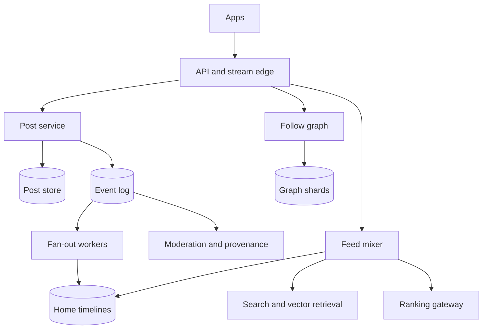
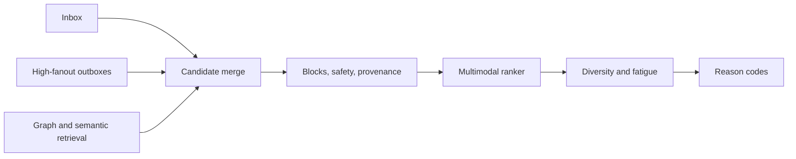
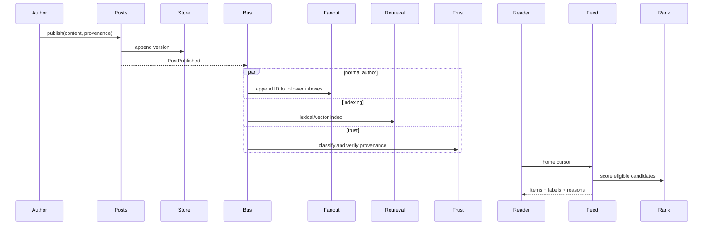
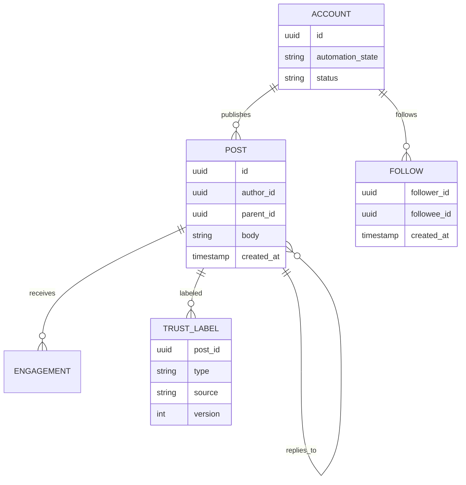

## 1. Interview prompt

Design a public short-post network with follows, replies, reposts, media, search, recommendations, and transparent controls for AI-generated content and automated accounts.

## 2. Requirements and scope

Publish/delete posts, follow, home feed, conversation threads, search, moderation, provenance labels, and user-selectable chronological/recommended views. Target sub-second publishing, feed p99 below 500 ms, high read availability, and rapid abuse response. Exclude ads and private direct messages.

## 3. Capacity estimate

For 300M daily users, 100M posts/day averages 1,160 writes/s and peaks near 12k/s. With 100 feed reads/user/day, average reads are 347k/s. At 1 KB metadata per post, one year is 36.5 TB before replicas; media dominates and uses object storage/CDN. Celebrity fan-out must never synchronously write to hundreds of millions of inboxes.

## 4. API and event contracts

- `POST /v1/posts` is idempotent and returns moderation/provenance state; `GET /v1/feed?cursor=&mode=` returns stable pagination.
- `FollowChanged`, `PostPublished`, `PostDeleted`, `ModerationChanged`, and `ProvenanceVerified` are versioned events.
- Feed items include ranking reason, content labels, author automation disclosure, and signed cursor.

## 5. System context

## 6. Container architecture

## 7. Component deep dive

Ordinary authors fan out post IDs on write. High-fan-out authors remain in an author outbox and merge on read. The mixer gathers followed, conversation, and exploration candidates, applies blocks/safety/provenance rules, scores with a compact ranker, then enforces diversity and author caps. A chronological mode skips learned ranking.

## 8. Critical flow

## 9. Data model

## 10. Storage, partitioning, consistency, and caching

Shard posts by author ID plus time bucket; keep globally unique IDs for ordering. Partition graph edges by follower for home-feed reads and maintain reverse edges asynchronously for fan-out. Deletes/moderation use high-priority tombstone streams to invalidate timelines, caches, search, and CDN. Engagement counts are eventual; post authorship is immutable.

## 11. Reliability and failure handling

If ranking fails, return chronological eligible candidates. If fan-out lags, merge author outboxes on read and expose freshness. Event consumers checkpoint and deduplicate. Protect celebrity publishes with pull-based delivery. During overload, shed exploration and expensive embeddings before follows or publishing.

## 12. Security, privacy, moderation, and abuse prevention

Enforce blocks before candidate ranking, rate-limit writes and graph mutations, isolate untrusted media, and provide appeals. Detect coordinated behavior using graph/temporal signals with human-reviewed enforcement. Label automated accounts and C2PA-verifiable media; provenance is a signal, not proof of truth. Preserve moderator audit trails and minimize private behavioral features.

## 13. AI architecture

Specialized multimodal models produce safety, topic, quality, and ranking features. LLMs summarize long threads and assist moderators with cited evidence, but do not autonomously ban. Agent posting uses scoped credentials, declared identity, quotas, and provenance. Users can inspect ranking reasons and opt for chronological feeds.

## 14. Model lifecycle, evaluation, and observability

Measure feed latency, freshness, satisfaction, diversity, calibration, harmful exposure, false enforcement, appeals, and creator/follower-size slices. Use offline replay, shadow ranking, interleaving, guarded experiments, and rollback. Trace model/feature versions with OpenTelemetry while aggregating sensitive user signals.

## 15. Cost controls and deterministic fallbacks

Precompute embeddings, batch fan-out, limit candidate pools, cascade cheap-to-expensive rankers, cache public inference, and sample summaries. Chronological feed, rules moderation, keyword search, and publishing work without AI.

## 16. Trade-offs and alternatives

| Decision | Choice | Alternative and trigger |
|---|---|---|
| Feed | hybrid push/pull | pure pull for smaller graphs |
| Ranking | candidate cascade | single large model when latency/cost permit |
| Moderation | labels plus policy tiers | binary removal only for illegal/high-confidence harm |
| Provenance | C2PA signal | platform-only labels when source credentials absent |

## 17. Phased evolution

MVP offers posts, follows, chronological pull feeds, and rules. Phase 2 adds timeline materialization and search. Phase 3 adds hybrid fan-out and learned ranking. Phase 4 adds provenance, disclosed agents, multimodal trust, and transparent controls.

## 18. 45-minute interview walkthrough

Use 5 minutes for scope, 5 for scale, 10 for post/graph stores, 10 for hybrid fan-out, 5 for feed ranking, 5 for moderation/provenance, and 5 for failure modes and trade-offs.

## 19. Follow-up questions and key takeaways

How are celebrity posts delivered? How quickly does a delete disappear? How do agent swarms affect rate limits? Separate durable public truth from disposable feed projections, and always retain a chronological deterministic product beneath learned ranking.

## 20. References

- [C2PA technical specification and charter](https://spec.c2pa.org/about/charter/)
- [OpenTelemetry generative AI semantic conventions](https://opentelemetry.io/docs/specs/semconv/how-to-write-conventions/)
