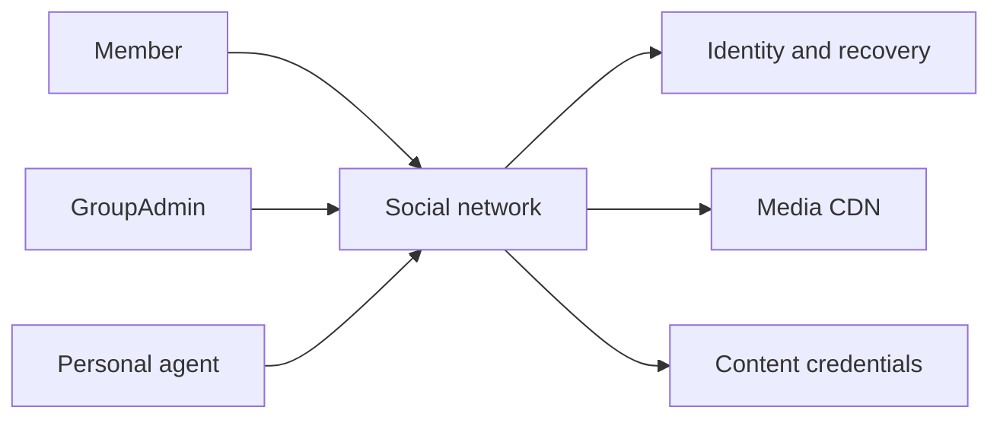
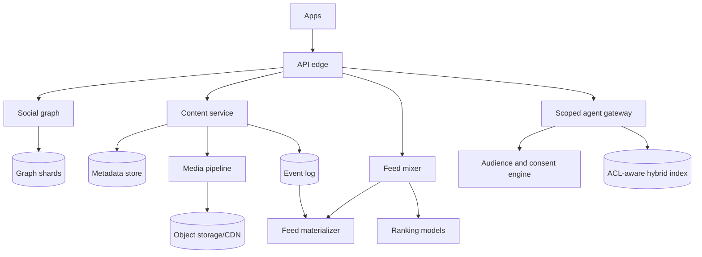
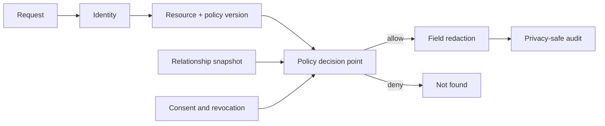
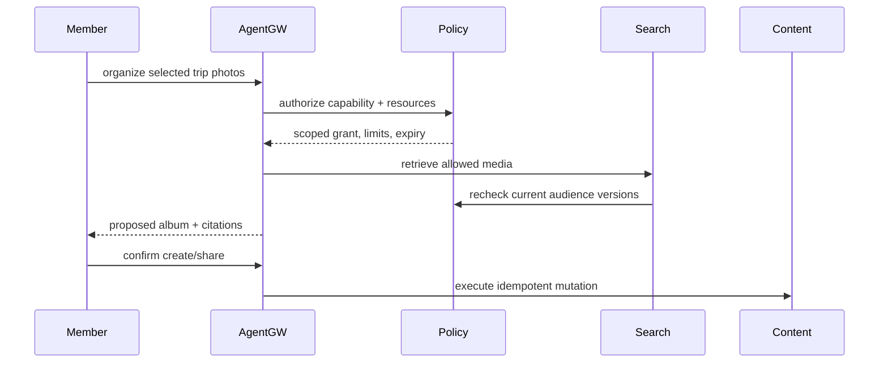
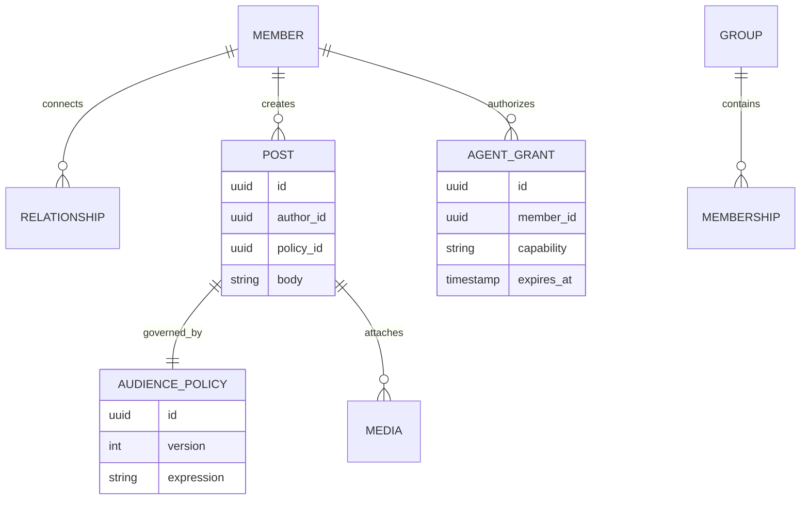

## 1. Interview prompt

Design a social network for profiles, friendships, groups, media, feeds, and a personal assistant that can organize and retrieve a user’s content without crossing audience or consent boundaries.

## 2. Requirements and scope

Profiles, reciprocal friendships, groups, posts/media, comments, audience selection, feed, search, notifications, and user-controlled agent tasks. Target p99 feed under 700 ms, fast revocation, regional data controls, and explainable ranking. Exclude advertising and face identification.

## 3. Capacity estimate

At 1B monthly and 500M daily users, 2 posts and 200 feed items/user/day yield 12k post writes/s average and 1.16M feed-item reads/s, with 5× peaks. Ten photos per monthly user at 2 MB is 20 PB/month logical ingress. The graph has tens of billions of edges and must partition without assuming every celebrity is a friend.

## 4. API and event contracts

- `POST /v1/posts {body, mediaIds, audiencePolicy}`; `GET /v1/feed?cursor=` returns reason and policy version.
- `POST /v1/agent/tasks` includes declared capability, selected resources, budget, expiry, and confirmation policy.
- `AudienceChanged` and `ConsentRevoked` are priority invalidation events consumed by feed, search, caches, embeddings, and agent memory.

## 5. System context

## 6. Container architecture

## 7. Component deep dive

Every resource references a versioned audience policy compiled to fast predicates. Reads evaluate viewer, relationship/group edge, resource policy, blocks, region, and revocation generation before returning content. Feed and search carry policy references but must recheck at serving time. Agent capabilities are short-lived grants narrower than the user session.

## 8. Critical flow

## 9. Data model

## 10. Storage, partitioning, consistency, and caching

Partition graph adjacency by member, content metadata by author/time, group membership by group, and media by content hash. Relationship acceptance and audience policy updates are strongly consistent in their home shard. Feeds, counts, search, and embeddings are projections. Cache authorization only with policy/revocation generation and short TTL.

## 11. Reliability and failure handling

Outbox events feed idempotent projections. If ranking fails, serve recent eligible friend/group posts. If policy or revocation data is unavailable, sensitive reads fail closed. Rebuild feeds/search from content and graph logs. Large-group fan-out uses pull/merge and adaptive backpressure.

## 12. Security, privacy, moderation, and abuse prevention

Default audiences conservatively, make sharing previews explicit, isolate media processing, and enforce block/revocation ahead of ranking. Protect graph queries from enumeration. Moderation combines rules, models, community/admin workflows, and appeal. C2PA signals disclose origin without treating provenance as factual verification.

## 13. AI architecture

Multimodal embeddings support accessible search and feed candidates. A personal agent uses capability-scoped MCP-style tools, consented memory with provenance/expiry, and proposal-before-action for posting, sharing, deleting, inviting, or messaging. Retrieved user content is data, not instructions; policy checks surround every tool call.

## 14. Model lifecycle, evaluation, and observability

Evaluate recommendation utility, diversity, harmful exposure, policy leakage, unsupported memories, action-confirmation rate, and demographic/graph-size slices. Red-team prompt injection in posts and images. Shadow and canary rankers; version embeddings and memory schemas. Trace tool/model IDs and authorization outcomes without storing private payloads.

## 15. Cost controls and deterministic fallbacks

Use cascaded ranking, precomputed features, embedding deduplication, bounded memory, task budgets, and small routing models. When AI is off or unhealthy, chronological feeds, keyword search, manual albums, audience controls, and all core social actions remain available.

## 16. Trade-offs and alternatives

| Decision | Choice | Alternative and trigger |
|---|---|---|
| Graph | sharded adjacency lists | graph database for smaller scale/richer traversal |
| Feed | hybrid materialize/merge | pull-only at early scale |
| Privacy | recheck at serving | projection-only checks are faster but unsafe on revocation |
| Agents | scoped proposal/confirm | autonomous action only for reversible low-risk operations |

## 17. Phased evolution

MVP adds profiles, friends, posts, explicit audiences, and chronological feeds. Phase 2 adds groups/media and projections. Phase 3 adds multimodal ranking/search. Phase 4 adds consent memory, scoped agents, provenance, and continuous privacy evaluation.

## 18. 45-minute interview walkthrough

Spend 5 minutes on scope, 5 on scale, 10 on graph/content stores, 10 on feed, 5 on audience revocation, 5 on personal agents, and 5 on reliability and trade-offs.

## 19. Follow-up questions and key takeaways

How does unfriend propagate? What makes agent memory revocable? How do large groups change fan-out? Treat authorization as live source-of-truth logic; every feed, index, embedding, and memory is only a revocable projection.

## 20. References

- [Model Context Protocol 2026 updates](https://blog.modelcontextprotocol.io/posts/2026-07-28/)
- [C2PA technical specification and charter](https://spec.c2pa.org/about/charter/)
