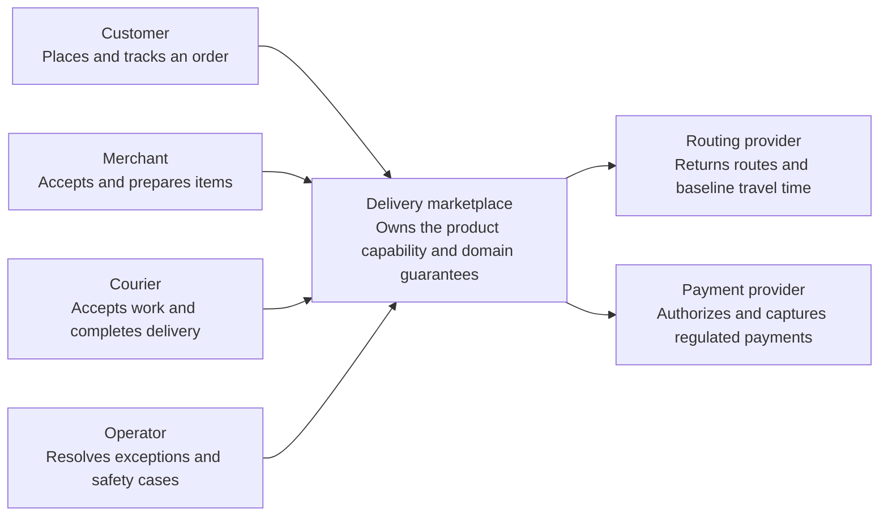
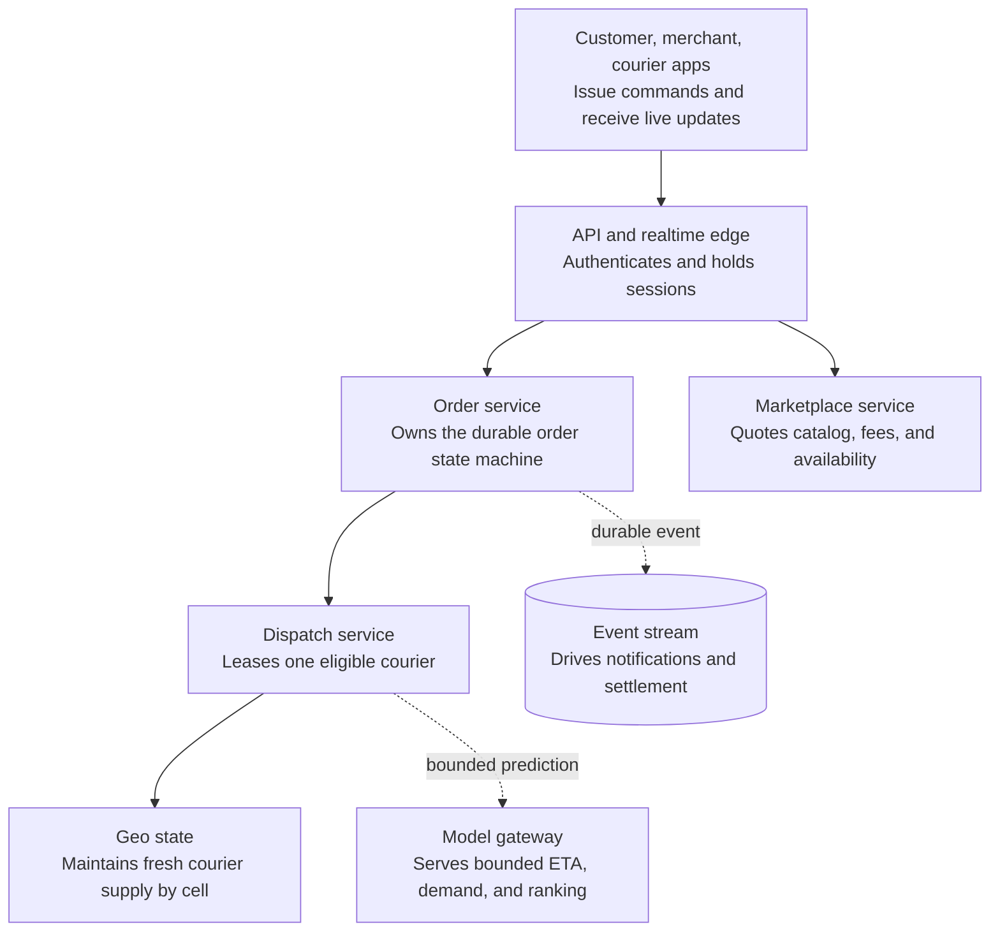
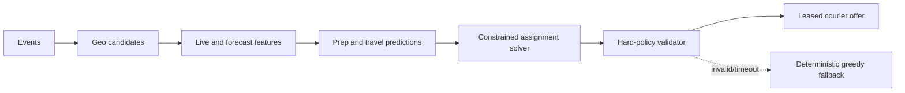
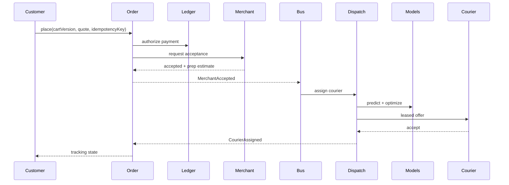
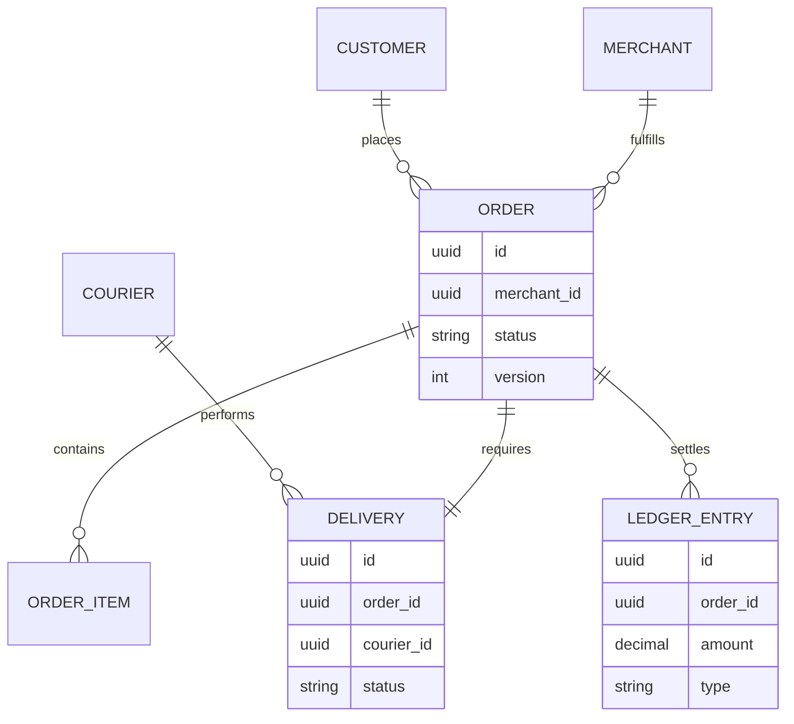

_Follows the [System Design Template](../00-system-design-template) — the reusable method behind every design in this library._

## 1. Interview prompt

Design local delivery from merchant discovery through order, preparation, courier dispatch, tracking, settlement, and support. Models improve search, preparation time, ETA, and batching; durable workflows and people retain authority over money and safety.

## 2. Requirements and scope

### Functional requirements

| ID | Requirement | Priority | Interview significance |
|---|---|---|---|
| FR-1 | The system must quote, place, accept, prepare, dispatch, deliver, and settle orders. | Must | Defines the authoritative synchronous command boundary and its invariants. |
| FR-2 | The system must track courier position, order state, ETA, and merchant readiness. | Must | Defines the dominant read path, caches, indexes, and acceptable staleness. |
| FR-3 | The system must optimize dispatch, forecast demand, notify parties, and reconcile payment. | Must | Separates durable acceptance from retryable fan-out and derived work. |
| FR-4 | The system must resolve exceptions, refunds, fraud, safety, and marketplace imbalance. | Should | Requires versioned configuration, least privilege, audit, and rollback. |

### Non-functional requirements

| Quality | Measurable target | Why it matters | Architecture consequence |
|---|---|---|---|
| Latency | quote p99 below 500 ms and normal courier assignment below 10 seconds | Users experience this path directly. | Keep the critical path local, bounded, and independently scalable. |
| Availability | 99.99% active-order state availability across a zone failure | A partial infrastructure failure must have an explicit outcome. | Spread workloads across failure zones and define degradation before failover. |
| Correctness | one valid order state transition, courier lease, inventory reservation, and payment capture | The system is not useful if its central invariant can be violated. | Use idempotency, ownership epochs, transactions, leases, or version checks where required. |
| Peak scale | ingest high-rate courier locations and meal-time order bursts per market | Peak traffic and skew determine partitions and isolation. | Partition by the domain ownership key, autoscale on work, and reserve burst headroom. |
| Security and privacy | protect precise location and payment data with scoped operational access | Abuse or data disclosure can outweigh availability. | Authenticate at the edge, authorize at the data boundary, encrypt, minimize, and audit. |

**Scope exclusions:** merchant kitchen software, payroll, autonomous delivery, and proprietary map infrastructure. **Assumptions:** each order belongs to one market cell, external providers handle maps and regulated card data, and AI has constrained fallback.

## 3. Capacity estimate

At 20M orders/day, average creation is 230/s and meal peaks reach 2.3k/s. If 2M active couriers send 150-byte positions every five seconds, ingestion peaks at 400k/s or 60 MB/s. With ten candidate merchants and couriers evaluated per request, prediction QPS reaches tens of thousands; batch demand forecasts separately.

## 4. API and event contracts

- `POST /v1/orders` includes cart version, quote, payment token, and idempotency key.
- Commands transition a versioned state machine: `accept`, `substitute`, `assign`, `pickup`, `deliver`, `cancel`, `refund`.
- Events include `OrderPlaced`, `MerchantAccepted`, `CourierAssigned`, `ItemSubstituted`, `Delivered`, `RefundApproved`; money events reference a ledger transaction.

## 5. System context

### Context component roles

| Component | Role |
|---|---|
| Customer | Places and tracks an order. |
| Merchant | Accepts and prepares items. |
| Courier | Accepts work and completes delivery. |
| Operator | Resolves exceptions and safety cases. |
| Delivery marketplace | Owns the product boundary, core policy, and durable outcome. |
| Routing provider | Returns routes and baseline travel time. |
| Payment provider | Authorizes and captures regulated payments. |

## 6. Container architecture

### Container component roles

| Component | Role |
|---|---|
| Customer, merchant, courier apps | Issue commands and receive live updates. |
| API and realtime edge | Authenticates and holds sessions. |
| Order service | Owns the durable order state machine. |
| Marketplace service | Quotes catalog, fees, and availability. |
| Dispatch service | Leases one eligible courier. |
| Geo state | Maintains fresh courier supply by cell. |
| Event stream | Drives notifications and settlement. |
| Model gateway | Serves bounded ETA, demand, and ranking. |

## 7. Component deep dive

The order service is a durable state machine with command deduplication, optimistic versioning, timers, and saga compensation. Dispatch generates H3 candidates, predicts pickup/delivery times, and solves a constrained assignment/batching problem. Hard constraints cover capacity, vehicle, food safety, promised time, and courier breaks; a greedy scorer is always available.

## 8. Critical flow

## 9. Data model

## 10. Storage, partitioning, consistency, and caching

Partition operational services by delivery region; keep an order and its workflow home together. Use relational transactions/outbox for order and ledger references, append-only double-entry records for money, H3/TTL storage for live courier locations, and object storage for history. Catalog/menu caches are versioned; availability is short-lived and revalidated at checkout.

## 11. Reliability and failure handling

Durable timers escalate unaccepted orders and expired offers. Sagas void authorization or issue compensating refunds. Idempotency covers every partner retry. If dispatch inference/solver fails, use capacity-checked greedy assignment. If merchant connectivity fails, pause confirmation rather than fabricate acceptance. Regional overload sheds recommendations before ordering/tracking.

## 12. Security, privacy, moderation, and abuse prevention

Tokenize cards, mask addresses until assignment, restrict location retention, verify courier/merchant identity, and audit support actions. Detect account takeover, collusion, fake delivery, promotion abuse, and unsafe substitutions. Models produce evidence/recommendations; adverse account, refund, and safety decisions support human review and appeals.

## 13. AI architecture

Models rank search, forecast demand, estimate prep/travel time, and optimize dispatch. A bounded exception agent summarizes timeline evidence and proposes actions through scoped tools. Refunds over threshold, substitutions, customer contact, and account actions require policy validation and human/customer confirmation. The order state machine is authoritative.

## 14. Model lifecycle, evaluation, and observability

Backtest by region, weather, cuisine, accessibility, and demand regime. Track ETA calibration, late orders, cancellations, courier earnings/fairness, batching detour, solver timeout, overrides, refund accuracy, and agent action acceptance. Shadow then canary by region; trace features, versions, decisions, and workflow state.

## 15. Cost controls and deterministic fallbacks

Forecast in batches, cache stable merchant features, cascade rankers, cap solver time/candidates, and summarize exceptions once per state transition. Rules and greedy assignment cover model outages; manual support covers agent outages; ordering, tracking, and settlement remain deterministic.

## 16. Trade-offs and alternatives

| Decision | Choice | Alternative and trigger |
|---|---|---|
| Workflow | durable state machine/saga | distributed transaction where one database owns all effects |
| Dispatch | constrained optimization | greedy nearest for MVP and overload |
| Region | city-local cells | global pool only for cross-region inventory |
| Exceptions | propose + approve agent | automatic action for low-value reversible cases after evaluation |

## 17. Phased evolution

MVP uses catalog, order workflow, payment, manual dispatch, and support. Phase 2 adds live geo/ETA and greedy dispatch. Phase 3 adds forecasting, constrained batching, and experimentation. Phase 4 adds evidence-grounded exception agents with approval and continuous safety evaluation.

## 18. 45-minute interview walkthrough

Use 5 minutes on actors/scope, 5 on scale, 10 on state machine and ledger, 10 on dispatch/location, 5 on critical sequence, 5 on exceptions/security, and 5 on AI fallbacks and trade-offs.

## 19. Follow-up questions and key takeaways

How are duplicate merchant callbacks handled? What happens after pickup cancellation? How are multi-order batches constrained? Model the real world as an explicit durable workflow; predictions advise transitions but never become the source of truth.

## 20. References

- [Model Context Protocol 2026 updates](https://blog.modelcontextprotocol.io/posts/2026-07-28/)
- [OpenTelemetry generative AI semantic conventions](https://opentelemetry.io/docs/specs/semconv/how-to-write-conventions/)
- [H3 documentation](https://h3geo.org/docs/)
