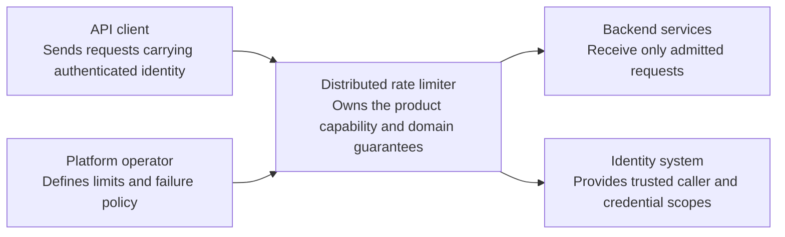
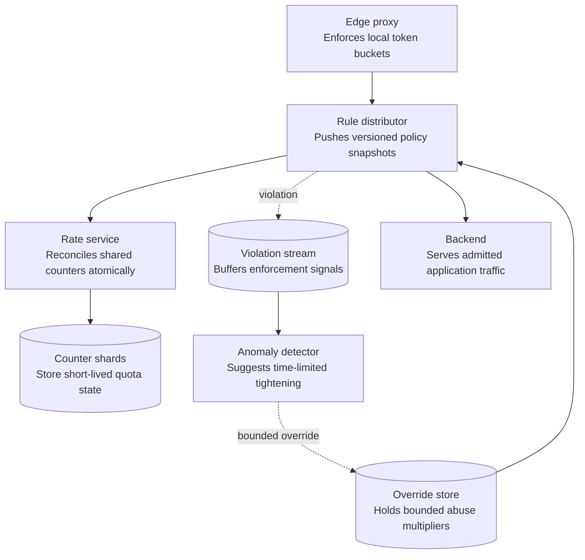
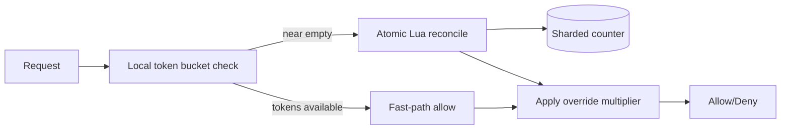
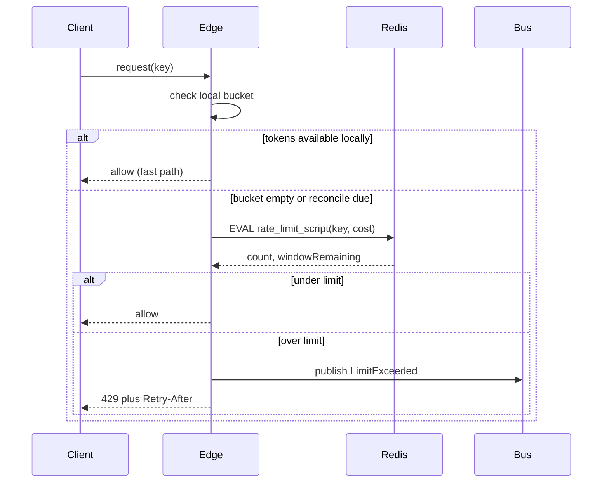
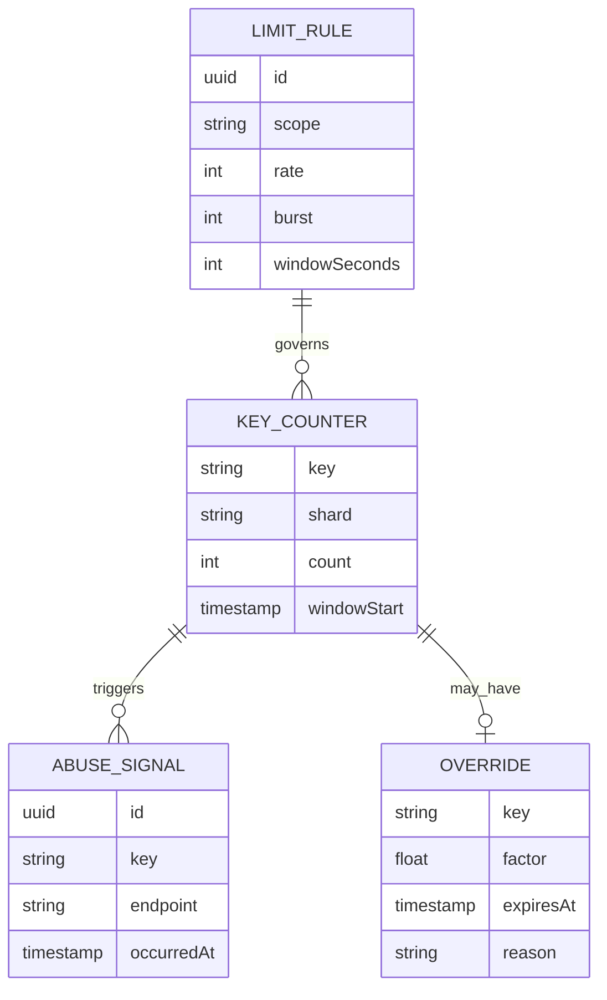

_Follows the [System Design Template](../00-system-design-template) — the reusable method behind every design in this library._

## 1. Interview prompt

Design a rate limiter that throttles API requests per user, API key, and IP across many stateless edge servers, enforcing shared limits accurately and cheaply, with AI used to tighten limits under detected abuse without ever putting availability behind a model call.

## 2. Requirements and scope

### Functional requirements

| ID | Requirement | Priority | Interview significance |
|---|---|---|---|
| FR-1 | The system must evaluate a request cost against user, credential, IP, and endpoint policy. | Must | Defines the authoritative synchronous command boundary and its invariants. |
| FR-2 | The system must return allow or deny with remaining quota and reset metadata. | Must | Defines the dominant read path, caches, indexes, and acceptable staleness. |
| FR-3 | The system must distribute configuration and analyze violation patterns. | Must | Separates durable acceptance from retryable fan-out and derived work. |
| FR-4 | The system must publish, audit, canary, and roll back limit rules. | Should | Requires versioned configuration, least privilege, audit, and rollback. |

### Non-functional requirements

| Quality | Measurable target | Why it matters | Architecture consequence |
|---|---|---|---|
| Latency | p99 decision latency below 5 ms at the enforcement point | Users experience this path directly. | Keep the critical path local, bounded, and independently scalable. |
| Availability | limiter failure must not become a platform-wide outage | A partial infrastructure failure must have an explicit outcome. | Spread workloads across failure zones and define degradation before failover. |
| Correctness | bounded over-admission is explicit while unauthorized fail-open is prohibited for protected endpoints | The system is not useful if its central invariant can be violated. | Use idempotency, ownership epochs, transactions, leases, or version checks where required. |
| Peak scale | sustain 500k checks/s with hot-key and burst protection | Peak traffic and skew determine partitions and isolation. | Partition by the domain ownership key, autoscale on work, and reserve burst headroom. |
| Security and privacy | derive keys from authenticated identity and restrict high-impact rule changes | Abuse or data disclosure can outweigh availability. | Authenticate at the edge, authorize at the data boundary, encrypt, minimize, and audit. |

**Scope exclusions:** billing-grade metering and long-window invoice quotas. **Assumptions:** authentication precedes enforcement and each endpoint declares fail-open or fail-closed policy.

## 3. Capacity estimate

At 500K requests/sec platform-wide, every request needs a check, so naive centralized counting is 500K ops/sec against one store. A single Redis node with pipelined Lua scripts sustains roughly 100-150K ops/sec, so shard state across 8-10 nodes by consistent hash of the limit key. Pushing most decisions to per-edge-node local token buckets, reconciled against the shard every 1-2 seconds, absorbs an estimated 90%+ of checks locally, cutting cross-node traffic to the tens of thousands of ops/sec even at peak.

## 4. API and event contracts

- Internal call embedded in the edge proxy: `checkLimit(key, scope, cost) -> {allowed, remaining, resetAt}`, sub-millisecond on the local fast path.
- Config: `PUT /v1/limits/{scope} {rate, burst, windowSeconds}`; changes propagate via pub/sub invalidation, not polling.
- Events: `LimitExceeded {key, scope, endpoint, timestamp, clientIp}` to an abuse-detection stream; `LimitOverrideApplied {key, factor, expiresAt}` written by the anomaly model.

## 5. System context

### Context component roles

| Component | Role |
|---|---|
| API client | Sends requests carrying authenticated identity. |
| Platform operator | Defines limits and failure policy. |
| Distributed rate limiter | Owns the product boundary, core policy, and durable outcome. |
| Backend services | Receive only admitted requests. |
| Identity system | Provides trusted caller and credential scopes. |

## 6. Container architecture

### Container component roles

| Component | Role |
|---|---|
| Edge proxy | Enforces local token buckets. |
| Rule distributor | Pushes versioned policy snapshots. |
| Rate service | Reconciles shared counters atomically. |
| Counter shards | Store short-lived quota state. |
| Override store | Holds bounded abuse multipliers. |
| Violation stream | Buffers enforcement signals. |
| Anomaly detector | Suggests time-limited tightening. |
| Backend | Serves admitted application traffic. |

## 7. Component deep dive

Each edge node keeps an approximate local token bucket per key, refilled at the configured rate; local decisions cover the fast path and never block on network I/O. Every reconciliation interval, or when a local bucket nears empty, the node calls a Lua script that atomically reads-and-increments a sliding-window counter (two fixed windows weighted by elapsed time) in the owning Redis shard, correcting local drift. A separate override lookup applies any anomaly-model-issued multiplier before the final decision, but only the deterministic bucket math can deny — the override can only tighten, never grant extra capacity.

## 8. Critical flow

## 9. Data model

## 10. Storage, partitioning, consistency, and caching

Partition counters by consistent hash of the limit key across the Redis shard ring, so adding shards only reshuffles a fraction of keys. Sliding-window counters use the two-window weighted-average approximation rather than a full sorted-set log, trading exactness for O(1) memory and a single atomic command. Local edge caches are intentionally eventually consistent with the shard — a burst landing unevenly across edge nodes can transiently over-admit by up to one reconciliation interval, accepted as the cost of avoiding a network round trip per request. Rule config is cached at the edge with pub/sub invalidation so updates land within about a second.

## 11. Reliability and failure handling

Each Redis shard replicates with a fast-failover replica; on primary loss the edge tolerates a few seconds of stale local-only enforcement using the last known rate before promotion completes. Limiter calls run behind a timeout and circuit breaker: on store unavailability, edge nodes fail open to a conservative static per-key default rather than blocking all traffic or fabricating an unbounded allow. Abuse-stream backpressure sheds anomaly-detection input before it ever affects the synchronous allow/deny path — the check path has no hard dependency on the model pipeline.

## 12. Security, privacy, moderation, and abuse prevention

Keys must derive from signed, already-authenticated identity — never trust a client-supplied header for the rate-limit key, or spoofing trivially resets counters. IP-based limits alone are weak against distributed slow-drip abuse across large botnets, so per-account and per-credential-fingerprint scopes layer on top of per-IP. Changes to limit rules are audited and require elevated access, since a misconfigured or maliciously widened limit is itself an outage vector. Stored data is limited to keys, counts, and timestamps with short TTLs.

## 13. AI architecture

An anomaly model consumes the request-velocity and `LimitExceeded` stream and scores per-key and per-cluster features (request entropy, endpoint diversity, geographic dispersion, timing regularity) to flag bot-like or credential-stuffing patterns that individually stay under static thresholds. Flags write a bounded, time-limited tightening multiplier to the override store, which the edge applies as an extra constraint on top of the static bucket — the model can only add restriction, never bypass or loosen a configured limit. Inference happens asynchronously, off the request path, so its output is just another config value the edge already knows how to apply.

## 14. Model lifecycle, evaluation, and observability

Label training data from confirmed abuse incidents (chargebacks, manual security review, blocked botnets) rather than raw flag counts, since flags alone are circular. Replay candidate models against historical traffic offline before shadowing them in production, comparing flagged keys against the confirmed-abuse label set for precision and recall. Track false-positive rate, override propagation latency, feature drift, and model latency; trace every override through OpenTelemetry so an edge-observed 429 can be attributed back to the deterministic bucket or the model override.

## 15. Cost controls and deterministic fallbacks

Compute abuse features in periodic batch aggregation rather than per-request, and cache override lookups at the edge for their full validity window. Cascade cheap rule-based heuristics (IP reputation lists, known bot user-agents) ahead of the full model to filter obvious cases cheaply. If the anomaly pipeline is fully down, the system runs on static per-scope limits alone — the only capability lost is faster reaction to novel abuse, not enforcement itself.

## 16. Trade-offs and alternatives

| Decision | Choice | Alternative and trigger |
|---|---|---|
| Algorithm | token bucket + sliding window counter | sliding window log when exact per-request precision matters more than memory |
| Coordination | sharded Redis with atomic Lua scripts | local-only counting when slight cross-node inaccuracy is fully acceptable |
| Consistency | eventually consistent local caches | strongly consistent central counter if legal/billing enforcement requires exactness |
| Abuse response | async model tightens via override | inline model scoring only if latency budget and model reliability allow it |

## 17. Phased evolution

MVP is a single Redis instance with a fixed token bucket per key and no local caching. Phase 2 adds edge-local buckets with periodic reconciliation and sharding by consistent hash. Phase 3 adds the abuse event stream and anomaly-scored overrides in shadow mode. Phase 4 promotes overrides to production with bounded auto-tightening, dashboards, and per-scope tuning.

## 18. 45-minute interview walkthrough

Spend 5 minutes on scope and algorithm choice, 5 on capacity numbers justifying sharding, 5 on the API/event contract, 10 on the container diagram and local/global reconciliation, 5 on the check sequence, 10 on failure handling, security, and the AI override layer, and 5 on trade-offs and evolution.

## 19. Follow-up questions and key takeaways

How would you rate-limit a burst of legitimate traffic (a product launch) without also blocking it as abuse? What happens to in-flight local tokens during shard failover? How would you extend this to a distributed leaky bucket for smoother egress to a downstream dependency? The key insight is separating the always-available deterministic bucket from an advisory, asynchronous abuse layer that can only make enforcement stricter, never looser or slower.

## 20. References

- [Cloudflare: How we built rate limiting capable of scaling to millions of domains](https://blog.cloudflare.com/counting-things-a-lot-of-different-things/)
- [Stripe: Scaling your API with rate limiters](https://stripe.com/blog/rate-limiters)
- [Redis documentation: scripting with Lua](https://redis.io/docs/latest/develop/interact/programmability/eval-intro/)
