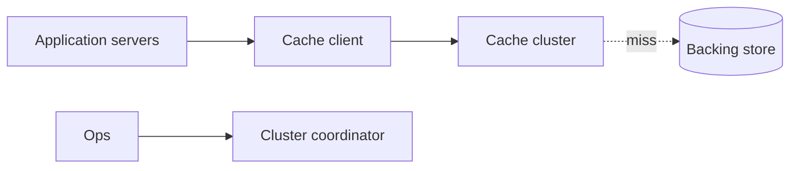
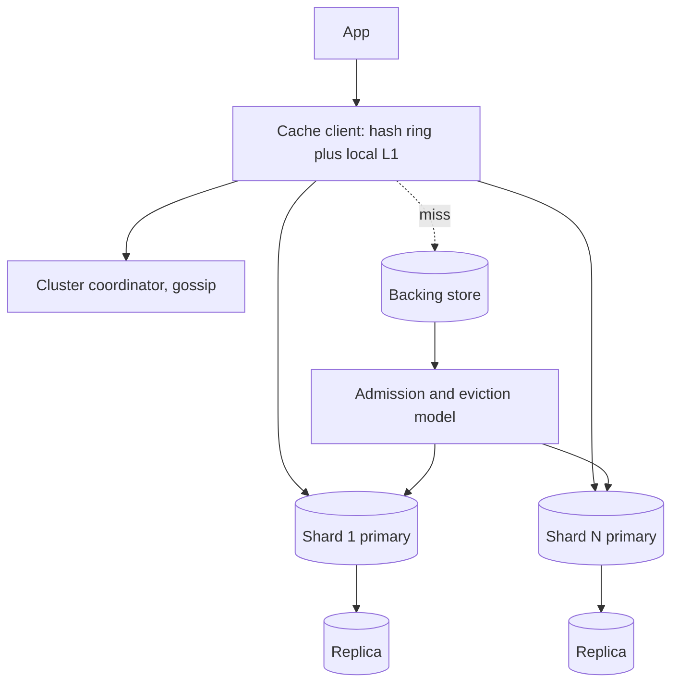
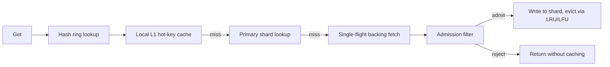
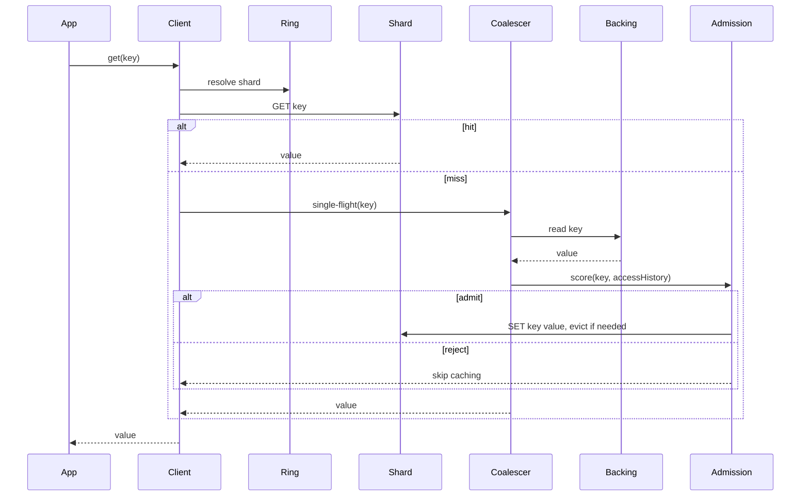
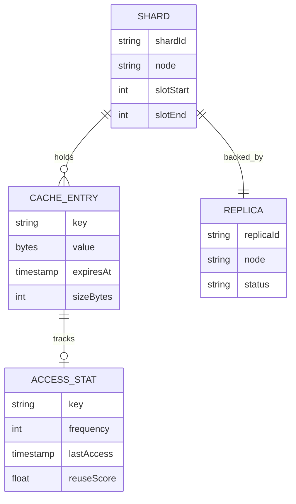

_Follows the [System Design Template](/system-design/00-system-design-template) — the reusable method behind every design in this library._

## 1. Interview prompt

Design a distributed in-memory cache sitting in front of a slower backing store — sharded across many nodes, replicated for availability, resilient to hot keys and stampedes — with AI used to improve eviction decisions without ever making a cache miss unsafe or a hit incorrect.

## 2. Requirements and scope

**Functional:** get/set/delete with TTL, batch multi-get, per-key expiration, cluster-aware client routing. **Non-functional:** p99 get latency under 1ms intra-region, survive single-node failure without client-visible errors, hit rate above a target threshold under normal load, bounded memory per node. Exclude cross-region active-active replication and durability guarantees beyond best-effort — this is a cache, not a source of truth. Assume the backing store is authoritative and can always be re-read on a miss.

## 3. Capacity estimate

At 2M reads/sec and 200K writes/sec with 2KB average values, a 50M-key hot working set is roughly 100GB. With 16GB usable RAM per node, that needs 8-10 primary shards, doubled with one replica each for 16-20 nodes total. Even distribution puts peak per-node load around 200K ops/sec, well within a single-threaded event-loop cache engine, but skewed hot keys can spike a single shard 10-100x above that — the actual design problem is skew, not aggregate throughput.

## 4. API and event contracts

- `GET /key`, `MGET key1,key2,...`, `SET key value ttl`, `DEL key` — the client library resolves shard via the hash ring directly, no proxy hop.
- `KeyInvalidated {key, version}` published over pub/sub on write, consumed by local L1 caches.
- Admin: `POST /v1/cluster/rebalance` triggers controlled slot migration between nodes.

## 5. System context

## 6. Container architecture

## 7. Component deep dive

Placement uses hash-slot sharding (Redis Cluster style, a fixed number of slots mapped to nodes) so only a fraction of keys move when a node joins or leaves. Each node runs deterministic LRU/LFU as the baseline eviction policy; a lightweight admission filter decides whether a newly-missed key is worth admitting at all, since not every miss deserves cache space. Hot-key mitigation uses a local per-node L1 cache of the hottest few hundred keys plus request coalescing, so concurrent misses for the same key trigger exactly one backing-store fetch.

## 8. Critical flow

## 9. Data model

## 10. Storage, partitioning, consistency, and caching

Hash-slot sharding makes rebalancing an explicit, controlled slot migration rather than a full rehash across the cluster. Each shard writes to its in-memory structure and asynchronously replicates to one or more replicas; reads default to the primary, with stale-replica reads allowed only on non-critical paths. Consistency is best-effort: a write followed immediately by a read on a different connection can race a replica's async catch-up, acceptable since the backing store remains the source of truth. TTL expiration is lazy-plus-active — checked on access, with a background sweep reclaiming expired keys.

## 11. Reliability and failure handling

Each shard has at least one replica that can be promoted within seconds on primary failure, using the coordinator's health checks and gossip-based failure detection. Clients retry a failed shard against its replica or, on total shard loss, fall through to the backing store directly, degrading to higher latency rather than errors. Hot-key stampedes are bounded by request coalescing and a short negative-cache TTL for repeated misses on hot-but-nonexistent keys, preventing repeated backing-store hammering during a bad deploy.

## 12. Security, privacy, moderation, and abuse prevention

Cache traffic stays on an internal network with mTLS between client and shard, since the cache often holds session or PII-adjacent data with short TTLs. Enforce per-tenant/per-key namespacing so one tenant cannot read another's keys through a hash collision or misconfigured prefix. Rate-limit or quarantine keys/clients that repeatedly cause cache stampedes, since a single buggy client bypassing TTL can degrade the shared cluster for everyone.

## 13. AI architecture

A small learned admission/eviction model scores each candidate key using recency, frequency, and access-pattern features, predicting reuse probability before deciding whether to cache it and, under memory pressure, which resident keys to evict first. The model runs off the hot path, periodically refreshing per-key scores that the deterministic LRU/LFU policy consults as a tiebreaker rather than a replacement — eviction order is still enforced by the deterministic structure, not the model directly.

## 14. Model lifecycle, evaluation, and observability

Train on replayed access logs, evaluating candidate admission policies via trace-driven simulation before ever touching production — replaying real request traces against different eviction policies offline is standard practice for cache research. Compare hit rate, byte hit rate, and eviction-caused miss rate against the deterministic LRU/LFU baseline in shadow mode per shard. Track score staleness and inference latency, and fall back automatically if the scoring service's error rate or latency exceeds a threshold.

## 15. Cost controls and deterministic fallbacks

Score updates run in batch off a sampled access log rather than per-request, and the model output is a numeric hint written alongside each key's metadata, not an inline call on the read/write path. If the scoring pipeline is unavailable, the cache runs pure LRU/LFU with no correctness degradation — the model only ever improves hit rate, it is never required for the cache to function.

## 16. Trade-offs and alternatives

| Decision | Choice | Alternative and trigger |
|---|---|---|
| Sharding | fixed hash slots (Redis Cluster style) | pure consistent hashing when node count changes very frequently |
| Eviction baseline | deterministic LRU/LFU | random/FIFO eviction only for throwaway low-value caches |
| Admission | learned reuse-probability hint | frequency-sketch admission alone when a model pipeline isn't justified |
| Replication | async replica with fast promotion | synchronous quorum writes if the cache must never lose a recent write |

## 17. Phased evolution

MVP is a single sharded cluster with plain LRU and no replicas. Phase 2 adds replication and automated failover. Phase 3 adds request coalescing and hot-key local caching. Phase 4 adds trace-driven offline evaluation and a shadow-mode learned admission hint before promoting it to production.

## 18. 45-minute interview walkthrough

Spend 5 minutes on scope and consistency expectations, 5 on capacity and why sharding is needed, 5 on the API, 10 on hash-slot placement and replication in the container diagram, 10 on the miss/coalescing/admission sequence, 5 on failure handling and hot keys, and 5 on the AI admission layer and trade-offs.

## 19. Follow-up questions and key takeaways

How do you rebalance slots without a stampede on the destination shard? How would you handle a single key so hot it needs to live on every node? What's the failure mode if the admission model always says "admit"? The key insight is that the cache's correctness never depends on the model — deterministic eviction and stampede protection carry the system, and the model is a hit-rate optimization layered on top.

## 20. References

- [Netflix Tech Blog: Caching for a Global Netflix](http://techblog.netflix.com/2016/03/caching-for-global-netflix.html)
- [Redis documentation: key eviction](https://redis.io/docs/latest/develop/reference/eviction/)
- [Redis Cluster specification: hash slots](https://redis.io/docs/latest/operate/oss_and_stack/reference/cluster-spec/)
