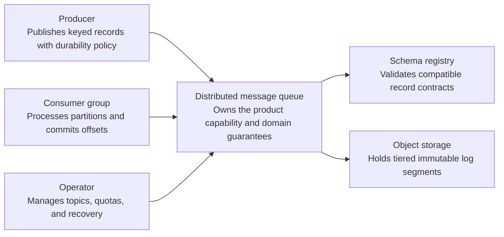
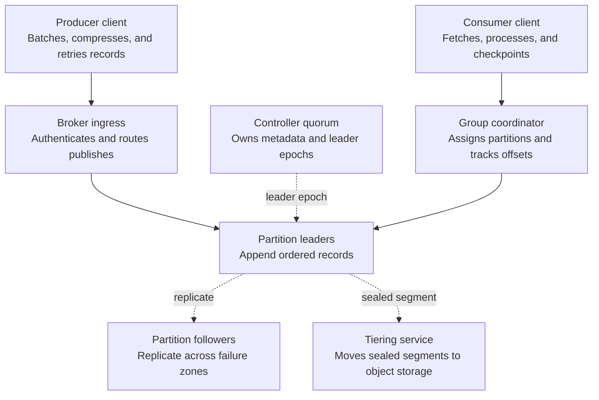
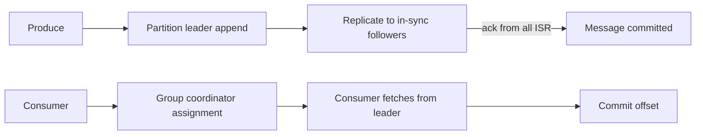
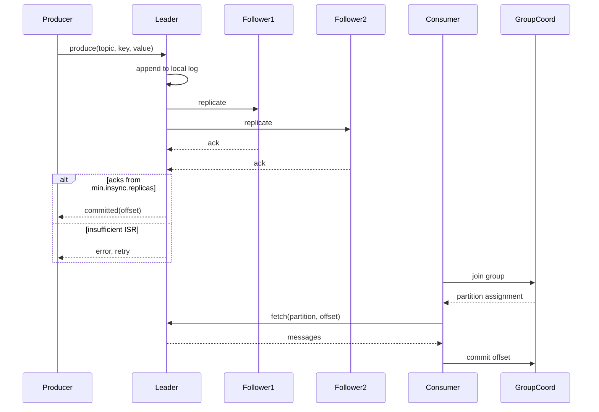
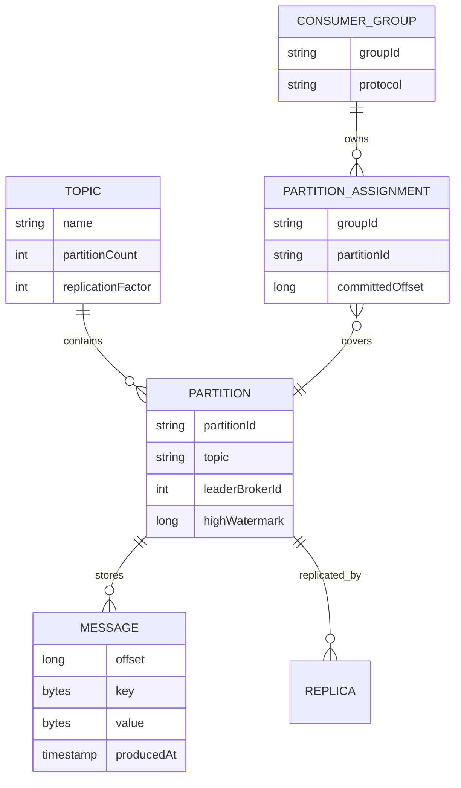

_Follows the [System Design Template](../00-system-design-template) — the reusable method behind every design in this library._

## 1. Interview prompt

Design a distributed, partitioned message queue that producers publish to and consumer groups read from with ordering per partition, configurable at-least-once or exactly-once semantics, and durability through replication, with AI layered on to catch abnormal lag or throughput without ever gating delivery on a model call.

## 2. Requirements and scope

### Functional requirements

| ID | Requirement | Priority | Interview significance |
|---|---|---|---|
| FR-1 | The system must create topics and publish keyed durable records. | Must | Defines the authoritative synchronous command boundary and its invariants. |
| FR-2 | The system must consume ordered partition records with explicit offsets. | Must | Defines the dominant read path, caches, indexes, and acceptable staleness. |
| FR-3 | The system must replicate partitions, compact or retain logs, and tier old segments. | Must | Separates durable acceptance from retryable fan-out and derived work. |
| FR-4 | The system must rebalance leaders, quotas, schemas, retention, and consumer access. | Should | Requires versioned configuration, least privilege, audit, and rollback. |

### Non-functional requirements

| Quality | Measurable target | Why it matters | Architecture consequence |
|---|---|---|---|
| Latency | p99 acknowledged publish below 20 ms within a region | Users experience this path directly. | Keep the critical path local, bounded, and independently scalable. |
| Availability | continue reads and writes through one broker or zone failure | A partial infrastructure failure must have an explicit outcome. | Spread workloads across failure zones and define degradation before failover. |
| Correctness | acknowledged records meet configured durability and per-partition ordering | The system is not useful if its central invariant can be violated. | Use idempotency, ownership epochs, transactions, leases, or version checks where required. |
| Peak scale | sustain millions of records/s and petabytes of retained segments | Peak traffic and skew determine partitions and isolation. | Partition by the domain ownership key, autoscale on work, and reserve burst headroom. |
| Security and privacy | authenticate producers and consumers, authorize topics, encrypt links, and audit administrative changes | Abuse or data disclosure can outweigh availability. | Authenticate at the edge, authorize at the data boundary, encrypt, minimize, and audit. |

**Scope exclusions:** cross-partition total order and exactly-once arbitrary external side effects. **Assumptions:** keys choose partitions, consumers tolerate replay, and tiered storage is eventually available.

## 3. Capacity estimate

At 2M messages/sec platform-wide with 1KB average size, ingress is 2GB/s; with replication factor 3, sustained write across the cluster is 6GB/s. If each partition sustains roughly 10MB/s sequential write, that implies at least ~200 partitions active concurrently, typically split into a few thousand total for parallelism headroom and bounded per-partition replay time. Seven-day retention at 2GB/s is roughly 1.2PB before replication, ~3.6PB after — the number that drives tiered-storage decisions.

## 4. API and event contracts

- `produce(topic, key, value, headers) -> {partition, offset}`; partition chosen by `hash(key)` unless explicit.
- `poll(consumerGroup, topic) -> [{partition, offset, value}]`, `commit(consumerGroup, offsets)`.
- Broker-internal replication protocol: leader appends to its local log, followers fetch and acknowledge; `min.insync.replicas` and `acks=all` govern the durability semantics exposed to producers.

## 5. System context

### Context component roles

| Component | Role |
|---|---|
| Producer | Publishes keyed records with durability policy. |
| Consumer group | Processes partitions and commits offsets. |
| Operator | Manages topics, quotas, and recovery. |
| Distributed message queue | Owns the product boundary, core policy, and durable outcome. |
| Schema registry | Validates compatible record contracts. |
| Object storage | Holds tiered immutable log segments. |

## 6. Container architecture

### Container component roles

| Component | Role |
|---|---|
| Producer client | Batches, compresses, and retries records. |
| Broker ingress | Authenticates and routes publishes. |
| Partition leaders | Append ordered records. |
| Partition followers | Replicate across failure zones. |
| Controller quorum | Owns metadata and leader epochs. |
| Group coordinator | Assigns partitions and tracks offsets. |
| Tiering service | Moves sealed segments to object storage. |
| Consumer client | Fetches, processes, and checkpoints. |

## 7. Component deep dive

Each partition is an append-only log with a single leader; followers replicate by fetching from the leader and acknowledging, and the leader maintains the in-sync replica (ISR) set — a follower falling behind its fetch-lag threshold is dropped from ISR, and a message is only "committed" once every ISR member has it. Consumer group rebalancing runs on a group coordinator broker that applies a partition-assignment protocol (range or cooperative-sticky) whenever membership changes, minimizing partition movement to avoid a full stop-the-world reassignment. Delivery semantics are a configuration axis: at-least-once from commit-after-process, or idempotent/exactly-once via producer sequence numbers and transactional offset commits.

## 8. Critical flow

## 9. Data model

## 10. Storage, partitioning, consistency, and caching

Partitions are the unit of both parallelism and ordering — key-hash routing keeps related messages (same user, same entity) in order, at the cost of hot partitions when keys are skewed. Logs are append-only segment files with an offset index for fast seek, aged out by time or size retention, optionally tiered to object storage for long retention without keeping it all on broker disk. Consistency is per-partition linearizable for committed messages (once ISR-acknowledged, durable and ordered); cross-partition ordering is explicitly not guaranteed, which is the main scoping decision consumers must design around.

## 11. Reliability and failure handling

Leader failure triggers controller-driven election of a new leader from the remaining ISR, bounded by the controller's failure-detection timeout; followers outside ISR are excluded from election to avoid electing a lagging replica and silently losing committed data. Producers use bounded retries with idempotent sequence numbers to avoid duplicate writes on retry after a timeout. Consumer-side backpressure (slow processing) is visible as growing lag rather than broker overload, since the broker just serves fetch requests — this decoupling is intended, and lag is the primary signal for both humans and the anomaly model.

## 12. Security, privacy, moderation, and abuse prevention

Enforce topic-level ACLs (who can produce/consume) and encrypt in transit both between clients and brokers and between brokers during replication. Quota producer/consumer bandwidth per client so one runaway job cannot starve the cluster. Sensitive payloads (PII in message values) should be encrypted or tokenized by the producer application, since the broker treats message bodies as opaque bytes and should not be trusted as a moderation boundary.

## 13. AI architecture

An anomaly model consumes per-partition lag, throughput, and rebalance-frequency time series to flag abnormal patterns — a consumer group falling behind faster than historical seasonality, or a partition receiving disproportionate load — that static fixed-threshold alerts would either miss or over-trigger. Flags feed a recommendation to the partition/consumer autoscaler (add partitions, add consumer instances) that a human or a bounded auto-scaling policy acts on; the model never directly produces, consumes, or commits offsets, so an inference failure cannot affect message delivery.

## 14. Model lifecycle, evaluation, and observability

Train lag-forecasting models on historical per-topic time series segmented by day-of-week and known traffic events, backtesting against past incidents where manual scaling was needed. Evaluate against static-threshold alerting as the baseline, tracking precision/recall on confirmed incidents, time-to-detection versus static thresholds, and false-alarm rate that would cause alert fatigue. Trace scaling recommendations end to end — metric window used, model version, action taken — so an over-scale event is auditable.

## 15. Cost controls and deterministic fallbacks

Compute anomaly scores on downsampled per-minute aggregates rather than raw per-message metrics, and batch model inference on a fixed interval rather than streaming per-event. Static lag and throughput threshold alerts remain configured and active regardless of model health, so operators always have a deterministic signal even if the anomaly pipeline is degraded or disabled entirely.

## 16. Trade-offs and alternatives

| Decision | Choice | Alternative and trigger |
|---|---|---|
| Ordering scope | per-partition only | global ordering only for small single-partition topics where throughput doesn't matter |
| Durability | ISR quorum ack (acks=all) | single-replica ack for throughput-over-durability workloads (metrics, logs) |
| Delivery semantics | at-least-once plus idempotent producer | full exactly-once transactions only where duplicate side effects are unacceptable |
| Scaling signal | learned anomaly detection plus static thresholds | static thresholds alone for small clusters where model ops cost isn't justified |

## 17. Phased evolution

MVP is a single-broker log with one partition per topic and no replication. Phase 2 adds partitioning, replication with ISR, and leader election. Phase 3 adds consumer group coordination with cooperative rebalancing and configurable delivery semantics. Phase 4 adds lag/throughput anomaly detection feeding a bounded autoscaler alongside the existing static alerts.

## 18. 45-minute interview walkthrough

Spend 5 minutes on ordering/delivery-semantics scope, 5 on capacity and partition count, 5 on the API/replication contract, 10 on the broker/ISR/consumer-group container diagram, 10 on the produce-replicate-consume sequence, 5 on failure handling and security, and 5 on the anomaly layer and trade-offs.

## 19. Follow-up questions and key takeaways

How does a consumer recover correctly after a rebalance mid-batch? What happens if `min.insync.replicas` can't be satisfied? How would you handle a single hot partition from a skewed key? The key insight is that ordering and durability guarantees are scoped to the partition on purpose — that's what makes horizontal scaling possible — and every guarantee claimed beyond that boundary needs explicit justification.

## 20. References

- [Confluent: Kafka Data Replication Protocol](https://docs.confluent.io/kafka/design/replication.html)
- [Apache Kafka: Consumer Rebalance Protocol](https://kafka.apache.org/41/operations/consumer-rebalance-protocol/)
- [Apache Kafka official documentation](https://kafka.apache.org/documentation/#replication)
