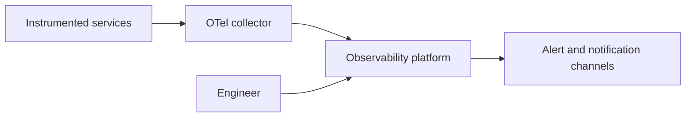
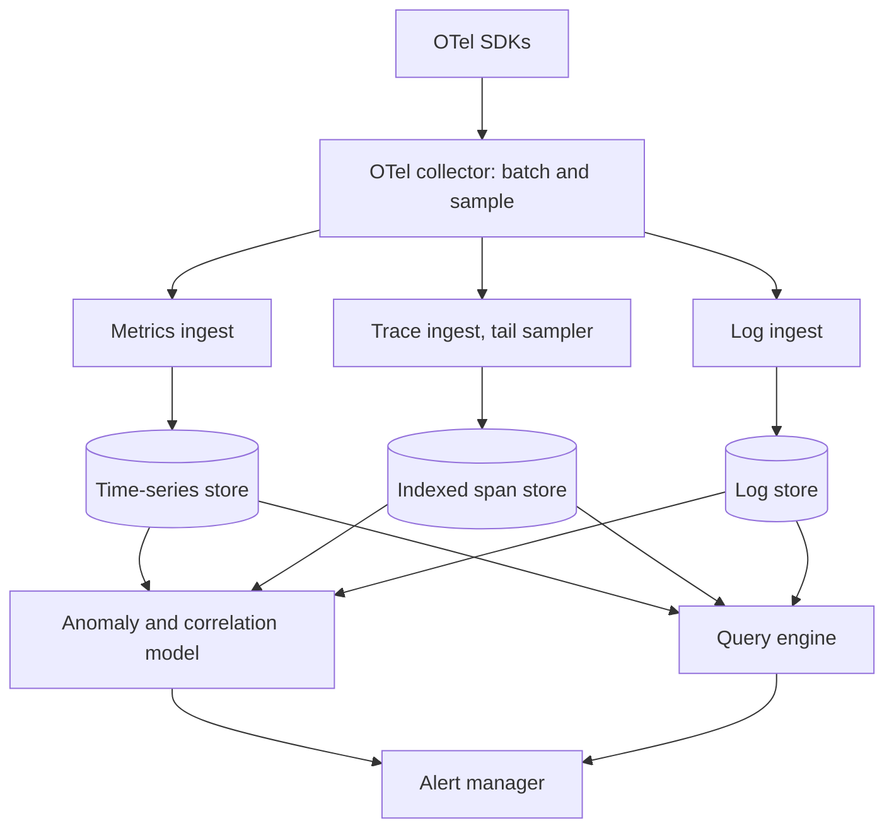
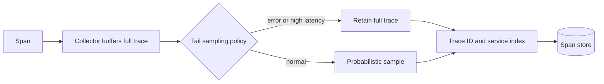
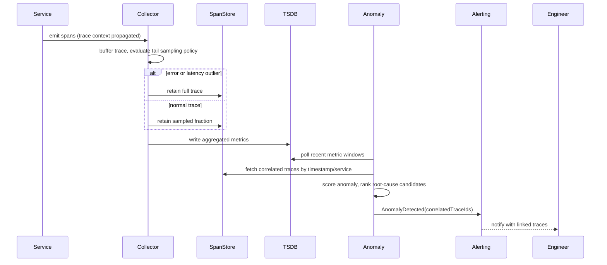
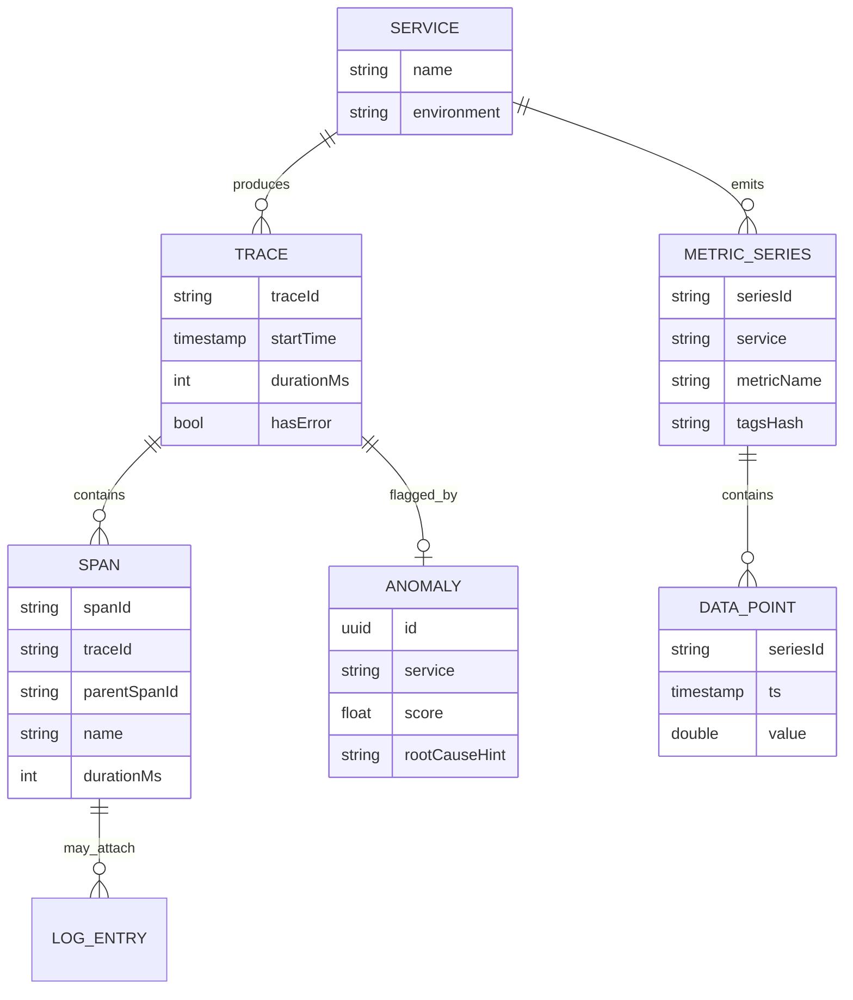

_Follows the [System Design Template](/system-design/00-system-design-template) — the reusable method behind every design in this library._

## 1. Interview prompt

Design an observability platform ingesting metrics, logs, and OpenTelemetry-instrumented distributed traces from thousands of services, storing them affordably at scale, and using models to surface likely root causes across signals without hiding the underlying raw data behind an opaque black box.

## 2. Requirements and scope

**Functional:** ingest metrics (counters/gauges/histograms) with tags, structured logs, and traces with span/context propagation; support ad hoc query, dashboards, and alerting; correlate traces to metrics and logs via trace ID. **Non-functional:** ingestion must never backpressure instrumented services, query latency must support interactive dashboards, and cost must scale sublinearly with raw telemetry volume through sampling and aggregation. Exclude long-term (multi-year) compliance log archival — a separate cold-storage pipeline. Assume services are instrumented with OpenTelemetry SDKs emitting standard semantic-convention data.

## 3. Capacity estimate

At 100K services emitting ~50 spans/sec each at peak, platform-wide ingress is 5M spans/sec; at ~500 bytes/span that's 2.5GB/s raw trace volume, clearly too much to store unsampled — this number forces a sampling strategy, it isn't an optional optimization. Metrics at 1M active time series updated every 10s is 100K writes/sec, but high-cardinality tags (a per-user tag, for instance) can blow this up by orders of magnitude, which is the real capacity risk versus raw request volume. At 1% trace retention post-sampling, 7-day storage is still on the order of hundreds of terabytes before compression.

## 4. API and event contracts

- OTLP ingestion endpoints (gRPC/HTTP) for traces, metrics, and logs — the OpenTelemetry Protocol is the wire format, not a bespoke SDK contract.
- `POST /v1/query {signal, filters, timeRange}` for ad hoc metric/trace/log queries.
- Alert rules: `POST /v1/alerts {condition, threshold, window}` for static thresholds; anomaly-detected alerts publish `AnomalyDetected {signal, service, score, correlatedTraceIds}`.

## 5. System context

## 6. Container architecture

## 7. Component deep dive

The collector batches and applies sampling before data ever hits storage — head-based sampling decides per-span probabilistically at creation time (cheap, but can drop the one error trace you needed), while tail-based sampling buffers a full trace and decides after seeing all spans, keeping error or high-latency traces at the cost of requiring all spans of a trace to reach the same collector instance via consistent routing by trace ID. Span storage indexes by trace ID, service, and a bounded set of tags for fast lookup, since full-cardinality indexing of every tag is cost-prohibitive at this volume. The query engine fans out across the three stores and joins on trace ID/timestamp to answer "show me the trace behind this metric spike."

## 8. Critical flow

## 9. Data model

## 10. Storage, partitioning, consistency, and caching

Partition the span store by time bucket and service so recent, hot data stays on fast storage while older buckets tier to cheaper object storage with a coarser index. Metrics use a purpose-built time-series store with downsampling rollups (raw for a day, one-minute for a week, one-hour beyond that), since nobody queries a month-old spike at millisecond resolution. Consistency is eventually consistent by design — ingestion is fire-and-forget from the instrumented service, and a query might miss the last few seconds of data, an accepted trade for never blocking application request paths on telemetry writes.

## 11. Reliability and failure handling

Collectors buffer locally and retry with backoff on downstream store unavailability, dropping — with a counted, visible metric — only after a bounded queue fills, since telemetry loss is preferable to backpressuring production traffic. Trace ID-consistent routing to collectors, so all spans of one trace land on the same instance for tail sampling, uses consistent hashing; a collector failure loses in-flight buffered traces for that shard, monitored as a known gap rather than silently ignored. Store-side, ingestion write paths are isolated from query read paths so a runaway dashboard query cannot degrade ingestion.

## 12. Security, privacy, moderation, and abuse prevention

Scrub or hash known PII fields (emails, tokens, IPs beyond coarse geo) at the collector before storage, since traces and logs are a common accidental PII leak vector from careless instrumentation. Enforce per-team/service RBAC on query and dashboard access, since trace data can reveal internal architecture and business-sensitive volumes. Rate-limit and quota per-service ingestion so a misbehaving service emitting runaway cardinality — tagging spans with raw user IDs, for example — cannot blow up shared storage cost or index size for everyone.

## 13. AI architecture

An anomaly and correlation model scores each active metric series against its historical seasonal baseline, and on detected deviation, queries the span store for traces in the same service and time window to surface likely root-cause candidates — a specific downstream dependency, a deploy marker, an error-spike pattern — ranked by correlation strength. The model only ever produces a ranked suggestion with links to the underlying raw traces/metrics it used; it never auto-remediates or silences an alert, and every suggestion is falsifiable by the engineer clicking into the same data the model saw.

## 14. Model lifecycle, evaluation, and observability

Backtest anomaly detection against a labeled corpus of past incidents (known start/end times, known root cause) to measure detection lag and precision/recall against the existing static-threshold alert rules. Track false-positive rate directly against on-call fatigue, root-cause suggestion acceptance rate by engineers, and model latency, since a root-cause hint arriving after the human already found the issue has negative value. Version and trace every anomaly score back to the exact metric windows and trace IDs it used, so a bad call is debuggable the same way any other production decision is.

## 15. Cost controls and deterministic fallbacks

Tail sampling and metric downsampling are the primary cost levers — the model's cost is secondary to storage/ingestion cost. Run anomaly scoring on downsampled, batched windows rather than raw streaming data, and only fetch full trace detail for the top-ranked candidates rather than every trace in the window. Static threshold alerts remain configured on every critical metric regardless of anomaly-model health, so the platform's core promise — page me when this breaks — never depends on the model pipeline being up.

## 16. Trade-offs and alternatives

| Decision | Choice | Alternative and trigger |
|---|---|---|
| Sampling | tail-based (buffer, decide after) | head-based probabilistic when collector memory/routing cost is the constraint |
| Metric cardinality | bounded tag allowlist plus rollups | unrestricted cardinality only for small internal-only deployments |
| Storage tiering | hot recent plus cold object storage | single hot tier only when retention window is short enough to afford it |
| Root cause | ranked suggestion, human confirms | fully automated remediation only for narrowly scoped, well-tested playbooks |

## 17. Phased evolution

MVP ingests metrics and logs only, with static threshold alerting and no tracing. Phase 2 adds OpenTelemetry trace ingestion with head-based sampling. Phase 3 adds tail-based sampling and cross-signal query joins by trace ID. Phase 4 adds the anomaly/correlation model in shadow mode, then promotes it to production alerts alongside — never instead of — static thresholds.

## 18. 45-minute interview walkthrough

Spend 5 minutes on signal scope (metrics/logs/traces) and cost framing, 5 on capacity numbers that force sampling, 5 on the OTLP contract, 10 on the collector/sampling/storage container diagram, 10 on the tail-sampling and correlation sequence, 5 on reliability/security, and 5 on the AI layer and trade-offs.

## 19. Follow-up questions and key takeaways

How do you guarantee all spans of one trace reach the same tail-sampling collector under autoscaling? How would you handle a metric whose cardinality suddenly explodes? What's the failure mode if the root-cause model is confidently wrong? The key insight is that observability's own reliability requirements are inverted from most systems — it must degrade by dropping data under load, never by blocking the production traffic it exists to watch.

## 20. References

- [OpenTelemetry: Sampling concepts](https://opentelemetry.io/docs/concepts/sampling/)
- [OpenTelemetry blog: Tail Sampling with the OpenTelemetry Collector](https://opentelemetry.io/blog/2022/tail-sampling/)
- [Google Research: Dapper, a Large-Scale Distributed Systems Tracing Infrastructure](https://research.google/pubs/dapper-a-large-scale-distributed-systems-tracing-infrastructure/)
