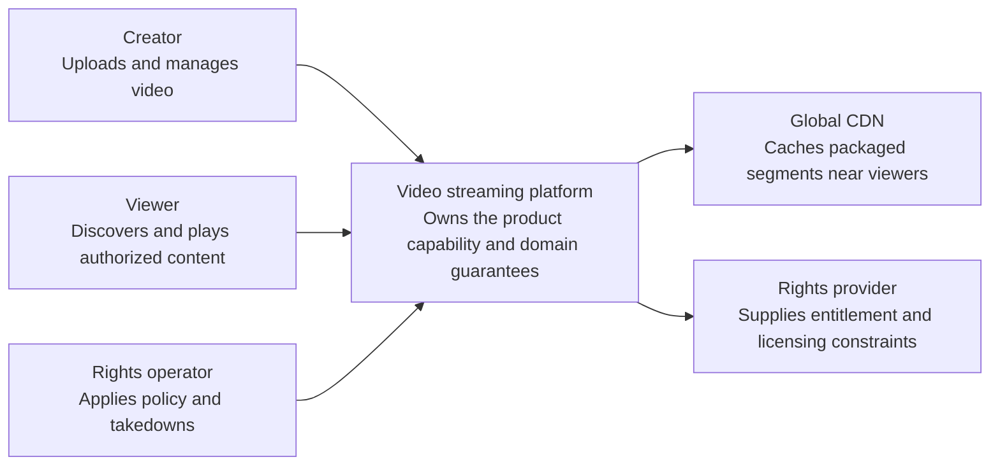
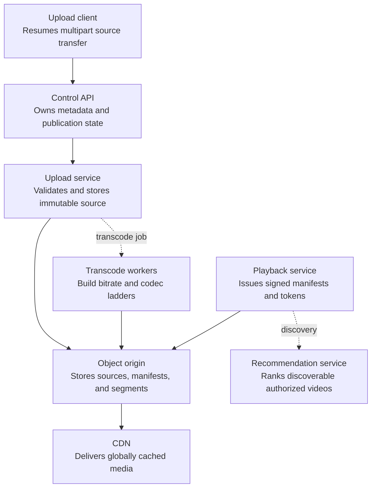
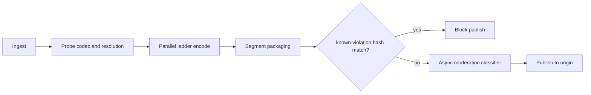
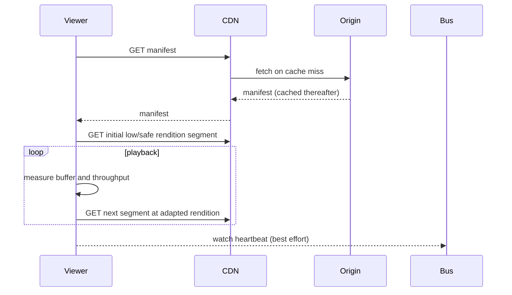
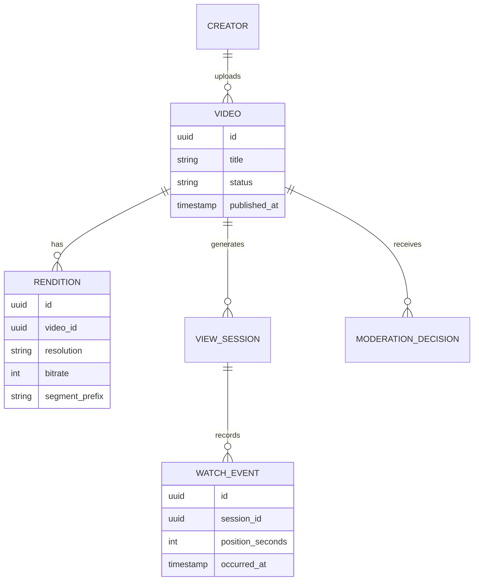

_Follows the [System Design Template](../00-system-design-template) — the reusable method behind every design in this library._

## 1. Interview prompt

Design a video platform where creators upload videos, the platform transcodes them into multiple resolutions/bitrates and serves adaptive playback globally, tracks watch time, and ranks a personalized feed. AI ranks recommendations and screens uploaded content, but playback start and upload durability must never depend on inference availability.

## 2. Requirements and scope

### Functional requirements

| ID | Requirement | Priority | Interview significance |
|---|---|---|---|
| FR-1 | The system must upload, validate, publish, update, and remove video assets. | Must | Defines the authoritative synchronous command boundary and its invariants. |
| FR-2 | The system must start adaptive playback from a nearby edge with entitlement checks. | Must | Defines the dominant read path, caches, indexes, and acceptable staleness. |
| FR-3 | The system must transcode, package, caption, moderate, index, and recommend content. | Must | Separates durable acceptance from retryable fan-out and derived work. |
| FR-4 | The system must manage rights, takedowns, encoding ladders, quality, and creator analytics. | Should | Requires versioned configuration, least privilege, audit, and rollback. |

### Non-functional requirements

| Quality | Measurable target | Why it matters | Architecture consequence |
|---|---|---|---|
| Latency | playback start p95 below 2 seconds on a healthy broadband link | Users experience this path directly. | Keep the critical path local, bounded, and independently scalable. |
| Availability | 99.99% playback-control availability with durable source media | A partial infrastructure failure must have an explicit outcome. | Spread workloads across failure zones and define degradation before failover. |
| Correctness | entitlement, takedown, and publication state override stale CDN objects within policy bounds | The system is not useful if its central invariant can be violated. | Use idempotency, ownership epochs, transactions, leases, or version checks where required. |
| Peak scale | store exabytes and deliver globally skewed playback bandwidth | Peak traffic and skew determine partitions and isolation. | Partition by the domain ownership key, autoscale on work, and reserve burst headroom. |
| Security and privacy | signed playback tokens, DRM where required, upload scanning, and rights audit | Abuse or data disclosure can outweigh availability. | Authenticate at the edge, authorize at the data boundary, encrypt, minimize, and audit. |

**Scope exclusions:** live broadcast production and claims about a specific company implementation. **Assumptions:** media segments are immutable by version, CDN serves bytes, and recommendation failure falls back to editorial/popular lists.

## 3. Capacity estimate

At 500K uploads/day (5.8/s average, 60/s peak) with an 8-minute average source at ~8 Mbps (~480 MB), transcoding into a 6-rung ladder (240p–1080p) adds roughly 1.6x the source size, so daily storage growth is ~375 TB pre-replication and ~1.1 PB/day with 3x geo-replication. At 50M DAU averaging 5 plays/session (250M plays/day, ~2,900/s average, ~29,000/s peak), egress at a compressed average of ~150 MB per full view is on the order of tens of petabytes/day, making CDN cache-hit ratio the dominant cost lever.

## 4. API and event contracts

- `POST /v1/uploads` (init) → `{uploadId, chunkUrls}`; `PUT` per chunk; `POST /v1/uploads/{id}:complete` triggers the transcode pipeline.
- `GET /v1/videos/{id}/manifest.m3u8|.mpd` returns the adaptive manifest; segment URLs are signed and versioned.
- Events carry `eventId`, `occurredAt`, `schemaVersion`: `VideoUploaded`, `RenditionReady{resolution, bitrate}`, `WatchHeartbeat` (~every 10s, deduped by session+sequence), `ModerationDecided`.

## 5. System context

### Context component roles

| Component | Role |
|---|---|
| Creator | Uploads and manages video. |
| Viewer | Discovers and plays authorized content. |
| Rights operator | Applies policy and takedowns. |
| Video streaming platform | Owns the product boundary, core policy, and durable outcome. |
| Global CDN | Caches packaged segments near viewers. |
| Rights provider | Supplies entitlement and licensing constraints. |

## 6. Container architecture

### Container component roles

| Component | Role |
|---|---|
| Upload client | Resumes multipart source transfer. |
| Control API | Owns metadata and publication state. |
| Upload service | Validates and stores immutable source. |
| Transcode workers | Build bitrate and codec ladders. |
| Object origin | Stores sources, manifests, and segments. |
| CDN | Delivers globally cached media. |
| Playback service | Issues signed manifests and tokens. |
| Recommendation service | Ranks discoverable authorized videos. |

## 7. Component deep dive

The transcode pipeline assembles uploaded chunks, probes source codec/resolution, fans out parallel encode jobs per rung of the bitrate ladder, and packages GOP-aligned segments so the player can switch renditions mid-stream without re-buffering. Publication to the origin is gated by an async moderation pass; a synchronous, deterministic hash-match check against known-violation content blocks publish outright regardless of the ML classifier's state.

## 8. Critical flow

## 9. Data model

## 10. Storage, partitioning, consistency, and caching

Tier storage by popularity: hot/recent renditions stay CDN-fronted, long-tail archive moves to cheaper cold storage with on-demand rehydration on first request. Segment URLs are versioned and immutable, so CDN edges cache them with long TTLs; metadata publish state is strongly consistent while view counts are approximate rollups (HyperLogLog/CRDT-style counters) updated asynchronously. Trending/viral videos get proactive edge pre-warming rather than relying on cold cache-fill under load.

## 11. Reliability and failure handling

Transcode jobs checkpoint per chunk so a failed rendition retries without restarting the whole pipeline; stuck jobs move to a dead-letter queue for operator review. Upload is resumable from a chunk manifest after a network drop. CDN or origin-shield failure falls back to a secondary CDN; watch-heartbeat events are at-least-once with session+sequence dedup so a retried heartbeat never double-counts watch time.

## 12. Security, privacy, moderation, and abuse prevention

Serve segments behind short-TTL signed URLs to prevent hotlinking and token replay. Run mandatory hash-based matching against known-violation content before publish (deterministic, not model-gated), plus audio/video fingerprinting against a copyright reference database. Age-restricted and region-restricted content is gated at the edge; takedowns and appeals are logged to an auditable moderation trail.

## 13. AI architecture

A two-tower retrieval model plus a re-ranking model produce the personalized home feed from watch-time, session, and co-engagement features; both run off the critical playback path. A multimodal classifier (sampled frames, audio transcript, title/description text) flags policy violations for human review post-publish; an ASR model generates auto-captions asynchronously. None of these gate initial playback availability.

## 14. Model lifecycle, evaluation, and observability

Train ranking on delayed watch-time and satisfaction labels; evaluate offline via watch-time lift, diversity, and fairness across creator segments before online A/B. Shadow-score moderation and ranking models, canary by traffic percentage, and track moderation precision/recall per policy category against sampled human review. Trace inference calls with OpenTelemetry, correlated to video and session IDs, without embedding raw content in general telemetry.

## 15. Cost controls and deterministic fallbacks

Cache popular manifests/segments aggressively at the edge; run scene-understanding and captioning jobs as offline batch rather than online inference. If the ranking model is unavailable or times out, the feed falls back to a deterministic chronological/subscription feed blended with view-velocity popularity. If the moderation classifier degrades, new uploads route to a human review queue instead of auto-publishing — publish never proceeds on faith.

## 16. Trade-offs and alternatives

| Decision | Choice | Alternative and trigger |
|---|---|---|
| Bitrate ladder | fixed 6-rung ladder | per-title encode optimization once catalog size justifies the extra compute |
| Storage tiering | hot CDN + cold archive | flat single-tier storage for a small catalog, until cost forces tiering |
| Recommendation | two-tower retrieval + re-rank | popularity-only feed for MVP or model outage |
| Moderation gate | async classifier + sync hash match | fully synchronous classifier if publish-latency budget allows |

## 17. Phased evolution

MVP transcodes a single rendition ladder synchronously, serves from one origin, and ranks by upload recency. Phase 2 adds CDN edge caching, resumable chunked upload, and streaming watch-time aggregation. Phase 3 adds async moderation classification and personalized ranking. Phase 4 adds storage tiering, per-title encode optimization, and auto-captioning.

## 18. 45-minute interview walkthrough

Spend 5 minutes on scope, 5 on capacity math, 10 on upload/transcode pipeline and the container diagram, 10 on the playback sequence and caching, 5 on reliability/moderation, and 5 on ranking, fallbacks, and trade-offs.

## 19. Follow-up questions and key takeaways

How do you re-encode the entire catalog onto a new codec without downtime? How does the CDN handle a sudden viral spike on a cold long-tail video? Why gate publish on a deterministic hash check rather than the ML classifier alone? The key insight is that transcoding and delivery are decoupled, cacheable, deterministic pipelines; ranking and moderation are advisory layers that never block upload or playback.

## 20. References

- [Netflix Technology Blog: Per-Title Encode Optimization](https://netflixtechblog.com/per-title-encode-optimization-7e99442b62a2)
- [RFC 8216: HTTP Live Streaming](https://www.rfc-editor.org/rfc/rfc8216.html)
