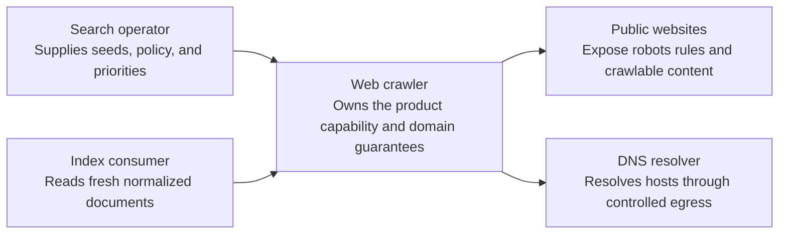
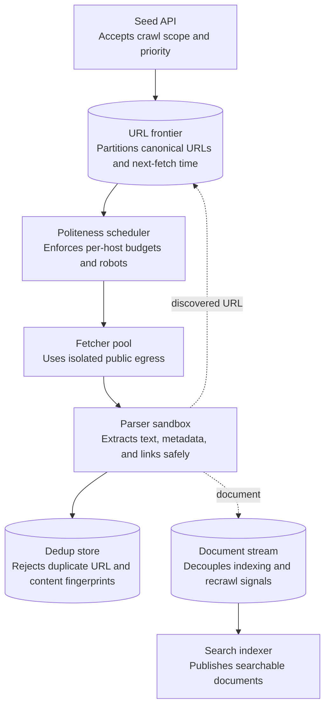
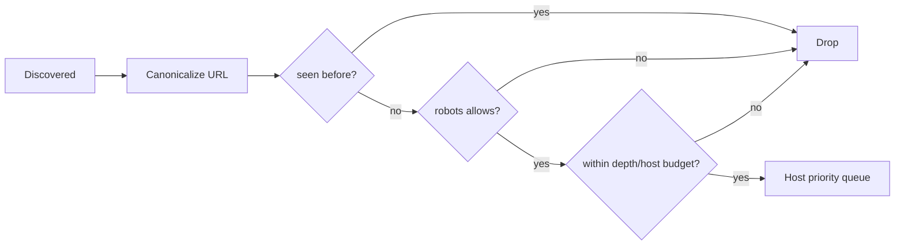
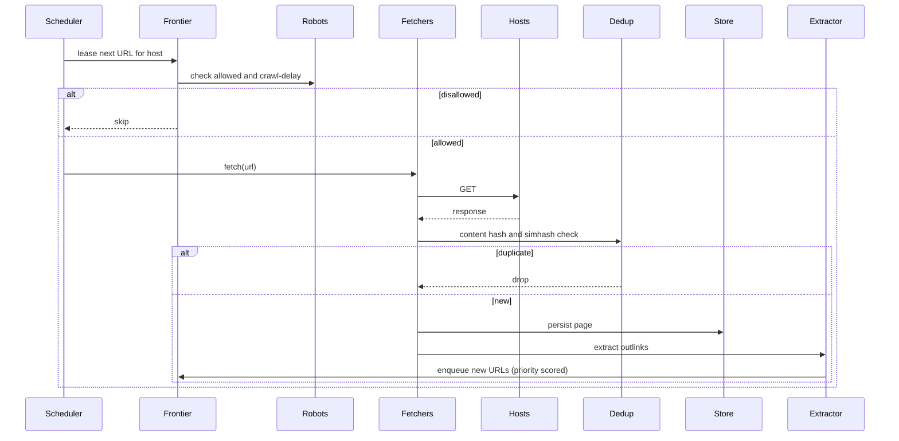
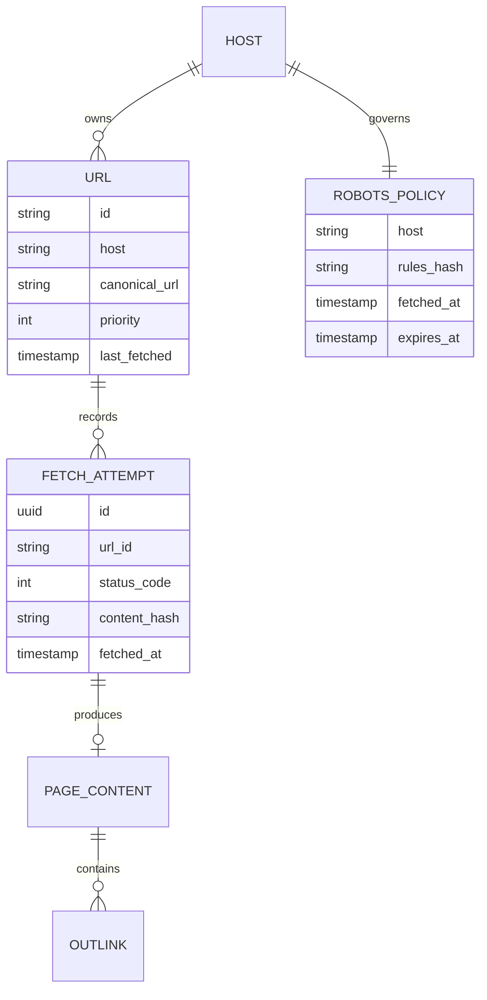

_Follows the [System Design Template](../00-system-design-template) — the reusable method behind every design in this library._

## 1. Interview prompt

Design a distributed crawler that discovers, fetches, and stores billions of URLs while honoring robots.txt and per-host politeness, deduplicates near-identical content, and avoids infinite crawl traps. AI may prioritize which pages to (re)crawl, but robots.txt compliance and per-host rate limits must remain deterministic guarantees, not model outputs.

## 2. Requirements and scope

### Functional requirements

| ID | Requirement | Priority | Interview significance |
|---|---|---|---|
| FR-1 | The system must submit seeds and policy for discoverable URLs. | Must | Defines the authoritative synchronous command boundary and its invariants. |
| FR-2 | The system must inspect crawl status, freshness, and indexed results. | Must | Defines the dominant read path, caches, indexes, and acceptable staleness. |
| FR-3 | The system must schedule polite fetches, parse content, deduplicate, and update the index. | Must | Separates durable acceptance from retryable fan-out and derived work. |
| FR-4 | The system must control allowlists, robots policy, egress, retries, and recrawl priority. | Should | Requires versioned configuration, least privilege, audit, and rollback. |

### Non-functional requirements

| Quality | Measurable target | Why it matters | Architecture consequence |
|---|---|---|---|
| Latency | fresh high-priority pages within minutes while respecting host budgets | Users experience this path directly. | Keep the critical path local, bounded, and independently scalable. |
| Availability | frontier and checkpoints survive worker or zone loss without duplicate storms | A partial infrastructure failure must have an explicit outcome. | Spread workloads across failure zones and define degradation before failover. |
| Correctness | robots, per-host politeness, canonicalization, and content deduplication are enforced | The system is not useful if its central invariant can be violated. | Use idempotency, ownership epochs, transactions, leases, or version checks where required. |
| Peak scale | coordinate billions of URLs with bounded per-host concurrency | Peak traffic and skew determine partitions and isolation. | Partition by the domain ownership key, autoscale on work, and reserve burst headroom. |
| Security and privacy | sandbox parsers, block private-network SSRF, isolate egress, and treat fetched content as untrusted | Abuse or data disclosure can outweigh availability. | Authenticate at the edge, authorize at the data boundary, encrypt, minimize, and audit. |

**Scope exclusions:** bypassing robots or authentication and executing arbitrary page instructions. **Assumptions:** DNS and HTTP are adversarial, fetch work is at-least-once, and indexing tolerates bounded delay.

## 3. Capacity estimate

At 10B pages/month, average throughput is ~3,860 fetches/s with bursty peaks near 40,000/s. Average page size ~100 KB raw HTML implies ~1 PB/month raw content, roughly 600 TB/month retained after compression and light replication. A 50B-entry URL-seen set needs a sharded structure sized around 400 GB (fingerprint-backed, tuned for a low false-positive rediscovery rate); a parallel content-fingerprint store for near-dup detection adds a comparable footprint.

## 4. API and event contracts

- `POST /v1/seeds {url, priority}` for operator-submitted seeds.
- Internal lease API: `GET /v1/frontier/lease?host=` returns the next allowed URL under the host's politeness budget.
- Events carry `eventId`, `occurredAt`, `schemaVersion`: `PageFetched{url, statusCode, contentHash, fetchedAt}`, `RobotsUpdated`, `URLDiscovered`.

## 5. System context

### Context component roles

| Component | Role |
|---|---|
| Search operator | Supplies seeds, policy, and priorities. |
| Index consumer | Reads fresh normalized documents. |
| Web crawler | Owns the product boundary, core policy, and durable outcome. |
| Public websites | Expose robots rules and crawlable content. |
| DNS resolver | Resolves hosts through controlled egress. |

## 6. Container architecture

### Container component roles

| Component | Role |
|---|---|
| Seed API | Accepts crawl scope and priority. |
| URL frontier | Partitions canonical URLs and next-fetch time. |
| Politeness scheduler | Enforces per-host budgets and robots. |
| Fetcher pool | Uses isolated public egress. |
| Parser sandbox | Extracts text, metadata, and links safely. |
| Dedup store | Rejects duplicate URL and content fingerprints. |
| Document stream | Decouples indexing and recrawl signals. |
| Search indexer | Publishes searchable documents. |

## 7. Component deep dive

The politeness scheduler holds one token bucket per host, caches robots.txt with a bounded TTL, honors any `Crawl-delay` directive, and applies exponential backoff on 429/5xx before leasing more work to that host. Discovered URLs are canonicalized, checked against the exact-match seen-set, then queued by host with a priority score; a max-depth and per-host URL budget caps crawler traps like infinite calendar or session-ID pagination.

## 8. Critical flow

## 9. Data model

## 10. Storage, partitioning, consistency, and caching

Partition the frontier by host hash so per-host politeness state stays co-located and rate-limit decisions never require cross-node coordination. Robots.txt is cached per host with a bounded TTL and refreshed lazily on expiry; the URL-seen set uses sharded, consistent-hashed bloom filters, accepting a small false-positive rediscovery cost in exchange for avoiding a global lock. Content is stored keyed by content hash so mirrors and republished pages collapse naturally; frontier priority ordering is eventually consistent across shards, but per-host rate-limit state must be strongly consistent within its shard.

## 11. Reliability and failure handling

A circuit breaker per host opens on repeated 5xx/timeouts and backs off; persistent DNS failure quarantines the host temporarily rather than retrying in a tight loop. Leased-but-unacknowledged URLs are re-queued after a lease timeout so a crashed fetcher never silently drops work. Dead links get capped retry attempts before being tombstoned, and crawler traps are bounded structurally (depth and per-host URL budget) rather than detected after the fact.

## 12. Security, privacy, moderation, and abuse prevention

Honor robots.txt and `noindex` meta directives; never crawl behind authentication or paywalls. Rate limits are tuned to avoid DoS-like load on small sites, and the user-agent string is honest (no cloaking to bypass robots rules). Malware/exploit signatures are scanned before storing executable content; a legal takedown blocklist is enforced pre-fetch; pages with exposed PII are scrubbed before entering the indexing pipeline.

## 13. AI architecture

A learned recrawl-priority model predicts change frequency and page value (from historical diffs and inlink/quality signals) to reorder recrawl scheduling within the existing politeness budget. A lightweight classifier tags language, category, and spam likelihood for the indexing pipeline. Both are advisory scores layered on top of the deterministic host-partitioned priority queue — they reorder it, they never replace or bypass it.

## 14. Model lifecycle, evaluation, and observability

Train the priority model on historical change-detection labels (diffs between successive fetches of the same URL); evaluate via a freshness-vs-fetch-budget curve and offline replay against a held-out host set. Shadow-score before it affects scheduling, canary by host segment, and monitor staleness distribution, spam-classifier precision/recall, domain-category drift, and inference latency kept separate from the fetch latency budget.

## 15. Cost controls and deterministic fallbacks

Cache DNS and robots.txt aggressively; score recrawl priority in offline nightly batches rather than per-URL online inference. Skip headless JS rendering unless a heuristic (script-to-content ratio, known SPA framework markers) flags the host as needing it. If the priority model is unavailable, priority falls back to a deterministic formula of inlink count, staleness since last fetch, and host tier — the crawl continues uninterrupted.

## 16. Trade-offs and alternatives

| Decision | Choice | Alternative and trigger |
|---|---|---|
| Frontier partitioning | host-hash sharding | random sharding only if cross-host politeness coordination becomes acceptable |
| Near-dup detection | simhash + Hamming threshold | full-text diff for a small, high-value corpus |
| JS rendering | heuristic subset, headless | render every page once compute budget allows |
| Recrawl priority | learned model over deterministic base | static inlink-count/PageRank-style scoring for MVP or model outage |

## 17. Phased evolution

MVP is a single-node BFS crawler with a static seed list, robots.txt compliance, and exact-match dedup. Phase 2 distributes the frontier by host shard with DNS caching and backoff. Phase 3 adds simhash near-duplicate detection and headless rendering for JS-heavy hosts. Phase 4 adds the learned recrawl-priority model and spam/quality classifiers with shadow and canary rollout.

## 18. 45-minute interview walkthrough

Spend 5 minutes on scope, 5 on capacity estimate, 10 on frontier/politeness design and the container diagram, 10 on dedup and the fetch sequence, 5 on partitioning/storage, 5 on abuse/legal constraints, and 5 on AI prioritization and its fallback.

## 19. Follow-up questions and key takeaways

How do you avoid crawler traps like infinite calendar pages? How does per-host politeness scale across thousands of fetcher nodes without a central bottleneck? How do you detect near-duplicate content across mirrors? The key insight is to partition by host so politeness state stays local and correctness-first, treating dedup and prioritization as optimizations layered on top rather than the crawl's foundation.

## 20. References

- [RFC 9309: Robots Exclusion Protocol](https://www.rfc-editor.org/rfc/rfc9309.html)
- [Mercator: A Scalable, Extensible Web Crawler (Heydon and Najork)](https://courses.cs.washington.edu/courses/cse454/15wi/papers/mercator.pdf)
- [Google Search Central: How Googlebot crawls](https://developers.google.com/search/docs/crawling-indexing/googlebot)
