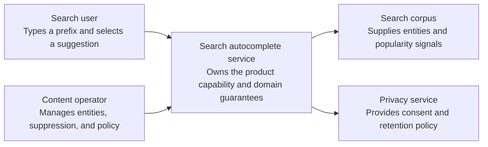
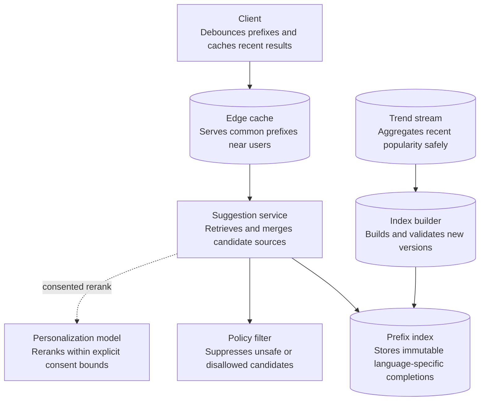
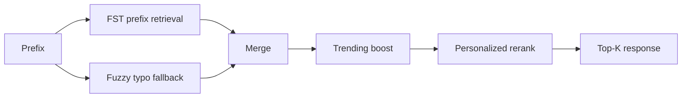
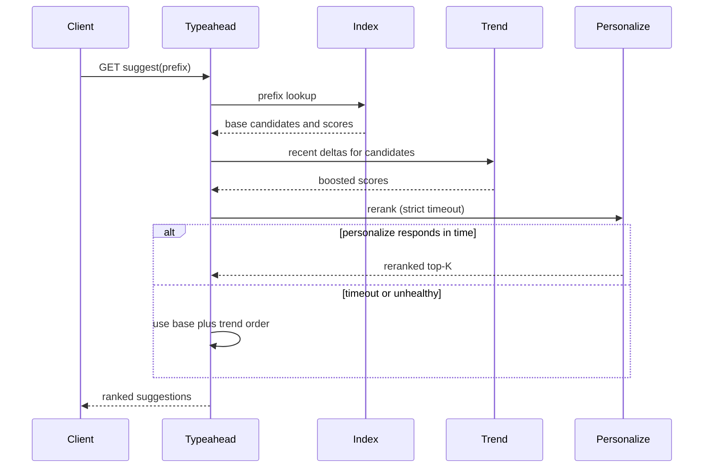
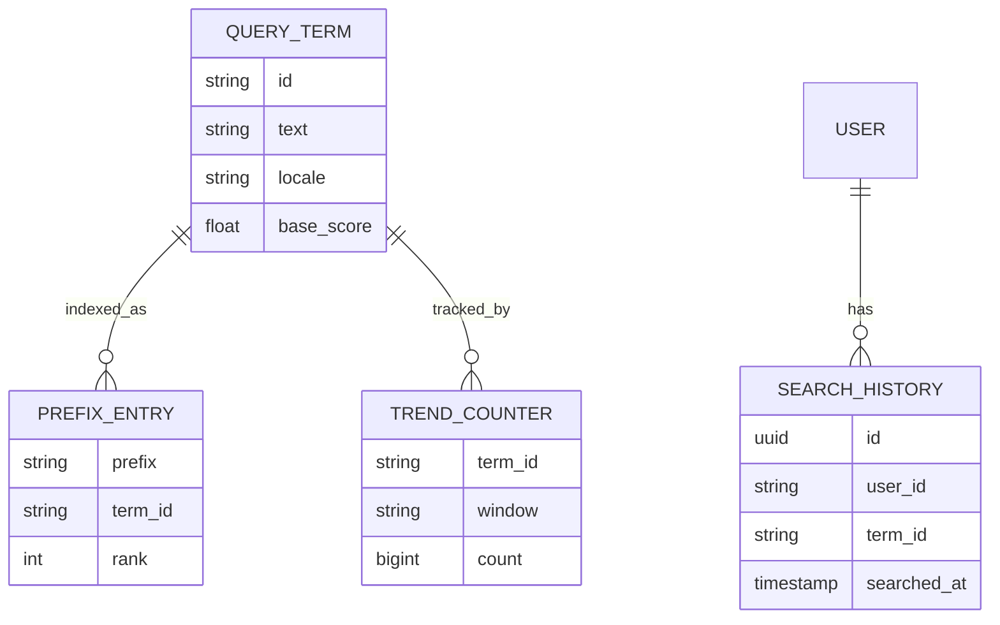

_Follows the [System Design Template](../00-system-design-template) — the reusable method behind every design in this library._

## 1. Interview prompt

Design a typeahead service that returns ranked query suggestions as a user types, blending global popularity, trending queries, typo tolerance, and personalization — while p99 latency stays under 100ms even when personalization or the ranking model is unavailable.

## 2. Requirements and scope

### Functional requirements

| ID | Requirement | Priority | Interview significance |
|---|---|---|---|
| FR-1 | The system must publish and retire query, entity, and policy signals. | Must | Defines the authoritative synchronous command boundary and its invariants. |
| FR-2 | The system must return ranked prefix completions within a keystroke budget. | Must | Defines the dominant read path, caches, indexes, and acceptable staleness. |
| FR-3 | The system must aggregate trends, build indexes, evaluate safety, and atomically publish versions. | Must | Separates durable acceptance from retryable fan-out and derived work. |
| FR-4 | The system must manage languages, suppression, experiments, and rollback. | Should | Requires versioned configuration, least privilege, audit, and rollback. |

### Non-functional requirements

| Quality | Measurable target | Why it matters | Architecture consequence |
|---|---|---|---|
| Latency | p99 suggestion response below 50 ms from the nearest serving region | Users experience this path directly. | Keep the critical path local, bounded, and independently scalable. |
| Availability | 99.99% serving availability with last-known-good index fallback | A partial infrastructure failure must have an explicit outcome. | Spread workloads across failure zones and define degradation before failover. |
| Correctness | suppressed or unsafe terms disappear within the declared invalidation bound | The system is not useful if its central invariant can be violated. | Use idempotency, ownership epochs, transactions, leases, or version checks where required. |
| Peak scale | serve millions of requests/s with strong prefix hot spots | Peak traffic and skew determine partitions and isolation. | Partition by the domain ownership key, autoscale on work, and reserve burst headroom. |
| Security and privacy | minimize raw query retention, protect children and sensitive terms, and prevent trend manipulation | Abuse or data disclosure can outweigh availability. | Authenticate at the edge, authorize at the data boundary, encrypt, minimize, and audit. |

**Scope exclusions:** full search-result ranking and storing identifiable query histories indefinitely. **Assumptions:** indexes are immutable by version, personalization is consent-bounded, and serving never calls a large model synchronously.

## 3. Capacity estimate

At 200M DAU averaging 3 searches/session and ~5 keystroke-triggered suggestion calls per search, suggestion traffic is ~3B requests/day: ~35,000/s average, ~350,000/s peak — several times the underlying search QPS. A 1B-entry query dictionary at ~20 bytes/entry is a ~20 GB base structure, small enough to replicate fully in memory per regional shard. Trending counters use sliding-window sketches (e.g. Count-Min Sketch) sized at a few hundred MB per region, refreshed continuously.

## 4. API and event contracts

- `GET /v1/suggest?q=<prefix>&locale=&sessionId=` → `{suggestions: [{text, score, source}]}`.
- Events: `QuerySubmitted` (feeds the offline popularity index), `SuggestionShown`, `SuggestionClicked` (sampled, feeds reranking training with position-bias correction).

## 5. System context

### Context component roles

| Component | Role |
|---|---|
| Search user | Types a prefix and selects a suggestion. |
| Content operator | Manages entities, suppression, and policy. |
| Search autocomplete service | Owns the product boundary, core policy, and durable outcome. |
| Search corpus | Supplies entities and popularity signals. |
| Privacy service | Provides consent and retention policy. |

## 6. Container architecture

### Container component roles

| Component | Role |
|---|---|
| Client | Debounces prefixes and caches recent results. |
| Edge cache | Serves common prefixes near users. |
| Suggestion service | Retrieves and merges candidate sources. |
| Prefix index | Stores immutable language-specific completions. |
| Trend stream | Aggregates recent popularity safely. |
| Index builder | Builds and validates new versions. |
| Policy filter | Suppresses unsafe or disallowed candidates. |
| Personalization model | Reranks within explicit consent bounds. |

## 7. Component deep dive

The base structure is a weighted FST/trie built offline from aggregated, privacy-filtered query logs, mapping each prefix to its top-K completions with a static popularity score. The online layer retrieves candidates from that structure, merges in a bounded edit-distance/fuzzy-index expansion for typo tolerance, applies a trending-counter boost from recent deltas, and only then, within a tight timeout, asks a personalization reranker to reorder the set.

## 8. Critical flow

## 9. Data model

## 10. Storage, partitioning, consistency, and caching

The base FST/trie is built in offline batch (hourly or daily) from aggregated logs, partitioned by locale/language, and fully replicated in memory to every regional edge node — read-heavy and small enough that eventual consistency at an hours-old freshness is acceptable for the base layer. Trending counters live in a separate fast-path streaming store refreshed every few seconds, layered on top of the base index rather than triggering a rebuild. Personalization features are cached per session with a short TTL.

## 11. Reliability and failure handling

If personalization or the trend service misses its latency budget (roughly 10-15ms), the service falls back to base-plus-trend ranking rather than blocking or erroring. A failed regional index replica fails over to the nearest healthy region at slightly higher latency. Index rebuild failures keep serving the last known-good snapshot indefinitely via atomic pointer swap — a partially built index never goes live.

## 12. Security, privacy, moderation, and abuse prevention

A filter plus deny-list strips PII-shaped and self-harm-adjacent query patterns before they enter the popularity index. Suggestions for terms below a minimum distinct-user threshold are suppressed (k-anonymity) so one person's rare query never leaks through autocomplete. Per-client rate limiting blocks suggestion scraping; offensive or hateful terms are blocklisted with a human-reviewed appeals path.

## 13. AI architecture

An offline-trained ranking model (gradient-boosted trees or a small learned-to-rank model) reorders the retrieved candidate set using historical CTR, session context, and semantic-similarity features for related-query expansion. It sits strictly behind the deterministic base-index retrieval and runs as a bounded-timeout advisory reranker — it is never on the retrieval path itself.

## 14. Model lifecycle, evaluation, and observability

Train on sampled impression/click logs with position-bias correction; evaluate offline via NDCG/MRR against held-out sessions, then online via A/B on suggestion click-through and zero-result rate. Shadow-score before serving, canary by locale, and monitor rerank-vs-base agreement rate, latency-budget adherence, and drift in trending vocabulary; trace inference calls with request IDs correlated to search sessions.

## 15. Cost controls and deterministic fallbacks

Personalization reranking only fires after the cheap base-plus-trend lookup returns candidates, so it is trivially skippable under load. Reranked results are cached per (user-cohort, prefix) briefly to absorb repeat-keystroke traffic, and embeddings for related-query expansion are precomputed offline in batch. A strict timeout always returns the deterministic popularity-ranked list, keeping suggestion serving fully independent of model availability.

## 16. Trade-offs and alternatives

| Decision | Choice | Alternative and trigger |
|---|---|---|
| Base structure | offline-built FST/trie | on-the-fly inverted index if update latency must be near-real-time |
| Typo tolerance | bounded edit-distance fuzzy index | n-gram index if mid-string typos dominate |
| Trending | streaming Count-Min Sketch | periodic batch recompute for lower-traffic locales |
| Reranking | learned model over deterministic base | popularity-only ranking for MVP or model outage |

## 17. Phased evolution

MVP is a static trie built nightly from logs with frequency-only ranking and no personalization. Phase 2 adds streaming trend counters and typo tolerance. Phase 3 adds a learned reranking model with offline and online evaluation. Phase 4 adds multi-region replication, k-anonymity filtering, and semantic related-query expansion.

## 18. 45-minute interview walkthrough

Spend 5 minutes on scope, 5 on capacity estimate, 10 on the base index design and container diagram, 10 on the candidate pipeline and request sequence, 5 on storage/caching, 5 on privacy (k-anonymity), and 5 on reranking and its fallback.

## 19. Follow-up questions and key takeaways

How would you rebuild the index without a latency blip? How do you prevent a single rare or embarrassing query from leaking via suggestions? How would you handle a sudden breaking-news trending spike? The key insight is separating an offline, eventually-consistent base popularity index from thin, fast online layers — trending and personalization — that are always safe to skip.

## 20. References

- [Engineering at Meta: The Life of a Typeahead Query](https://engineering.fb.com/2010/05/17/web/the-life-of-a-typeahead-query/)
- [Elasticsearch Reference: Completion Suggester](https://www.elastic.co/docs/reference/elasticsearch/rest-apis/search-suggesters)
