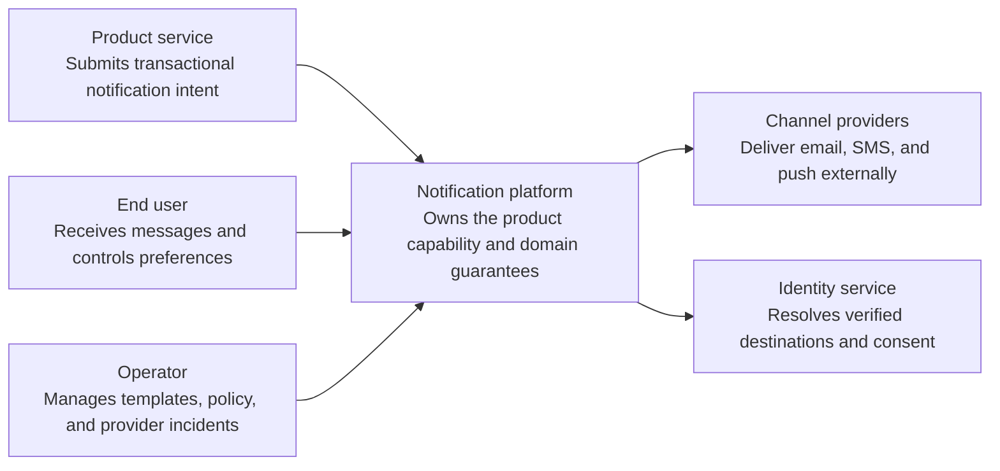
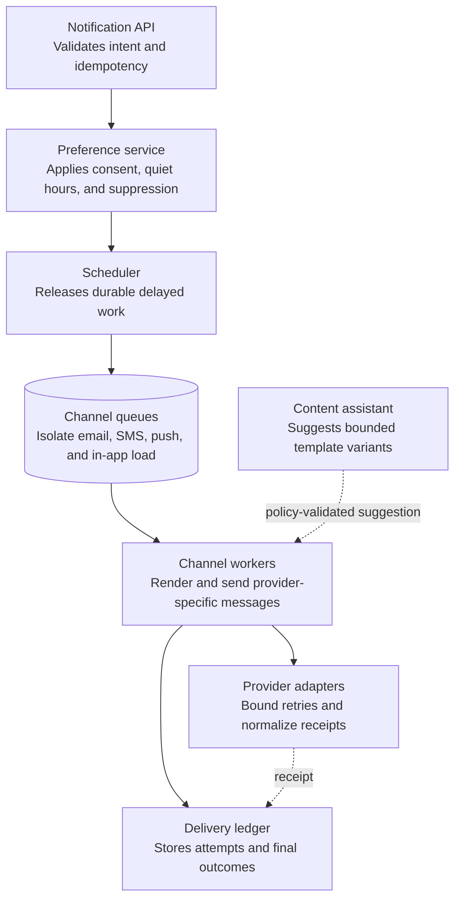
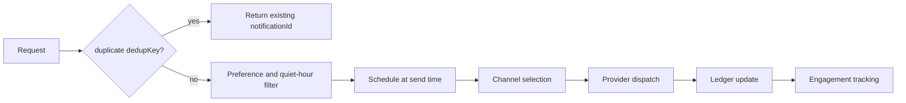
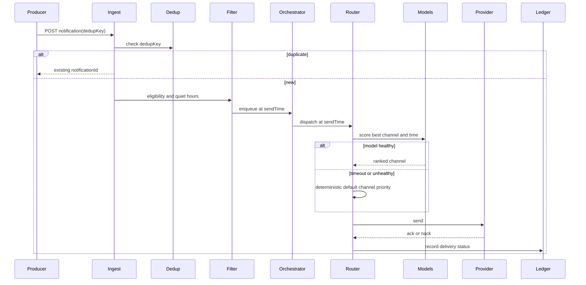
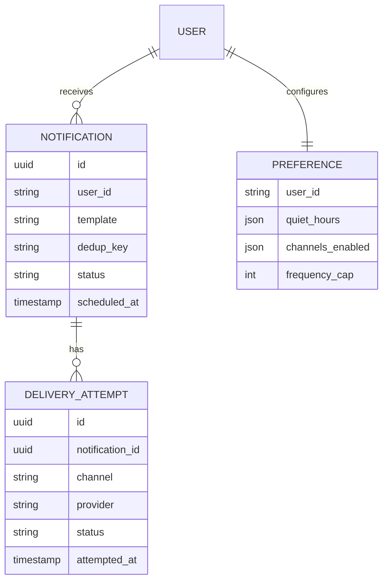

_Follows the [System Design Template](../00-system-design-template) — the reusable method behind every design in this library._

## 1. Interview prompt

Design a notification platform that fans events out across push, SMS, and email, respects per-user rate limits, quiet hours, and preferences, guarantees at-least-once delivery with dedup, and fails over between providers — with an ML layer that predicts optimal send time and channel but never blocks or drops a notification if it is unavailable.

## 2. Requirements and scope

### Functional requirements

| ID | Requirement | Priority | Interview significance |
|---|---|---|---|
| FR-1 | The system must submit, schedule, cancel, and query a notification intent. | Must | Defines the authoritative synchronous command boundary and its invariants. |
| FR-2 | The system must return delivery state and user preference outcome. | Must | Defines the dominant read path, caches, indexes, and acceptable staleness. |
| FR-3 | The system must fan out channel work, retry providers, suppress duplicates, and record receipts. | Must | Separates durable acceptance from retryable fan-out and derived work. |
| FR-4 | The system must manage templates, channel policy, quiet hours, quotas, and provider health. | Should | Requires versioned configuration, least privilege, audit, and rollback. |

### Non-functional requirements

| Quality | Measurable target | Why it matters | Architecture consequence |
|---|---|---|---|
| Latency | transactional notifications enqueue below 200 ms and urgent delivery begins within seconds | Users experience this path directly. | Keep the critical path local, bounded, and independently scalable. |
| Availability | 99.99% intent acceptance with durable schedules and no duplicate user-visible send | A partial infrastructure failure must have an explicit outcome. | Spread workloads across failure zones and define degradation before failover. |
| Correctness | idempotency, preference, suppression, and per-channel ordering policy are enforced | The system is not useful if its central invariant can be violated. | Use idempotency, ownership epochs, transactions, leases, or version checks where required. |
| Peak scale | handle burst campaigns across email, SMS, push, and in-app channels | Peak traffic and skew determine partitions and isolation. | Partition by the domain ownership key, autoscale on work, and reserve burst headroom. |
| Security and privacy | protect contact data, restrict templates, verify webhooks, and prevent spam abuse | Abuse or data disclosure can outweigh availability. | Authenticate at the edge, authorize at the data boundary, encrypt, minimize, and audit. |

**Scope exclusions:** marketing campaign authoring and building telecom or email provider networks. **Assumptions:** providers are unreliable external dependencies, channels differ in guarantees, and AI copy is never sent without policy validation.

## 3. Capacity estimate

At 100M users averaging 5 notifications/user/day, volume is 500M/day: ~5,800/s average, ~58,000/s peak during major events. Each notification is roughly 1 KB of payload and metadata, so raw event volume is ~500 GB/day; the delivery ledger (attempts plus retries) roughly doubles that to ~1 TB/day. Provider throughput differs sharply by channel — push (APNs/FCM) tolerates very high sustained rates, while SMS gateways are typically rate-capped per number pool — so SMS needs its own admission control separate from push.

## 4. API and event contracts

- `POST /v1/notifications {userId, template, data, channelsHint?, dedupKey}` → `{notificationId, status: queued}`.
- Events carry `eventId`, `occurredAt`, `schemaVersion`: `NotificationRequested`, `ChannelSelected`, `DeliveryAttempted{provider, status}`, `DeliveryConfirmed`/`DeliveryFailed`, `UserEngaged{open|click}`.
- `dedupKey` plus an idempotency key on ingest guarantee a retried producer request never results in a duplicate send.

## 5. System context

### Context component roles

| Component | Role |
|---|---|
| Product service | Submits transactional notification intent. |
| End user | Receives messages and controls preferences. |
| Operator | Manages templates, policy, and provider incidents. |
| Notification platform | Owns the product boundary, core policy, and durable outcome. |
| Channel providers | Deliver email, SMS, and push externally. |
| Identity service | Resolves verified destinations and consent. |

## 6. Container architecture

### Container component roles

| Component | Role |
|---|---|
| Notification API | Validates intent and idempotency. |
| Preference service | Applies consent, quiet hours, and suppression. |
| Scheduler | Releases durable delayed work. |
| Channel queues | Isolate email, SMS, push, and in-app load. |
| Channel workers | Render and send provider-specific messages. |
| Provider adapters | Bound retries and normalize receipts. |
| Delivery ledger | Stores attempts and final outcomes. |
| Content assistant | Suggests bounded template variants. |

## 7. Component deep dive

The preference and rate-limit filter checks per-user frequency caps, timezone-aware quiet hours, opt-outs, and topic subscriptions before a notification is scheduled at all. The orchestrator holds notifications in a durable delay queue until send time, then hands off to channel-specific dispatch workers that apply provider-specific batching and backoff independently per channel.

## 8. Critical flow

## 9. Data model

## 10. Storage, partitioning, consistency, and caching

Partition notifications and the delivery ledger by `user_id` hash so per-user rate-limit and dedup checks stay local and never require cross-shard coordination. Dedup keys live in a fast KV with a bounded TTL (e.g. 24h) and conditional-write/compare-and-set semantics, giving effectively-once enqueue on top of an at-least-once producer. Preference data is cached at the edge with a short TTL, invalidated on write; delivery status is eventually consistent across channels, but the dedup and rate-limit check must be strongly consistent per user.

## 11. Reliability and failure handling

Each provider sits behind its own circuit breaker with automatic failover — e.g. a primary SMS gateway outage shifts traffic to a secondary gateway pool. Retries use bounded exponential backoff with jitter; permanently failing sends move to a dead-letter queue with alerting. Producer-to-ingest delivery uses an outbox pattern for at-least-once semantics, and downstream dedup absorbs producer retries so a user never receives a duplicate push for the same event.

## 12. Security, privacy, moderation, and abuse prevention

PII (phone numbers, email addresses) is encrypted at rest and in transit, and sensitive payload content is redacted from general logs. Unsubscribe/opt-out compliance (CAN-SPAM, TCPA) is enforced as a hard block that bypasses even override flags. Producer services are rate-limited to prevent notification storms, and consent scopes are tracked per channel (marketing vs. transactional) so a transactional integration can never silently escalate into marketing sends.

## 13. AI architecture

A send-time and channel-selection model predicts, per user, the engagement-maximizing delivery time and channel using historical open/click/response features; the orchestrator queries it as an advisory scoring step under a strict timeout before falling back to defaults. A separate lightweight model may personalize notification copy or subject lines, but it never alters the timing or content of transactional or security-critical notifications.

## 14. Model lifecycle, evaluation, and observability

Train the send-time/channel model on delayed engagement labels within a bounded attribution window; evaluate via offline replay plus online A/B on engagement rate and unsubscribe rate. Shadow-score before serving, canary by user segment, and track prediction-vs-default agreement rate, latency-budget adherence, fairness across channel-availability segments (e.g. users without a smartphone), and drift. Trace scoring calls with OpenTelemetry, correlated to notification IDs.

## 15. Cost controls and deterministic fallbacks

Batch-score send-time predictions offline where latency allows rather than per-notification online inference; cache per-user channel-preference scores with periodic refresh. Reserve SMS — the highest per-message cost channel — as a fallback rather than a default. If the send-time/channel model is unavailable or times out, dispatch immediately via the user's deterministic default-channel priority list (push, then email, then SMS) and default schedule, keeping core delivery fully operational.

## 16. Trade-offs and alternatives

| Decision | Choice | Alternative and trigger |
|---|---|---|
| Dedup | KV with conditional write, bounded TTL | in-memory dedup only for small scale before durability matters |
| Scheduling | durable delay queue | synchronous immediate send for MVP with no scheduling need |
| Channel selection | learned model over deterministic default | fixed priority list only, until engagement data justifies a model |
| Provider strategy | circuit breaker + secondary pool per channel | single provider per channel until outage frequency demands failover |

## 17. Phased evolution

MVP supports a single channel (push), synchronous send, and static preferences. Phase 2 adds SMS/email, provider failover, dedup, and rate limiting. Phase 3 adds the durable scheduling orchestrator and delivery ledger. Phase 4 adds the send-time/channel optimization model with shadow and canary rollout.

## 18. 45-minute interview walkthrough

Spend 5 minutes on scope, 5 on capacity estimate, 10 on ingest/dedup/preference filtering and the container diagram, 10 on the dispatch sequence and provider failover, 5 on reliability, 5 on privacy/compliance, and 5 on send-time optimization and its fallback.

## 19. Follow-up questions and key takeaways

How do you guarantee exactly-once user-visible delivery on top of at-least-once infrastructure? How would you handle a provider-wide outage like APNs going down at 2am? How do quiet hours interact with urgent security alerts? The key insight is that delivery guarantees, rate limiting, and provider failover form the deterministic backbone, while AI is purely an optional scoring layer bounded by a strict timeout.

## 20. References

- [Uber Engineering: How Uber Optimizes the Timing of Push Notifications using ML and Linear Programming](https://www.uber.com/en-US/blog/how-uber-optimizes-push-notifications-using-ml/)
- [Apple Developer Documentation: Sending notification requests to APNs](https://developer.apple.com/documentation/usernotifications/sending-notification-requests-to-apns)
- [Firebase Cloud Messaging documentation](https://firebase.google.com/docs/cloud-messaging)
