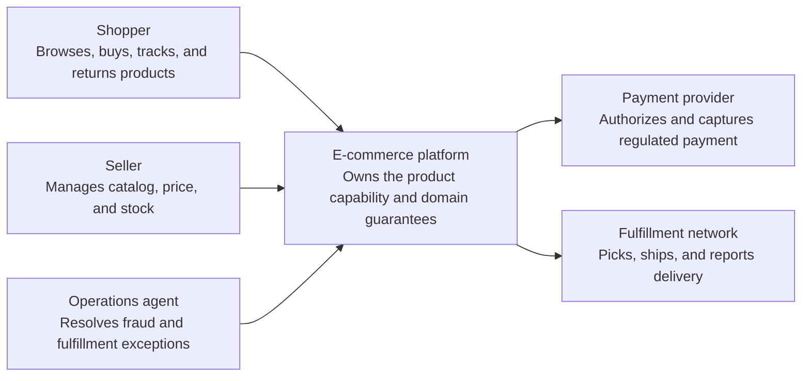
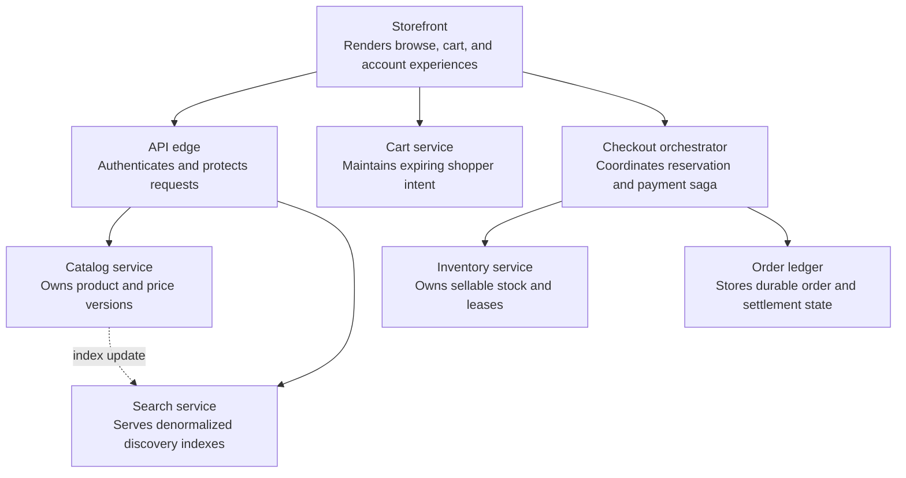
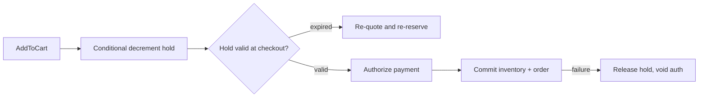
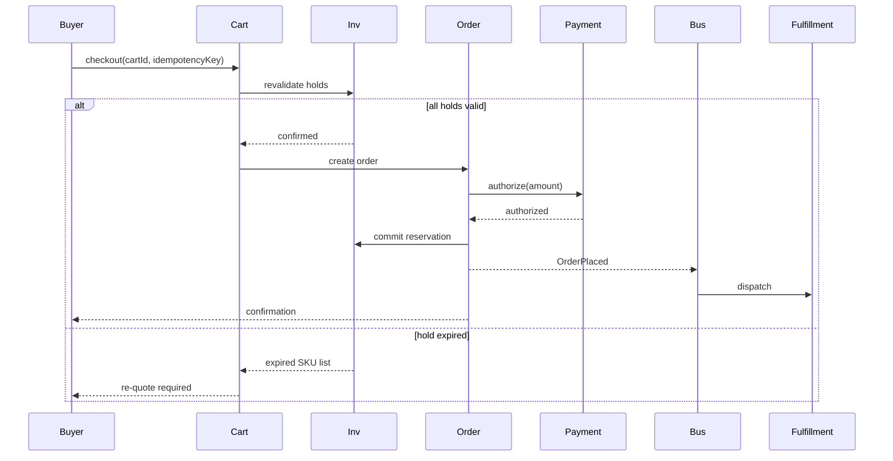
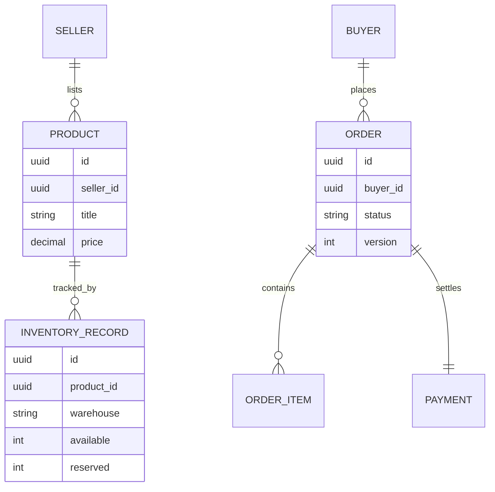

_Follows the [System Design Template](../00-system-design-template) — the reusable method behind every design in this library._

## 1. Interview prompt

Design an e-commerce platform where sellers list products, buyers search/browse, carts hold time-limited reservations, checkout debits inventory and money exactly once, and orders flow through fulfillment. Ranking and recommendations use models; inventory correctness and payment must not depend on them.

## 2. Requirements and scope

### Functional requirements

| ID | Requirement | Priority | Interview significance |
|---|---|---|---|
| FR-1 | The system must manage catalog, cart, checkout, order, return, and fulfillment state. | Must | Defines the authoritative synchronous command boundary and its invariants. |
| FR-2 | The system must browse searchable catalog, price, availability, cart, and order status. | Must | Defines the dominant read path, caches, indexes, and acceptable staleness. |
| FR-3 | The system must index products, reserve inventory, capture payment, notify fulfillment, and recommend items. | Must | Separates durable acceptance from retryable fan-out and derived work. |
| FR-4 | The system must manage sellers, fraud, disputes, promotions, and fulfillment exceptions. | Should | Requires versioned configuration, least privilege, audit, and rollback. |

### Non-functional requirements

| Quality | Measurable target | Why it matters | Architecture consequence |
|---|---|---|---|
| Latency | catalog p99 below 300 ms and checkout command acceptance below 1 second | Users experience this path directly. | Keep the critical path local, bounded, and independently scalable. |
| Availability | 99.99% browse availability and 99.95% checkout availability | A partial infrastructure failure must have an explicit outcome. | Spread workloads across failure zones and define degradation before failover. |
| Correctness | price snapshot, inventory reservation, order state, and payment capture reconcile exactly once | The system is not useful if its central invariant can be violated. | Use idempotency, ownership epochs, transactions, leases, or version checks where required. |
| Peak scale | serve flash-sale hot products and globally read-heavy catalog traffic | Peak traffic and skew determine partitions and isolation. | Partition by the domain ownership key, autoscale on work, and reserve burst headroom. |
| Security and privacy | isolate seller data, tokenize payment, prevent account takeover, and audit price/inventory changes | Abuse or data disclosure can outweigh availability. | Authenticate at the edge, authorize at the data boundary, encrypt, minimize, and audit. |

**Scope exclusions:** warehouse robotics, ad auctions, and proprietary marketplace internals. **Assumptions:** catalog tolerates staleness, checkout uses a regional writer, and recommendations have deterministic fallback.

## 3. Capacity estimate

At 50M daily active shoppers and a 3% search-to-cart rate, baseline cart creation is roughly 175/s, with flash-sale peaks reaching 3.5k/s on a handful of hot SKUs. A 10M-SKU catalog with 2 KB of indexed attributes per item is about 20 GB of index data, replicated across shards for sub-300ms query fanout. Inventory counters for hot SKUs must sustain tens of thousands of conditional decrements per second without lock contention collapsing throughput.

## 4. API and event contracts

- `POST /v1/cart/items {sku, qty}` creates a reservation hold with a TTL and returns `{holdId, expiresAt}`; the hold is a conditional decrement, not a display estimate.
- `POST /v1/orders {cartId, idempotencyKey, paymentToken}` commits holds into an order only if all holds are still valid; expired holds force a re-quote.
- Events carry `eventId`, `occurredAt`, `schemaVersion`: `InventoryReserved`, `InventoryReleased`, `OrderPlaced`, `PaymentCaptured`, `OrderShipped`, `OrderCancelled`.

## 5. System context

### Context component roles

| Component | Role |
|---|---|
| Shopper | Browses, buys, tracks, and returns products. |
| Seller | Manages catalog, price, and stock. |
| Operations agent | Resolves fraud and fulfillment exceptions. |
| E-commerce platform | Owns the product boundary, core policy, and durable outcome. |
| Payment provider | Authorizes and captures regulated payment. |
| Fulfillment network | Picks, ships, and reports delivery. |

## 6. Container architecture

### Container component roles

| Component | Role |
|---|---|
| Storefront | Renders browse, cart, and account experiences. |
| API edge | Authenticates and protects requests. |
| Catalog service | Owns product and price versions. |
| Search service | Serves denormalized discovery indexes. |
| Cart service | Maintains expiring shopper intent. |
| Checkout orchestrator | Coordinates reservation and payment saga. |
| Inventory service | Owns sellable stock and leases. |
| Order ledger | Stores durable order and settlement state. |

## 7. Component deep dive

The inventory ledger exposes an atomic conditional-decrement primitive (available -= qty where available >= qty) per SKU-warehouse pair, backed by a single-writer partition to avoid lost updates under contention. Cart holds are soft reservations with a short TTL (minutes) that expire back into available stock via a sweeper; checkout re-validates every hold before committing. The order saga then coordinates payment authorization, inventory commit, and fulfillment dispatch, compensating (releasing inventory, voiding payment) on any step failure.

## 8. Critical flow

## 9. Data model

## 10. Storage, partitioning, consistency, and caching

Partition the inventory ledger by SKU-warehouse with single-writer semantics per partition so conditional decrements are linearizable without cross-partition coordination; catalog and order data use regional relational stores with optimistic concurrency (version column) for order state transitions. The search index is a denormalized, eventually-consistent projection rebuilt from catalog/inventory events, refreshed on a short lag (seconds) rather than serving as the source of truth for availability. Product detail pages cache aggressively (CDN, minutes-scale TTL) while the "add to cart" path always reads live inventory.

## 11. Reliability and failure handling

Hold expiry sweepers and idempotency keys make retried checkouts safe; the order saga uses an outbox and compensating transactions (inventory release, payment void) so a mid-flow crash never leaves debited inventory without a corresponding order or payment. Under flash-sale overload, admission control queues checkout requests per hot SKU rather than letting them all race the same partition, and search/ranking degrade before cart/checkout do. Payment provider outages pause new order creation rather than accepting orders with unauthorized payment.

## 12. Security, privacy, moderation, and abuse prevention

Tokenize payment instruments, encrypt PII at rest, and scope seller access to their own catalog and order data. Detect fake reviews, counterfeit listings, and inventory-hoarding bots (rapid repeated holds without checkout) with rules plus reviewed classifiers. Listing takedowns, account suspension, and large refunds remain human-reviewed decisions with an audit trail and seller appeal path.

## 13. AI architecture

Search ranking and recommendations blend a learned relevance/personalization model over a lexical+vector retrieval base with business signals (price, margin, in-stock status). A separate moderation classifier flags likely-fake reviews and counterfeit listings for human review. None of the AI path touches the inventory ledger or payment authorization — it only influences what buyers see and in what order.

## 14. Model lifecycle, evaluation, and observability

Evaluate ranking offline against historical click/purchase logs (NDCG, conversion lift) before online A/B tests; shadow new rankers against production traffic before ramping. Track search latency, click-through and conversion by segment, recommendation diversity, moderation precision/recall, and override rate. Trace ranking requests with OpenTelemetry so a bad ranker version can be isolated and rolled back quickly.

## 15. Cost controls and deterministic fallbacks

Cache embeddings and precomputed candidate sets for popular queries; batch recommendation refresh rather than computing per-request for cold users. If the ranking service times out or degrades, fall back to a deterministic ranking (best-seller rank, review count, in-stock first) computed offline and refreshed periodically — search remains usable, just less personalized. Checkout, inventory, and payment paths have no model dependency at all.

## 16. Trade-offs and alternatives

| Decision | Choice | Alternative and trigger |
|---|---|---|
| Inventory correctness | conditional decrement with TTL holds | pessimistic per-SKU lock queue when hold-expiry churn dominates hot SKUs |
| Order consistency | saga with compensation | distributed transaction only if all services share one datastore |
| Search freshness | async index projection, seconds lag | synchronous dual-write if buyers require sub-second availability accuracy |
| Ranking | learned model with deterministic fallback | pure rules-based ranking for MVP or low-traffic catalogs |

## 17. Phased evolution

MVP uses a single-region relational catalog/order store, simple lexical search, and best-seller ranking. Phase 2 adds a dedicated search index, cart holds with TTL, and an order saga. Phase 3 adds learned ranking/recommendations and moderation classifiers. Phase 4 adds regional partitioning, flash-sale admission control, and shadow-evaluated ranking rollouts.

## 18. 45-minute interview walkthrough

Spend 5 minutes on scope, 5 on capacity/hot-SKU estimation, 10 on the reservation model and order saga, 10 on the checkout sequence and container diagram, 5 on reliability/security, and 10 on ranking, fallbacks, and trade-offs.

## 19. Follow-up questions and key takeaways

How do you prevent two concurrent checkouts from both committing the last unit of a hot SKU? What happens if the payment provider times out after inventory is committed? How would you handle a seller's own warehouse going offline? The key insight is to make inventory and payment strongly consistent through explicit reservations and sagas, and keep AI ranking strictly advisory with a deterministic, always-available fallback.

## 20. References

- [Implement resource counters with Amazon DynamoDB](https://aws.amazon.com/blogs/database/implement-resource-counters-with-amazon-dynamodb/)
- [Dynamo: Amazon's Highly Available Key-value Store (SOSP 2007)](https://www.allthingsdistributed.com/files/amazon-dynamo-sosp2007.pdf)
- [OpenTelemetry generative AI semantic conventions](https://opentelemetry.io/docs/specs/semconv/how-to-write-conventions/)
