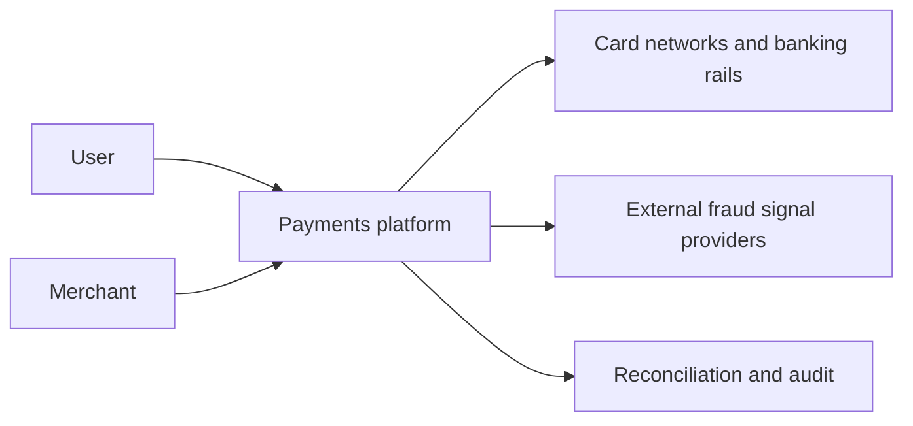
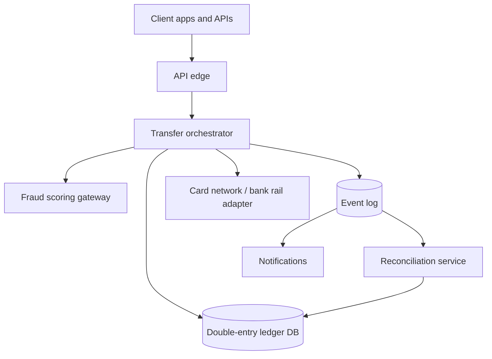
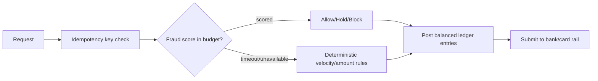
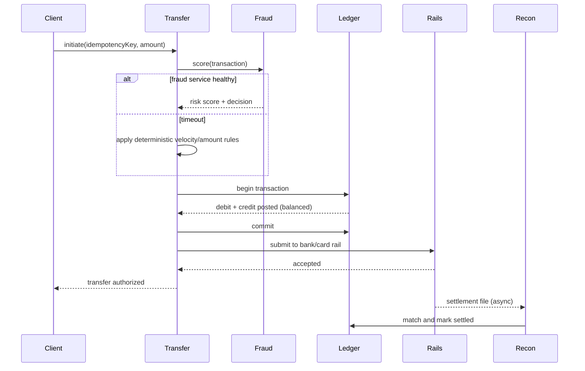
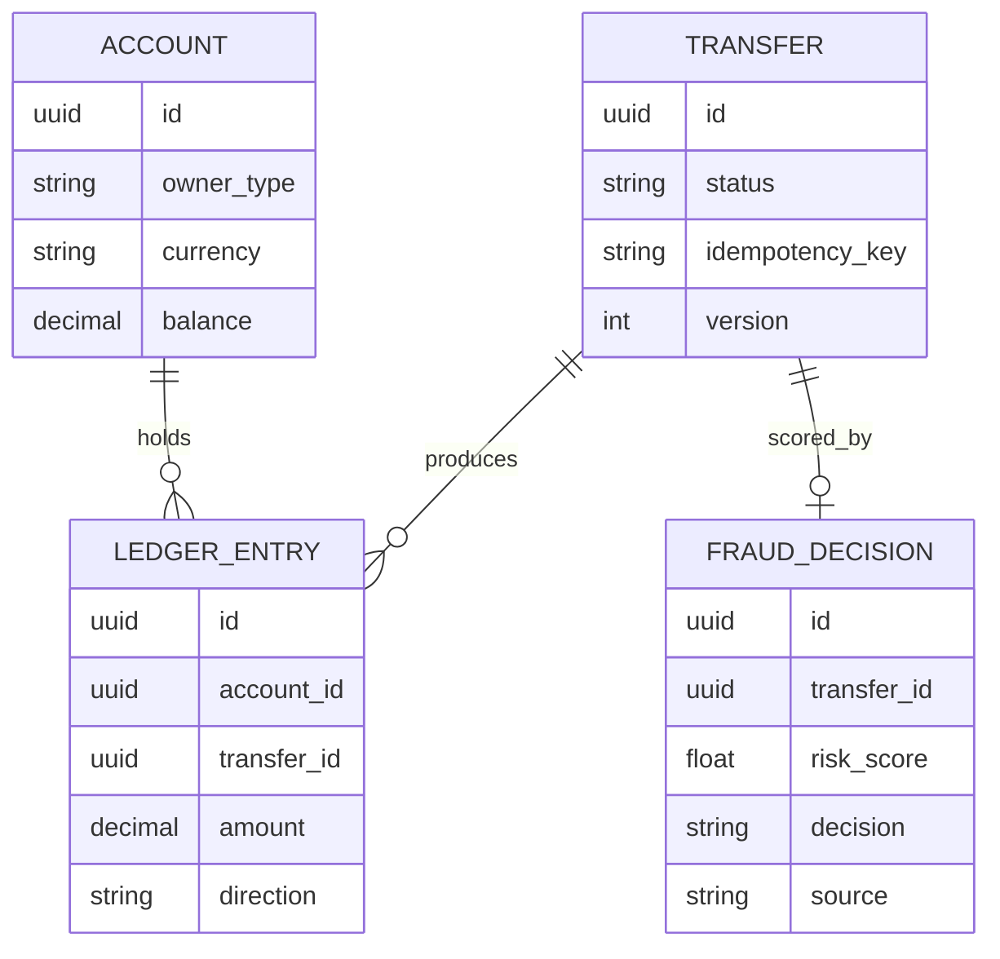

_Follows the [System Design Template](/system-design/00-system-design-template) — the reusable method behind every design in this library._

## 1. Interview prompt

Design a payments platform that holds account balances, moves money between accounts and external processors exactly once, reconciles against those processors, and scores transactions for fraud in real time — without ever double-charging, losing money, or letting a model decide whether to move money.

## 2. Requirements and scope

**Functional:** create accounts, hold balances, initiate transfers/charges/payouts, record every movement as balanced double-entry, reconcile against external processor statements, flag/hold suspicious transactions. **Non-functional:** every transaction is exactly-once and auditable, balances are strongly consistent, p99 transfer decision under 300 ms, full replayability for audits. Exclude currency-exchange trading and card-issuing/BIN sponsorship mechanics.

## 3. Capacity estimate

At 5M transactions/day, average throughput is roughly 60/s with peaks (paydays, promotions) around 10x at 600/s. Each transaction produces at least two ledger entries (debit + credit) plus metadata, so at ~1 KB per entry pair, daily ledger growth is about 10 GB, or roughly 3.6 TB/year before replication — small enough to keep entries in a durable relational store rather than a data lake. Fraud scoring must complete within the authorization latency budget (typically under 100-200 ms) since it sits in the synchronous charge path.

## 4. API and event contracts

- `POST /v1/transfers` requires a client-generated idempotency key; the server stores the first response for that key and replays it on retry rather than re-executing the transfer.
- `POST /v1/transfers/{id}:capture` and `:void` use compare-and-set on transfer state to prevent double-capture.
- Events carry `eventId`, `occurredAt`, `schemaVersion`, and a ledger reference: `TransferInitiated`, `TransferAuthorized`, `LedgerEntriesPosted`, `TransferSettled`, `TransferReversed`, `FraudHoldApplied`.

## 5. System context

## 6. Container architecture

## 7. Component deep dive

The transfer orchestrator is a state machine (initiated -> authorized -> captured -> settled, or -> reversed) that persists every transition with an idempotency key and a monotonic version so retries and duplicate webhooks from external rails are safely absorbed. Every state transition that moves money writes a balanced double-entry pair (equal debits and credits) inside the same transaction as the state transition, never as a separate best-effort step. The fraud gateway sits in the authorization path with a hard timeout budget; it returns a risk score and never blocks the transaction indefinitely.

## 8. Critical flow

## 9. Data model

## 10. Storage, partitioning, consistency, and caching

The ledger lives in a strongly consistent relational store with ACID transactions per transfer; partition by account or account-shard so a single transfer's debit and credit land on partitions that can be committed atomically (or via a two-phase commit / sagas for cross-shard transfers). Idempotency keys and transfer state use compare-and-set to reject duplicate execution. Read-heavy balance lookups can be cached with short TTLs, but any cache is invalidated synchronously on ledger writes — balances are never served stale on the write-confirmation path.

## 11. Reliability and failure handling

Every external rail call is wrapped in an outbox pattern: the ledger transaction commits first, then a durable event drives the rail submission with bounded retries and a dead-letter queue for manual review. If a rail acknowledgment is lost, reconciliation against the rail's settlement file is the source of truth for closing the loop, not a client retry. Circuit breakers isolate a failing fraud provider or rail from cascading into transfer rejection storms; degraded mode falls back to conservative deterministic rules rather than blocking all transfers.

## 12. Security, privacy, moderation, and abuse prevention

Tokenize card and bank account numbers, encrypt PII, and restrict raw ledger access to audited service accounts. Velocity limits, device/IP reputation, and the fraud model jointly gate large or anomalous transfers; the model provides a score and reasons, never an autonomous block/release decision above a configured risk threshold — that requires a human reviewer. All fraud holds, reversals, and account freezes are logged with reason codes for audit and regulatory reporting.

## 13. AI architecture

A real-time fraud model scores each transaction using account history, device/network signals, and graph features (shared devices/cards across accounts), returning a risk score and top contributing factors. A separate model assists human fraud reviewers by summarizing case evidence, but only the reviewer or a pre-approved deterministic rule can hold or release funds. The model never has write access to the ledger or transfer state machine.

## 14. Model lifecycle, evaluation, and observability

Train on labeled chargebacks/confirmed fraud with a delay for label maturity (chargebacks can take 60-120 days to resolve); backtest by transaction type, geography, and amount band before shadowing and canarying by traffic segment. Track precision/recall against confirmed fraud, false-positive rate (legitimate transactions blocked), reviewer override rate, latency, and drift. Trace every scoring call with the transfer ID so a disputed decision can be reconstructed end to end.

## 15. Cost controls and deterministic fallbacks

Cache stable account/device risk features, use a lightweight model on the synchronous authorization path and a heavier model for asynchronous post-transaction review, and batch graph feature recomputation. If the fraud service is unavailable or exceeds its latency budget, apply deterministic velocity and amount-threshold rules (fixed at conservative values); the transfer path never blocks waiting on a model. Ledger posting and rail submission have zero dependency on any AI component.

## 16. Trade-offs and alternatives

| Decision | Choice | Alternative and trigger |
|---|---|---|
| Consistency model | strong ACID ledger per transfer | eventual consistency with reconciliation only for cross-border/multi-rail settlement legs |
| Idempotency | client-supplied key with stored first response | server-generated dedup on (account, amount, timestamp window) if clients can't guarantee unique keys |
| Fraud scoring placement | synchronous, budget-capped, in authorization path | asynchronous post-authorization scoring with delayed hold for low-risk transaction classes |
| Cross-shard transfers | saga with compensation | two-phase commit if all accounts share one database engine |

## 17. Phased evolution

MVP uses a single-region relational ledger, synchronous transfers, and fixed velocity rules. Phase 2 adds idempotency keys, outbox-driven rail submission, and reconciliation. Phase 3 adds real-time fraud scoring with rule fallback and reviewer tooling. Phase 4 adds cross-shard sagas, graph-based fraud features, and continuous model evaluation against chargeback outcomes.

## 18. 45-minute interview walkthrough

Spend 5 minutes clarifying scope, 5 on capacity, 10 on the ledger data model and exactly-once transfer mechanics, 10 on the authorization sequence and container diagram, 5 on reliability/reconciliation, and 10 on fraud scoring, fallbacks, and trade-offs.

## 19. Follow-up questions and key takeaways

How do you handle a rail acknowledgment that arrives after the client has already timed out and retried? How would you extend the ledger to support multi-currency transfers? What's the blast radius if the fraud model starts scoring everything as high-risk? The key insight is that the ledger's ACID guarantees and idempotency are the actual product; fraud scoring is a bounded, always-overridable advisor that must never sit on the critical path to money moving correctly.

## 20. References

- [Designing robust and predictable APIs with idempotency (Stripe)](https://stripe.com/blog/idempotency)
- [Books: an immutable double-entry accounting database service (Square)](https://developer.squareup.com/blog/books-an-immutable-double-entry-accounting-database-service/)
- [A primer on machine learning for fraud detection (Stripe)](https://stripe.com/blog/a-primer-on-machine-learning-for-fraud-detection)
