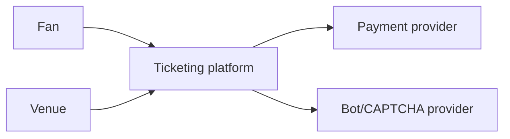
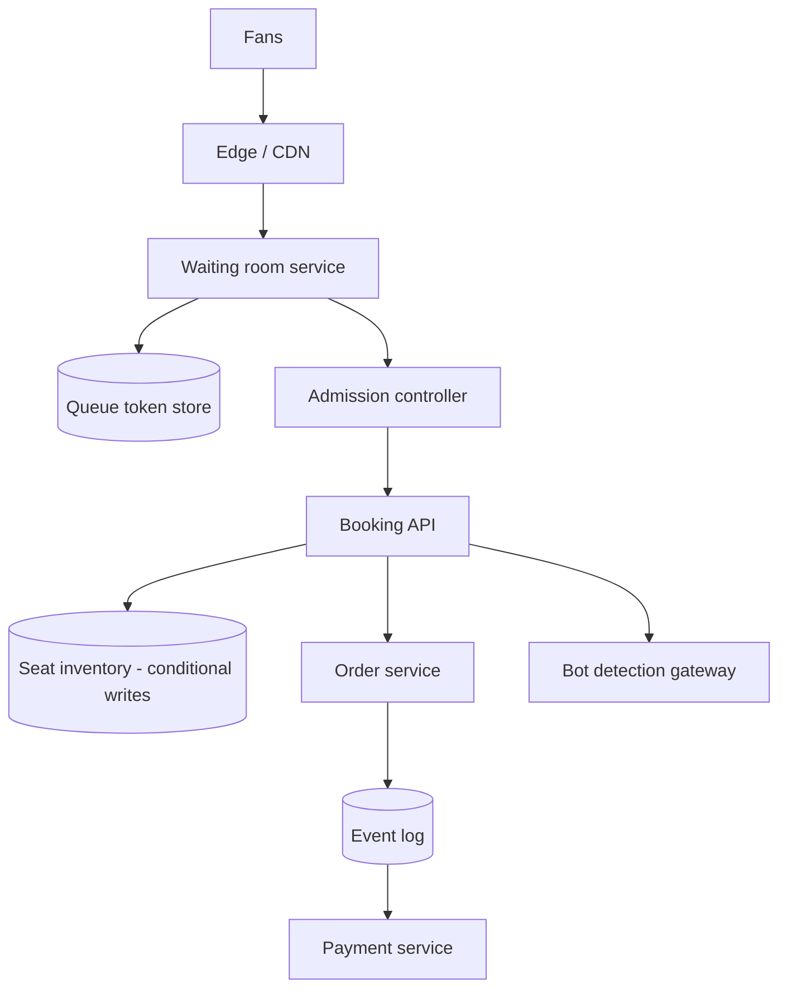
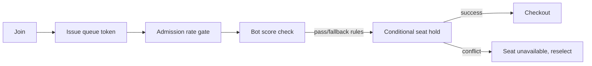
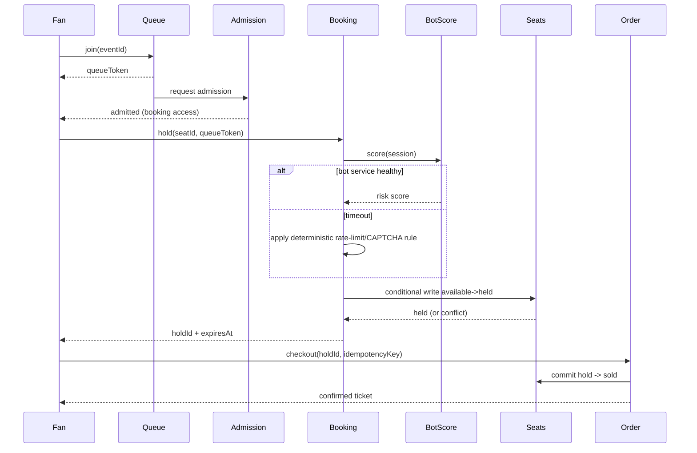
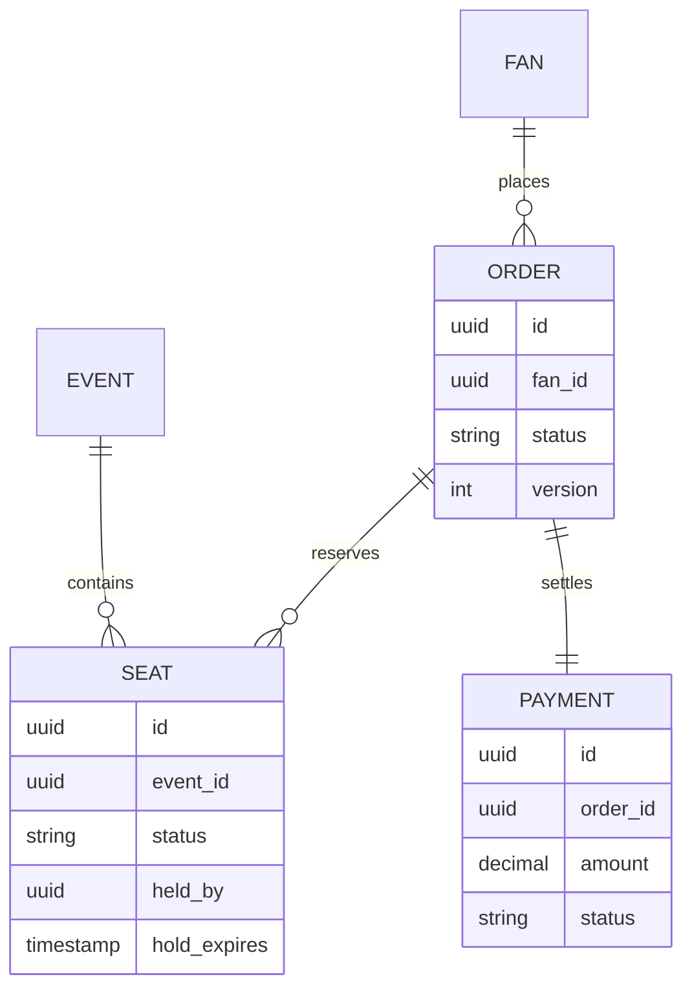

_Follows the [System Design Template](/system-design/00-system-design-template) — the reusable method behind every design in this library._

## 1. Interview prompt

Design a ticketing platform for on-sale events where demand can exceed inventory 100x in the first second: admit buyers through a fair queue, hold a specific seat exclusively for a short window, checkout exactly once per seat, and detect bots/scalpers without blocking legitimate fans.

## 2. Requirements and scope

**Functional:** browse events, join a waiting room at on-sale time, select/hold seats, checkout, refund/transfer tickets. **Non-functional:** zero double-booking of a seat, predictable admission order, checkout availability even at 100x baseline load, sub-minute seat hold expiry. Exclude dynamic resale marketplace pricing and physical box-office integration.

## 3. Capacity estimate

A single high-demand on-sale (e.g., 50k-seat stadium) can see 5M concurrent queue joins in the first minute against 50k available seats — a 100:1 demand-to-supply ratio. The waiting room must admit users into the booking flow at the rate the seat-hold and checkout services can actually sustain, roughly a few hundred to low thousands of admissions/second, not the raw arrival rate. Seat hold state for one event is small (50k rows), but the queue and rate-limiting state during the spike must handle millions of writes/second in aggregate across concurrent on-sales.

## 4. API and event contracts

- `POST /v1/queue/join {eventId}` returns `{queueToken, estimatedWait}`; the token is periodically re-validated and only exchanged for booking access when the admission controller signals capacity.
- `POST /v1/seats/{seatId}:hold {queueToken}` performs a conditional write (hold only if seat status is `available`) and returns `{holdId, expiresAt}` with a short TTL (typically 1-5 minutes).
- `POST /v1/orders {holdIds, idempotencyKey, paymentToken}` commits holds atomically; any expired or already-committed hold fails the whole order. Events: `QueueAdmitted`, `SeatHeld`, `SeatReleased`, `OrderPlaced`, `OrderCancelled`.

## 5. System context

## 6. Container architecture

## 7. Component deep dive

The waiting room issues a signed queue token on join and holds fans in a low-cost holding state (CDN edge or lightweight token store) so the expensive booking path is never exposed to the full arrival spike. The admission controller admits tokens into the booking flow at a rate matched to booking/checkout capacity, using a leaky-bucket or fixed-rate release rather than admitting everyone who has waited long enough. Seat holds use conditional (compare-and-set) writes per seat so exactly one concurrent request can transition a seat from `available` to `held`.

## 8. Critical flow

## 9. Data model

## 10. Storage, partitioning, consistency, and caching

Partition seat inventory by event so the entire hot dataset for one on-sale fits in a small, fast, strongly consistent store (in-memory with durable backing, or a relational table with row-level conditional updates) — cross-event contention never touches a single-event hot spot. Queue token state is high-volume but low-value per write, so it tolerates a simpler, horizontally scalable store with short TTLs. Event/venue metadata and past order history are cached aggressively; live seat status is never served from a cache on the booking path.

## 11. Reliability and failure handling

A background sweeper releases expired holds back to `available` so a fan who abandons checkout doesn't strand inventory. Admission control sheds load at the queue layer first, keeping the booking/checkout core within its tested capacity even if arrival rate is 100x that capacity. If the bot-detection service is slow or down, fall back to deterministic per-IP/per-account rate limits and CAPTCHA challenges rather than opening the gate uncontrolled or blocking all traffic. Payment failures release the seat hold immediately rather than leaving it ambiguously held.

## 12. Security, privacy, moderation, and abuse prevention

Rate-limit and fingerprint sessions to slow scripted queue-joining; require CAPTCHA or account verification at suspicious velocity. Bot/scalper detection combines behavioral signals (join velocity, device/IP reuse, headless-browser fingerprints) with a reviewed model; blocking large numbers of accounts or IPs at once is a human-approved action, not a fully automated one, to avoid false-positive lockouts during genuine demand spikes. Ticket transfer and refund flows are audited to limit resale abuse.

## 13. AI architecture

A bot-detection model scores each queue join and booking attempt using behavioral and device signals, feeding the admission and rate-limit layers a risk score. The model informs throttling and challenge decisions (e.g., trigger CAPTCHA) but never directly blocks checkout for a seat already legitimately held — seat conditional-write correctness is independent of the model's availability. Post-sale, a separate model flags likely scalper resale listings for review.

## 14. Model lifecycle, evaluation, and observability

Evaluate bot models against labeled historical on-sales (known bot traffic vs. verified genuine fans) before shadowing on a lower-demand event and canarying on a high-demand one. Track false-positive rate (legitimate fans challenged/blocked), bot catch rate, queue fairness (admission order vs. join order), checkout success rate, and seat-hold conflict rate. Trace queue tokens end to end so a fairness or bot-detection dispute can be reconstructed.

## 15. Cost controls and deterministic fallbacks

Score bot risk with lightweight session/device features on the hot path; run heavier graph-based scalper-network detection asynchronously after the sale. If the bot-scoring service degrades, deterministic per-account/IP rate limits and CAPTCHA challenges keep the queue functional. Admission control, seat holds, and checkout have no dependency on any AI service — the entire booking critical section is deterministic.

## 16. Trade-offs and alternatives

| Decision | Choice | Alternative and trigger |
|---|---|---|
| Load shedding | waiting-room admission control | direct load-balanced access for low-demand events without flash-sale spikes |
| Seat locking | short-TTL conditional hold | pessimistic distributed lock (e.g., Redis-based) if hold/release semantics need finer control |
| Queue fairness | token issued at join, rate-released | lottery/random admission if strict join-order fairness isn't required |
| Bot defense | ML score plus deterministic rules | rules-only (rate limits, CAPTCHA) for MVP or low-value events |

## 17. Phased evolution

MVP uses direct booking with per-seat database locks and simple IP rate limits, suitable for low-demand events. Phase 2 adds a waiting room and admission controller for flash sales. Phase 3 adds conditional-write seat holds with TTL sweepers and CAPTCHA-based bot defense. Phase 4 adds ML-based bot/scalper scoring, queue fairness monitoring, and async scalper-network detection.

## 18. 45-minute interview walkthrough

Spend 5 minutes on scope and demand shape, 5 on capacity/the 100x spike estimate, 10 on the waiting room and seat-hold mechanics, 10 on the admission-to-checkout sequence and container diagram, 5 on reliability under overload, and 10 on bot detection, fallbacks, and trade-offs.

## 19. Follow-up questions and key takeaways

How do you keep queue admission fair when some fans have faster connections? What happens if a seat hold's TTL expires mid-payment-authorization? How would you extend this to general-admission (no assigned seat) events? The key insight is that the waiting room's job is to protect the small, deterministic booking critical section from an arrival spike orders of magnitude larger than capacity — AI only tunes who gets challenged, never who gets a seat.

## 20. References

- [Virtual Waiting Room Architecture That Handles High-Demand Ticket Sales at SeatGeek (AWS Architecture Blog)](https://aws.amazon.com/blogs/architecture/build-a-virtual-waiting-room-with-amazon-dynamodb-and-aws-lambda-at-seatgeek/)
- [How the Ticketmaster Queue Works](https://blog.ticketmaster.com/how-ticketmaster-queue-works/)
- [Redis distributed locks pattern](https://redis.io/docs/latest/develop/use/patterns/distributed-locks/)
