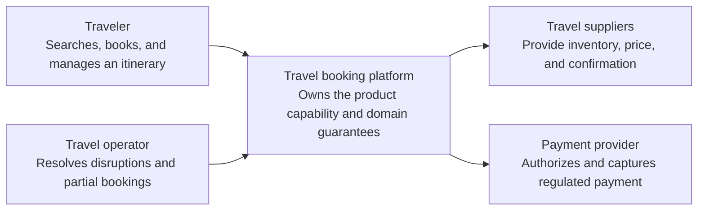
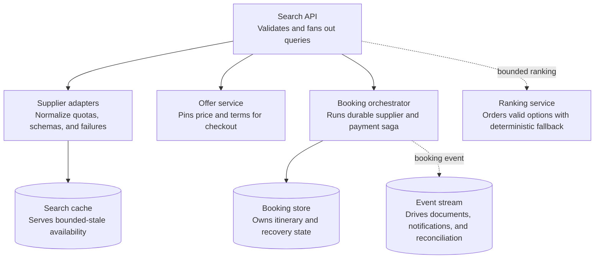
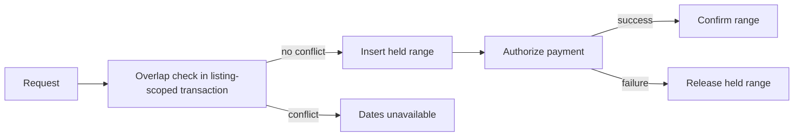
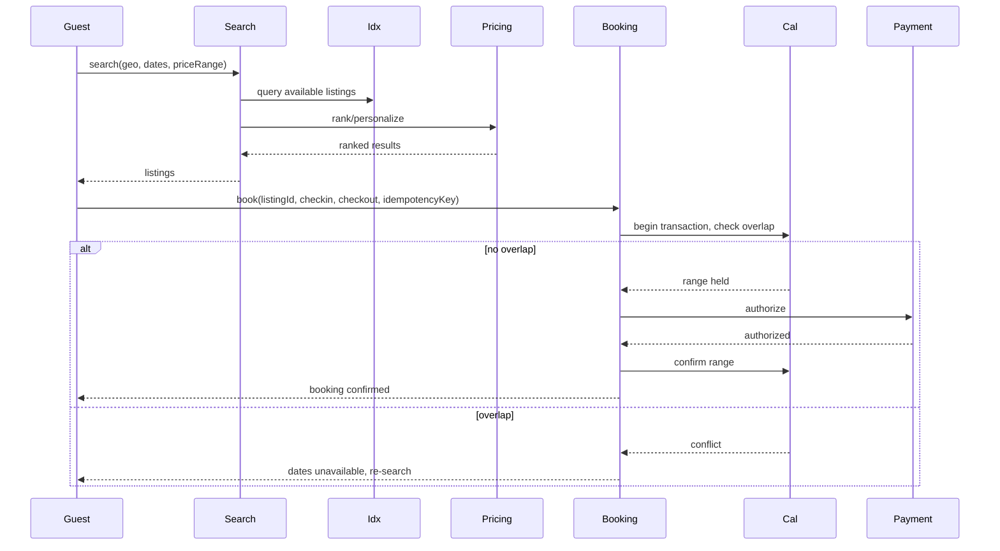
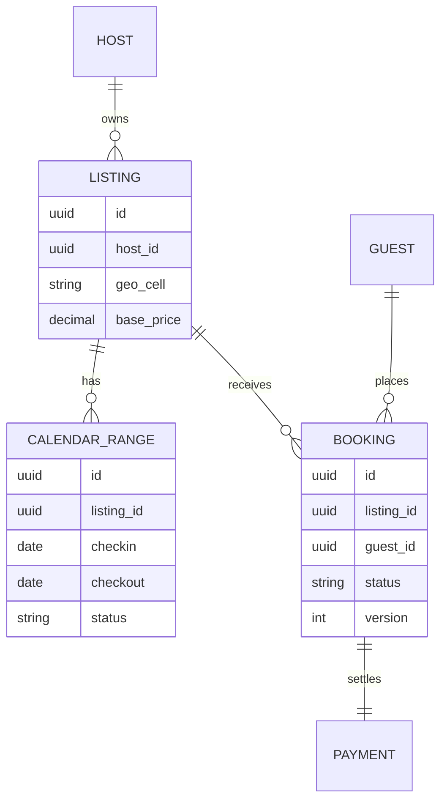

_Follows the [System Design Template](../00-system-design-template) — the reusable method behind every design in this library._

## 1. Interview prompt

Design a travel booking platform where hosts list properties with calendars, guests search by location/dates/price and book a date range, and cancellation follows a policy state machine. Models suggest pricing and personalize ranking; the booking transaction itself must never allow two overlapping reservations on the same listing.

## 2. Requirements and scope

### Functional requirements

| ID | Requirement | Priority | Interview significance |
|---|---|---|---|
| FR-1 | The system must search, price, reserve, book, cancel, and reconcile travel inventory. | Must | Defines the authoritative synchronous command boundary and its invariants. |
| FR-2 | The system must return normalized options, current price, itinerary, and booking state. | Must | Defines the dominant read path, caches, indexes, and acceptable staleness. |
| FR-3 | The system must refresh supplier caches, run booking sagas, issue documents, notify travelers, and reconcile. | Must | Separates durable acceptance from retryable fan-out and derived work. |
| FR-4 | The system must resolve partial bookings, schedule changes, refunds, and supplier disputes. | Should | Requires versioned configuration, least privilege, audit, and rollback. |

### Non-functional requirements

| Quality | Measurable target | Why it matters | Architecture consequence |
|---|---|---|---|
| Latency | cached search p95 below 2 seconds and booking state visible immediately after acceptance | Users experience this path directly. | Keep the critical path local, bounded, and independently scalable. |
| Availability | 99.9% booking workflow availability with durable recovery from partial supplier success | A partial infrastructure failure must have an explicit outcome. | Spread workloads across failure zones and define degradation before failover. |
| Correctness | never claim confirmation without supplier proof and never duplicate charge or reservation | The system is not useful if its central invariant can be violated. | Use idempotency, ownership epochs, transactions, leases, or version checks where required. |
| Peak scale | fan out search across many suppliers with seasonal bursts and slow dependencies | Peak traffic and skew determine partitions and isolation. | Partition by the domain ownership key, autoscale on work, and reserve burst headroom. |
| Security and privacy | protect passport/contact/payment data, constrain supplier credentials, and audit operator access | Abuse or data disclosure can outweigh availability. | Authenticate at the edge, authorize at the data boundary, encrypt, minimize, and audit. |

**Scope exclusions:** operating airlines or hotels and guaranteeing external inventory before supplier confirmation. **Assumptions:** supplier APIs are inconsistent, search is eventually consistent, and booking uses durable sagas and human recovery.

## 3. Capacity estimate

At 5M nightly stays booked/month, average booking creation is roughly 2/s with weekend/holiday peaks around 20-30/s — far lower volume than the search path. Search traffic dominates: at 200M searches/day, average QPS is ~2.3k with evening peaks near 10x, each search filtering millions of listings by geo cell, date-range availability, and price. Availability data per listing (365 days x small per-night record) is small per listing but must support fast overlap checks across tens of millions of listings.

## 4. API and event contracts

- `GET /v1/search?geo,checkin,checkout,priceRange` returns listings with availability already filtered, not just static listing data.
- `POST /v1/bookings {listingId, checkin, checkout, idempotencyKey}` performs an overlap-checked reservation; success requires no existing confirmed or held booking overlaps `[checkin, checkout)` for that listing.
- Events carry `eventId`, `occurredAt`, `schemaVersion`: `BookingHeld`, `BookingConfirmed`, `BookingCancelled`, `CalendarUpdated`, `RefundIssued`.

## 5. System context

### Context component roles

| Component | Role |
|---|---|
| Traveler | Searches, books, and manages an itinerary. |
| Travel operator | Resolves disruptions and partial bookings. |
| Travel booking platform | Owns the product boundary, core policy, and durable outcome. |
| Travel suppliers | Provide inventory, price, and confirmation. |
| Payment provider | Authorizes and captures regulated payment. |

## 6. Container architecture

### Container component roles

| Component | Role |
|---|---|
| Search API | Validates and fans out queries. |
| Supplier adapters | Normalize quotas, schemas, and failures. |
| Search cache | Serves bounded-stale availability. |
| Offer service | Pins price and terms for checkout. |
| Booking orchestrator | Runs durable supplier and payment saga. |
| Booking store | Owns itinerary and recovery state. |
| Event stream | Drives documents, notifications, and reconciliation. |
| Ranking service | Orders valid options with deterministic fallback. |

## 7. Component deep dive

Each listing's calendar is modeled as a set of non-overlapping date-range rows; the booking transaction inserts a new range only if a range-exclusion constraint (or equivalent conditional check) confirms no existing held/confirmed range overlaps it, all within a single database transaction scoped to that listing. Search runs against a denormalized, eventually-consistent geo+date index refreshed from calendar events, so search results can show a listing as available that a concurrent booking just took — the booking transaction is what actually enforces correctness, and search failures on that edge case surface as a "no longer available" retry.

## 8. Critical flow

## 9. Data model

## 10. Storage, partitioning, consistency, and caching

Partition calendar/booking data by listing ID so every overlap check and booking transaction is scoped to a single partition and can use a native range-exclusion constraint or equivalent conditional insert without cross-partition coordination. The search index is partitioned by geo cell and is intentionally eventually consistent (seconds of lag) since it's a discovery aid, not the correctness boundary. Listing metadata and photos cache with long TTLs; per-night availability and price are always read live at booking time.

## 11. Reliability and failure handling

Booking holds have a short TTL during payment authorization; a sweeper releases abandoned holds back to available. Idempotency keys make retried booking requests safe against network failures without risking a duplicate reservation. If the search index falls behind or fails, guests can still fail-fast at the booking transaction (overlap detected, "dates unavailable") rather than silently double-booking — the index is a hint, the transaction is authoritative. Regional outages isolate to affected geo cells rather than blocking global search.

## 12. Security, privacy, moderation, and abuse prevention

Mask exact addresses until booking is confirmed, encrypt payment and identity data, and restrict host access to their own listings and bookings. Detect fake listings, review manipulation, and price-gouging/collusion with rules plus reviewed models. Cancellation-policy enforcement, refund overrides, and account suspension remain human-reviewed with an audit trail, since they carry direct financial and trust impact.

## 13. AI architecture

A pricing-suggestion model recommends nightly rates to hosts based on comparable listings, seasonality, and demand signals, but hosts retain final say over their listed price — the model never auto-changes a live price without host opt-in. A separate ranking model personalizes search order using quality, popularity, and price-competitiveness signals. Neither model has write access to the calendar or booking transaction.

## 14. Model lifecycle, evaluation, and observability

Backtest pricing suggestions against realized occupancy and revenue by market and season before shadowing; evaluate ranking with NDCG/conversion against historical search logs before online experiments. Track booking conversion, host adoption of suggested prices, occupancy lift, ranking click-through, and override rates. Trace search and pricing requests with OpenTelemetry so a ranking or pricing regression can be isolated by market.

## 15. Cost controls and deterministic fallbacks

Precompute and cache pricing suggestions and ranking features on a batch cadence (hourly/daily) rather than per-request inference for every search. If the pricing model is unavailable, fall back to the host's last-set price with no suggestion shown; if ranking degrades, fall back to a deterministic order (recency of listing activity plus review score). Search, calendar, and booking remain fully functional with zero AI dependency.

## 16. Trade-offs and alternatives

| Decision | Choice | Alternative and trigger |
|---|---|---|
| Overlap correctness | listing-scoped transaction with range-exclusion | global distributed lock per listing if the datastore lacks native range constraints |
| Search consistency | eventually consistent geo+date index | synchronous index update if guests require zero stale-availability results |
| Pricing control | host sets price, model suggests | fully automated dynamic pricing only for hosts who explicitly opt in |
| Ranking | learned personalization with deterministic fallback | pure recency/review-score ranking for MVP or new markets |

## 17. Phased evolution

MVP uses a single-region relational store with per-listing locking for bookings and simple date/geo filtering for search. Phase 2 adds a dedicated search index, calendar holds with TTL, and idempotent booking transactions. Phase 3 adds learned ranking and pricing suggestions. Phase 4 adds geo-partitioned search, shadow-evaluated pricing/ranking rollouts, and abuse-detection models.

## 18. 45-minute interview walkthrough

Spend 5 minutes on scope, 5 on capacity (search-heavy vs. booking-light), 10 on the calendar/overlap data model, 10 on the booking transaction sequence and container diagram, 5 on reliability/security, and 10 on pricing/ranking AI and fallbacks.

## 19. Follow-up questions and key takeaways

How do you prevent two guests from booking overlapping dates when search showed both listings as available? What happens if payment authorization fails after the calendar hold succeeds? How would you support instant-book vs. host-approval flows differently? The key insight is that search is a fast, approximate discovery layer while the listing-scoped booking transaction is the sole source of overlap correctness, and pricing/ranking models stay advisory with host and deterministic-fallback control preserved.

## 20. References

- [PostgreSQL range types and exclusion constraints](https://www.postgresql.org/docs/current/rangetypes.html)
- [Learning Market Dynamics for Optimal Pricing (Airbnb Tech Blog)](https://medium.com/airbnb-engineering/learning-market-dynamics-for-optimal-pricing-97cffbcc53e3)
- [Personalizing Airbnb search by learning from the guest journey (Airbnb Tech Blog)](https://medium.com/airbnb-engineering/personalizing-airbnb-search-by-learning-from-the-guest-journey-bcefd1915624)
