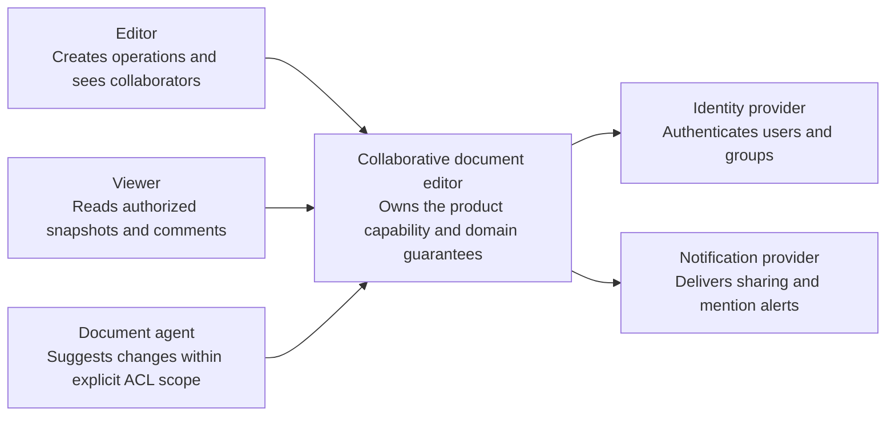
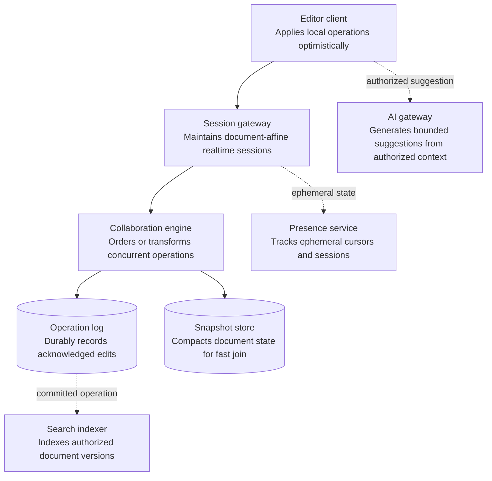
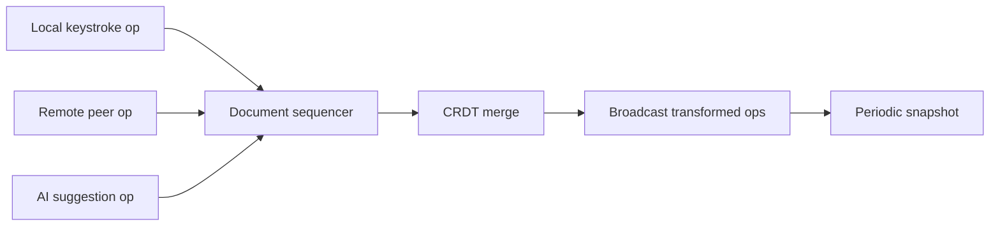
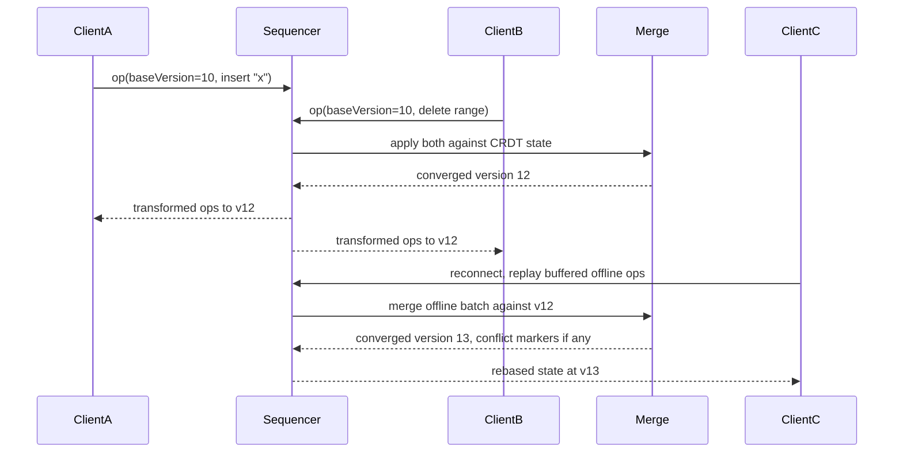
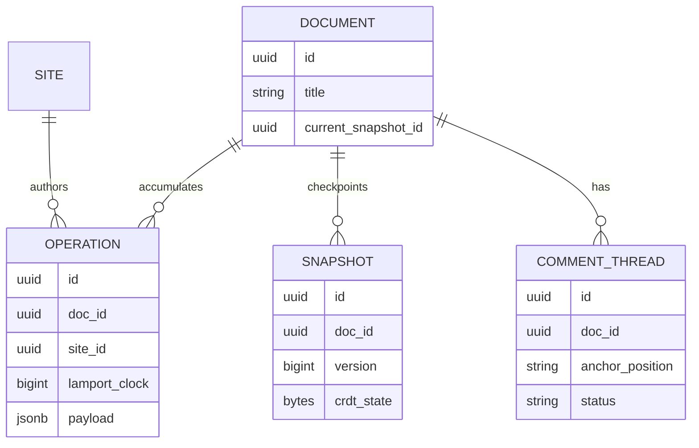

_Follows the [System Design Template](../00-system-design-template) — the reusable method behind every design in this library._

## 1. Interview prompt

Design a multi-user document editor where collaborators type concurrently, see each other's cursors, keep editing while offline, and get AI-drafted suggestions that never corrupt the document or bypass another user's concurrent edit.

## 2. Requirements and scope

### Functional requirements

| ID | Requirement | Priority | Interview significance |
|---|---|---|---|
| FR-1 | The system must create, edit, comment, share, rename, and restore documents. | Must | Defines the authoritative synchronous command boundary and its invariants. |
| FR-2 | The system must join a session, receive operations, presence, and durable catch-up. | Must | Defines the dominant read path, caches, indexes, and acceptable staleness. |
| FR-3 | The system must persist operation logs, compact snapshots, index content, and notify collaborators. | Must | Separates durable acceptance from retryable fan-out and derived work. |
| FR-4 | The system must manage tenancy, retention, sharing policy, and region evacuation. | Should | Requires versioned configuration, least privilege, audit, and rollback. |

### Non-functional requirements

| Quality | Measurable target | Why it matters | Architecture consequence |
|---|---|---|---|
| Latency | local edit echo immediate and remote operation propagation p99 below 200 ms | Users experience this path directly. | Keep the critical path local, bounded, and independently scalable. |
| Availability | 99.99% active-session availability with no acknowledged operation loss | A partial infrastructure failure must have an explicit outcome. | Spread workloads across failure zones and define degradation before failover. |
| Correctness | all replicas converge while ACL and document ownership remain authoritative | The system is not useful if its central invariant can be violated. | Use idempotency, ownership epochs, transactions, leases, or version checks where required. |
| Peak scale | support millions of concurrent sessions and hot documents with many editors | Peak traffic and skew determine partitions and isolation. | Partition by the domain ownership key, autoscale on work, and reserve burst headroom. |
| Security and privacy | authorize every session, encrypt content, isolate tenants, and prevent agent access beyond document ACLs | Abuse or data disclosure can outweigh availability. | Authenticate at the edge, authorize at the data boundary, encrypt, minimize, and audit. |

**Scope exclusions:** pixel-perfect office suite compatibility and offline conflict semantics for every rich object. **Assumptions:** documents have session affinity, operations are idempotent, and AI assistance is explicit and bounded.

## 3. Capacity estimate

At 5M daily active documents and an average of 4 concurrent editors producing roughly 2 ops/second while active, sustained edit throughput is around 40k ops/s platform-wide, bursting 5-10x during business-hours peaks. A typical document position/insert/delete op is 50-150 bytes; at 40k ops/s that is 2-6 MB/s of operation-log traffic before fan-out. Retaining full operation history for 90 days for undo and audit costs roughly tens of terabytes, so older history is compacted into periodic snapshots plus a shorter tail of raw ops.

## 4. API and event contracts

- `WS /docs/{id}/session` establishes a per-document socket; client sends `{op, baseVersion, siteId, clock}` and server returns `{appliedVersion, transformedOps}`.
- `POST /docs/{id}/snapshots` triggers a compaction checkpoint; `GET /docs/{id}/history?since=` replays ops for time-travel/restore.
- Events carry `docId`, `siteId`, `lamportClock`, `schemaVersion`: `OpApplied`, `PresenceChanged`, `CommentThreadUpdated`, `SnapshotCreated`.

## 5. System context

### Context component roles

| Component | Role |
|---|---|
| Editor | Creates operations and sees collaborators. |
| Viewer | Reads authorized snapshots and comments. |
| Document agent | Suggests changes within explicit ACL scope. |
| Collaborative document editor | Owns the product boundary, core policy, and durable outcome. |
| Identity provider | Authenticates users and groups. |
| Notification provider | Delivers sharing and mention alerts. |

## 6. Container architecture

### Container component roles

| Component | Role |
|---|---|
| Editor client | Applies local operations optimistically. |
| Session gateway | Maintains document-affine realtime sessions. |
| Collaboration engine | Orders or transforms concurrent operations. |
| Operation log | Durably records acknowledged edits. |
| Snapshot store | Compacts document state for fast join. |
| Presence service | Tracks ephemeral cursors and sessions. |
| Search indexer | Indexes authorized document versions. |
| AI gateway | Generates bounded suggestions from authorized context. |

## 7. Component deep dive

Each document is owned by exactly one sequencer instance at a time (leased via the coordination layer), which assigns a total order to incoming ops and is the single point that resolves concurrent intent. The merge engine represents text as a CRDT (e.g., RGA/Fugue-style sequence with per-character or per-run identifiers) rather than raw offsets, so inserts and deletes commute regardless of arrival order. AI-generated edits are synthesized as an ordinary op batch tagged with a synthetic site ID and pushed through the identical sequencer path — they carry no special merge priority.

## 8. Critical flow

## 9. Data model

## 10. Storage, partitioning, consistency, and caching

Shard by document ID so all ops for one document route to one sequencer and one log partition, keeping merge state single-writer and strongly ordered per document. Snapshots and history compact into object storage; the live op log keeps only the tail since the last snapshot, bounding replay cost on reconnect. Presence and cursor state is ephemeral and lives in memory with short TTLs — it never needs durability. Comment metadata is a separate strongly consistent store keyed by document, since thread state changes less often than text.

## 11. Reliability and failure handling

If a sequencer instance fails, its document lease expires and a new instance rehydrates from the last snapshot plus tail ops before accepting writes, so no acknowledged op is lost but there is a bounded failover gap. Clients buffer local ops in IndexedDB/local storage while offline and replay them with their original Lamport clocks on reconnect, letting the CRDT merge resolve conflicts deterministically rather than requiring manual conflict UI in the common case. Sustained overload on one hot document (e.g., a viral shared doc) is handled by capacity isolation per document rather than global backpressure, so one document cannot starve others.

## 12. Security, privacy, moderation, and abuse prevention

Enforce document ACLs at the gateway on connect and re-check on every mutating op, since a stale session must not retain access after a permission revoke. Encrypt snapshots and history at rest; redact document content from operational logs and traces, keeping only IDs and op metadata. AI suggestion requests pass only the minimal context window needed (not always the full document) and are scoped read access; accepting a suggestion is an explicit user action, never an autonomous write outside the normal op path.

## 13. AI architecture

The AI co-writer receives a bounded context window (surrounding paragraphs, not the whole document, for latency and cost) and returns a suggested edit as a diff, which the client renders as a normal ghost-text or comment-style suggestion. On acceptance, the suggestion is converted into a standard CRDT op batch and submitted through the same sequencer path as any human edit — it is never applied out-of-band, so it can never silently overwrite a concurrent human edit that landed first. Summarization and comment-triage features run asynchronously against snapshots, not the live op stream, to avoid coupling AI latency to typing latency.

## 14. Model lifecycle, evaluation, and observability

Evaluate suggestion acceptance rate, edit-distance between suggestion and final accepted text, latency to first suggestion token, and rate of suggestions that would have conflicted with a concurrent op (measured, not prevented, since the merge path already prevents corruption). Shadow new suggestion models against production traffic before enabling accept buttons, and canary by workspace. Trace suggestion requests with document ID and snapshot version so a bad suggestion can be correlated to the exact context it saw.

## 15. Cost controls and deterministic fallbacks

Debounce suggestion requests to avoid firing on every keystroke, cache recent suggestions for near-identical contexts, and cap context window size before falling back to a cheaper summarization-only mode. If the AI gateway is down or over budget, the editor keeps full real-time collaboration, comments, and history — only the suggestion affordance disappears, with no impact on the CRDT merge path.

## 16. Trade-offs and alternatives

| Decision | Choice | Alternative and trigger |
|---|---|---|
| Conflict resolution | CRDT sequence type | Operational Transformation when a central sequencer is already mandatory and OT's simpler storage model is preferred |
| Document ownership | single-writer sequencer per document with lease failover | fully peer-to-peer CRDT sync for offline-first apps without a central service |
| AI edit path | suggestions re-enter the normal op pipeline | direct document mutation by AI, rejected because it bypasses conflict resolution |
| History storage | snapshot + tail op log | full op replay from genesis, viable only for low-volume documents |

## 17. Phased evolution

MVP is single-editor with autosave and no realtime merge. Phase 2 adds a central sequencer with OT or a simple CRDT for two-way sync. Phase 3 adds presence, comments, offline buffering, and snapshot-based history. Phase 4 adds the AI co-writer routed through the same merge pipeline, plus evaluation and canarying for suggestion quality.

## 18. 45-minute interview walkthrough

Spend 5 minutes on requirements, 5 on capacity, 10 on the CRDT-vs-OT decision and container diagram, 10 on the concurrent-edit and offline-reconnect sequence, 5 on storage/sharding, 5 on AI suggestion integration and why it must not bypass the merge path, and 5 on failure handling and trade-offs.

## 19. Follow-up questions and key takeaways

How would you support rich formatting (bold spans, tables) in the CRDT model without exploding metadata size? What happens if two offline clients both delete overlapping ranges? How do you bound history storage for a document edited daily for years? The key insight is that correctness in this system comes entirely from a merge algorithm that guarantees convergence regardless of arrival order — AI-generated edits are just another concurrent author and get no special treatment in that pipeline.

## 20. References

- [How Figma's multiplayer technology works](https://www.figma.com/blog/how-figmas-multiplayer-technology-works/)
- [Making multiplayer more reliable](https://www.figma.com/blog/making-multiplayer-more-reliable/)
- [High-latency, low-bandwidth windowing in the Jupiter collaboration system (ACM UIST 1995)](https://dl.acm.org/doi/10.1145/215585.215706)
