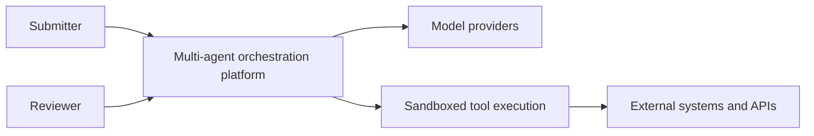
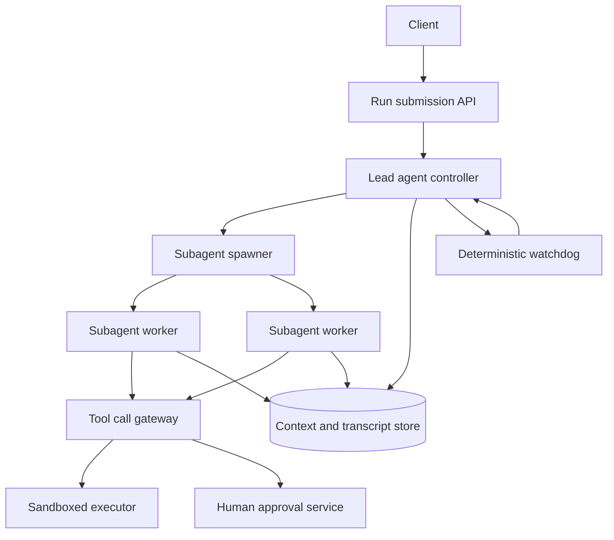
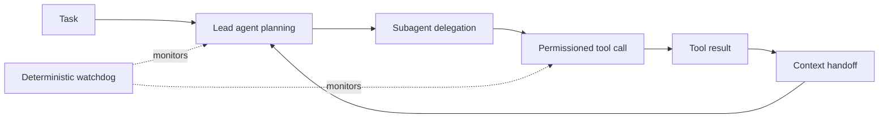
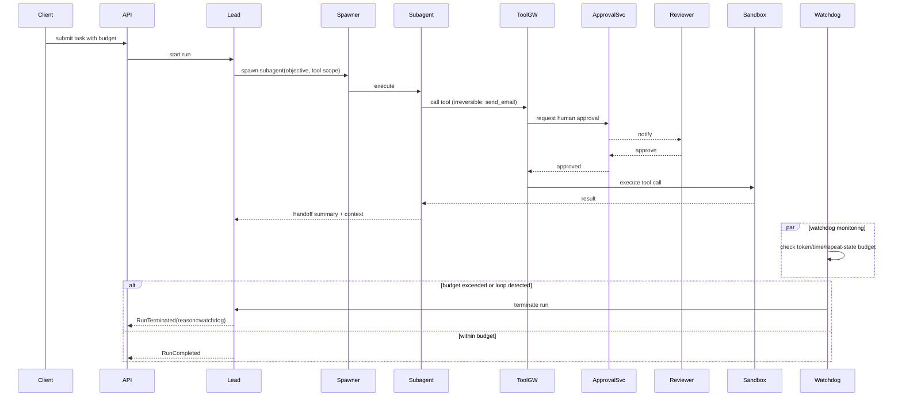
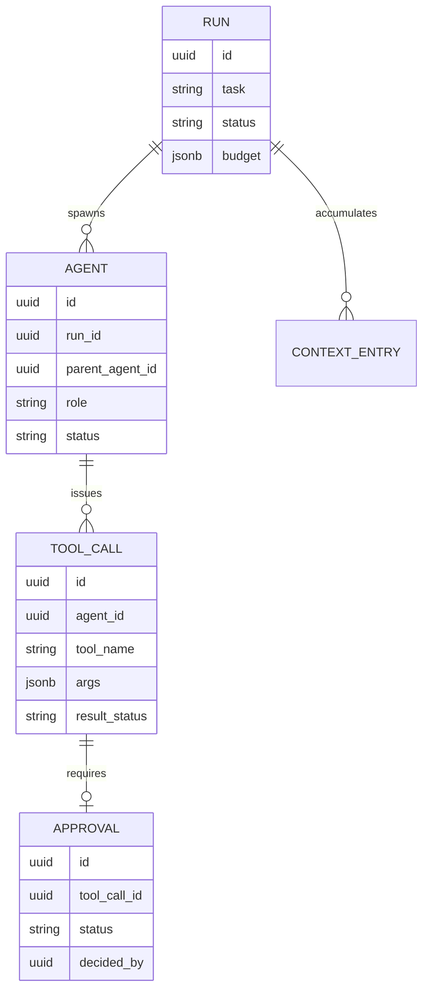

_Follows the [System Design Template](/system-design/00-system-design-template) — the reusable method behind every design in this library._

## 1. Interview prompt

Design a platform that accepts a high-level task, decomposes it across specialized agents, routes tool calls safely, hands context between agents, and terminates runaway or looping agent runs deterministically — without a stuck LLM call ever becoming a stuck production incident.

## 2. Requirements and scope

**Functional:** submit a task; decompose it into a plan executed by a lead agent and delegated subagents; route tool calls through a permissioned sandbox; checkpoint and resume runs; require human approval before irreversible actions (payments, deletions, external sends). **Non-functional:** bound every run's wall-clock time, token spend, and tool-call count; guarantee a stuck run is killed within a fixed budget regardless of model behavior; make every tool call auditable. Exclude training new models and exclude fully autonomous execution of irreversible actions without a human gate.

## 3. Capacity estimate

At 50k task submissions/day averaging 4 subagents per lead run and 15 tool calls per subagent, that is roughly 3M tool calls/day, or 35/s average with 5-10x bursts around business hours. Multi-agent runs are token-heavy — Anthropic's own multi-agent research system reports roughly 15x the token consumption of single-agent chat for comparable tasks — so budget accordingly: at 3M tool calls/day and ~2k tokens of context per call amortized, that's on the order of billions of tokens/day, making per-run token budgets and context compaction first-order cost concerns, not afterthoughts. Run state (plan, transcript, tool results) for a typical multi-agent task is 1-5 MB; at 50k runs/day with 30-day retention that's tens of terabytes.

## 4. API and event contracts

- `POST /v1/runs {task, budget: {maxTokens, maxToolCalls, maxWallClockSeconds}}` -> `{runId, status}`.
- `GET /v1/runs/{id}/events` streams a typed event log; `POST /v1/runs/{id}/approvals/{approvalId}:decide {approve|deny}` resolves a human gate.
- Events carry `runId`, `agentId`, `parentAgentId`, `stepIndex`, `traceId`: `AgentSpawned`, `ToolCallRequested`, `ToolCallCompleted`, `ApprovalRequested`, `RunTerminated`.

## 5. System context

## 6. Container architecture

## 7. Component deep dive

The lead agent controller owns the plan: it decomposes the task into subagent assignments with explicit objectives, output contracts, and tool allowlists, mirroring how a human lead would brief specialists rather than letting subagents freely reinterpret scope. The tool gateway is the single choke point where every tool call is checked against the calling agent's permission scope, rate-limited, and — for irreversible actions — routed to the approval service before execution rather than after. The watchdog is a separate, non-LLM process that tracks token spend, tool-call count, wall-clock time, and repeated-state detection (hashing recent tool calls/results to catch an agent re-issuing the same call) per run, independent of anything the model itself reports.

## 8. Critical flow

## 9. Data model

## 10. Storage, partitioning, consistency, and caching

Partition run state, transcripts, and tool-call logs by `runId`, keeping all mutations for a single run on one shard for simple ordering. Run status transitions (active/terminated/completed) and approval decisions require strong consistency with compare-and-set, since a double-approved irreversible action is unacceptable. Context handoff between agents reads the latest committed context entries for a run — eventually consistent by a few hundred milliseconds is acceptable since agent turns are already seconds apart. Cache tool schemas and permission scopes, which change rarely, at the gateway.

## 11. Reliability and failure handling

The watchdog enforces hard ceilings independently of the model: max wall-clock per run, max tokens, max tool calls, and a repeated-state detector that flags when the last N tool call/result pairs are near-duplicates, killing the run before a stuck agent burns budget indefinitely. Tool calls are idempotent where possible (idempotency keys on writes) so a retried call after a transient gateway failure does not double-execute an irreversible action. If a subagent crashes, the lead agent resumes from the last checkpointed context entry rather than restarting the whole run; if the model provider itself is degraded, the platform queues runs rather than executing with a silently degraded model.

## 12. Security, privacy, moderation, and abuse prevention

Every tool call carries the issuing agent's scoped permission token, minted per-run and revoked on run termination, so a compromised or misbehaving agent cannot call tools outside its assignment. The sandbox isolates tool execution (no shared filesystem/network access across concurrent runs) and redacts secrets from context before it is visible to any agent. Irreversible actions — payments, external sends, deletions — are enumerated in a policy table and always route through human approval regardless of the requesting agent's confidence; this list is reviewed and version-controlled, not left to model judgment.

## 13. AI architecture

Model routing selects a model per agent role — a cheaper/faster model for narrow tool-execution subagents, a stronger model for the lead's planning and synthesis — based on task complexity signals, not a single model for every step. Context window management compacts prior turns into structured summaries once a run approaches the model's context limit, prioritizing tool results and decisions over raw intermediate reasoning, so long runs stay within budget without losing task-critical state. Tool permissioning is capability-scoped per agent role (a research subagent gets read-only search tools; only the lead or a designated action-agent gets write-capable tools), enforced at the gateway rather than trusted from agent output.

## 14. Model lifecycle, evaluation, and observability

Evaluate plan quality (task decomposition correctness against held-out tasks), tool-call success rate, loop-termination rate, approval-gate coverage (percentage of irreversible actions that correctly triggered approval), and cost per completed run. Shadow new model versions on replayed historical runs before routing live traffic, then canary by task category. Trace every agent spawn and tool call with a shared `traceId` per run using OpenTelemetry-style spans, so a terminated run can be replayed step by step to find where it diverged.

## 15. Cost controls and deterministic fallbacks

Cap tokens, tool calls, and wall-clock per run at submission time and reject runs that don't specify a budget; route narrow, well-defined subtasks to smaller/cheaper models instead of the lead's frontier model. The watchdog's termination logic is deterministic code, not a model call, specifically so a stuck or looping agent can always be killed even if every model in the routing table is unavailable or itself the source of the loop. If the model provider is down, queue new runs and let in-flight runs checkpoint and pause rather than fail destructively.

## 16. Trade-offs and alternatives

| Decision | Choice | Alternative and trigger |
|---|---|---|
| Loop/runaway detection | deterministic non-LLM watchdog | model self-monitoring, rejected because it fails exactly when the model itself is malfunctioning |
| Agent topology | lead + delegated subagents | flat single-agent with a long tool loop, viable for simple single-domain tasks |
| Irreversible actions | mandatory human approval gate | fully autonomous execution, acceptable only for actions proven reversible/low-risk |
| Context handoff | structured summaries at compaction | passing full raw transcripts between agents, simpler but blows context budgets on long runs |

## 17. Phased evolution

MVP is a single agent with a bounded tool loop and a hard step-count ceiling. Phase 2 adds a lead/subagent split with a shared context store. Phase 3 adds the deterministic watchdog, approval gates, and per-role model routing. Phase 4 adds replay-based evaluation, canarying, and cost-aware routing across model tiers.

## 18. 45-minute interview walkthrough

Spend 5 minutes on requirements and what "irreversible" means here, 5 on capacity/token math, 10 on the container diagram and why the watchdog is a separate non-LLM component, 10 on the execution sequence with the approval gate, 5 on data model and consistency for approvals, 5 on security/permission scoping, and 5 on cost controls and trade-offs.

## 19. Follow-up questions and key takeaways

How do you detect a loop that isn't an exact repeat, just semantically circular? How would you handle two subagents that need to write to the same resource concurrently? What's the right timeout when a tool call itself is slow versus when the model is stuck? The key insight is that safety in this system cannot depend on the model behaving well — the watchdog, permission scoping, and approval gates are deterministic guardrails that hold even when the model doesn't.

## 20. References

- [How we built our multi-agent research system (Anthropic Engineering)](https://www.anthropic.com/engineering/multi-agent-research-system)
- [Effective context engineering for AI agents (Anthropic Engineering)](https://www.anthropic.com/engineering/effective-context-engineering-for-ai-agents)
- [OpenTelemetry generative AI semantic conventions](https://opentelemetry.io/docs/specs/semconv/how-to-write-conventions/)
