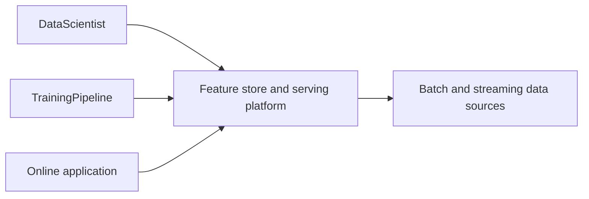
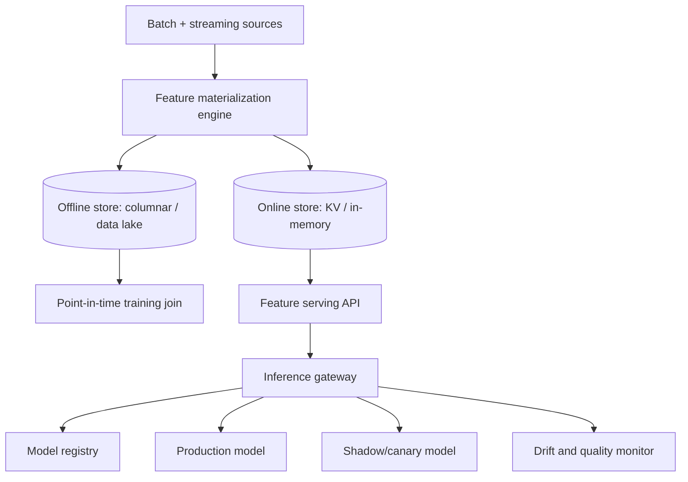
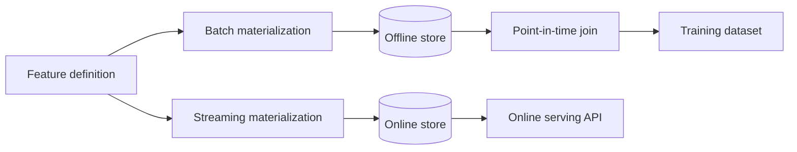
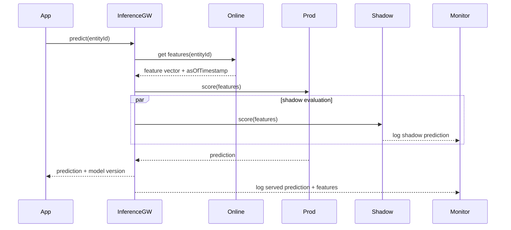
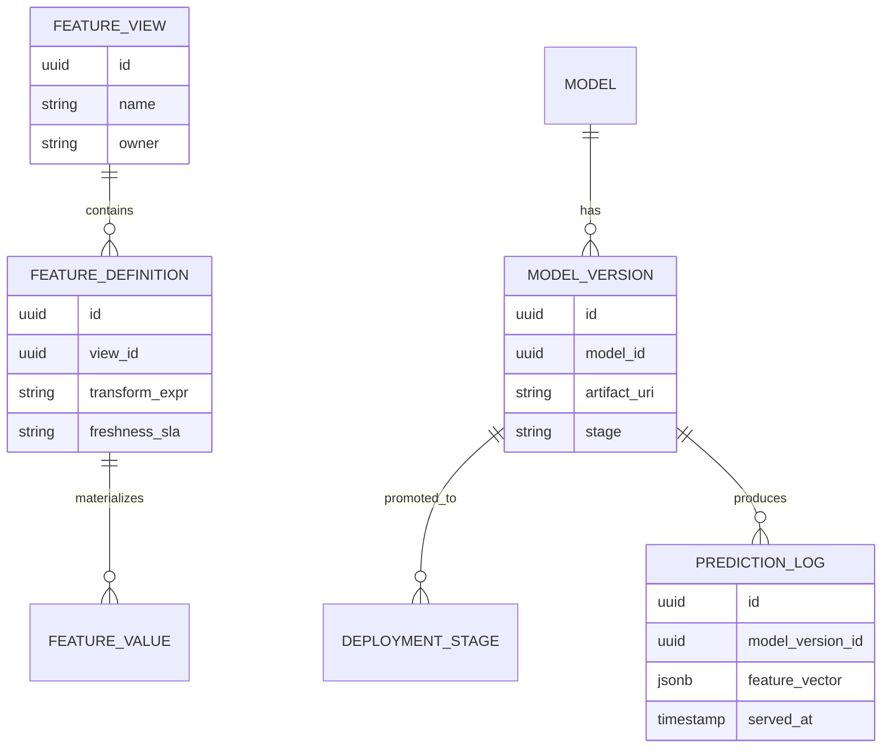

_Follows the [System Design Template](/system-design/00-system-design-template) — the reusable method behind every design in this library._

## 1. Interview prompt

Design a feature store and serving platform that lets teams define a feature once, use identical values for offline training and online inference, serve predictions within a tight latency budget, and roll out new model versions without a bad model silently degrading production.

## 2. Requirements and scope

**Functional:** define feature transformations once; materialize features to both an offline store (for training) and an online store (for serving); register and version models; serve low-latency predictions; canary/shadow new model versions; detect drift and data-quality regressions. **Non-functional:** p99 online feature retrieval under 10 ms, point-in-time-correct offline joins for training (no label leakage), and provable parity between the feature value a model saw offline during training and online at serving time. Exclude the model training infrastructure itself (assume training happens elsewhere and produces artifacts this platform registers).

## 3. Capacity estimate

At 500 registered features across 50 models, 100k predictions/second at peak, and an average of 30 features per prediction, that is 3M feature reads/second against the online store, so the online path must be an in-memory or SSD-backed KV store, not a relational database. Offline, computing features over a 2-year, 10B-row event history for training runs is a batch job measured in hours, not milliseconds — the two paths have fundamentally different latency budgets and must share only transformation logic, not infrastructure. Feature freshness requirements vary: some features (account age) update daily, others (last-5-minutes click rate) require streaming materialization within seconds.

## 4. API and event contracts

- `GET /v1/features/online?entityId=&featureView=` -> `{features: {...}, asOfTimestamp}` for the hot serving path.
- `POST /v1/features/offline/retrieve {entityIds[], featureView, timestamps[]}` returns a point-in-time-correct training dataset join.
- `POST /v1/models/{name}/versions` registers an artifact with metadata; `POST /v1/models/{name}/versions/{v}:promote {stage: shadow|canary|production}` drives rollout.
- Events carry `featureView`, `entityId`, `eventTimestamp`, `schemaVersion`: `FeatureMaterialized`, `ModelVersionPromoted`, `DriftDetected`.

## 5. System context

## 6. Container architecture

## 7. Component deep dive

Feature transformation logic is defined once as a declarative pipeline (e.g., a windowed aggregation or a join) and compiled to two execution paths: a batch job that backfills the offline store and a streaming/on-demand job that keeps the online store current — both paths execute the same transformation definition so they cannot silently drift apart. The point-in-time join for training explicitly excludes any feature value materialized after the label's event timestamp, which is the specific mechanism that prevents label leakage. The inference gateway resolves which model version serves a request (production, canary percentage, or shadow-only) and logs the exact feature vector used, so any prediction can be reproduced.

## 8. Critical flow

## 9. Data model

## 10. Storage, partitioning, consistency, and caching

The online store partitions by entity ID in a KV or in-memory store (e.g., sorted by entity for locality), tuned purely for p99 read latency, with writes applied asynchronously from the materialization pipeline. The offline store is a columnar/data-lake format partitioned by event date, optimized for large scan-and-join throughput rather than point lookups. Online feature values carry an `asOfTimestamp` so staleness is observable rather than silently assumed; the platform enforces per-feature-view freshness SLAs and alerts when streaming materialization lags beyond them. Prediction logs (feature vector + model version + output) are append-only and retained long enough to support offline reproduction of any served prediction.

## 11. Reliability and failure handling

If streaming materialization falls behind, the online store serves the last successfully materialized value along with its staleness age rather than blocking, and the inference gateway can be configured to reject predictions above a staleness threshold for latency/freshness-sensitive features. Materialization jobs are idempotent and checkpointed by watermark, so a restart replays only the unprocessed window. If the online store itself degrades, the inference gateway fails over to a reduced feature set with a pre-registered fallback (default values or a simpler model) rather than failing the request outright, and this fallback path is itself tested and versioned.

## 12. Security, privacy, moderation, and abuse prevention

Feature definitions are access-controlled per feature view so teams cannot read features derived from data they are not entitled to (e.g., PII-derived features restricted to specific model use cases). Prediction logs containing feature vectors are subject to the same retention and deletion policies as the underlying source data, since a logged feature vector can itself be personal data. Model promotion to production requires a recorded approval and passes an automated policy check (bias/fairness slice evaluation, minimum eval score) before the registry allows the promotion API to succeed.

## 13. AI architecture

The model registry is the source of truth for what is running where: every model version records its training data snapshot, feature view versions it depends on, evaluation metrics, and current deployment stage (shadow, canary at a traffic percentage, production). Canary promotion shifts a small percentage of live traffic to the new version while comparing prediction distributions and downstream business metrics against the incumbent before widening; shadow deployment runs the new version on 100% of traffic without serving its output, purely to compare offline against the incumbent's live decisions. Version pinning means a rollback is a registry update (repoint traffic to the prior version), not a redeploy, keeping rollback time independent of build pipelines.

## 14. Model lifecycle, evaluation, and observability

Track training/serving skew directly by periodically replaying recent online feature reads through the offline point-in-time join and diffing the values — any nonzero diff indicates a materialization bug, not just a metric to watch. Monitor input drift (feature distribution shift via population stability index or similar) and output drift (prediction distribution shift) per model version, alerting before accuracy visibly degrades. Every prediction is traceable end-to-end: feature view versions used, model version, and latency breakdown, so a production incident can be attributed to a specific feature or model change.

## 15. Cost controls and deterministic fallbacks

Cache hot entity feature vectors at the inference gateway for repeat-scoring workloads, batch low-frequency feature updates instead of streaming everything, and tier cold offline data to cheaper storage classes. If the model-serving path itself fails or the registry is unreachable, the gateway falls back to a last-known-good pinned model version cached locally rather than blocking on registry lookups for every request — this fallback is deterministic and tested, not a live decision.

## 16. Trade-offs and alternatives

| Decision | Choice | Alternative and trigger |
|---|---|---|
| Feature consistency | single definition compiled to batch + stream jobs | separately maintained offline/online pipelines, rejected due to skew risk |
| Online store | KV/in-memory store keyed by entity | relational DB when read volume is low and joins are still needed at serving time |
| Rollout strategy | shadow then percentage canary | direct cutover for low-risk, easily reversible models |
| Rollback | registry traffic repoint | full redeploy, acceptable only when registry-based routing isn't available |

## 17. Phased evolution

MVP computes features in the training pipeline only, with no online store — predictions use batch-scored lookup tables. Phase 2 adds a real online KV store and a basic batch materialization job. Phase 3 adds streaming materialization, point-in-time-correct offline joins, and a model registry with manual promotion. Phase 4 adds automated canary/shadow rollout, drift monitoring, and skew-detection replay jobs.

## 18. 45-minute interview walkthrough

Spend 5 minutes on requirements and what "consistency" means here, 5 on capacity/latency budgets, 10 on the container diagram and the shared-definition materialization design, 10 on the serving sequence with shadow evaluation, 5 on storage/partitioning trade-offs, 5 on registry-driven rollout and rollback, and 5 on monitoring and fallbacks.

## 19. Follow-up questions and key takeaways

How would you detect training/serving skew before it affects live predictions rather than after? What's the right staleness threshold for a fraud-detection feature versus a recommendation feature? How do you version a feature definition without breaking models already depending on the old version? The key insight is that feature consistency is an engineering property enforced by sharing transformation logic across two very different execution paths, not a promise kept by convention — and the model registry makes rollout and rollback data operations, not deploys.

## 20. References

- [Scaling Machine Learning at Uber with Michelangelo](https://www.uber.com/blog/scaling-michelangelo/)
- [Feast: the Open Source Feature Store — documentation](https://docs.feast.dev/)
