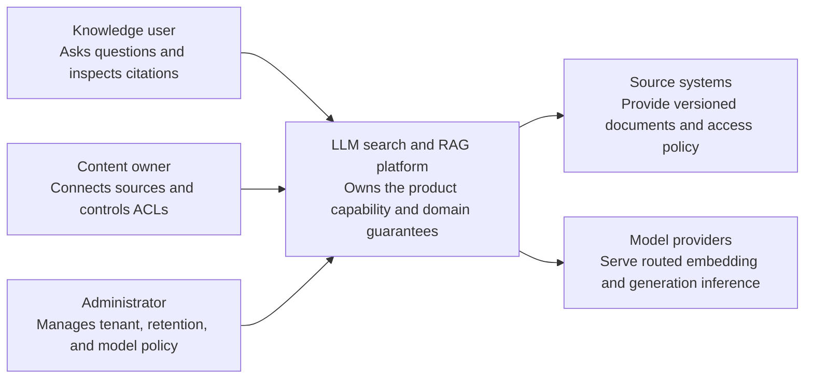
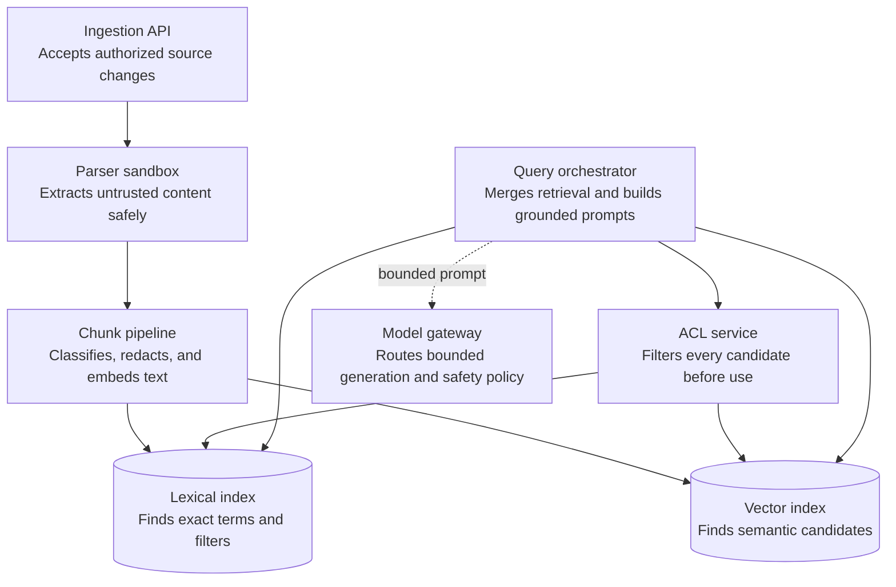
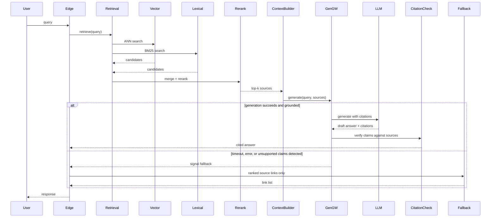
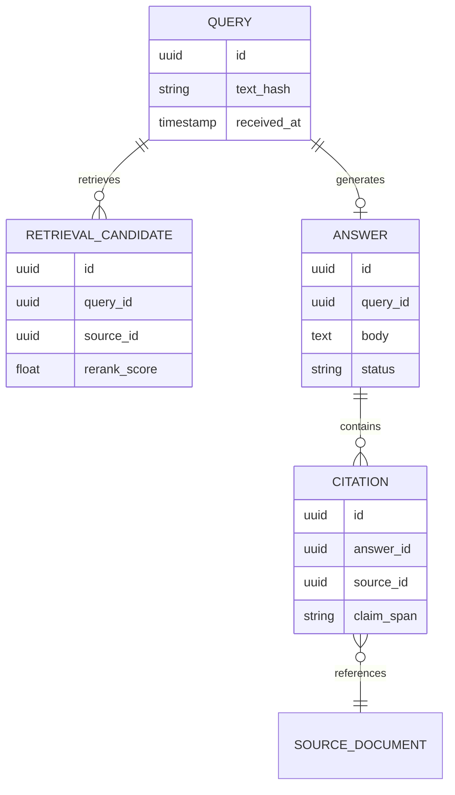

_Follows the [System Design Template](../00-system-design-template) — the reusable method behind every design in this library._

## 1. Interview prompt

Design a search product where a user's query is answered by an LLM-generated summary grounded in retrieved web/document sources with inline citations, staying fast under load and never presenting a claim the sources don't actually support.

## 2. Requirements and scope

### Functional requirements

| ID | Requirement | Priority | Interview significance |
|---|---|---|---|
| FR-1 | The system must ingest, update, delete, and authorize documents and sources. | Must | Defines the authoritative synchronous command boundary and its invariants. |
| FR-2 | The system must answer a query with ACL-filtered evidence, citations, and confidence. | Must | Defines the dominant read path, caches, indexes, and acceptable staleness. |
| FR-3 | The system must parse, chunk, classify, embed, index, evaluate, and delete content. | Must | Separates durable acceptance from retryable fan-out and derived work. |
| FR-4 | The system must manage sources, tenancy, retention, model policy, evaluation, and incident review. | Should | Requires versioned configuration, least privilege, audit, and rollback. |

### Non-functional requirements

| Quality | Measurable target | Why it matters | Architecture consequence |
|---|---|---|---|
| Latency | retrieval p95 below 500 ms and first answer token below 2 seconds for normal queries | Users experience this path directly. | Keep the critical path local, bounded, and independently scalable. |
| Availability | 99.9% grounded-answer availability with retrieval-only fallback | A partial infrastructure failure must have an explicit outcome. | Spread workloads across failure zones and define degradation before failover. |
| Correctness | ACL enforcement and source deletion precede retrieval, prompt construction, and citations | The system is not useful if its central invariant can be violated. | Use idempotency, ownership epochs, transactions, leases, or version checks where required. |
| Peak scale | index billions of chunks and serve bursty hybrid retrieval plus inference | Peak traffic and skew determine partitions and isolation. | Partition by the domain ownership key, autoscale on work, and reserve burst headroom. |
| Security and privacy | treat documents as untrusted, isolate tenants, prevent prompt injection, redact secrets, and audit access | Abuse or data disclosure can outweigh availability. | Authenticate at the edge, authorize at the data boundary, encrypt, minimize, and audit. |

**Scope exclusions:** training foundation models on tenant content and allowing generated text to perform side effects. **Assumptions:** documents have authoritative ACLs, indexes are versioned, and the deterministic fallback returns ranked evidence without generation.

## 3. Capacity estimate

At 20M queries/day averaging 230/s with 10x peaks near 2,300/s, each query fans out to retrieval (tens of milliseconds for ANN search over a billion-plus vector index) followed by generation (typically 1-3 seconds for a grounded answer), so the two stages need independent scaling and the generation stage — the expensive one — is the capacity bottleneck. At an average of 8 retrieved chunks re-ranked and packed into a ~4k-token context per query, that's roughly 80-160M tokens/day of LLM input just for grounding, before counting output tokens — materially shaping model choice and caching strategy. A billion-document, 768-dimension embedding index is on the order of a few terabytes, requiring a sharded ANN index rather than a single-node one.

## 4. API and event contracts

- `POST /v1/search {query}` -> streams `{type: source|token|citation|fallback, ...}` server-sent events.
- `GET /v1/sources/{id}` returns the retrieved document snapshot used for a given answer, for auditability.
- Events carry `queryId`, `traceId`, `schemaVersion`: `QueryReceived`, `RetrievalCompleted`, `AnswerGenerated`, `UnsupportedClaimFlagged`, `FallbackServed`.

## 5. System context

### Context component roles

| Component | Role |
|---|---|
| Knowledge user | Asks questions and inspects citations. |
| Content owner | Connects sources and controls ACLs. |
| Administrator | Manages tenant, retention, and model policy. |
| LLM search and RAG platform | Owns the product boundary, core policy, and durable outcome. |
| Source systems | Provide versioned documents and access policy. |
| Model providers | Serve routed embedding and generation inference. |

## 6. Container architecture

### Container component roles

| Component | Role |
|---|---|
| Ingestion API | Accepts authorized source changes. |
| Parser sandbox | Extracts untrusted content safely. |
| Chunk pipeline | Classifies, redacts, and embeds text. |
| Lexical index | Finds exact terms and filters. |
| Vector index | Finds semantic candidates. |
| ACL service | Filters every candidate before use. |
| Query orchestrator | Merges retrieval and builds grounded prompts. |
| Model gateway | Routes bounded generation and safety policy. |

## 7. Component deep dive

Query understanding rewrites/expands the raw query (spelling, intent classification, decomposition into sub-questions for complex queries) before retrieval, since retrieval quality is bounded by query quality. Hybrid retrieval runs lexical (BM25-style) and vector (ANN, e.g., HNSW) search in parallel and merges results, because lexical search catches exact terms/entities that embedding similarity alone can miss, and vice versa. The re-ranker (a cross-encoder or learned model, more expensive than the first-stage retrievers) scores the merged candidate set and the context builder selects a token-budgeted subset, preferring source diversity so the generator isn't grounded in near-duplicate pages.

## 8. Critical flow

## 9. Data model

## 10. Storage, partitioning, consistency, and caching

Shard the vector index by document partition (e.g., by crawl shard or content domain) with a scatter-gather query fan-out, since a single-node ANN index can't hold a billion-plus vectors with acceptable recall/latency trade-offs. The lexical index is a standard inverted index, sharded similarly and kept in sync with the vector index off the same ingestion pipeline so a document doesn't appear in one but not the other. Cache retrieval results and even full generated answers for identical or near-duplicate popular queries (with a freshness TTL, since answers about current events go stale fast); source documents themselves are read-mostly and cached aggressively at the context-builder layer.

## 11. Reliability and failure handling

The generation gateway enforces a hard timeout on the LLM call; on timeout, error, or an explicit low-confidence/ungrounded signal from the citation checker, the request degrades to the deterministic fallback — ranked source links with no generated summary — rather than blocking or, worse, showing a partially generated or unverified answer. Retrieval and generation are independently circuit-broken so a slow generation provider doesn't back up the fast retrieval path. If the vector index shard for part of the corpus is unavailable, retrieval proceeds with reduced recall from the remaining shards and lexical results, rather than failing the whole query.

## 12. Security, privacy, moderation, and abuse prevention

Retrieved content is sandboxed as data, not instructions — the generation prompt structure must prevent a retrieved page's embedded text from being interpreted as commands to the model (prompt-injection via indexed content is a first-class threat here, not an edge case). Filter retrieval results against a content-safety/blocklist layer before they ever reach the context builder. Log queries and served answers for abuse review and quality auditing, with PII minimization in stored query logs and a retention policy consistent with the rest of the platform's data handling.

## 13. AI architecture

Generation uses a model selected per query complexity — a smaller/faster model for simple factual lookups, a stronger model for multi-source synthesis or comparison queries — routed by the query understanding stage's complexity classification. The citation checker runs a second pass (either a lighter-weight model or an entailment-style classifier) that checks each generated claim against the specific retrieved passages it cites, flagging or stripping claims that aren't actually supported, which is the concrete mechanism against hallucination rather than trusting the generator's own citations. Re-ranking is a distinct, cheaper model stage from generation specifically so the expensive generation call only ever sees a small, high-precision context set.

## 14. Model lifecycle, evaluation, and observability

Evaluate retrieval recall/precision against labeled relevance sets, re-ranker NDCG, citation precision (fraction of generated claims actually supported by cited sources, ideally near 100%), fallback rate, and end-to-end latency percentiles. Shadow new generation or re-ranking models against live traffic comparing citation precision and fallback rate before canarying by query category. Trace each query end-to-end through retrieval, re-ranking, generation, and citation-checking stages with a shared `traceId`, so a bad answer can be attributed to a specific stage (missed retrieval vs. bad generation vs. missed grounding check).

## 15. Cost controls and deterministic fallbacks

Cache popular query answers and retrieval results, use a small model for the re-ranking and citation-checking stages (they're classification-shaped, not generation-shaped, so they don't need frontier-model capability), and route simple queries to smaller generation models. The link-only fallback is the deterministic backstop: on any generation timeout, provider outage, budget cap, or failed grounding check, the platform always has ranked retrieval results ready to serve on their own, since retrieval never depends on the generation step succeeding.

## 16. Trade-offs and alternatives

| Decision | Choice | Alternative and trigger |
|---|---|---|
| Retrieval | hybrid lexical + vector | vector-only when the corpus is short/informal text where lexical match adds little |
| Grounding | dedicated citation-checking pass | trusting the generator's self-reported citations, acceptable only for low-stakes internal tools |
| Fallback | ranked links with no summary | a cached generic disclaimer answer, rejected because it still implies a generated claim |
| Vector index | sharded ANN (HNSW-style) | flat/brute-force search for small, sub-million-document corpora |

## 17. Phased evolution

MVP is lexical search only, no generation. Phase 2 adds a vector index and hybrid retrieval with a simple re-ranker. Phase 3 adds grounded generation with basic citation formatting. Phase 4 adds the dedicated citation-grounding checker, complexity-based model routing, and the deterministic fallback path with full observability.

## 18. 45-minute interview walkthrough

Spend 5 minutes on requirements and what "grounded" must mean precisely, 5 on capacity/latency budgets for retrieval vs. generation, 10 on the container diagram and hybrid retrieval design, 10 on the retrieve-then-generate sequence and the fallback trigger conditions, 5 on index sharding/consistency, 5 on the citation-checking mechanism against hallucination, and 5 on cost and trade-offs.

## 19. Follow-up questions and key takeaways

How would you handle a query where retrieval returns conflicting sources? What's the latency budget split between retrieval, re-ranking, and generation, and where would you cut first under load? How do you evaluate citation precision at scale without human review of every answer? The key insight is that grounding is enforced by a distinct verification stage that checks generated claims against retrieved text, not by prompting the generator to "cite sources" and trusting it — and the fallback to plain links is what keeps the product functional when that verification, or generation itself, fails.

## 20. References

- [Rethinking Search as Code Generation (Perplexity Research)](https://research.perplexity.ai/articles/rethinking-search-as-code-generation)
- [Vespa.ai: Retrieval-Augmented Generation](https://docs.vespa.ai/en/llms-rag.html)
